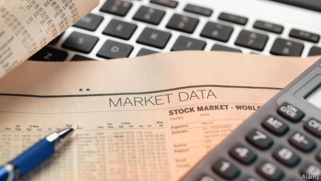
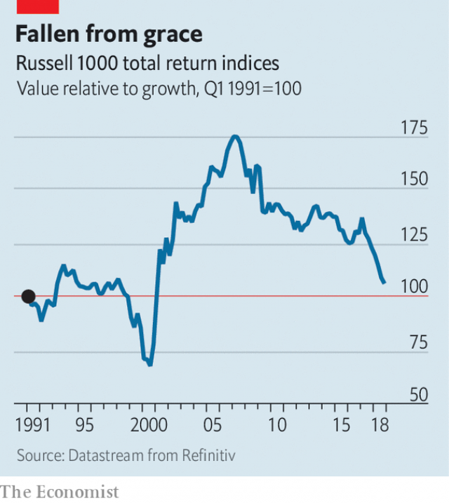

###### Buttonwood

# Value investing is long on virtue but has been short on reward 

##### Value indices can seem like dumping grounds for problem industries 

 

> Feb 2nd 2019 

 

IN A COMEDY sketch from the 1980s, Rowan Atkinson plays the devil as a cross between a package-holiday guide and a louche English bureaucrat. Dressed in a smoking jacket, he welcomes the damned to Hell and, consulting his clipboard, sorts them into groups. Lawyers? Join the thieves and murderers over there. The French? Come down here with the Germans. Atheists? You must be feeling pretty silly. And finally, Christians? I’m sorry, your faith was an error. 

Even if they are not confronted by hard evidence, everyone is occasionally troubled by the thought that their beliefs are misplaced. A bad run of stockmarket returns is such a test of faith. Investors who favour “value” stocks—those with a low price relative to the book value of a firm’s assets—have had to wrestle more than most with doubt. If you buy value, and are patient, your reward should be superior returns. But for much of the past decade, value has seemed a damned strategy (see chart). 

Is redemption at hand? Value stocks fell less hard than others at the end of last year and have bounced in the early weeks of this year. Even so, don’t expect too many sudden converts to the value religion. Look in the basket of low price-to-book stocks and you find it heavy with troubled carmakers, banks and energy firms. Few are enticed by this lot. Only the faithful can bear the discomfort that is part of value investing. If you seek its promise, it is hard to avoid the suffering that goes with it. 

 

The value approach favours stocks with a low price relative to intrinsic worth. It is founded on the idea that though prices will vary with investors’ moods, a stock’s true value is lasting. It is anchored by the worth of a company’s assets—its buildings, machinery and so on. A slew of academic studies, notably a canonical paper by Eugene Fama and Kenneth French published in 1992, have identified a value premium. Value stocks—those with a low price-to-book ratio—do better over the long haul than “growth” stocks—those with a high price-to-book. This may be a reward for business-cycle risk: asset-heavy firms suffer in downturns, when those assets lie idle. Or it may be because of investor errors—overpaying for faddish growth stocks while neglecting dowdy value stocks. 

It has been such a long wait for value to come good that it is natural for doubts to emerge. One is about the merit of book as a gauge of intrinsic value. It is useful in appraising the sort of businesses that are based on machine technology. Much of their value is in fixed assets. But it is a harsh judge of digital firms, whose value is tied up in intangibles, such as patents, brands, processes and general know-how. Accounting rules distort the value lens. Factories and office buildings count as a capital asset on a firm’s books; most intangible assets do not. This is why many value investors do not rely solely on book. They also look at a firm’s cashflow, net debt, governance and, yes, even its earnings growth. 

A broader view of this kind mitigates a second nagging doubt—about the sectoral bias that emerges when stocks are sorted by price-to-book. A value strategy ought (or used) to mean favouring cheap stocks over dear ones. But it now almost boils down to banks versus tech. Pure value baskets are groaning with financial firms; growth indices are crammed with asset-light technology firms. So if tech firms do well and banks suffer, “value gets killed”, in the words of one value-fund manager. 

Value indices seem more and more like a dumping grounds for problem industries: banks (a narrow margin between short- and long-term interest rates); carmakers (trade wars; emissions scandals; electric vehicles) and energy firms (peak oil demand). Yet for believers in value, that is precisely the point. You buy problem stocks while they are a problem, because that is when they are cheap, says Andrew Lapthorne of Société Générale, a French bank. The problem need not go away for value stocks to rally. It need only become less acute. 

Value is an austere church, with its own liturgy, sacraments and martyrs. But just as you find traces of religiosity in the most committed atheist, every investor is at some level a value investor. The agnostic who says it is impossible to time the market will discover a price level at which he refuses to buy. And though growth is supposed to be the antithesis of value, few growth investors ever express a wish to buy the priciest stocks they can find. All investors suffer doubt. When judgment is due, they hope they have ended up in the right place. 

-- 

 单词注释:

1.buttonwood['bʌtnwʊd]: 美洲悬铃木 

2.feb[]:abbr. 二月（February） 

3.rowan['rәuәn]:n. 花楸树 

4.Atkinson[]:n. 阿特金森（姓氏） 

5.louche[lu:ʃ]:a. 品德有问题的, 声名狼籍的 

6.bureaucrat['bjuәrәukræt]:n. 官僚作风的人, 官僚, 官僚主义者 [法] 官僚, 官僚作风的人 

7.damn[dæm]:n. 一点, 诅咒, 丝毫 interj. 该死, 该死的 vt. 诅咒, 罚...下地狱 vi. 指责, 谴责, 骂...该死, 证明...有罪 

8.clipboard['klipbɒ:d]:n. 有纸夹的写字板, 剪贴板 [计] 剪贴板 

9.confront[kәn'frʌnt]:vt. 使面对, 对抗, 遭遇, 使对质, 比较 [法] 对证, 使对质, 比较 

10.misplace[mis'pleis]:vt. 放错地方 

11.stockmarket[s'tɒkmɑ:kɪt]: 证券市场; 证券交易所; 证券行情 

12.investor[in'vestә]:n. 投资者 [经] 投资者 

13.redemption[ri'dempʃәn]:n. 赎回, 赎身, 偿还, 拯救 [经] 偿还, 买回, 赎回 

14.les[lei]:abbr. 发射脱离系统（Launch Escape System） 

15.carmaker['kɑ:,meikә(r)]:n. 汽车制造商 

16.entice[in'tais]:vt. 诱骗, 引诱, 怂恿 

17.discomfort[dis'kʌmfәt]:n. 困苦, 不适 [医] 不舒适, 不舒, 烦闷, 不快活 

18.intrinsic[in'trinsik]:a. 本质的, 原有的, 真正的 [医] 内部的, 内在的 

19.machinery[mә'ʃi:nәri]:n. 机器, 机械装置, 机构 [化] 机械 

20.slay[slei]:v. 杀害, 残杀 

21.notably['nәjtbәli]:adv. 显著地, 著名地, 尤其, 特别 

22.canonical[kә'nɔnikәl]:a. 依教规的, 被认为圣典的, 权威的, 典型的 [建] 正则的 

23.eugene[ju:'ʒein, 'ju:dʒi:n]:n. 尤金（男子名） 

24.fama[]: [医][=fellow of the american medical association]美国医学会会员 

25.kenneth[]:n. 肯尼思（男子名）；[古]英俊的领导者 

26.premium['pri:miәm]:n. 额外补贴, 奖金, 奖赏, 保险费 [医] 保险费 

27.haul[hɒ:l]:n. 用力拖拉, 拖运, 强拉, 捕获量, 拖运距离 vi. 拖, 拉, 改变方向, 改变主意 vt. 拖拉, 拖运 

28.downturn['dauntә:n]:n. (尤指经济方面的)衰退, 下降趋势 [电] 低迷时期 

29.asset['æset]:n. 资产, 有益的东西 

30.faddish['fædiʃ]:a. 趋于时尚的, 风行的, 流行的 

31.dowdy['daudi]:a. 过时的, 懒散的 n. 懒散女人, 邋遢女人 

32.appraise[ә'preiz]:vt. 评价, 估价 [经] 评价, 鉴定 

33.intangible[in'tændʒәbl]:a. 难以明了的, 无形的 [经] 无形的 

34.distort[dis'tɒ:t]:vt. 扭曲, 歪曲 [法] 歪区, 曲解, 纂改 

35.len[]:n. 伦恩（男子名） 

36.cashflow['kæʃfləʊ]:vi. 现金流转 

37.governance['gʌvәnәns]:n. 统治, 统辖, 管理 [法] 统治, 管理, 支配 

38.earning['ә:niŋ]:n. 收入（earn的现在分词） 

39.mitigate['mitigeit]:vt. 温和, 缓和, 减轻 [医] 缓和, 减轻 

40.nag[næg]:n. 老马, 驽马, 劣等竞赛马, 唠叨 v. 不断地唠叨, 恼人 

41.sectoral['sektərə]:a. 扇形的 

42.bias['baiәs]:n. 偏见, 斜纹 a. 偏斜的 adv. 偏斜 vt. 使有偏见 [计] 偏流; 偏压; 偏磁; 偏离 

43.versus['vә:sәs]:prep. 对... [法] 诉, 对, 相形 

44.tech[tek]:n. 技术学院或学校 

45.cram[kræm]:vt. 塞满, 填满, 猛吃 vi. 贪吃 n. 极度拥挤, 死记硬背 

46.emission[i'miʃәn]:n. 发射, 射出, 发行 [医] 发射, 遗精 

47.believer[bi'li:vә]:n. 信徒 

48.precisely[pri'saisli]:adv. 精确地, 明确地, 刻板地, 拘泥地, 正好, 恰恰, 对, 正是如此, 确实如此, 不错 

49.andrew['ændru:]:n. 安德鲁（男子名） 

50.rally['ræli]:n. 重振旗鼓, 集合, 群众集会, 跌停回升 v. 重整旗鼓, 集合, 恢复精神, 团结, 挖苦, 嘲笑 

51.austere[ɒ'stiә]:a. 严峻的, 禁欲的, 简朴的 

52.liturgy['litәdʒi]:n. 礼拜仪式, 祷告文, 圣餐仪式 

53.sacrament['sækrәmәnt]:n. 圣礼, 圣事, 誓言 vt. 使立誓, 使宣誓 

54.martyr['mɑ:tә]:n. 烈士, 受苦者, 受难者 vt. 使成为烈士, 使受苦 

55.religiosity[ri.lidʒi'ɒsiti]:n. 笃信, 虚伪信仰, 虔诚, 宗教狂 

56.atheist['eiθiist]:n. 无神论者 

57.agnostic[æg'nɒstik]:n. 不可知论者 

58.antithesis[æn'tiθisis]:n. 对偶, 对照, 对立面 

59.pricy['praisi]:a. 昂贵的, 价格高的 

60.judgment['dʒʌdʒmәnt]:n. 裁判, 宣告, 判决书 [医] 判断 

