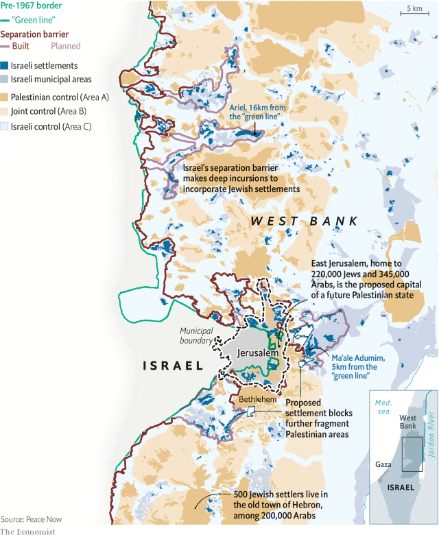

###### Future of the Holy Land

# Israel’s growing settlements force stark choices about its future 

##### The country cannot remain Jewish and democratic while controlling the entire Holy Land 

 

> Feb 2nd 2019 

 

ISRAELI-PALESTINIAN peace talks are frozen. President Donald Trump’s plan for the “deal of the century” has been put off. The subject is absent in campaigning for the Israeli election in April, which focuses on looming corruption charges against Binyamin Netanyahu, the prime minister. 

The Oslo accords of 1993 created a crazy quilt of autonomous zones in the lands that Israel captured in 1967. They also kindled the hope of creating a Palestinian state in most of the West Bank and Gaza Strip, with its capital in East Jerusalem. After much bloodshed, though, most Israelis are wary of this “two-state solution”. Today Palestinians are mostly shut off by security barriers, and divided. The Palestinian Authority in the West Bank refuses to negotiate with Israel but co-operates on security. Its Islamist rival, Hamas, which runs Gaza, dares not risk another war, for now. 

Besides, the growth of Jewish settlements makes a two-state deal ever harder. Establishing a Palestinian state would probably require the removal of settlers in its territory. Israel had trouble enough evicting 8,000 Jews from Gaza in 2005. There are more than fifty times as many in the West Bank. Even excluding East Jerusalem, annexed by Israel, the number of Jews east of the “green line” (the pre-1967 border) has risen from 110,000 in 1993 to 425,000. New home approvals nearly quadrupled from 5,000 in 2015-16 to 19,000 in 2017-18, according to Peace Now, a pressure group. 

Such “facts on the ground” follow a pattern: more intense building in East Jerusalem and close to the green line; less so deeper in the West Bank. In theory, a line could be drawn to incorporate the vast majority of settlers within Israel. The route of the existing and planned barriers would take in 77% of the West Bank’s settlers (or 85%, counting East Jerusalem). But this creates deep salients that break up Palestinian areas and cut them off from Jerusalem. 

As Palestinians lose hope for a state of their own, some favour a “one-state” deal: a single state on all the land with equal rights for Jews and Arabs. Israel would have to give up its predominantly Jewish identity. That is because, between the Mediterranean and the Jordan river, the overall number of Arabs has caught up with that of Jews, and may soon exceed them. 

This creates a “trilemma” for Israel. It cannot have at the same time a strong Jewish majority, all the land and a full democracy that does not discriminate against Arabs. In the end it must sacrifice either land in a two-state solution; or a Jewish majority in a big “binational” state; or the claim to being a proper democracy. It has tried to avoid such stark choices through messy partial withdrawals. But the more permanent its occupation becomes, the more it risks sliding towards apartheid. 

-- 

 单词注释:

1.stark[stɑ:k]:a. 僵硬的, 完全的, 刻板的, 明显的, 荒凉的, 结实的 adv. 突出地, 简直, 全然 

2.cannot['kænɒt]:aux. 无法, 不能 

3.feb[]:abbr. 二月（February） 

4.donald['dɔnәld]:n. 唐纳德（男子名） 

5.Israeli[iz'reili]:a. 以色列的, 以色列人(语)的 n. 以色列人 

6.loom[lu:m]:n. 织布机, 若隐若现的景象 vi. 朦胧地出现, 隐约可见, 可怕地出现 

7.corruption[kә'rʌpʃәn]:n. 腐败, 堕落, 贪污 [计] 论误 

8.binyamin[]:本雅明 

9.Netanyahu[]:n. 内塔尼亚胡（人名） 

10.Oslo['ɒzlәu]:n. 奥斯陆 

11.Israel['izreil]:n. 以色列, 以色列后裔, 犹太人 

12.kindle['kindl]:vt. 点燃, 使着火, 引起, 照亮 vi. 着火, 激动, 发亮 

13.Palestinian[,pælis'tiniәn]:[经] 巴勒斯坦的 

14.gaza['^ɑ:zә]:n. 加沙（地中海岸港市） 

15.Jerusalem[dʒә'ru:sәlәm]:n. 耶路撒冷 

16.bloodshed['blʌdʃed]:n. 流血 

17.Israeli[iz'reili]:a. 以色列的, 以色列人(语)的 n. 以色列人 

18.wary['wєәri]:a. 谨慎的, 小心的, 机警的, 周到的, 唯恐的 

19.Palestinian[,pælis'tiniәn]:[经] 巴勒斯坦的 

20.Islamist[iz'lɑ:mist]:n. 伊斯兰教主义者；回教教徒 

21.Hama['hæmә]:哈马[叙利亚西部城市] 

22.evict[i'vikt]:vt. 逐出, 赶出, 驱逐 [法] 逐出, 驱逐, 没收 

23.Jew[dʒu:]:n. 犹太人, 守财奴, 犹太教信徒 vt. 欺骗, 杀价 

24.annex[ә'neks]:n. 附加物, 附属建筑物 vt. 附加, 盖(印), 并吞 

25.quadruple['kwɒdrupl]:a. 四倍的, 四重的, 四部分组成的 n. 四倍 vt. 使成四倍 vi. 成为四倍 

26.les[lei]:abbr. 发射脱离系统（Launch Escape System） 

27.incorporate[in'kɒ:pәreit]:a. 合并的, 组成公司的, 一体化的 vt. 吸收, 合并, 使组成公司, 体现 vi. 合并, 混合, 组成公司 

28.salient['seiliәnt]:a. 显著的, 突出的, 跳跃的 n. 凸角, 突出部分 

29.predominantly[]:adv. 主要地, 显著地, 大多数地, 突出地 

30.jordan['dʒɒ:dәn]:n. 约旦, 约旦河, 尿壶 

31.trilemma[trai'lemә]:n. 三难困难,三难选择的窘境,[逻]三难推理 

32.discriminate[dis'krimineit]:v. 区别, 差别待遇 

33.binational[bai'næʃәnәl]:a. 两个国家的,两个民族的 

34.withdrawal[wið'drɒ:l]:n. 提款, 撤退, 退回, 撤消, 退隐, 戒毒过程 [医] 戒除, 脱瘾 

35.apartheid[ә'pɑ:theit]:n. 种族隔离 

