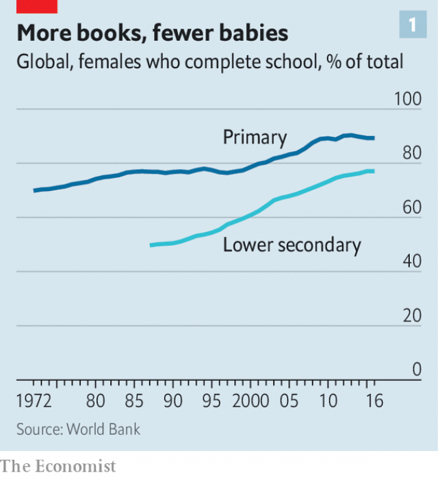
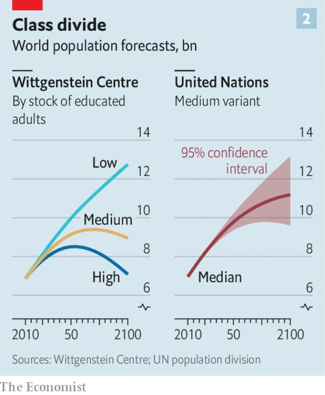

###### A school for small families

# Thanks to education, global fertility could fall faster than expected 

##### The world’s population in 2100 could be no higher than it is today 

 

> Jan 31st 2019 

 

THE AVERAGE woman in Niger has seven children. The average South Korean has barely one. The future size of the world’s population depends largely on how quickly child-bearing habits in places like Niger become more like those in South Korea. If women in high-fertility countries keep having lots of babies, the number of people will keep swelling. The sooner they curb their fecundity, the sooner it will peak and start falling. 

The UN projects that fertility will fall gradually and that lifespans will increase, so the world’s population will rise from 7.7bn today to 11.2bn by 2100. (This is its best estimate; the UN says it is 95% confident that the true figure will lie between 9.6bn and 13.2bn.) Opinions are divided over the effects of such growth. For some, a more crowded planet will be an environmental disaster. For others, those billions of extra brains will help humanity devise ever more cunning solutions to its problems. 

But what if the projection is wrong? Some demographers argue that the UN underestimates how fast fertility will decline. It has already tumbled dramatically. Data from before the Industrial Revolution are spotty but evidence from countries that kept good records, such as America, suggests that a typical woman had seven or more children. By 1960 the global fertility rate had fallen to five. Today it is 2.4. This is only just above the “replacement rate” of 2.1, at which the population remains stable, with each generation replacing itself but no more. (The rate is more than two because not every baby grows up to be able to have children.) 

Nearly all rich countries have sub-replacement fertility rates: the OECD average is 1.7. Middle-income countries are close, at 2.3. Only in poor countries is fertility still high enough to fuel rapid population growth. In sub-Saharan Africa it is 4.8; in “heavily indebted poor countries” (as the World Bank calls them) it is 4.9. Pre-industrial fertility rates persist only in the poorest parts of the poorest countries. 

 

The decline in fertility in Africa was recently smaller than expected. If this is a long-term trend rather than a blip, then the world’s future population will be much larger than today’s. But Wolfgang Lutz, a demographer at the International Institute for Applied Systems Analysis in Austria, argues that it is indeed a blip. It happened because spending on education stalled during the 1990s. Many women born around 1980 received less education than the previous generation. The UN extrapolates from past trends, so the stalling in Africa makes its model predict higher fertility far into the future. However, the decline in education has reversed. The long-term trend is for ever more women to complete a basic education (see chart 1). After a lag (since schooling starts several years before puberty), this should allow fertility to resume its downward slide. 

Models that take education into account produce wildly different projections. Mr Lutz and his team have produced a range. If progress in education and other social indicators stalls, the global population will be 12bn by 2100. If current progress continues, it will peak at 9.4bn in 2075 and then fall to 8.9bn by 2100. If progress is a bit brisker, the world’s population will peak at around 9bn and decline back to 7bn—today’s level—by 2100 (see chart 2). These estimates are based on three scenarios devised by climate-change wonks. Both the medium and optimistic ones are significantly lower than the UN’s 95% confidence range. To assess whether this is plausible, it is important to understand why some women have lots of children and others very few. A good way to start is to ask them. 

 

Oumou Nyero lives in Torodi, a rustic district in Niger. She has had eight children, one of whom died. Though tragic, this is not unusual in rural Niger, where nearly one child in six dies before the age of five. Ms Nyero is 43 and assumes that her child-bearing days are over, unless God wills it. She is Muslim, conservative and veiled. Yet she is happy to discuss procreation, smiling and giggling as she does so. Giving birth eight times was not easy. Asked if any of her children were twins, Ms Nyero grins, raises her forefinger and says: “No. One. One. One. One.” At every “one” she waves her finger around and puffs out her face to emphasise how hard it was. 

She is intensely proud of her brood—three surviving boys and four girls, aged between two and 21, and delighted that there are so many of them. “It is very, very important to have children,” she says, sitting on a wicker chair in the shade of a dusty tree. 

Ms Nyero’s view is typical for someone in her circumstances, and perfectly rational. Her family are poor and rural. Her husband is a small farmer, one of the most precarious jobs in the world. She works for five hours a day selling millet snacks by the side of the road. Having lots of children is an investment that pays off quickly. From a young age, her brood can help in the fields, gather wood, fetch water and do all kinds of odd jobs to eke out the family budget. A local proverb sums it up: “A child comes with two hands and only one mouth.” 

Having a large family is also an insurance policy. Some may die, others may turn out to be feckless. “It is better to have many children, because you cannot tell if you will need them or not,” says Ms Nyero. In the absence of a public safety-net, “children will take care of you in old age.” 

There are intangible benefits, too. For a woman, “it raises your value if you have more [children],” says Ms Nyero. “If you have many, even the friends of your children pay you respect.” By contrast, a failure to breed carries a social stigma. In rural Niger, a woman is not considered an adult unless she has children, observes Alison Heller of the University of Maryland, the author of “Fistula Politics: Birthing Injuries and the Quest for Continence in Niger”. In parts of the country, women whose children all die are known as wabi, meaning a tree whose fruit falls off without ripening. 

Married men in Niger say they want, on average, 12 children. Asked if her husband would like more, Ms Nyero says: “Yes, of course.” She adds: “If he had money, he would marry more wives and have more children. But he hasn’t got money. So, he has to stick to one wife.” 

Ms Nyero adds with a chuckle that she pities childless people, such as the correspondent from The Economist interviewing her. Her approach to child-rearing is loving, fatalistic and far removed from the “helicopter parenting” so common in rich countries. Asked where her two-year-old son is, she grins nonchalantly and looks around the yard. “He was around playing here, but he has wandered off into the fields,” she shrugs. 

For people in rich countries, the economics of child-rearing are different. Rather than start earning at the age of five, the little darlings consume huge amounts of time, resources and parental attention for at least the first 18 years, and possibly far longer. Instead of putting them to work in the fields, their parents try to cram them with education, hoping they will get into a good university and eventually land a good job. All this is costly, so they can afford to do it only once or twice. 

Chung Yeon-jeong lives in Seoul, the bustling capital of South Korea. She works as a translator for a small pharmaceutical company, but is currently on maternity leave. She is still 34, the age at which she had her one child, a boy, and one at which women in Niger are quite likely to be grandmothers. (The median age at which to have one’s first baby in Niger is 18.) 

She is vastly richer than Ms Nyero, but finds even one child a financial strain. She moved in with her parents elsewhere in the country for five months after the birth, because she and her husband could not afford an apartment big enough for three in Seoul, where the average home costs $640,000. “We lived in a small studio flat, which was just about fine for the two of us, but it would have been miserable raising a child there,” she says. Raising seven children in a mudbrick home with no running water, as Ms Nyero does, is hard to imagine. 

Whereas people who are hungry think only of food, those with full fridges crave less tangible things: a fulfilling career, a spouse who is also a soulmate, quality time with each individual child. Ms Nyero never so much as mentions any of these first-world luxuries. For Ms Chung they are important—but also hard to combine with having lots of children. 

Having her parents to help was great, she says, but in other ways it was a tough time. Her husband worked in Seoul and came to see them only at weekends. “The idea was that he would spend time with our son or with me when he came, but sometimes he’d just sit in his room and work, so I didn’t get to spend any time with him, or even have any time to myself, because I had to look after the baby.” 

Ms Chung has now moved back to Seoul. Her husband has found a new job with a broadcasting company that lets him get home at a reasonable hour every night. This is unusual in South Korea, where male white-collar workers are expected to put in punishing hours and then go drinking with colleagues. The husbands of Ms Chung’s friends are rarely home before midnight. 

The pressure on South Korean mothers is unusually intense. Their bosses often assume that they will quit. Employers are legally obliged to offer 12 months of maternity leave, but often find ways to avoid it, complains Ms Chung. The average Korean husband does far less child care or housework than his Western peer. 

Moreover, the competition to get one’s children into the right university is ferocious. Families spend a fortune on cram schools, despite attempts by the government to restrict them. Mothers spend hours nagging their children to study and preparing snacks so they can stay longer in the library. Ms Chung wants her son to have the best education possible, which will be horribly expensive. She would like more children but doubts that would be compatible with her desire to go back to work. Also, if she had several kids she could not afford to educate them properly, she says. 

Some young South Korean women go further, and say that even one child is too many. “I look at my mother and how she’s sacrificed everything and people don’t even notice. I don’t want my life to be like that,” says a 22-year-old student in Seoul. 

South Korea is an extreme example, but women in other rich countries make the same basic calculation. Instead of starting to have babies shortly after they reach puberty, as women have done throughout history, they postpone motherhood until they have spent years in education and then established themselves in a career. If they have children, they typically have only one or two, because giving them the best start in life is expensive. They assume, with good cause, that none of their offspring will die young. 

Women in middle-income countries (ie, most women) behave a lot like women in rich countries, which is why their fertility rate is but a whisker above the replacement level. In China, the norm of having just one child has become so ingrained since the one-child policy was introduced in 1979 that even after its progressive relaxation in recent years, the birth rate has continued to fall. Officially, the fertility rate is 1.6, but some demographers suspect it is actually lower. In India, which is far poorer, the rate is nonetheless only 2.3. 

It is unlikely that the trend towards lower fertility will reverse. “Once having one or two children becomes the norm, it stays the norm,” write Darrell Bricker and John Ibbitson in “Empty Planet: The Shock of Global Population Decline”. “Couples no longer see having children as a duty…to their families or their god. Rather, they choose to raise a child as an act of personal fulfilment. And they are quickly fulfilled.” 

The big question-mark hangs over women in poor, high-fertility countries. By 2025 only 1% will live in places where the fertility rate is above 5.0; however, a hefty 32% will live in places where it is between 2.1 and 5.0, predicts the UN. Some people argue that having big families is part of the culture of such places and unlikely to change. Many locals would agree, and their religious leaders would add that God wants them to multiply. But a similar “cultural” preference for large families once prevailed almost everywhere and has changed beyond recognition. So there is no reason to assume that it is immutable. 

Others assume that the important factor is the availability of contraception. However, using household surveys in Africa, Mr Lutz found that less than a tenth of women who researchers thought might need birth control cited cost or lack of access as reasons for not using it. The main reasons were lack of knowledge, misplaced fear of health risks and opposition to family planning. None of these things can be changed by handing out free condoms. All require a change of mindset. (Or, in some cases, contraception that a woman can use without her husband knowing.) 

Several factors correlate strongly with smaller families. One, as mentioned, is income. Another is urbanisation. Probably the most important, however, is educating girls. The more years they spend in school, the fewer babies they have. 

This is hard to disentangle from the other two—richer countries tend to be more urban and to educate girls better. And it is theoretically possible that causality could flow the other way—women who get pregnant as teenagers may be forced to drop out of school. But this effect is likely to be small. When researchers look only at the education that girls receive before they become sexually mature, they still find that more years in school means fewer babies later in life. That suggests that learning reduces fertility, not the other way round. 

A truckload of academic studies supports this argument. Education reduces fertility by giving women other options. It increases their chances of finding paid work. It reduces their economic dependence on their husbands, making it easier to refuse to have more children even if he wants them. It equips them with the mental tools and self-confidence to question traditional norms, such as having as many children as possible. It makes it more likely that they will understand, and use, contraception. It transforms their ambitions for their own children—and thus the number that they choose to have. 

Education also takes a long time. A woman who studies until she is 25 and then spends ten years building a career has just a few years left to get pregnant before she no longer can. Technology may someday remove this constraint, but for now it is hard to have eight children unless, like Ms Nyero, you start early. 

 

The difference that education makes is especially notable in countries where fertility has only just started to fall. In Ethiopia, for example, a household survey in 2005 found that the fertility rate for women with no formal schooling was 6.1; for women with secondary education or more, it was only 2.0. Educating girls better is one of the few goals that nearly every government agrees is important. So it would be surprising if the girls of the future were worse educated than today’s. The proportion worldwide who complete primary school has risen from 76% in 1997 to 90%. The last mile may be the hardest, but there is no doubt what parents and voters want. 

A transition that took 200 years in the West, from seven children to two, can now take place astonishingly fast. When rural folk move to the city, it can happen in a single generation. Consider Dorothy Achieng, a 29-year-old receptionist at an accountancy firm in Nairobi. Her mother had eight children, one of whom died. Dorothy has two. Whereas her mother could barely read and put her older children to work on a small family farm, Ms Achieng hopes to keep hers in school. 

Ms Achieng is typical of those who move from the countryside to the city. The rural fertility rate in Kenya is 4.5; the urban one, 3.1. Most of Ms Achieng’s friends, like her, have far fewer children than their parents did. No one she knows has seven or eight children. 

Although she lives in a slum and has no running water in her modest two-room flat, Ms Achieng is part of the aspiring middle class. Indeed, on her salary of just $200 a month, she pays for a private school that costs $50 per child, per term. It is a strain, but she thinks it is worth it. She does not plan to have more children. If she did, she says, she could not “give them the best”. 

Asked what they want to be when they grow up, her two boys stop whizzing around her flat in pursuit of a remote controlled car. “A doctor,” says Crispian, who is nine. Lennox-Lewis, aged seven, chimes in: “And I want to be a lawyer.” 

-- 

 单词注释:

1.fertility[fә'tiliti]:n. 肥沃, 丰饶, 生产力 [医] 生育力 

2.Jan[dʒæn]:n. 一月 

3.Niger['naidʒә]:n. 尼日尔 [化] 皂脚 

4.Korean[kә'riәn]:n. 朝鲜人, 朝鲜语 a. 朝鲜人的, 朝鲜语的 

5.quickly['kwikli]:adv. 很快地 

6.Korea[kә'riә]:n. 朝鲜, 韩国 

7.curb[kә:b]:n. 抑制, 勒马绳, 边石 vt. 抑制, 束缚, 勒住 

8.fecundity[fi'kʌnditi]:n. 多产, 丰饶, 肥沃, 繁殖力 [医] 生殖能, 生殖力 

9.UN[ʌn]:pron. 家伙, 东西 [经] 联合国 

10.lifespan['laifspæn]:n. 预期生命期限；寿命；预期使用期限 

11.environmental[in.vaiәrәn'mentәl]:a. 周围的, 环境的 [经] 环境的, 环保的 

12.humanity[hju:'mæniti]:n. 人性, 人类, 博爱 

13.projection[prә'dʒekʃәn]:n. 发射, 计划, 突出部分, 设计, 推测 [计] 投影 

14.demographer[di:'mɒgrәfә]:n. 人口统计学家 

15.underestimate[.ʌndәr'estimeit]:n. 低估 vt. 低估, 看轻 

16.dramatically[drә'mætikli]:adv. 戏剧地, 引人注目地, 突然地 

17.datum['deitәm]:n. 论据, 材料, 资料, 已知数 [医] 材料, 资料, 论据 

18.spotty['spɒti]:a. 有斑点的, 有污点的, 质量不一的, 发疹的 

19.replacement[ri'pleismәnt]:n. 归还, 更换, 代替者 [医] 复位, 置换 

20.Oecd[]:[经] 已开发国家组织 

21.indebted[in'detid]:a. 负债的, 受惠的 [法] 负债的, 法律上有义务偿还的 

22.blip[blip]:n. 光点, 清脆的短音 [电] 小粒 

23.wolfgang['wulf^æŋ]:n. 沃尔夫冈（男子名） 

24.Lutz[ljts]:n. (花样滑冰中)后外钩点冰一周跳 

25.Austria['ɒstriә]:n. 奥地利 

26.stall[stɒ:l]:n. 厩, 停车处, 牧师职位, 货摊, 托辞, 拖延 vt. 关入厩, 停顿, 推托, 支吾, 使陷于泥中 vi. 被关在厩内, 陷于泥中, 停止, 支吾 

27.les[lei]:abbr. 发射脱离系统（Launch Escape System） 

28.extrapolate[ek'stræpәleit]:v. 推断, 外推 

29.puberty['pju:bәti]:n. 青春期, 春情发动期 [医] 青春期(12-17岁) 

30.wildly[]:adv. 狂暴地, 激动地, 狂热地, 鲁莽地, 轻率地 

31.indicator['indikeitә]:n. 指示器, 指示剂, 指标 [计] 指示器 

32.scenario[si'nɑ:riәu]:n. 剧本提纲, 情节, 剧本, 方案, 事态 [计] 方案 

33.wonk[wɔŋk]:[俚]书呆子, 死用功的学生 

34.significantly[]:adv. 值得注目地；意味深长地 

35.plausible['plɒ:zibl]:a. 貌似真实的, 貌似合理的, 说得煞有其事的 [法] 花言巧语的, 似乎有理的 

36.oumou[]:乌穆 

37.Torodi[]:[地名] 托罗迪 ( 尼日尔 ) 

38.rustic['rʌstik]:n. 乡下人, 乡巴佬 a. 乡村的, 纯朴的, 手工粗糙的 

39.tragic['trædʒik]:a. 悲惨的, 悲剧的 

40.Muslim['mjzlim; (?@) 'mʌzlem]:n. 伊斯兰教, 伊斯兰教教徒 

41.procreation[.prәukri'eiʃәn]:n. 生产, 生殖 [医] 生殖, 生育 

42.giggle['gigl]:v. 吃吃地笑, 咯咯地笑 n. 咯咯笑, 傻笑 

43.grin[grin]:n. 露齿笑 v. 露齿而笑 

44.forefinger['fɒ:fiŋgә]:n. 食指 [医] 食指, 示指 

45.emphasise[]:vt. 强调, 重读, 加强...的语气, 着重 

46.intensely[ɪn'tenslɪ]:adv. 强烈地; 极度; 剧烈地 

47.wicker['wikә]:n. 柳条 a. 柳条编的 

48.precarious[pri'kєәriәs]:a. 不稳定的, 不安的, 危险的 

49.millet['milit]:n. 稷, 粟, 黍 [医] 小米 

50.eke[i:k]:vt. 补充, 增加 

51.proverb['prɒvә:b]:n. 谚语, 格言, 箴言 vt. 使众所周知, 用谚语表达 

52.feckless['feklis]:a. 无效的, 无能的, 不负责任的 

53.cannot['kænɒt]:aux. 无法, 不能 

54.intangible[in'tændʒәbl]:a. 难以明了的, 无形的 [经] 无形的 

55.stigma['stigmә]:n. 耻辱, 污名, 烙印 [医] 柱头; 小孔, 眼点; 气孔; 小斑; 特征 

56.alison['ælisn]:n. 艾莉森（女子名） 

57.heller['helә]:n. 捷克货币；昔德国之小铜币 

58.Maryland['merilәnd]:n. 马里兰州 

59.fistula['fistjulә]:n. 瘘, 瘘管 [医] 瘘, 瘘管 

60.quest[kwest]:n. 探索, 寻求, 调查 v. 寻找, 找, 追寻猎物 

61.continence['kɒntinәns]:n. 自制 [医] 节制; 节欲 

62.wabi[]:abbr. Windows application binary interface Windows （操作系统）应用程序二进制接口 

63.chuckle['tʃʌkl]:n. 咯咯的笑声, 轻笑 vi. 咯咯的笑, 咕咕叫 

64.childless['tʃaildlis]:a. 无儿女的 

65.economist[i:'kɒnәmist]:n. 经济学者, 经济家 [经] 经济学家 

66.fatalistic[.feitә'listik]:a. 宿命论的 

67.parenting['pεәrәntiŋ]:n. 父母对子女的养育 

68.nonchalantly['nɒnʃələntlɪ]:adv. 漠不关心地, 无动于衷地 

69.parental[pә'rentәl]:a. 父母亲的, 做双亲的, 作为渊源的 [医] 父母的, 双亲的 

70.cram[kræm]:vt. 塞满, 填满, 猛吃 vi. 贪吃 n. 极度拥挤, 死记硬背 

71.chung[]:n. 钟, 宗, 忠, 聪 

72.Seoul[sәul]:n. 汉城 

73.bustle['bʌsl]:n. 喧闹, 裙撑 vi. 奔忙, 喧闹 vt. 使忙碌, 催促 

74.pharmaceutical[,fɑ:mә'sju:tikәl]:a. 药学的, 制药的, 药用的, 药物的, 药剂师的, 药师的 n. 药品, 成药, 药剂 

75.currently['kʌrәntli]:adv. 现在, 当前, 一般, 普通 [计] 当前 

76.maternity[mә'tә:niti]:n. 母性, 怀孕, 妇产科医院 a. 产妇的 

77.median['mi:diәn]:a. 中央的, 中间的, 正中的 n. 正中动脉, 中位数, 中线 

78.vastly['vɑ:stli]:adv. 广大地, 许多, 巨大 

79.mudbrick[]:un. 泥砖 [网络] 德布里克；怀赫科岛酒庄；布莱克 

80.crave[kreiv]:v. 渴望, 热望, 恳求 

81.tangible['tændʒәbl]:n. 可触知的东西, 有形资产 a. 可触摸的, 有实体的, 非相像的, 有形的, 明确的 

82.spouse[spauz]:n. 配偶 

83.soulmate[ˈsəʊlmeɪt]:n. 心灵伴侣, 知音, 梦中情人 

84.legally['li:gәli]:adv. 法律上, 合法地 [法] 法律上, 合法地, 法定地 

85.peer[piә]:n. 同等的人, 匹敌, 贵族 vi. 凝视, 窥视, 费力地看, 隐现 vt. 与...同等, 封为贵族 

86.ferocious[fә'rәuʃәs]:a. 残忍的, 凶猛的, 可怕的 

87.nag[næg]:n. 老马, 驽马, 劣等竞赛马, 唠叨 v. 不断地唠叨, 恼人 

88.horribly['hɒrәbli]:adv. 可怕地, 非常地 

89.compatible[kәm'pætәbl]:a. 能共处的, 可并立的, 适合的 [计] 相容的; 兼容的 

90.motherhood['mʌðәhud]:n. 母道, 母性, 母亲们 

91.typically['tipikәli]:adv. 代表性地；作为特色地 

92.offspring['ɒ:fspriŋ]:n. 子孙, 后代, 产物 [法] 后辈, 子孙, 后裔 

93.IE['i:ei]:[计] 中断启动 

94.whisker['hwiskә]:n. 腮须, 胡须, 一丝儿 [化] 晶须 

95.norm[nɒ:m]:n. 基准, 模范, 标准, 准则, 平均数 [化] 定额 

96.ingrain[in'grein]:vt. 给原纱染色, 使根深蒂固 a. 原纱染色的, 根深蒂固的 n. 原纱染色, 固有品质 

97.relaxation[.ri:læk'seiʃәn]:n. 松弛, 放松, 减轻, 缓和, 休息, 休养 [化] 松弛; 驰豫 

98.officially[ә'fiʃәli]:adv. 作为公务员, 职务上, 官方地 

99.nonetheless[,nʌnðә'les]:conj. 然而, 尽管, 不过 adv. 不过, 仍然, 尽管如此, 然而 

100.darrell['dærәl]:n. 达雷尔（男子名） 

101.bricker[]: [人名] 布里克 

102.john[dʒɔn]:n. 盥洗室, 厕所, 嫖客 

103.fulfilment[]:n. 履行, 结束, 完成, 实现, 满意, 称心 [法] 履行, 实现, 完成 

104.hefty['hefti]:a. 重的, 肌肉发达的 

105.cultural['kʌltʃәrәl]:a. 文化的, 教养的, 修养的 [医] 培养的 

106.immutable[i'mju:tәbl]:a. 不可变的, 不变的, 不能变的 

107.availability[ә.veilә'biliti]:n. 有效性, 可利用性, 可利用的人 [计] 有效性; 可用性 

108.contraception[.kɒntrә'sepʃәn]:n. 避孕, 避孕法 [医] 节(制生)育, 避孕 

109.cite[sait]:vt. 引用, 引证, 表彰 [建] 引证, 指引 

110.misplace[mis'pleis]:vt. 放错地方 

111.opposition[.ɒpә'ziʃәn]:n. 反对, 敌对, 相反, 在野党 [医] 对生, 对向, 反抗, 反对症 

112.condom['kɒndәm]:n. 避孕套 [医] 阴茎套 

113.mindset[]:n. 心态；倾向；习惯；精神状态 

114.correlate['kɒrәleit]:n. 有相互关系的东西, 相关物 vt. 使有相互关系 vi. 相关 

115.urbanisation[ˌɜ:bənaɪ'zeɪʃən]:n. 城市化（等于urbanization） 

116.disentangle[.disin'tængl]:vi. 解开纠结, 松开, 解决 vt. 解开, 松开 

117.theoretically[.θi:ә'retikli]:adv. 理论上, 理论地 

118.causality[kɒ:'zæliti]:n. 因果关系 [化] 因果性 

119.sexually[]:adv. 性别地；两性之间地 

120.truckload['trʌklәjd]:n. 货车荷载, 最低起运量 

121.dependence[di'pendәns]:n. 依赖, 依存, 信赖 [医] 依赖(如对药物的依赖,即瘾或癖), 从属, 偏利共生 

122.someday['sʌmdei]:adv. 有一天 

123.constraint[kәn'streint]:n. 强制, 约束 [计] 约束 

124.notable['nәutәbl]:n. 著名人士, 值得注意之事物 a. 值得注意的, 显著的 

125.Ethiopia[.i:θi'әupiә]:n. 埃塞俄比亚 

126.voter['vәutә]:n. 选民, 投票人 [法] 选民, 选举人, 投票人 

127.transition[træn'ziʃәn]:n. 转变, 转换, 变迁, 过渡时期, 临时转调 [化] 跃迁 

128.astonishingly[ə'stɔniʃiŋli]:adv. 令人惊讶地 

129.dorothy['dɔrәθi]:n. 桃乐茜（女子名） 

130.Achieng[]:阿钦 

131.accountancy[ә'kauntәnsi]:n. 会计工作, 会计学 [经] 会计工作, 会计学术, 会计职业 

132.Nairobi[nai'rәubi]:n. 内罗比 

133.Kenya['kenjә]:n. 肯尼亚 

134.aspire[ә'spaiә]:vi. 渴望, 立志于 

135.whizz[hwiz]:n. 飕飕声, 精明的人, 专家 v. (使)飕飕作声 

136.crispian[]: [男子名] 克里斯皮安 Crispin的变体 

137.chime[tʃaim]:n. 钟声, 钟, 和谐 vi. 鸣, 奏出谐和的乐声, 和谐 vt. 敲出和谐的声音, 打钟报时, 重复说 

