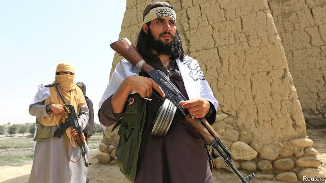

###### Talking to the Taliban

# A deal to end the insurgency in Afghanistan would be wonderful 

##### As long as it is not a figleaf to cover an American retreat 

 

> Jan 31st 2019 

 

AFTER MORE than 17 years, it is the longest war in American history. American forces are no closer to defeating the Taliban—the repressive Islamist militia that ruled most of Afghanistan before 2001—than they were a decade ago. In fact, the share of the country under full control of the elected, American-backed government is humiliatingly small. The conflict has reached something close to a stalemate, but a bloody one: some 10,000 police and soldiers, 3,400 civilians and an unknown number of insurgents died in 2017 alone. Since then, the authorities have stopped releasing data on military casualties—not, presumably, because things have got better. 

The news that America and the Taliban are making headway in negotiations to end the conflict is therefore welcome (see article). Zalmay Khalilzad, America’s chief negotiator, says the two sides have agreed on a “framework” for a deal. America would withdraw its troops in exchange for an undertaking from the Taliban not to provide sanctuary to foreign terrorists, as they once did for Osama bin Laden. The Taliban would also have to agree to a ceasefire and begin negotiations with the Afghan government, which they have long denounced as an American creation. 

The goals of drawing the Taliban into peaceful politics and thus extricating America from a costly and destructive conflict are the right ones. But there are, sadly, many reasons to fear that the framework will not produce either outcome. For one thing, the details will be thorny. The Taliban already sound lukewarm about the ceasefire and the talks. Setting the order in which the agreed steps are taken could also be a stumbling block, especially when it comes to the timing and pace of America’s withdrawal. 

Another worry is that the Taliban will promise the moon to rid themselves of the Americans, on the entirely reasonable assumption that, even if they go on to break their word, the GIs are unlikely to return. The American-led mission in Afghanistan is called Resolute Support, but the resolve of President Donald Trump, at least, is clearly dissipating. He has made no secret of his desire to bring American troops home, and given no sign that he values the things their presence achieves. 

Before America toppled the Taliban regime, Afghanistan was a violent theocratic despotism. Women were not allowed out of their homes unless covered head to toe and accompanied by a male relative. Any departure from the Taliban’s barbaric version of Islam, such as dancing or shaving or educating girls, could earn floggings, imprisonment or even death. Ancient statues were dynamited as pagan idols. Keeping such zealots at bay, for as long as they try to impose their beliefs by force, is an incalculable benefit to the two-thirds of Afghans (some 24m people) who live in government-controlled areas. 

There are benefits for America, too. If the Taliban were to overthrow the Afghan government after an American withdrawal, it would be a humiliation on a par with Vietnam. Even if the government staggered on, a pull-out without a solid peace agreement would cause chaos. Regional powers such as China, India, Iran, Pakistan and Russia would all struggle to fill the vacuum. At best, the result would be a gruesome surge in fighting; at worst, the whole region could be destabilised. An offshoot of the Taliban in Pakistan set off something close to civil war there in 2014. America could easily be sucked back in. 

With a force of 140,000, America could not wipe out the Taliban. But with a mere 13,000 troops bolstering the Afghan army today, it seems able to keep the insurgents more or less in check. Mr Khalilzad should be clear that America is looking for a durable settlement, not a figleaf to cover its retreat. Its troops should stay until the Taliban show that they are sincere about taking up politics and laying down arms. Otherwise, the Taliban will have no reason to change their stripes—and Afghanistan, already at war for 40 years, will be condemned to yet more conflict. 

-- 

 单词注释:

1.Taliban[]:塔利班 

2.insurgency[in'sә:dʒәnsi]:n. 叛乱状态, 发生暴动 [法] 暴动, 起义, 叛乱 

3.Afghanistan[æf'gænistæn]:n. 阿富汗 

4.figleaf[]:na. (雕塑)裸体像的遮羞叶；无花果叶 [网络] 狼战士；无花果树叶 

5.Jan[dʒæn]:n. 一月 

6.repressive[ri'presiv]:a. 压抑的, 抑制的, 镇压的 

7.Islamist[iz'lɑ:mist]:n. 伊斯兰教主义者；回教教徒 

8.militia[mi'liʃә]:n. 义勇军, 民兵组织, 国民军 

9.humiliatingly[]:adv. humiliating的变形 

10.stalemate['steilmeit]:n. 僵持状态, 僵局, 陷于困境, 胶着状况 vt. 将...逼和, 使僵持, 使陷入困境 

11.bloody['blʌdi]:a. 血腥的, 嗜杀的, 有血的 

12.insurgent[in'sә:dʒәnt]:a. 谋叛的, 起义的, 澎湃的 n. 起义者, 叛乱者 

13.datum['deitәm]:n. 论据, 材料, 资料, 已知数 [医] 材料, 资料, 论据 

14.headway['hedwei]:n. 前进, 航行速度, 进展 [经] 进尺, 钻井 

15.negotiation[ni.gәuʃi'eiʃәn]:n. 谈判, 磋商, 交涉 [经] 谈判, 协商 

16.zalmay[]: [人名] 扎尔梅 

17.khalilzad[]:[网络] 哈利勒扎德 

18.negotiator[ni'gәuʃieitә]:n. 磋商者, 交涉者, 议定者 [经] 谈判者, 交易者, 协商者 

19.sanctuary['sæŋktʃuәri]:n. 圣所(指教堂、寺院等), 耶路撒冷的神殿, 避难所 [法] 庇护所, 避难所, 教堂 

20.terrorist['terәrist]:n. 恐怖分子 [法] 恐怖份子, 恐怖主义 

21.osama[]:奥萨马 (本拉登的名字) 

22.bin[bin]:n. (贮存谷物等的)容器, 箱子 [计] 二进制, 商业信息网 

23.ceasefire[ˈsi:sfaɪə(r)]:n. （通常指永久性的）停火, 停战; 停火命令 

24.Afghan['æfgæn]:a. 阿富汗的, 阿富汗人的 n. 阿富汗人, 阿富汗语, 阿富汗毛毯 

25.denounce[di'nauns]:vt. 告发, 抨击, 谴责 [法] 谴责, 斥责, 告发 

26.creation[kri:'eiʃәn]:n. 创造, 创作物, 发明 [化] 产生 

27.politic['pɒlitik]:a. 精明的, 明智的, 策略的 

28.extricate['ekstrikeit]:vt. 使解脱, 救出 

29.thorny['θɒ:ni]:a. 多刺的, 令人苦恼的 

30.lukewarm['lu:kwɒ:m]:a. 微温的, 不热的, 不热情的 [医] 微温的 

31.timing['taimiŋ]:n. 时间选择, 时间测定, 定时, 调速 [计] 定时器时钟 

32.withdrawal[wið'drɒ:l]:n. 提款, 撤退, 退回, 撤消, 退隐, 戒毒过程 [医] 戒除, 脱瘾 

33.entirely[in'taiәli]:adv. 完全, 全然, 一概 

34.gi[dʒi: 'ai]:a. 军用的；美国军人的 

35.resolute['rezәlu:t]:n. 果断的人 a. 坚决的, 刚毅的, 毅然的 

36.donald['dɔnәld]:n. 唐纳德（男子名） 

37.trump[trʌmp]:n. 王牌, 法宝, 喇叭 vt. 打出王牌赢, 胜过 vi. 出王牌, 吹喇叭 

38.dissipate['disipeit]:vt. 散失, 驱散, 浪费 vi. 消散, 放荡 

39.topple['tɒpl]:vt. 推翻, 颠覆 vi. 倒塌, 摇摇欲坠 

40.regime[rei'ʒi:m]:n. 政权, 当权期间, 政体, 社会制度, 体制, 情态 [医] 制度, 生活制度 

41.theocratic[.θi:ә'krætik]:a. 神权政治的 

42.despotism['despәtizәm]:n. 独裁, 专制, 专制政治 [法] 专制政体, 专制政治 

43.barbaric[bɑ:'bærik]:a. 野蛮的, 粗野的 

44.Islam['izlɑ:m]:n. 伊斯兰教 

45.flogging['flɒgiŋ]:n. 鞭打 [机] 击落浇冒口 

46.imprisonment[im'priznmәnt]:n. 监禁, 下狱, 坐牢 [法] 监禁, 徒刑, 拘禁 

47.dynamit[daɪnə'mɪt]:abbr. dynamic allocation of manufacturing inventory and time 制造业存货和时间的机动安排 

48.pagan['peigәn]:n. 异教徒, 无宗教信仰者 a. 异教的, 异教徒的 

49.idol['aidәl]:n. 偶像, 崇拜物, 宠儿, 幻象, 谬论 

50.zealot['zelәt]:n. 热心者, 狂热者, 犹太教狂热信徒 [法] 狂热分子, 激烈分子 

51.incalculable[in'kælkjulәbl]:a. 无法计数的, 无数的, 不可预料的 

52.Afghan['æfgæn]:a. 阿富汗的, 阿富汗人的 n. 阿富汗人, 阿富汗语, 阿富汗毛毯 

53.overthrow[.әuvә'θrәu]:n. 推翻, 瓦解, 倾覆 vt. 打倒, 推翻, 倾覆 

54.humiliation[hju:.mili'eiʃәn]:n. 耻辱, 丢脸, 谦卑 

55.par[pɑ:]:n. 标准, 票面价值, 平均数量, 同等水平 a. 票面的, 平常的, 标准的, 平价的 [计] 重新传输的肯定回答 

56.Vietnam[.vjet'næm]:n. 越南 

57.stagger['stægә]:n. 蹒跚, 踌躇 vi. 蹒跚, 犹豫 vt. 使摇摆, 使踌躇, 交错, 错开 a. 交错的, 错开的 

58.chao[]:n. 钞（货币） 

59.regional['ri:dʒәnәl]:a. 地方的, 地域性的 [医] 区的, 部位的 

60.Iran[i'rɑ:n]:n. 伊朗 

61.Pakistan[.pɑ:ki'stɑ:n]:n. 巴基斯坦 

62.gruesome['gru:sәm]:a. 可怕的, 令人毛骨悚然的, 阴森的 

63.surge[sә:dʒ]:n. 巨涌, 汹涌, 澎湃 vi. 汹涌, 澎湃, 颠簸, 猛冲, 突然放松 vt. 使汹涌奔腾, 急放 [计] 电压尖峰 

64.destabilise[di:'steɪbɪlaɪz]:vt. 破坏政府的稳定 

65.offshoot['ɒ:fʃu:t]:n. 分支, 旁系, 衍生事物 

66.bolster['bәulstә]:n. 支持, 长枕 vt. 支持, 支撑 

67.les[lei]:abbr. 发射脱离系统（Launch Escape System） 

