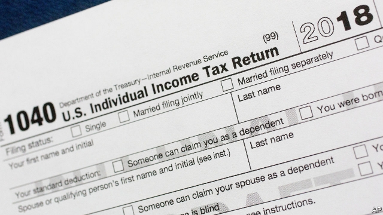
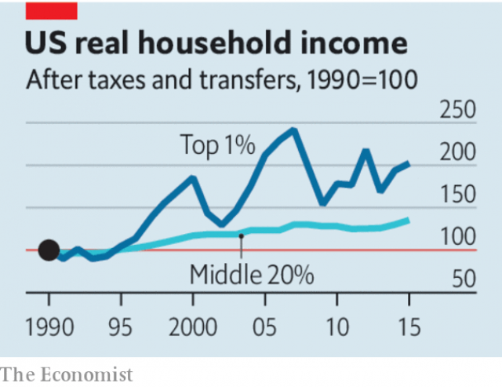

###### A way through the warren

# How to tax the rich 

##### And how to limit the economic damage 

 

> Feb 2nd 2019 

 

DURING HIS lesser-known run for president, which began in 1999, Donald Trump proposed levying a wealth tax on Americans with more than $10m. He may soon find himself campaigning on the other side of the issue. That is because Democrats are lining up to find ways to tax the rich. Senator Elizabeth Warren, who wants Mr Trump’s job, has called for an annual levy of 2% on wealth above $50m and of 3% on wealth above $1bn. Alexandria Ocasio-Cortez, a prominent new left-wing congresswoman, has floated a top tax rate of 70% on the highest incomes. 

In one way these proposals are a relief. Left-wing Democrats have plenty of ideas for new spending—Medicare for all, free college tuition, the “Green New Deal”—that would need funding. Mainly because America is ageing, but also boosted by Mr Trump’s unfunded tax cuts, the debt-to-GDP ratio is already expected to nearly double over the next 30 years. If a future Democratic administration creates new spending programmes while maintaining existing ones, higher taxes will be necessary. 

If revenues are to rise, there are good grounds to look first to the rich. Mr Trump’s tax cuts are just the latest change to have made life at the top more splendorous. Between 1990 and 2015 the real income of the top 1% of households, after taxes and transfers, nearly doubled. Over the same period middle incomes grew by only about a third—and most of that was thanks to government intervention. Globalisation, technological change and ebbing competition have all helped the rich prosper in recent decades. Techno-prophets fear that inequality could soon worsen further, as algorithms replace workers en masse. Whether or not they are right, the disproportionate gains the rich have already enjoyed could justify raising new revenues from them. 

Unfortunately, the proposed new schemes are poorly designed. Ms Warren’s takes aim at wealth inequality, which has also risen dramatically. It is legitimate to tax wealth. But Ms Warren’s levy would be crude, distorting and hard to enforce. A business owner making nominal annual returns of around 5% would see much of that wiped out, before accounting for existing taxes on capital. That prospect would squash investment and enterprise. Meanwhile, bureaucrats would repeatedly find themselves having to value billionaires’ art collections and other illiquid assets. Eight rich countries have scrapped their wealth taxes since 1990, often amid concerns about their economic and administrative costs. In 2017 only four levied them. 

 

There are better ways to raise taxes on capital. One is to increase inheritance tax, an inequality-buster that, though also too easily avoided, is relatively gentle on investment and work incentives when levied at modest rates. Another is to target economic rents and windfalls that inflate investment returns. Higher property taxes can efficiently capture some of the astronomical gains that landowners near successful cities have enjoyed. It is also possible to raise taxes on corporations that enjoy abnormally high profits without severely inhibiting growth. The trick is to shield investment spending by letting companies deduct it from their taxable profit immediately, rather than as their assets depreciate. (Mr Trump’s reform accomplished this, but only partially and temporarily.) 

What about income tax? Ms Ocasio-Cortez’s boosters point out that a 70% levy is close to the rate that is said to maximise revenue in one notable economic study. In truth the study is notable because it is an outlier—one that ignores the benefits of entrepreneurial innovation or of workers improving their skills. France’s short-lived 75% top tax rate, which was scrapped at the end of 2014, raised less money than was hoped. America’s top rate of federal income tax is 37%; higher is clearly feasible, but it would be wise to keep change incremental. 

Although there is scope to raise taxes on the rich, they cannot pay for everything, if only because the rich are relatively scarce. One estimate puts extra annual revenue from Ms Ocasio-Cortez’s idea, which applies only to incomes above $10m, at perhaps $12bn, or 0.3% of the tax take. Ms Warren’s proposal would raise $210bn a year, her backers say—but they assume, implausibly, limited avoidance and no economic damage. Ultimately, the price of ambitious spending programmes will be tax increases that are also far-reaching. The crucial point about a strategy for taxing the rich is to realise that it has limits. 

-- 

 单词注释:

1.warren['wɒrәn]:n. 养兔场, 拥挤的地区 

2.feb[]:abbr. 二月（February） 

3.donald['dɔnәld]:n. 唐纳德（男子名） 

4.trump[trʌmp]:n. 王牌, 法宝, 喇叭 vt. 打出王牌赢, 胜过 vi. 出王牌, 吹喇叭 

5.levy['levi]:n. 税款, 所征的人数, 征收 vi. 征税, 课税 vt. 征收, 强求, 召集 

6.democrat['demәkræt]:n. 民主人士, 民主主义者, 民主党党员 [经] 民主党 

7.senator['senәtә]:n. 参议员, (某些大学的)理事 [法] 参议员, 上议员 

8.elizabeth[i'lizәbәθ]:n. 伊丽莎白（女子名） 

9.warren['wɒrәn]:n. 养兔场, 拥挤的地区 

10.alexandria[,æli^'zɑ:ndriә]:n. 亚历山大港（位于埃及）；亚历山大市（美国弗吉尼亚一城市）；亚历山大大帝 

11.congresswoman['kɒŋgreswumәn]:n. 国会女议员, 众议院女议员 

12.unfunded['ʌn'fʌndid]:a. 未备基金的, 债务短期的 [经] 未设基金的 

13.splendorous['splendə]:a. 华丽的 

14.intervention[.intә'venʃәn]:n. 插入, 介入, 调停 [经] 干预 

15.globalisation[,gləubəlai'zeiʃən]:n. 全球化, =globalization 

16.technological[.teknә'lɒdʒikl]:a. 技术的 [经] 工艺的, 技术的 

17.eb[eb]:abbr. 电子束（Electron Beam） 

18.prosper['prɒspә]:vi. 繁荣, 兴隆, 成功 vt. 使成功, 使昌盛 

19.inequality[.ini'kwɒliti]:n. 不平等, 不同, 不平坦, 不平均 n. 不平等, 不等式 [计] 不等式 

20.worsen['wә:sn]:vt. 使更坏, 使恶化 vi. 变得更坏, 恶化 

21.algorithm['ælgәriðm]:n. 算法 [计] 算法 

22.en[en]:n. 字母N, (铅字)半方 prep. 在...中, 作为 

23.masse[mæ'sei]: [体]竖直挫球 

24.disproportionate[.disprә'pɒ:ʃәnit]:a. 不成比例的 

25.poorly['puәli]:adv. 贫穷地, 不充分地, 贫乏地 a. 身体不舒服的 

26.dramatically[drә'mætikli]:adv. 戏剧地, 引人注目地, 突然地 

27.legitimate[li'dʒitimәt]:a. 合法的, 正当的, 婚生的 vt. 认为正当, 立为嫡嗣, 使合法 

28.distort[dis'tɒ:t]:vt. 扭曲, 歪曲 [法] 歪区, 曲解, 纂改 

29.nominal['nɒminl]:a. 名义上的, 名字的, 有名无实的, 稍许的 n. 名词性词 

30.squash[skwɒʃ]:n. 挤压, 压碎的东西, 南瓜属植物, 拥挤的人群 vt. 压扁, 镇压, 压制 vi. 被压扁, 发溅泼声, 挤入 

31.bureaucrat['bjuәrәukræt]:n. 官僚作风的人, 官僚, 官僚主义者 [法] 官僚, 官僚作风的人 

32.illiquid[i'likwid]:a. 不能立即兑现的, 无流动资金的 [经] 非流动(资金)的, 非现金的 

33.asset['æset]:n. 资产, 有益的东西 

34.scrap[skræp]:n. 碎片, 残余物, 些微, 片断, 铁屑, 吵架 vt. 扔弃, 敲碎, 拆毁 vi. 互相殴打 a. 零碎拼凑成的, 废弃的 

35.amid[ә'mid]:prep. 在其间, 在其中 [经] 在...中 

36.administrative[әd'ministrәtiv]:a. 管理的, 行政的 [法] 行政的, 管理的, 遗产管理的 

37.inheritance[in'heritәns]:n. 遗传, 遗产 [医] 遗传 

38.incentive[in'sentiv]:n. 动机 a. 激励的 

39.windfall['windfɒ:l]:n. 被风吹落的果子, 横财 [经] 意外损失 

40.inflate[in'fleit]:vt. 使膨胀, 使得意, 使通货膨胀, 使充气 vi. 充气, 膨胀 

41.efficiently[i'fiʃәntli]:adv. 生效, 能胜任, 有能力, 效率高, 有效 

42.astronomical[.æstrә'nɒmikl]:a. 天文学的, 庞大的 

43.landowner['lændәunә]:n. 地主 [法] 土地所有人, 地主 

44.abnormally[]:adv. 不正常, 异常, (贬)不同寻常, 不规则, 变态, 反常 

45.inhibit[in'hibit]:vt. 禁止, 抑制 vi. 起抑制作用 

46.deduct[di'dʌkt]:vt. 扣除, 减去 [经] 扣除, 减去, 折扣 

47.taxable['tæksәbl]:a. 可征税的, 应征税的 [经] 可征税的, 应纳税的 

48.depreciate[di'pri:ʃieit]:vi. 贬值 vt. 降价, 贬低 

49.temporarily['tempәrәrәli]:adv. 暂时, 一时, 临时 

50.booster['bu:stә]:n. 向前推的人, 支持者, 后援者, 升压器 [化] 爆管; 扩爆药; 传爆药; 升压机; 增压装置; 升压器; 助促进剂 

51.maximise['mæksimaiz]:vt. 把...增加到最大限度, 把...扩大到最大限度, 充分重视, 找出...的最高值 

52.notable['nәutәbl]:n. 著名人士, 值得注意之事物 a. 值得注意的, 显著的 

53.entrepreneurial[ˌɒntrəprə'nɜ:rɪəl]:a. 创业的, 具有企业精神的; 企业性质的 

54.innovation[.inәu'veiʃәn]:n. 改革, 创新 [法] 创新, 改革, 刷新 

55.les[lei]:abbr. 发射脱离系统（Launch Escape System） 

56.incremental[.inkri'mentl]:a. 增加的, 增值的 [经] 增长的, 增量的 

57.cannot['kænɒt]:aux. 无法, 不能 

58.backer['bækә]:n. 援助者, 支持者 [经] 背书人, 支持人 

59.implausibly[im'plɔ:zəbli]:adv. 难以置信地 

60.avoidance[ә'vɒidәns]:n. 避免, 避开, 逃避 [经] 回避, 废止, 宣告无效 

61.ambitious[æm'biʃәs]:a. 有野心的, 抱负不凡的, 雄心勃勃的 

