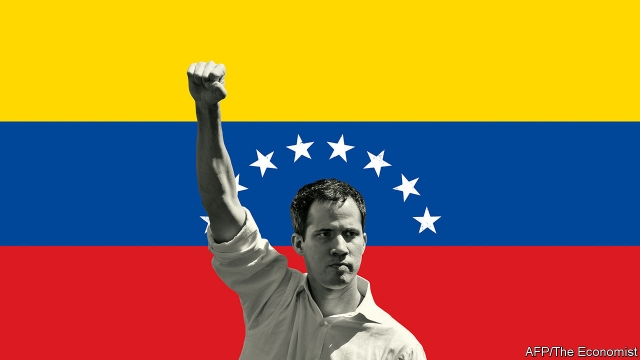

###### The anointing of Juan Guaidó

# The battle for Venezuela’s future 

##### The world’s democracies are right to seek change in Latin America’s worst-governed country 

 

> Feb 2nd 2019 

 

IF PROTESTS ALONE could oust a president, Nicolás Maduro would already be on a plane to Cuba. On January 23rd at least 1m Venezuelans from across the country took to the streets demanding Mr Maduro step down. They were answering the call of Juan Guaidó, who last week proclaimed himself the rightful head of state. Mr Guaidó has won the backing of most of Latin America, as well as the United States and Europe. Protests planned for February 2nd promise to be even bigger. But Mr Maduro is supported by the army as well as Russia, China and Turkey. As The Economist went to press, he was still holding on to power. 

Much is at stake. Most important is the fate of 32m Venezuelans made wretched by six years under Mr Maduro. Polls suggest that 80% of them are sick of him. Other countries are also hurt by Venezuela’s failure. The region is struggling with the exodus of over 3m of its people fleeing hunger, repression and the socialist dystopia created by the late Hugo Chávez. Europe and the United States suffer from Venezuela’s pervasive corruption, which enhances its role as a conduit for narcotics. And as world leaders pile in for Mr Maduro or against him, they are battling over an important idea which has lately fallen out of favour: that when a leader pillages his state, oppresses his people and subverts the rule of law, it is everybody’s business. 

The scale of the disaster Mr Maduro has brought down upon Venezuela is hard to comprehend. In the past five years GDP has fallen by half. Annual inflation is reckoned to be 1.7m per cent (the government no longer publishes the numbers), which means that bolívar savings worth $10,000 at the start of the year dwindle to 59 cents by the end. Venezuela has vast reserves of oil and gas, but the state oil company has been plundered and put under one of the country’s 2,000 generals, who has watched production tumble to 1.1m barrels a day. People are malnourished and lack simple medicines, including antibiotics. Hospitals have become death traps for want of power and equipment. Blaming his troubles on foreign conspiracies, Mr Maduro has rejected most offers of humanitarian aid. 

Despite this litany of suffering many outsiders, especially on the left, argue that the world should leave Venezuelans to sort out their differences. Some adopt Mr Maduro’s view that Mr Guaidó’s claim to the presidency, recognised immediately by the United States, is really a coup. Russia, which has worked hard to discredit the idea that Western intervention can ever be benign or constructive, is reported to have sent 400 troops from a private military contractor, also spotted in Syria, Ukraine and parts of Africa, to protect either the regime or Russian assets. 

Abandoning Venezuela to the malevolent rule of Mr Maduro would be wrong. If anyone has launched a coup it is he. He was inaugurated on January 10th for a second term having stolen last year’s election. In his first term, won in 2013 in another dubious vote, he eroded democracy by silencing critical media and eviscerating the constitution. He packed the electoral commission and the supreme court with puppets and neutered the national assembly, which the opposition controls. By contrast, Mr Guaidó has a good claim to legitimacy. As head of the national assembly, he serves as acting president if the office is vacant—which, because Mr Maduro is not a legitimate occupant, it is. 

The question is not whether the world should help Mr Guaidó, but how (see article). This week the United States, still Venezuela’s main trading partner, imposed what amounts to sanctions on oil exports and on imports of the diluents needed to market its heavy oil. By ordering that payments for Venezuelan oil must be put in bank accounts reserved for Mr Guaidó’s government, the United States aims to asphyxiate the regime, in the hope that the armed forces will switch to Mr Guaidó. 

One danger is that Mr Maduro digs in and orders the security forces and the collectivos, organised thugs at the regime’s service, to impose terror. Another is that the United States overplays its hand. Just now it is working with the Lima group of regional governments. But its sanctions could hurt the people more than the regime. If, bent on regime change, it acts unthinkingly, it could come to be seen once again in Latin America as imperialist and overbearing. Russia is portraying the United States’s intervention as an attempt to dominate its backyard. Its media are already saying that Vladimir Putin’s interest in Ukraine is no different. The situation is a test of President Donald Trump and his foreign-policy team, including the hawkish national security adviser, John Bolton. This week Mr Bolton hinted at the use of American troops. Barring state violence against American citizens, that would be a mistake. 

Mr Guaidó’s backers have ways to help without resorting to force or dirty tricks. These fall into two categories. The first includes incentives for Venezuelans to demand change, for the army to abandon the regime and for Mr Maduro to go. Now that Mr Guaidó has been recognised as interim president, he stands to control billions of dollars of Venezuela’s foreign assets if power shifts. The national assembly has passed a law offering an amnesty to soldiers and civilians who work to re-institute democracy. Mr Maduro is being promised the chance to flee the country. 

The second way to help is to let Venezuelans know that the world is ready if Mr Guaidó takes power. The lesson from the Arab spring is that even a leader who starts by sweeping away a tyrant must bring improvements rapidly or risk losing support. The immediate priorities will be food and health care. The very fact of a new government will help stop hyperinflation (see article), but Venezuela will also need real money from abroad—international lenders, including the IMF, should be generous. The to-do list is long: Venezuela will need to remove price controls and other distortions and build a social safety-net. It must restart the oil industry, which will entail welcoming foreign investment. Its debt will need restructuring—including the debt to Russia and China which is due to be paid in oil. And amid all this, Mr Guaidó’s caretaker government must hold elections. 

A generation ago, Venezuela was a functioning state. It can be again. It is blessed with oil and fertile land. It has an educated population at home and in the diaspora that fled. And in Mr Guaidó it has a leader who, at last, seems to be able to unite the fractious opposition. But first it must get rid of Mr Maduro. 

-- 

 单词注释:

1.anoint[ә'nɒint]:vt. 涂油, 施以涂油礼 [医] 涂油膏 

2.juan[hwɑ:n]:n. 胡安（男子名） 

3.feb[]:abbr. 二月（February） 

4.oust[aust]:vt. 逐出, 罢黜, 剥夺, 驱逐 [法] 驱逐, 剥夺, 免职 

5.maduro[mә'duәrәu]:a. 色深味浓的烟草做的, (雪茄)色深味浓的 

6.Cuba['kju:bә]:n. 古巴 

7.venezuelan[,venә'zweilәŋ]:a. 委内瑞拉的；委内瑞拉人的 

8.rightful['raitful]:a. 合法的, 正直的, 恰当的 [法] 正当的, 合法的, 依法有求权的 

9.economist[i:'kɒnәmist]:n. 经济学者, 经济家 [经] 经济学家 

10.wretched['retʃid]:a. 可怜的, 不幸的, 卑鄙的 

11.exodus['eksәdәs]:n. 大批的离去 [法] 退出, 大批离去, 成一外出 

12.repression[ri'preʃәn]:n. 抑制, 压抑, 制止 [医] 压抑, 抑制 

13.dystopia[dis'tәupiә]:n. 非理想化的地方 [医] 异位, 错位 

14.hugo['hju:^әu]:n. 雨果（男子名, 等于Hugh） 

15.pervasive[pә'veisiv]:a. 普遍的, 流行的, 到处蔓延的, 到处渗透的 

16.corruption[kә'rʌpʃәn]:n. 腐败, 堕落, 贪污 [计] 论误 

17.conduit['kɒndit]:n. 导管, 水管, 沟渠 [电] 导管 

18.narcotic[nɑ:'kɒtik]:n. 麻醉药, 镇静剂 a. 麻醉的, 催眠的 

19.pillage['pilidʒ]:n. 掠夺, 抢劫, 掠夺物, 战利品 v. 掠夺, 抢劫 

20.subvert[sәb'vә:t]:vt. 推翻, 颠覆, 毁灭 [法] 颠覆, 推翻, 减亡 

21.Venezuela[,vene'zweilә]:n. 委内瑞拉 

22.comprehend[.kɒmpri'hend]:vt. 理解, 包括 

23.GDP[]:[化] 鸟苷二磷酸 

24.inflation[in'fleiʃәn]:n. 胀大, 夸张, 通货膨胀 [化] 充气吹胀; 膨胀 

25.reckon['rekәn]:vt. 计算, 总计, 估计, 认为, 猜想 vi. 数, 计算, 估计, 依赖, 料想 

26.dwindle['dwindl]:vi. 减少, 缩小, 衰落 vt. 使缩小 

27.plunder['plʌndә]:n. 抢夺, 掠夺品, 战利品 v. 掠夺, 抢劫, 抢夺 

28.malnourished[mæl'næriʃt]:a. 营养失调的, 营养不良的 

29.antibiotic[.æntibai'ɒtik]:n. 抗生素 a. 抗生的 

30.conspiracy[kәn'spirәsi]:n. 同谋, 阴谋, 阴谋集团 [法] 阴谋, 通谋, 共谋 

31.humanitarian[hju:.mæni'tєәriәn]:n. 人道主义者, 博爱者, 基督凡人论者 a. 人道主义的, 博爱的, 凡人论的 

32.litany['litәni]:n. 连祷, 连续 

33.outsider[' aut'saidә]:n. 外人, 局外人, 非会员, 外行, 门外汉, 比赛中获胜可能性不大的选手 [经] 外船公司 

34.presidency['prezidәnsi]:n. 总统职权, 总裁职位 

35.coup['ku:]:n. 砰然的一击, 妙计, 出乎意料的行动, 政变 [医] 发作, 中, 击 

36.discredit[dis'kredit]:n. 无信用, 丢脸, 不名誉 vt. 不信, 怀疑, 使丢脸 

37.intervention[.intә'venʃәn]:n. 插入, 介入, 调停 [经] 干预 

38.benign[bi'nain]:a. 善良的, 良性的 [医] 良性的 

39.constructive[kәn'strʌktiv]:a. 建设性的, 构造上的 [医] 构成的 

40.contractor['kɒntræktә]:n. 立契约的人, 承包商 [化] 承包者; 承包工厂 

41.Syria['siriә]:n. 叙利亚 [经] 叙利亚 

42.ukraine[ju(:)'krein]:n. 乌克兰（原苏联一加盟共和国, 现已独立） 

43.regime[rei'ʒi:m]:n. 政权, 当权期间, 政体, 社会制度, 体制, 情态 [医] 制度, 生活制度 

44.asset['æset]:n. 资产, 有益的东西 

45.malevolent[mә'levәlәnt]:a. 有恶意的, 坏心肠的 

46.inaugurate[i'nɒ:gjureit]:vt. 开始, 举行...就职典礼 

47.dubious['dju:biәs]:a. 可疑的, 不确定的 

48.erode[i'rәud]:vt. 腐蚀, 侵蚀 vi. 受腐蚀 

49.eviscerate[i'visәreit]:vt. 取出内脏, 除去精华, 切除(病人)器官 vi. (因手术不良)内脏凸出 

50.electoral[i'lektәrәl]:a. 选举人的, 选举的, (有关)选举的 [法] 选举的, 选举人的, 由选举人组成的 

51.neuter['nju:tә]:a. 中性的, 不及物的, 生殖器不完全的 n. 中性词, 无性动物, 阉割动物 

52.opposition[.ɒpә'ziʃәn]:n. 反对, 敌对, 相反, 在野党 [医] 对生, 对向, 反抗, 反对症 

53.legitimacy[li'dʒitimәsi]:n. 合法, 正统, 正当 [法] 合法性, 正统性, 婚生 

54.legitimate[li'dʒitimәt]:a. 合法的, 正当的, 婚生的 vt. 认为正当, 立为嫡嗣, 使合法 

55.occupant['ɒkjupәnt]:n. 占有者, 居住者, 占用者 

56.sanction['sæŋkʃәn]:n. 核准, 制裁, 处罚, 约束力 vt. 制定制裁规则, 认可, 核准, 同意 

57.diluent['diljuәnt]:a. 冲淡的, 稀释的 n. 稀释液, 冲淡剂 

58.venezuelan[,venә'zweilәŋ]:a. 委内瑞拉的；委内瑞拉人的 

59.asphyxiate[æs'fiksieit]:vi. 窒息 vt. 使窒息 

60.thug[θʌg]:n. 恶棍, 刺客, 凶手 [法] 凶手, 刺客, 暴徒 

61.overplay[,әuvә'plei]:vt. 把...做得过分, 过分依赖...的力量, 夸张, 把...演得过火 

62.lima['li:mә]:n. 利马（秘鲁首都） 

63.regional['ri:dʒәnәl]:a. 地方的, 地域性的 [医] 区的, 部位的 

64.unthinkingly[ʌn'θiŋkiŋli]:adv. 不假思索地；轻率地 

65.imperialist[im'piәriәlist]:n. 帝国主义者, 皇帝统治的拥护者, 皇帝派的人 a. 帝国主义的 

66.overbear[.әuvә'bєә]:vt. 威压, 压服, 压抑 vi. 结果实过多, 繁殖过度 

67.portray[pɒ:'trei]:vt. 描绘, 描写, 描绘...的肖像 

68.backyard['bæk'jɑ:d]:n. 后院, 后庭 

69.Vladimir[vlɑ'dimɪr]:n. 弗拉基米尔（古罗斯弗拉基米尔-苏兹达里公国的古都） 

70.donald['dɔnәld]:n. 唐纳德（男子名） 

71.trump[trʌmp]:n. 王牌, 法宝, 喇叭 vt. 打出王牌赢, 胜过 vi. 出王牌, 吹喇叭 

72.hawkish['hɒ:kiʃ]:a. 像鹰的, 鹰派的, 强硬派的 

73.adviser[әd'vaizә]:n. 顾问, 劝告者, 指导教师 [法] 顾问, 劝告者 

74.john[dʒɔn]:n. 盥洗室, 厕所, 嫖客 

75.bolton['bәultәn]:a. 可用螺栓固定的 

76.backer['bækә]:n. 援助者, 支持者 [经] 背书人, 支持人 

77.incentive[in'sentiv]:n. 动机 a. 激励的 

78.interim['intәrim]:a. 暂时的, 临时的, 间歇的 n. 过渡时期 

79.amnesty['æmnisti]:n. 大赦, 赦免 

80.tyrant['taiәrәnt]:n. 暴君 [法] 专制君主, 暴君, 压制他人者 

81.hyperinflation[,haipәrin'fleiʃәn]:n. 恶性通货膨胀 

82.lender['lendә]:n. 出借人, 贷方 [经] 出借者, 贷方, 贷款人 

83.IMF[]:国际货币基金组织 [经] 国际货币基金 

84.distortion[dis'tɒ:ʃәn]:n. 扭曲, 变形, 曲解 [计] 畸变; 失真 

85.restart[.ri:'stɑ:t]:v. 重新开始, 重新启动 [计] 重新启动 

86.entail[in'teil]:vt. 使成为必需, 需要, 使承担, 遗传给 n. 限定继承 

87.amid[ә'mid]:prep. 在其间, 在其中 [经] 在...中 

88.caretaker['kєәteikә]:n. 照顾者, 看管者, 看守人 [法] 看守员, 管理员, 看管人 

89.Diaspora[dai'æspәrә]:n. 犹太人的离散, 离散的犹太人 

90.fractious['frækʃәs]:a. 易怒的, 倔强的, 脾气不好的 

