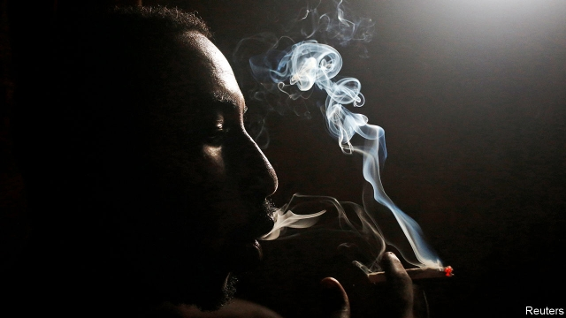
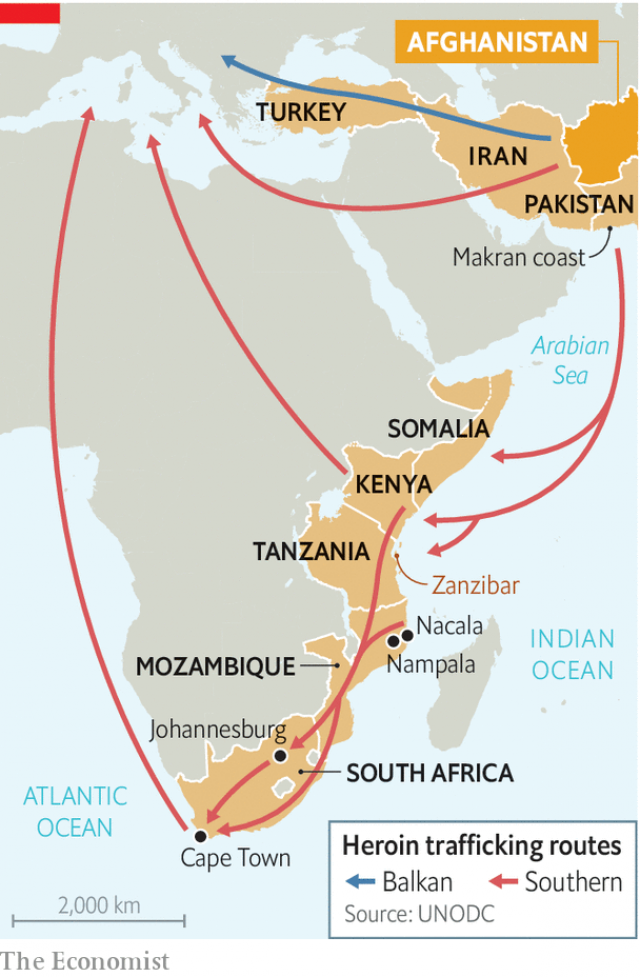

###### Down the smack track

# Africa is heroin’s new highway to the West 

##### The trade is poisoning politics and fuelling addiction on the continent 

 

> Jan 31st 2019 

 

ALIZEA SMIT sits on a plastic crate in front of her fruit and vegetable stand in Wynberg, Cape Town. It is a convenient spot. There is brisk custom for her oranges and avocados. And her heroin dealer is on the corner, just a few metres away. Ms Smit (not her real name) has used the drug for six years, buying three or four pellets a day at 30 rand ($2.21) each. If she does not sell enough fresh produce to feed her habit, she works as a prostitute in the evening. “Heroin is the worst,” she says. “It’s the first drug I’ve taken that you can’t escape.” 

Until recently heroin addicts were rare in Africa. In the 1980s and 1990s users could be found largely in tourist spots, such as Zanzibar, or in enclaves of white hipsterdom in cities like Johannesburg. Since 2006, however, heroin consumption has increased faster in Africa than in any other continent, according to the UN Office on Drugs and Crime (UNODC). The trade in the drug is having ruinous effects, not just on public health, but on politics, too. 

The rise of heroin in Africa partly reflects a surge in global supply. As the Taliban has consolidated its hold on parts of Afghanistan, where 85% of the world’s heroin is made, more of the country has been given over to poppies. In 2017 opium production increased by 65% to 10,500 tonnes, the highest recorded by the UNODC since it began collecting data in 2000. 

Not only is there more heroin being produced, but a rising share of the crop is being trafficked via Africa. The so-called Balkan route, encompassing Iran, Turkey and south-east Europe, has been the main way of getting heroin to the West. But over the past decade moving drugs along it has become harder, a side-effect of Turkey tightening its borders in response to the war in Syria and European countries’ attempts to keep out refugees. As a result, more of the harvests are being dispatched along the “southern route” (see map). 

 

On this route, sometimes called the “smack track”, heroin is taken from Afghanistan to Pakistan’s Makran coast, where shipments are put on dhows, traditional Arabian boats with triangular sails. (Some heroin is also smuggled via containers in larger ships.) Throughout the year, save for the monsoon season, dhows sail south-west through the Indian Ocean before anchoring off Somalia, Kenya, Tanzania and Mozambique. Smaller boats collect the contraband, taking it to beaches and coves, or to commercial harbours. From there heroin is taken by land to South Africa and shipped or flown to Europe or America, according to a report by Simone Haysom, Peter Gastrow and Mark Shaw of the Global Initiative against Transnational Organised Crime. Although it is longer than the Balkan route, the high margins on drug-smuggling more than compensate. 

Authorities have largely failed to curb the traffic. Since 2010 there have been seizures in the Arabian Sea by an American-led multinational naval force. But it is mainly a counter-terrorist outfit, not a drug-busting one. It seizes heroin on the basis that drug sales help finance the Taliban but it does not have a mandate to arrest smugglers. As for seizures on the African mainland, these have been “extremely low”, notes Shanaka Jayasekara of the  UNODC. Police may not even try as the authorities and their political patrons are often in league with traffickers. 

The corrosive effect that the heroin trade is having on politics is most evident in Mozambique. Though data are hard to verify, heroin may be Mozambique’s largest or second-largest export (after coal), reckons Joseph Hanlon of the London School of Economics. 

In Mozambique trafficking is controlled by powerful families and covertly regulated by Frelimo, the ex-Marxist ruling party. In a hotel in Nampula, in the north of the country, an employee of a drug kingpin explains the deal between smugglers and the state. In exchange for political donations and personal kickbacks, Frelimo grants traffickers protection from arrest. The party also issues permits allowing smugglers to import and export goods without detection at the port of Nacala. In one alleged case, a trafficker imported hundreds of motorbikes using the Frelimo imprimatur, all of which had heroin packed into their petrol tanks. 

No arrests of major figures for drug-trafficking have taken place in Mozambique. Seizures by police are all but unheard of; South African criminal-intelligence officials complain that their Mozambican counterparts block their investigations. For their part, donors to Mozambique have been reluctant to bring it up; development honchos pay little attention to crime. This is short-sighted. A report published in November by Ms Haysom suggests that conflict related to heroin and other illicit trades is helping fuel the insurgency in the far north of the country, near huge deposits of natural gas. 

The drug trade is harming South Africa, too, which is used as a base for onward shipment because of its good infrastructure and weak currency (which makes services like those of lawyers cheap). Competition for control of the heroin market among gang bosses has contributed to a spike in murders in Cape Town. 

South Africa is also where the public-health effects of the heroin trade are starkest. Since intermediaries are typically paid in drugs, as the wholesale trade grows, more heroin leaks out into the domestic retail market. A ready army of dealers then push heroin on consumers. 

Ms Smit’s pusher, a 35-year-old Tanzanian migrant by the name of Juma, describes how his patch works. New users are offered “starter packs” and repeat users are rewarded for loyalty: a free pellet worth R30 for every five they buy. He pays R500 for a “booster pack”, from which he nets a R250 profit, after paying gangs a “tax” for protection. Though dealing is risky, Juma says it is better than his life in Zanzibar, where he was paid the equivalent of $2 a day for repairing telephone poles. That was not enough to support his wife and two children, so he emigrated to South Africa. “Shit, it’s a tough life, boss,” he sighs. 

Data on South African heroin users are patchy. There are more than 1,000 people receiving treatment, up from almost none two decades ago, but this is a fraction of users. One estimate of injecting users puts the number at 75,000, or 0.2% of adults. Yet solo injecting is just one way heroin is consumed. Many smoke it in a toxic cocktail of washing powder, sleeping tablets and methamphetamines. A few indulge in “bluetoothing”, where they share the hit by withdrawing, then injecting, the blood of a fellow user into their own veins. In a country where HIV remains common, this is mind-bogglingly risky. 

For Craven Engel, a pastor who runs Camp Joy, a rehabilitation centre near Cape Town for gang members who take drugs, there is no doubt that heroin is now “the fashionable drug”. Over the past five years it has overtaken methamphetamine as the drug of choice, he says. Recovering addicts agree. For many of them, taking heroin was a way of expunging violent memories of fighting for drug turf. “I needed the drug to alleviate my conscience,” explains a member of a gang. So long as the southern route thrives, the demand for opium to salve the soul is unlikely to ease. 

-- 

 单词注释:

1.smack[smæk]:n. 风味, 滋味, 少量, 拍击声, 咂嘴声, 小渔船, 海洛因 vi. 有味道, 咂嘴, 发出拍击声 vt. 拍, 打, 掴, 咂, 出声地吻 adv. 啪地一声, 猛然 

2.politic['pɒlitik]:a. 精明的, 明智的, 策略的 

3.addiction[ә'dikʃәn]:n. 入迷, 瘾 [医] 瘾, 癖嗜 

4.Jan[dʒæn]:n. 一月 

5.smit[]:abbr. 系统管理界面工具（System Management Interface Tool）；[医]钠离子-肌醇转运蛋白 

6.crate[kreit]:n. 板条箱, 装货箱 [建] 篓, 筐 

7.wynberg[]:n. 韦恩堡（印第安纳州城市名） 

8.cape[keip]:n. 岬, 海角, 披肩, 斗蓬 

9.avocado[.ævәu'kɑ:dou]:n. 鳄梨, 鳄梨树 

10.heroin['herәuin]:n. 海洛因, 吗啡 [化] 海洛因; 二醋吗啡; 二乙酰吗啡 

11.dealer['di:lә]:n. 经销商, 商人 [经] 交易员, 贩卖商 

12.smit[]:abbr. 系统管理界面工具（System Management Interface Tool）；[医]钠离子-肌醇转运蛋白 

13.pellet['pelit]:n. 颗粒状物, 小子弹, 小药丸 vt. 使成颗粒, 使成团, 用子弹打 

14.rand[rænd]:n. 兰特, (非正式)边, 田埂, 缘 [经] 兰特 

15.prostitute['prɒstitju:t]:n. 妓女, 男娼 vt. 使沦为妓女 a. 卖淫的, 堕落的 

16.heroin['herәuin]:n. 海洛因, 吗啡 [化] 海洛因; 二醋吗啡; 二乙酰吗啡 

17.addict[ә'dikt]:vt. 使沉溺, 使上瘾 n. 入迷的人, 上瘾者 

18.Zanzibar[,zænzi'bɑ:]:n. 桑给巴尔 

19.enclave[en'cleiv]:n. 被包围的领土 [医] 被包围物 

20.hipsterdom[]:[网络] 时髦 

21.Johannesburg[dʒәu'hænisbә:^]:约翰内斯堡[南非(阿扎尼亚)东北部城市] 

22.UN[ʌn]:pron. 家伙, 东西 [经] 联合国 

23.unodc[]: 联合国毒品和犯罪问题办公室 

24.ruinous['ruinәs]:a. 破坏性的, 招致毁灭的 

25.surge[sә:dʒ]:n. 巨涌, 汹涌, 澎湃 vi. 汹涌, 澎湃, 颠簸, 猛冲, 突然放松 vt. 使汹涌奔腾, 急放 [计] 电压尖峰 

26.Taliban[]:塔利班 

27.consolidate[kәn'sɒlideit]:vt. 巩固, 使联合, 统一 vi. 巩固 [计] 合并计算 

28.Afghanistan[æf'gænistæn]:n. 阿富汗 

29.poppy['pɒpi]:n. 罂粟 [医] 罂粟 

30.opium['әupjәm]:n. 鸦片 [化] 阿片; 鸦片 

31.tonne[tʌn]:n. 吨, 公吨 [经] 吨 

32.datum['deitәm]:n. 论据, 材料, 资料, 已知数 [医] 材料, 资料, 论据 

33.traffick[]:[网络] 通行车辆；开放交通；非法交易 

34.Balkan['bɒ:lkәn]:a. 巴尔干的 

35.encompass[in'kʌmpәs]:vt. 围绕, 完成, 包括, 包含, 环绕, 包围 

36.Iran[i'rɑ:n]:n. 伊朗 

37.tighten['taitn]:vt. 勒紧, 使变紧 vi. 变紧, 绷紧 

38.Syria['siriә]:n. 叙利亚 [经] 叙利亚 

39.refugee[.refju'dʒi:]:n. 难民, 流亡者 [法] 避难者, 流亡者, 难民 

40.dispatch[dis'pætʃ]:vt. 派遣 n. 派遣, 急件 [计] 调度 

41.Makran[]:[网络] 莫克兰；马克兰；马克兰海区 

42.shipment['ʃipmәnt]:n. 装船, 出货 [经] 运送, 运送(寄出)货物, 装载 

43.dhow['dau]:n. 独桅三角帆船 

44.triangular[trai'æŋgjulә]:a. 三角形的, 三人间的 [医] 三角的, 三角形的 

45.smuggle['smʌgl]:vt. 偷运, 走私, 私运 vi. 走私 

46.monsoon[mɒn'su:n]:n. 季风, 吹季风的季节, 雨季 

47.Somalia[sәu'mɑ:liә]:n. 索马里 

48.Kenya['kenjә]:n. 肯尼亚 

49.Tanzania[.tænzә'ni:ә]:n. 坦桑尼亚 

50.Mozambique[.mәuzәm'bi:k]:n. 莫桑比克 

51.contraband['kɒntrәbænd]:n. 违禁品, 走私 a. 禁运的, 非法买卖的 

52.cove[kәuv]:n. 山凹, 小湾 v. (使)内凹, (使)成拱形 

53.Simone[]:n. 西蒙妮（电影名）；西蒙（女子名） 

54.haysom[]: [人名] 海瑟姆 

55.peter['pi:tә]:vi. 逐渐消失, 逐渐减少 

56.shaw[ʃɒ:]:n. 杂木林 

57.transnational[træns'næʃәnl]:a. 超越国界的, 跨国的 [法] 超越国界的, 超国家的, 跨国的 

58.curb[kә:b]:n. 抑制, 勒马绳, 边石 vt. 抑制, 束缚, 勒住 

59.seizure['si:ʒә]:n. 捕获, 夺取, 占领, 捕获物, 没收, 充公 [医] 发作; 癫痫发作 

60.multinational[.mʌlti'næʃәnl]:a. 多国的, 跨国公司的 n. 跨国公司 

61.outfit['autfit]:n. 用具, 配备, 机构 vt. 配备, 供应 vi. 得到装备 

62.mandate['mændeit]:n. 命令, 指令, 要求 vt. 委任统治 

63.smuggler['smʌglә]:n. 走私者, 走私船 [经] 走私者, 走私船 

64.patron['peitrәn]:n. 赞助人, 顾客, 保护人 [法] 保护人, 庇护人, 赞助人 

65.trafficker['træfikә]:n. 商人, 贩子 [法] 贩卖者, 买卖者, 商人 

66.corrosive[kә'rәusiv]:a. 腐蚀的, 腐蚀性的, 有害的 n. 腐蚀物, 腐蚀剂 

67.reckon['rekәn]:vt. 计算, 总计, 估计, 认为, 猜想 vi. 数, 计算, 估计, 依赖, 料想 

68.Joseph['dʒәuzif]:n. 约瑟夫（男子名）；约瑟（圣经中雅各的第十一子） 

69.HANLON[]:n. (Hanlon)人名；(西)安隆；(英)汉隆 

70.trafficking[ˈtræfikɪŋ]:n. 非法交易 

71.covertly[]:adv. 偷偷摸摸地；秘密地 

72.frelimo[]:n. 莫桑比克解放阵线 

73.Nampula[næm'pu:lә]:楠普拉[莫桑比克东北部城市] 

74.kingpin['kiŋpin]:n. 中心立轴, (非正式)中心人物, 首脑, 关键人物, (非正式)主要成分 

75.donation[dәu'neiʃәn]:n. 捐赠物, 捐款, 捐赠 [经] 赠品, 捐款, 捐赠 

76.kickback['kikbæk]:n. 回答, 反扑, 退还 [电] 蹴后 

77.Nacala[nɑ:'kɑ:lɑ:]:纳卡拉[莫桑比克东北部港市] 

78.allege[ә'ledʒ]:vt. 宣称, 主张, 提出, 断言 [法] 断言, 指称, 指证 

79.imprimatur[,impri'meitә]:n. 出版许可, 赞许 [法] 出版许可, 出版许可, 批准 

80.unheard[.ʌn'hә:d]:a. 没有被听到的, 未予倾听的, 未予考虑的 

81.Mozambican[,məuzəm'bi:kən]:a. 莫桑比克的；莫桑比克人的 

82.counterpart['kauntәpɑ:t]:n. 副本, 复本, 配对物, 相应物 [经] 副本, 正副二份中之一 

83.donor['dәunә]:n. 捐赠人 [化] 给体; 供体 

84.honcho['hɒntʃәu]:n. 老板 

85.illicit[i'lisit]:a. 不法的, 不正当的, 禁止的 [法] 违法的, 违禁的, 被禁止的 

86.insurgency[in'sә:dʒәnsi]:n. 叛乱状态, 发生暴动 [法] 暴动, 起义, 叛乱 

87.onward['ɒnwәd]:a. 向前的, 前进的 adv. 向前, 前进, 在先 

88.infrastructure['infrәstrʌktʃә]:n. 基础结构, 基础设施 [经] 基础设施 

89.spike[spaik]:n. 长钉, 鞋钉, 钉状物, 尖峰状物, 穗 vt. 以大钉钉牢, 用尖物刺穿, 阻止, 弃置不用 [计] 尖峰信号 

90.starke[]: [人名] 斯塔克; [地名] [美国] 斯塔克 

91.intermediary[.intә'mi:diәri]:n. 仲裁者, 调解者, 媒介物, 中间人 a. 中间的, 媒介的 

92.typically['tipikәli]:adv. 代表性地；作为特色地 

93.wholesale['hәulseil]:n. 批发 a. 批发的, 大规模的 adv. 大规模, 照批发方式 vi. 经营批发业, 批发 vt. 批发 

94.pusher['puʃә]:n. 推者, 推销员 [化] 推料机 

95.Tanzanian[,tænzə'niən]:a. 坦桑尼亚的 坦桑尼亚人 

96.migrant['maigrәnt]:n. 候鸟, 移居者 [法] 移居者 

97.juma[]:n. 伊斯兰教的安息日 

98.starter['stɑ:tә]:n. 开端者, 在起跑线上的人, 参加赛跑的人, 调度员, 起动机, 酵母 [计] 启动程序, 启动器 

99.booster['bu:stә]:n. 向前推的人, 支持者, 后援者, 升压器 [化] 爆管; 扩爆药; 传爆药; 升压机; 增压装置; 升压器; 助促进剂 

100.risky['riski]:a. 危险的 

101.emigrate['emigreit]:v. (使)移居, (使)移民 

102.shit[ʃit]:vi. 拉屎 vt. 欺骗, 在...拉屎 n. 粪, 屎 interj. 狗屁 

103.patchy['pætʃi]:a. 补缀的, 凑合的, 不调和的, 散落的, 斑驳的, 不完全的 

104.inject[in'dʒekt]:vt. 注射, 注入, 使入轨 [医] 注射 

105.solo['sәulәu]:n. 独奏, 独唱, 单独表演 a. 单独的, 独奏的, 独唱的 vi. 放单飞 

106.toxic['tɒksik]:a. 有毒的, 中毒的 [医] 中毒的, 毒物的 

107.cocktail['kɒkteil]:n. 鸡尾酒, 开味品 a. 鸡尾酒会的 

108.methamphetamine[,meθæ'fetәmin]:[化] 脱氧麻黄碱 

109.indulge[in'dʌldʒ]:vt. 纵情于, 使高兴, 放任, 迁就 vi. 沉溺 

110.vein[vein]:n. 血管, 静脉, 纹理, 气质, 情绪 vt. 使有脉络, 像脉络般分布于 

111.hiv[]:abbr. 艾滋病病毒（human immunodeficiency virus） 

112.craven['kreivәn]:n. 懦夫, 怯懦者, 胆小鬼 a. 怯懦的, 畏缩的, 胆小的 

113.engel[]:n. 恩格尔（恩格尔   	德国的统计学家）；英杰尔（日本品牌） 

114.pastor['pæstә]:n. 牧师 

115.rehabilitation['ri:(h)ә,bili'teiʃәn]:n. 复原 [医] 复原, 恢复, 康复 

116.turf[tә:f]:n. 草皮, 泥炭, 跑马场 vt. 覆草皮于 

117.alleviate[ә'li:vieit]:vt. 减轻, 使缓和 

118.salve[sælv]:n. 油膏, 药膏, 安慰, 奉承话 vt. 涂油膏于, 安慰, 缓和, 抢救, 打捞 

