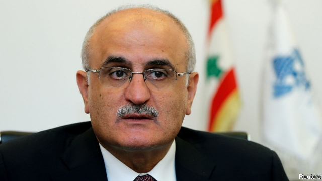

###### Default settings

# Lebanon’s caretaker government has edged it towards economic crisis 

##### Its economy is growing slowly and is overburdened by debt 

 

> Jan 31st 2019 

 

PITY THE finance minister who must instil confidence in Lebanon, which has the fifth-highest public-debt burden in the world, at 150% of GDP. But Ali Hassan Khalil did a staggeringly poor job of it when he told a local newspaper his country was ready to default. “It’s true that the ministry is preparing a plan for financial correction, including a restructuring of public debt,” he said in an interview published on January 10th. Within a day its bonds fell to a record low. Mr Khalil soon clarified that he meant rescheduling, not restructuring. For ratings agencies the distinction is moot. On January 21st Moody’s downgraded Lebanon’s bonds even deeper into junk. 

In a normal country, one banker mused, Mr Khalil’s comments might be a sackable offence. Lebanon is not a normal country. Nine months after the first parliamentary election in nine years, nobody has formed a government. The prime minister-designate, Saad Hariri, is stuck in a dispute with six Sunni MPs aligned with Hizbullah, the powerful Shia militia-cum-party. Parliament is frozen. There is no budget for 2019. Even if Mr Hariri wanted to fire his finance minister, doing so would lead to weeks of haggling over a replacement. 

This is hardly Lebanon’s worst political jam. From 2005 to 2017 parliament could not pass a budget. But it comes at a time of looming economic crisis as well. Since 2010 GDP growth has averaged less than 2% a year. Inflation hit 7.6% in 2018, its highest in five years. The purchasing managers’ index fell from 46.7 to 46.2 in December. A figure below 50 suggests a contraction; Lebanon has not crossed above that threshold since 2013. The chamber of commerce says about 2,200 firms closed last year. New construction has slowed and an estimated $9bn worth of properties are empty. 

With politics in disarray, the central bank drives economic policy. It borrows billions from commercial banks to prop up the Lebanese pound against the dollar. Foreign-currency deposits must grow by 6-7% annually if it is to defend the peg, reckons the IMF. In the 11 months to November 2018, the last month for which data are available, banks’ holdings of foreign currency increased by just 4%. Not all of that is new money, either. Customers seem to have converted 3.9trn pounds ($2.6bn) to dollar accounts. The central bank has ordered firms like Western Union to stop paying out money transfers in dollars. 

Optimists wave this away with breezy talk of Lebanon’s “resilience” and hope that wealthy Gulf patrons will come to the rescue. Qatar stepped in after Mr Khalil’s blunder and promised to buy $500m in Lebanese bonds, which helped stabilise the market. Not to be outdone by his Gulf rival, the Saudi finance minister pledged to “support Lebanon all the way”, though he offered no details. But half a billion is a pittance for a country with $49bn in outstanding dollar bonds. Resilience does not pay creditors. 

In January the finance ministry released a study from McKinsey, a consultancy, with advice on fixing the economy. Though some of its ideas are unrealistic, a few are common sense. Tourism and agriculture have room to grow. Lebanon’s well-educated population could export services or create tech startups. The country also stands to gain from reconstruction in war-ravaged Syria. 

But all the suggestions rest on the government fixing infrastructure, such as unreliable electricity and some of the world’s worst internet connections. Foreign donors offered to help at a conference in Paris last year, pledging $11bn in mostly concessional loans. But the money will not flow until Lebanon has a government. Ministers warn that donors are ready to take their cash elsewhere. That would be another blow to investor confidence—though at least that would be one debt Mr Khalil would not have to worry about. 

-- 

 单词注释:

1.default[di'fɒ:lt]:n. 违约, 不履行责任, 缺席, 默认值 v. 疏怠职责, 缺席, 拖欠, 默认 [计] 默认; 默认值; 缺省值 

2.caretaker['kєәteikә]:n. 照顾者, 看管者, 看守人 [法] 看守员, 管理员, 看管人 

3.overburden[.әuvә'bә:dn]:vt. 装载过多, 负担过多, 使过劳 [经] 过重的货物, 重担, 过度的负担 

4.Jan[dʒæn]:n. 一月 

5.instil[in'stil]:vt. 滴注, 逐渐灌输, 不断灌输 [医] 滴注 

6.Lebanon['lebәnәn]:n. 黎巴嫩 

7.GDP[]:[化] 鸟苷二磷酸 

8.ALI[]:[计] 异步线路接口 

9.Hassan[]:n. 哈山（男子名） 

10.Khalil[]:n. 卡里尔（阿富汗、巴基斯坦男子名） 

11.staggeringly['stæɡərɪŋlɪ]:adv. 难以置信地; 令人震惊地; 摇晃地; 蹒跚地 

12.default[di'fɒ:lt]:n. 违约, 不履行责任, 缺席, 默认值 v. 疏怠职责, 缺席, 拖欠, 默认 [计] 默认; 默认值; 缺省值 

13.restructuring[]:[计] 重构的 

14.reschedule[ri:ʃedju:l]:[计] 重安排, 重调度 [化] 修订计划 

15.rating['reitiŋ]:n. 等级, 额定功率, 责骂 [经] 等级评定 

16.moot[mu:t]:n. 大会, 模拟案件, 辩论会 a. 未决议的, 无实际意义的 vt. 讨论, 争论 

17.downgrade['dajn^reid]:vt. 降低, 贬低 n. 下坡 a. 下坡 adv. 下坡 

18.banker['bæŋkә]:n. 银行家, 庄家 [经] 银行业者, 银行家 

19.muse[mju:z]:n. 沉思, 冥想 v. 沉思, 冥想, 若有所思地凝望或说 

20.sackable['sækәbl]:a. 可据以解雇理由的 

21.parliamentary[.pɑ:lә'mentәri]:a. 国会的, 议会的, 议会制度的 

22.Saad[]:n. 萨阿德（巴格达的一名人道工作者）；萨德（体育明星） 

23.hariri[]: 哈里里 

24.Sunni['suni:]:n. 〈伊斯兰〉逊尼派教徒 

25.MP[]:国会议员, 下院议员 [计] 宏处理程序, 维护程序, 线性规划, 微程序, 多处理器 

26.align[ә'lain]:vi. 排列, 排成一行, 结盟 vt. 使结盟, 使成一行, 校正 

27.hizbullah[]:n. 真主党 

28.shia[]:n. 什叶；什叶派（等于Shiah） 

29.haggle[hægl]:vi. 争论, 杀价 vt. 乱砍, 乱劈 n. 杀价, 讨论, 争论 

30.replacement[ri'pleismәnt]:n. 归还, 更换, 代替者 [医] 复位, 置换 

31.loom[lu:m]:n. 织布机, 若隐若现的景象 vi. 朦胧地出现, 隐约可见, 可怕地出现 

32.les[lei]:abbr. 发射脱离系统（Launch Escape System） 

33.inflation[in'fleiʃәn]:n. 胀大, 夸张, 通货膨胀 [化] 充气吹胀; 膨胀 

34.contraction[kәn'trækʃәn]:n. 收缩, 缩写式, 害病 [医] 收缩; 挛缩; 牙弓内缩 

35.threshold['θreʃәuld]:n. 门槛, 入口, 开端, 阈 [计] 阈; 阈值 

36.politic['pɒlitik]:a. 精明的, 明智的, 策略的 

37.disarray[.disә'rei]:vt. 弄乱, 使混乱, 使脱去衣服 n. 无秩序, 杂乱, 不整齐的衣着 

38.prop[prɒp]:n. 支柱, 支持者, 倚靠人, 道具, 螺旋桨 vt. 支撑, 维持 

39.lebanese[,lebә'ni:z]:a. 黎巴嫩的 

40.annually['ænjuәli]:adv. 一年一次, 每年 [经] 年度的, 每年的 

41.peg[peg]:n. 钉, 桩, 栓, 藉口, 销子, 借口 vt. 钉木钉, 固定, 限制, 使受约束 vi. 坚持不懈地奋力于, 疾行 

42.reckon['rekәn]:vt. 计算, 总计, 估计, 认为, 猜想 vi. 数, 计算, 估计, 依赖, 料想 

43.IMF[]:国际货币基金组织 [经] 国际货币基金 

44.datum['deitәm]:n. 论据, 材料, 资料, 已知数 [医] 材料, 资料, 论据 

45.holding['hәuldiŋ]:n. 把持, 支持, 保持 [法] 租借地, 占有物, 拥有的财产 

46.optimist['ɔptimist]:n. 乐观者, 乐观主义者 

47.breezy['bri:zi]:a. 有微风的, 通风好的, 活泼的 

48.resilience[ri'ziliәns]:n. 弹回, 有弹力, 恢复力 [化] 回弹; 弹性; 弹回性; 回能; 弹能 

49.patron['peitrәn]:n. 赞助人, 顾客, 保护人 [法] 保护人, 庇护人, 赞助人 

50.Qatar['kɑ:tәr]:n. 卡塔尔 

51.blunder['blʌndә]:n. 大错, 大失策 vi. 失策, 跌跌撞撞地走, 犯错 vt. 做错 

52.stabilise['steibilaiz]:vt.vi. (使)稳定, (使)安定, (使)坚固 vt. 装稳定器 

53.outdo[.aut'du:]:vt. 超越, 胜过, 战胜 

54.saudi['sajdi]:a. 沙乌地阿拉伯（人或语）的 

55.pledge[pledʒ]:n. 诺言, 保证, 誓言, 抵押, 信物, 保人, 祝愿 vt. 许诺, 保证, 使发誓, 抵押, 典当, 举杯祝...健康 

56.pittance['pitns]:n. 少量津贴, 小额施舍, 少量 

57.resilience[ri'ziliәns]:n. 弹回, 有弹力, 恢复力 [化] 回弹; 弹性; 弹回性; 回能; 弹能 

58.creditor['kreditә]:n. 债权人 [法] 债权人, 债主, 贷方 

59.McKinsey[]:n. 麦肯锡（公司） 

60.consultancy[]:n. 商量, 协商, 磋商, 会诊, 与...商量, 咨询, 请教, 找(医生)看病, 查阅, 考虑 [经] 咨询业务, 咨询服务 

61.unrealistic[.ʌnriә'listik]:a. 不切实际的, 幻想的 

62.tech[tek]:n. 技术学院或学校 

63.startup[]:[计] 启动 

64.reconstruction[.ri:kәn'strʌkʃәn]:n. 改造, 再建 [医] 改建, 改造, 翻造 

65.Syria['siriә]:n. 叙利亚 [经] 叙利亚 

66.infrastructure['infrәstrʌktʃә]:n. 基础结构, 基础设施 [经] 基础设施 

67.unreliable[.ʌnri'laiәbl]:a. 不可靠的 [法] 不可靠的, 靠不住的 

68.donor['dәunә]:n. 捐赠人 [化] 给体; 供体 

69.concessional[kәn'seʃәnl]:a. 让步的, 容许的 [法] 让步的, 特许的, 优惠的 

70.investor[in'vestә]:n. 投资者 [经] 投资者 

