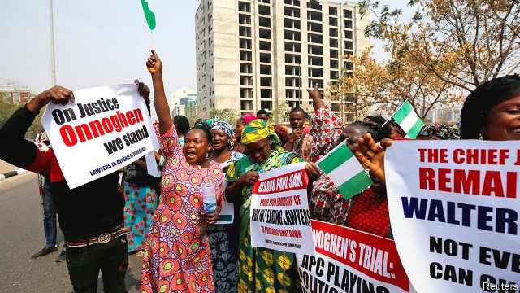

###### Above the law

# Nigeria’s president sacks the chief justice weeks before an election 

##### Critics say it is to remove a judge who may have ruled against him 

 

> Jan 31st 2019 

 

THE WHEELS of justice turn slowly in Nigeria. On the rare occasions when corruption cases are brought against prominent people, petitions can take years to resolve. It was therefore unusual that on January 25th President Muhammadu Buhari suspended Nigeria’s Chief Justice, Walter Onnoghen, a mere 15 days after allegations of impropriety were lodged against the most senior judge in the country. This was the first time that Nigeria’s head of state had sacked a chief justice since 1975, when the country was under military rule. 

Mr Buhari’s move was not merely unusual. It was also unlawful. Nigeria’s constitution seeks to balance the executive, legislative and judicial branches of government; a power play by one part against a second needs the consent of the third. Mr Buhari did not seek support from the Senate, where he lacks the two-thirds majority needed to oust the chief justice, so his act is widely viewed as being against the law. 

It has also injected a dose of fury into a previously placid election campaign. Earlier this week Nigerian lawyers took to the streets of Abuja, the capital, in protest (see picture). Some stopped work for two days. Atiku Abubakar, Mr Buhari’s main rival in the presidential race that takes place on February 16th, has called the move “a brazen act of dictatorship”. On January 26th America, Britain and the EU issued statements expressing concern. 

Few observers doubt that Mr Onnoghen has a case to answer. Under Nigerian law, officials have to disclose their assets every four years and upon taking a new job. He has not done so since his promotion in March 2017. Nigeria’s judiciary, like many of the country’s institutions, is widely seen as corrupt. Yet due process has not been followed, notes Aminu Gamawa, a member of Nigeria’s bar association. 

There are probably two reasons why Mr Buhari sacked him, critics say. Both are political. First, the Supreme Court is due to hear appeals lodged by the All Progressives Congress (APC), Mr Buhari’s party, against decisions by the Independent National Electoral Commission, which barred it from running candidates in two of Nigeria’s 36 states. Mr Onnoghen is viewed by the APC as being close to Mr Abubakar’s People’s Democratic Party. Second, the chief justice would have to preside over any litigation arising from a disputed election result. This matters in a country with a history of electoral shenanigans, preceded and followed by deadly violence. 

On January 29th the Senate asked Mr Buhari to reinstate Mr Onnoghen. But the president shows no sign of backing down. He has already sworn in a new chief justice, Ibrahim Tanko Muhammad. (Technically Mr Tanko is the “acting” chief justice, but temporary appointments have a way of becoming permanent.) 

It is not obvious that Mr Buhari would need to cheat to win re-election. His anti-corruption tirades appeal to voters. His opponent, Mr Abubakar, though he likens himself to Bill Gates, Steve Jobs and Lee Kuan Yew, is seen as less tough on graft. Yet Mr Buhari seems to think that the benefits of removing the top judge are worth the costs. Thus he has reminded Nigerians that since his election in 2015 he has done little to strengthen institutions, which is what Nigeria needs most of all. 

-- 

 单词注释:

1.Jan[dʒæn]:n. 一月 

2.Nigeria[nai'dʒiriә]:n. 尼日利亚 

3.corruption[kә'rʌpʃәn]:n. 腐败, 堕落, 贪污 [计] 论误 

4.petition[pi'tiʃәn]:n. 请愿, 诉状, 陈情书, 申请, 祈求, 祷文 v. 正式请求, 恳求, 请愿 

5.buhari[]:[网络] 布哈里 

6.Walter['wɔ:ltә(r)]:n. 沃尔特（男子名） 

7.allegation[.æli'geiʃәn]:n. 断言, 主张, 申辩 [法] 声明, 事实陈述, 断言 

8.impropriety[.imprә'praiәti]:n. 不适当, 不得体, 不正当行为, 用词不当 

9.unlawful[.ʌn'lɒ:ful]:a. 非法的, 不正当的 [法] 不法, 不法的, 非法的 

10.legislative['ledʒislәtiv]:n. 立法机构 a. 立法的, 有立法权的 

11.judicial[dʒu:'diʃәl]:a. 法庭的, 公正的, 审判上的, 司法的 [法] 司法的, 审判上的, 法官的 

12.oust[aust]:vt. 逐出, 罢黜, 剥夺, 驱逐 [法] 驱逐, 剥夺, 免职 

13.inject[in'dʒekt]:vt. 注射, 注入, 使入轨 [医] 注射 

14.fury['fjuri]:n. 愤怒, 狂暴, 狂怒的人 [医] 狂乱, 狂暴, 狂怒 

15.placid['plæsid]:a. 平静的, 温和的, 沉着的, 平稳的 

16.Nigerian[nai'dʒiriәn]:n. 尼日利亚人 

17.Abuja[a:'bu:dʒa:]:n. 阿布贾（尼日利亚现在的首都） 

18.atiku[]:[网络] 阿蒂库 

19.abubakar[]:n. (Abubakar)人名；(尼日利、坦桑)阿布巴卡尔 

20.presidential[.prezi'denʃәl]:a. 总统制的, 总统的, 首长的, 统辖的 [法] 总统的, 议长的, 总经理的 

21.brazen['breizn]:a. 黄铜制的, 厚颜无耻的 vt. 厚脸皮地对待 

22.dictatorship[dik'teitәʃip]:n. 独裁者之职位, 独裁, 独裁政权 [法] 专攻, 独裁权 

23.EU[]:[化] 富集铀; 浓缩铀 [医] 铕(63号元素) 

24.asset['æset]:n. 资产, 有益的东西 

25.promotion[prәu'mәuʃәn]:n. 晋级, 创建, 增进 [经] 推广, 推销, 促进 

26.judiciary[dʒu:'diʃiәri]:a. 司法的, 法院的, 法官的 n. 司法部, 司法系统, 法官 

27.aminu[]:n. (Aminu)人名；(尼日利)阿米努 

28.Gamawa[]:[地名] 加马瓦 ( 尼日利 ) 

29.APC[]:复方阿司匹林 [计] 自动程序控制 

30.electoral[i'lektәrәl]:a. 选举人的, 选举的, (有关)选举的 [法] 选举的, 选举人的, 由选举人组成的 

31.preside[pri'zaid]:vi. 统辖, 当主人, 主持 [法] 主持, 负责, 指挥 

32.litigation[.liti'geiʃәn]:n. 诉讼, 起诉 [经] 诉讼, 纠葛 

33.electoral[i'lektәrәl]:a. 选举人的, 选举的, (有关)选举的 [法] 选举的, 选举人的, 由选举人组成的 

34.shenanigan[ʃә'næni^әn]:n. 鬼把戏, 诡计, 淘气, 恶作剧, 胡闹 

35.precede[.pri:'si:d]:vt. 在...之前, 优于, 较...优先 vi. 在前面 

36.reinstate[.ri:in'steit]:vt. 使复原, 使恢复, 使复立 

37.Ibrahim[]:n. 易卜拉欣（与阿丹、努哈、穆萨、尔撒和穆罕默德并称为安拉的六大使者, 亦系犹太教和基督教推崇的圣人和希伯来人的祖先） 

38.tanko[]:[网络] 天钢；坦克；品牌通濠 

39.muhammad[]:n. 穆罕默德 

40.technically['teknikli]:adv. 技术上, 学术上, 专门地 

41.tirade['taireid]:n. 激烈的长篇演说 

42.voter['vәutә]:n. 选民, 投票人 [法] 选民, 选举人, 投票人 

43.liken['laikәn]:vt. 比喻, 比拟 

44.steve[]:n. 史蒂夫（男子名） 

45.lee[li:]:n. 背风处, 避风处, 下风处, 保护, 庇护 a. 避风的, 背风的, 下风的, 保护的 

46.kuan[^wɑ:n]:n. 官窑瓷器 

47.yew[ju:]:n. 紫杉 

48.les[lei]:abbr. 发射脱离系统（Launch Escape System） 

49.graft[grɑ:ft]:n. 嫁接, 贪污 v. 嫁接, 移植, 贪污 

50.Nigerian[nai'dʒiriәn]:n. 尼日利亚人 

