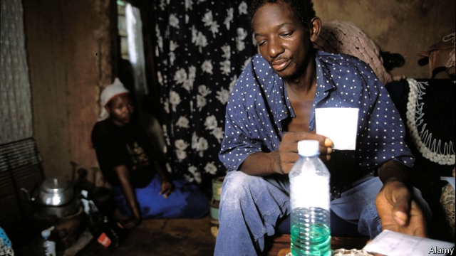

###### A nasty side effect

# Outdated drug policies leave millions of Africans in agony 

##### The war on drugs has hurt patients who need painkillers 

 

> Jan 31st 2019 

 

ANNA HAS just hit puberty and she can barely move. She has late-stage cancer and a tumour protrudes from her neck. As a nurse walks in, Anna (not her real name) slowly covers her face with a veil. She is dying in agony in Dantec, one of Senegal’s main hospitals. But the doctors don’t have enough morphine to give her. 

In west Africa there are just 52 palliative-care centres such as hospices for about 360m people. Many of these do not have enough drugs. In Senegal the average patient who needs it gets 13mg of morphine a year, compared with 55,704mg in America. Across sub-Saharan Africa nine-tenths of cancer sufferers in moderate or severe pain die without the relief granted by opioids. 

Providing palliative care without morphine is like “driving a car without fuel”, says Emmanuel Luyirika, of the Kampala-based African Palliative Care Association in Uganda. It is also unnecessary, because opioids are cheap. Providing pain relief for their populations can cost governments as little as $2-16 per person each year, according to a study commissioned by the Lancet. 

The morphine shortage stems from bad policies. In the 1980s and 1990s, as part of its “war on drugs”, America cut aid and imposed sanctions on countries that were not tough enough on trafficking. It listed Nigeria as unco-operative from 1994 to 1998 (during a criminal dictatorship), suspended military aid and blocked loans. 

There is little threat of being penalised today. But taboos about opioid use, restrictions on prescriptions and import barriers are still in place across much of Africa, says Barbara Goedde at the Global Commission on Drug Policy. In 2012, although some 200,000 Nigerians died of AIDS-related causes, often in severe pain, the country imported no morphine and said there was no need for it. 

Yet much of this pain can be eased. Consider Uganda. Four-fifths of its districts have at least one palliative-care service. Over 200 hospitals have in-patient palliative-care units. In 2015 the Economist Intelligence Unit, a sister company of The Economist, ranked palliative-care systems on measures including training and access to drugs. Uganda scored higher than richer countries such as Malaysia and Hungary. 

There are several reasons for Uganda’s success. The first is its adoption of oral morphine, a cheap and effective painkiller. This was brought to the country in 1993 by Hospice Africa, a non-profit outfit. For 17 years its staff mixed the solution “at the kitchen sink”, says Anne Merriman, the British doctor behind it. She met scepticism at first; some senior doctors said she was promoting euthanasia. Morphine still runs short; only 11% of need is met but its use has become normal. One cancer patient in Kampala keeps his bottle by the stove, next to the hot chocolate. 

The second reason for Uganda’s success is that nurses are allowed to prescribe morphine. That is crucial because there is just one doctor for every 11,000 people. And the third reason is government support. Officials see morphine as a useful painkiller rather than a shameful recreational drug. Since 2011 the government and Hospice Africa have produced oral morphine in a public-private partnership. Patients get it free. The solution, dyed to show different strengths, is too diluted to interest addicts. 

Esther Akongo lives with her sister in a gloomy single-room house in Kampala. Both have cancer. Since getting morphine, says Ms Akongo, she can at last get a good night’s sleep. But the happiest times are the regular trips to the hospice, where she can talk to other patients. Morphine brings respite; friendship brings joy. 

-- 

 单词注释:

1.outdate[.aut'deit]:vt. 使过时 

2.painkiller['pein,kilә(r)]:n. 解痛药, 止痛片, 止痛药 

3.Jan[dʒæn]:n. 一月 

4.anna['ænә]:n. 安娜（女子名） 

5.puberty['pju:bәti]:n. 青春期, 春情发动期 [医] 青春期(12-17岁) 

6.tumour['tju:mә]:n. 瘤, 肿块 

7.protrude[prәu'tru:d]:vi. 伸出, 突出 vt. 使伸出, 使突出 

8.anna['ænә]:n. 安娜（女子名） 

9.morphine['mɒ:fi:n]:n. 吗啡 [化] 吗啡 

10.hospice['hɒspis]:n. 旅客住宿处, 收容所 

11.Senegal[,seni'^ɔ:l]:n. 塞内加尔 

12.sufferer['sʌfәrә]:n. 受难者, 被害者, 患者 [法] 受害者, 受难者 

13.opioid[əʊ'pi:əʊɪd]:a. 类鸦片（引起）的 n. 类鸦片活性肽 

14.palliative['pælieitiv]:a. 缓和的, 减轻的, 掩饰的 n. 辩解, 缓和物 

15.emmanuel[i'mænjuәl]:n. 以马内利（耶稣基督的别称）；伊曼纽尔（男子名, 等于Immanuel） 

16.palliative['pælieitiv]:a. 缓和的, 减轻的, 掩饰的 n. 辩解, 缓和物 

17.Uganda[ju(:)'^ændә, u:'^ændә]:n. 乌干达 

18.lancet['lɑ:nsit]:n. 刺血针, 小枪, 尖顶窗 [医] 柳叶刀, 小刀 

19.sanction['sæŋkʃәn]:n. 核准, 制裁, 处罚, 约束力 vt. 制定制裁规则, 认可, 核准, 同意 

20.trafficking[ˈtræfikɪŋ]:n. 非法交易 

21.Nigeria[nai'dʒiriә]:n. 尼日利亚 

22.dictatorship[dik'teitәʃip]:n. 独裁者之职位, 独裁, 独裁政权 [法] 专攻, 独裁权 

23.penalise[]:vt. 对...处以刑罚/刑事惩罚, 惩罚, 处罚, 使处于严重不利地位 

24.taboo[tә'bu:]:n. 禁忌, 禁止接近, 禁止使用 a. 禁忌的, 忌讳的 vt. 禁忌, 忌讳, 禁止 

25.barbara['bɑ:bәrә]:n. 芭芭拉（女子名） 

26.Nigerian[nai'dʒiriәn]:n. 尼日利亚人 

27.economist[i:'kɒnәmist]:n. 经济学者, 经济家 [经] 经济学家 

28.Malaysia[mә'leiziә]:n. 马来西亚 [经] 马来西亚 

29.Hungary['hʌŋgәri]:n. 匈牙利 

30.adoption[ә'dɒpʃәn]:n. 采用, 采纳, 收养 [法] 收养, 采纳, 采用 

31.hospice['hɒspis]:n. 旅客住宿处, 收容所 

32.outfit['autfit]:n. 用具, 配备, 机构 vt. 配备, 供应 vi. 得到装备 

33.anne[æn]:n. 安妮（女子名） 

34.merriman[]: [人名] [英格兰人姓氏] 梅里曼 Merry的变体; [地名] [美国、南非共和国] 梅里曼 

35.scepticism['skeptisizm]:n. 怀疑论, 怀疑主义 [医] 多疑癖 

36.euthanasia[.ju:θә'neizjә]:n. 安乐死 [医] 安死术 

37.morphine['mɒ:fi:n]:n. 吗啡 [化] 吗啡 

38.Kampala[kɑ:m'pɑ:lә]:坎帕拉[乌干达首都] 

39.shameful['ʃeimful]:a. 可耻的, 丢脸的, 不道德的, 淫猥的, 猥亵的, 不体面的 

40.recreational[.rekri'eiʃәnәl]:a. 消遣的, 娱乐的 

41.partnership['pɑ:tnәʃip]:n. 合伙, 合股, 合作关系 [经] 合伙(合作)关系, 全体合伙人 

42.dilute[dai'lju:t]:vt. 冲淡, 稀释 a. 淡的, 稀释的 

43.addict[ә'dikt]:vt. 使沉溺, 使上瘾 n. 入迷的人, 上瘾者 

44.esther['estә]:n. 以斯帖（犹太女王名）；以斯帖记；埃丝特（女子名） 

45.respite['respait]:n. 暂缓, 缓期执行 vt. 使暂缓 

