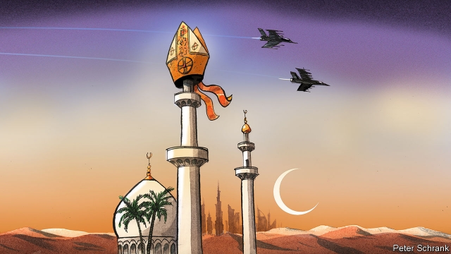

###### Pilgrims in the Gulf

# The Pope’s historic visit to the Arabian peninsula 

##### It will shine a light on the ways in which the UAE is growing more liberal—and where it is not 

 

> Jan 31st 2019 

 

CHRISTIAN PILGRIMS are not often seen in the Arabian peninsula, where Islam was born. But they are flocking to one of its emirates, Abu Dhabi, for its first papal mass on February 5th. More than 100,000 are preparing to pack the Zayed stadium, adorned with a big cross, to celebrate the Eucharist with Pope Francis. Hotels are full of pilgrims chanting hosannas. Some hold standards bearing the Christian dove of peace tweaked with wings the colours of the United Arab Emirates (UAE) flag. The pope is “a symbol of peace, tolerance and the promotion of brotherhood”, says Muhammad bin Zayed, the crown prince, de facto ruler and papal host. 

Such hospitality is remarkable for the region. Further north in Syria and Iraq jihadists have uprooted ancient Christian communities and torched their churches. Neighbouring Saudi Arabia still bans churches and Christmas trees. “Two religions shall not co-exist in the Arabian peninsula,” snap the Koran-bashers, quoting a saying of the Prophet. 

Prince Muhammad, by contrast, has turned his emirate into an oasis of inter-faith dialogue. Grand muftis and prelates hug for the cameras. Under his tenure, the UAE has offered fleeing Arab Christians a haven. It has a new cathedral, 16 new churches and some 700 congregations. Remarkably, in 2013 the UAE ranked third among countries with the fastest-growing Christian populations. At home and abroad, the prince is also promoting a strand of Islam that encourages its followers to obey their rulers. It opposes the political Islamism—notably the Muslim Brotherhood—which harnesses religion as a force for social and political change. This is sponsored by the UAE’s Gulf rival, Qatar. 

Pope Francis appears to prefer Prince Muhammad’s strand of the faith. In an interview in 2016 he warned against the export of an “overly Western model of democracy” to the Middle East. Unlike his predecessor, Benedict XVI (who upset Muslims with a quote about the Prophet Muhammad’s propagation of the faith by the sword), Pope Francis has reached out to Muslims who seem to be tolerant. A quarter of all his papal visits have been to Muslim-majority countries, but he has rarely spoken out against their autocrats. 

Some Catholics question whether the pope is right to take sides in intra-Muslim tussles. Others ask whether a peacemaker should be visiting just one party to a regional conflict (the UAE and not Qatar). In other instances he has visited both sides, such as when he went to Israel and Palestinian areas. 

In a region of despots, Prince Muhammad is one of the more feared. Although tolerant of religious minorities, he withholds political freedoms from the Muslim majority, particularly Islamists, who he fears might overthrow him. Parties are banned. Those who ask questions are jailed. Migrants—Christians included—have no prospect of citizenship. They remain foreigners no matter how many generations are born in the UAE. “If the pope really cared about humanity, he would speak about human rights,” says Muhammad Saqer al-Zaabi, an Emirati Islamist, exiled in London. 

The prince has bankrolled a regional campaign against Islamists, supporting the overthrow in 2013 of Egypt’s democratically elected Islamist president, Muhammad Morsi. He also meddles in civil wars, whether in Libya or Somalia. For almost four years, he and Muhammad bin Salman, the crown prince of Saudi Arabia, have bombed and besieged Yemen, after its government was pushed out by Houthi rebels. The war has killed tens of thousands, driven millions to the brink of starvation and drawn accusations of war crimes. “It’s a horrible state and the pope’s visit lends credibility to that government,” says Khaled Abou el Fadl of the University of California in Los Angeles. “I’m worried about the moral message he’s sending.” 

-- 

 单词注释:

1.pilgrim['pilgrim]:n. 旅行者, 朝圣者, 香客 vi. 朝圣 

2.historic[hi'stɒrik]:a. 历史上著名的, 有历史性的 

3.UAE[]:阿拉伯联合酋长国 

4.Jan[dʒæn]:n. 一月 

5.Islam['izlɑ:m]:n. 伊斯兰教 

6.emirate[e'miәrit]:n. 埃米尔的地位, 酋长国 

7.abu[]:abbr. 亚洲广播联盟（Asian Broadcast Union） 

8.papal['peipl]:a. 罗马教皇的, 教皇制度的 

9.zay[]: [地名] [俄罗斯] 扎伊河 

10.adorn[ә'dɒ:n]:vt. 装饰, 使生色 

11.Eucharist['ju:kәrist]:n. 圣餐 

12.pope[pәup]:n. 罗马教皇, 主教 

13.franci[]:[网络] 弗朗西；法赛纳；法奇 

14.hosanna[hәu'zænә]:n. 〈圣经〉和撒那（赞美上帝之语） 

15.tweak[twi:k]:n. 拧, 扭, 焦急 vt. 扭, 开足马力 

16.pope[pәup]:n. 罗马教皇, 主教 

17.promotion[prәu'mәuʃәn]:n. 晋级, 创建, 增进 [经] 推广, 推销, 促进 

18.muhammad[]:n. 穆罕默德 

19.bin[bin]:n. (贮存谷物等的)容器, 箱子 [计] 二进制, 商业信息网 

20.de[di:]:[化] 非对映体过量 [医] 铥(69号元素铥的别名,1916年Eder离得的假想元素) 

21.facto[]:[法] 实际上, 事实上 

22.hospitality[.hɒspi'tæliti]:n. 款待, 亲切, 殷勤 

23.Syria['siriә]:n. 叙利亚 [经] 叙利亚 

24.Iraq[i'rɑ:k]:n. 伊拉克 

25.jihadist[]:n. 伊斯兰圣战士 

26.uproot[ʌp'ru:t]:vt. 连根拔起, 根除 

27.saudi['sajdi]:a. 沙乌地阿拉伯（人或语）的 

28.Arabia[ә'reibiә]:n. 阿拉伯半岛 

29.prophet['prɒfit]:n. 预言者, 先知, 提倡者 

30.oasis[әu'eisis]:n. 绿洲, 舒适的地方 [医] 绿洲(沙漠中), 健岛(病变区中的健康组织) 

31.mufti['mʌfti]:n. 常服, 便服, 穆夫提(伊斯兰法典说明官) 

32.prelate['prelit]:n. 高级教士 

33.tenure['tenjuә]:n. 享有, 保有期 [经] (财产,职位等的)占有, 占有权 

34.haven['heivn]:n. 港, 避难所, 安息所 vt. 安置...于港中, 庇护, 入港 

35.congregation[.kɒŋgri'geiʃәn]:n. 集合, 聚集 [法] 集会, 人一, 红衣主教会议 

36.remarkably[ri'mɑ:kәbli]:adv. 显著地, 引人注目地, 非常地 

37.strand[strænd]:n. (绳索的)股, 绳, 串, 海滨, 河岸 vi. 搁浅 vt. 使搁浅, 使落后, 使陷于困境, 弄断, 搓 

38.follower['fɒlәuә]:n. 从者, 属下, 追补者 [电] 随动机 

39.Muslim['mjzlim; (?@) 'mʌzlem]:n. 伊斯兰教, 伊斯兰教教徒 

40.Qatar['kɑ:tәr]:n. 卡塔尔 

41.overly['әuvәli]:adv. 过度地, 极度地 

42.predecessor[.predi'sesә]:n. 前任, 先辈, 前身 [医] 初牙, 前辈, 祖先 

43.benedict['benidikt]:n. 新婚男人 

44.xvi[]:num. 罗马数字 16 

45.Muslim['mjzlim; (?@) 'mʌzlem]:n. 伊斯兰教, 伊斯兰教教徒 

46.propagation[.prɒpә'geiʃәn]:n. 增殖, 繁殖, 宣传 [医] 传播, 繁殖, 持续培养 

47.tolerant['tɒlәrәnt]:a. 宽容的, 容忍的, (对冷、热)能耐的 [医] 能耐受的 

48.autocrat['ɒ:tәkræt]:n. 独裁者 

49.tussle['tʌsl]:n. 扭打, 争斗, 论争 vi. 扭打, 打斗 

50.peacemaker['pi:smeikә]:n. 调解者, 和事佬 

51.regional['ri:dʒәnәl]:a. 地方的, 地域性的 [医] 区的, 部位的 

52.Israel['izreil]:n. 以色列, 以色列后裔, 犹太人 

53.Palestinian[,pælis'tiniәn]:[经] 巴勒斯坦的 

54.despot['despɒt]:n. 专制君主, 暴君 [法] 暴君, 专制君主 

55.withhold[wið'hәuld]:vt. 使停止, 扣留, 保留, 拒给 vi. 克制, 忍住 

56.Islamist[iz'lɑ:mist]:n. 伊斯兰教主义者；回教教徒 

57.overthrow[.әuvә'θrәu]:n. 推翻, 瓦解, 倾覆 vt. 打倒, 推翻, 倾覆 

58.citizenship['sitizәnʃip]:n. 国籍, 市民权, 市民的身份 [法] 公民权, 公民资格, 公民身分 

59.humanity[hju:'mæniti]:n. 人性, 人类, 博爱 

60.Emirati[]:n. (Emirati)人名；(意)埃米拉蒂 

61.Islamist[iz'lɑ:mist]:n. 伊斯兰教主义者；回教教徒 

62.exile['eksail]:n. 放逐, 流放, 被放逐者 vt. 放逐, 流放, 使背井离乡 

63.democratically[.demә'krætikli]:adv. 民主地, 民主主义地 

64.morsi[]: [地名] [印度] 莫尔西 

65.meddle['medl]:vi. 干涉, 干预, 擅自摸弄 [法] 干预, 插手, 弄乱 

66.Libya['libiә]:n. 利比亚 

67.Somalia[sәu'mɑ:liә]:n. 索马里 

68.Salman[]:n. 萨尔曼（男子名） 

69.besiege[bi'si:dʒ]:vt. 围攻, 包围 

70.yeman[]:[网络] 也门；叶门；园艺业的普及则始于也门 

71.houthi[]:[网络] 胡塞；也门一侧胡塞；什叶派胡塞 

72.tens[]:十位 

73.brink[briŋk]:n. 边缘, 陡岸 

74.accusation[ækju:'zeiʃәn]:n. 控告, 指控, 指责 [法] 控告, 起诉, 告发 

75.credibility[.kredi'biliti]:n. 可信用, 确实性, 可靠 [法] 证据能力, 可信程度, 确实性 

76.khaled[]:n. 卡勒德（人名） 

77.abou[]:n. (Abou)人名；(阿拉伯)阿布；(西)阿沃 

78.el[el]:abbr. 预期损失（Expected Loss） 

79.fadl[]:法德勒 

80.California[.kæli'fɒ:njә]:n. 加利福尼亚 

81.los[lɔ:s]:abbr. 月球轨道航天器（Lunar Orbiter Spacecraft）；视线（Line of Sight） 

82.angeles[]:n. 安杰利斯（姓氏）；天使城（菲律宾地名） 

