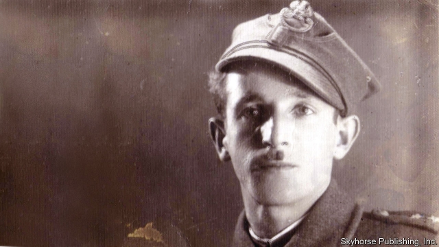

###### Arms and the man

# Obituary: Frank Blaichman died on December 27th 

##### One of the leaders of the Jewish Partisan Army in Poland was 96 

 

> Jan 31st 2019 

 

THAT FIRST proper gun Frank Blaichman did not forget. It was a rifle with straw still on it, because a farmer had fetched it from its hiding place in a barn. Not new, but polished, heavy, and with ammunition. It made him shiver from his head to his knees. More followed. One, dug from the ground, looked fresh out of a magazine. He had been told there were enough “to arm a company”. Well, not quite. There were six. But they changed everything. 

Up to then, for two months, he had been hiding in the forest. There was a camp of 100 Jews who had escaped deportation from his town, Kamionka, south-east of Warsaw, in October 1942, living in bunkers dug in the earth. They would creep out for water or food, run back again. Enemies were all around. In his bunker at night he would tremble with fear that the deer running by were Germans. At 19, he felt he was dead and in his grave. 

He had inner weapons, but they were all to do with disappearing. Since the Germans had arrived in 1939, he had honed them. Fluent Polish, picked up from customers in his grandmother’s general store. The look of a gentile, to blend in. Good local knowledge, from the bartering he did for other Jews, of which gentile farms had honey or chickens, and which might be friendly enough (resisting the general poison in the air) to hide him for a day or so. An uncanny sense of direction, and cunning too, so that he could slip into woods, ravines and even haystacks if people were hunting him. “Skinny Frank” was his nickname round the town. 

Yet hiding was not his nature. When the Germans started to round up Kamionka’s Jews he refused to be deported with them. He already laughed at the travel restrictions for Jews, racing out of town on his bicycle to trade stuff, leaving his white Star of David arm-band at home. Meanwhile, his fury mounted. When he saw Hasidim rifle-butted as they dug ditches, or heard that Uncle Moishe had been shot on the spot for having fresh meat in his house, he felt like fighting. Most of his neighbours said it was God’s will. He did not agree. So on the eve of the round-up he vaguely wished his family Zeits geszunt, “Be healthy!”, and walked out with nothing but bread in his pockets. 

So he had run away. But what could he fight with? That autumn 80 of his companions were slaughtered at their wretched campsite in the forest. It was not enough to bury them, say Kaddish and vanish. Jews had to defend themselves, and also avenge the dead. Even the pretence of a rifle—old farm forks with their outer teeth knocked out, slung on a shoulder-strap—made him feel stronger. With proper firearms, they would make an army of resistance. 

What he realised more gradually was the sheer power of a gun over other people. The silent threat of force, which gave you whatever you asked for in the blink of an eye. On that great Night of the Weapons he’d gone to the farm with no idea what to say. But he had an old small-calibre pistol in his hand, no bullets, and the handle held on with a rubber band. Seeing it, the farmer immediately gathered all the rifles he had. In villages from which Jews were usually chased away, for fear of German reprisals if they were let in, they could now eat and drink confidently and try to make the point that they were not hoodlums, but gentlemen. 

The guns’ message to the organised legions of Jew-haters was starker. If any of those bandits killed a Jew, they would be killed in turn. Harassers of Jews at roadblocks were now met with gunfire. Nazi collaborators who pretended to be picking mushrooms in the forest, looking for Jews to betray to the Germans, were arrested, interrogated and shot. (He continued to take revenge after the war, working briefly for the new communist government to hunt them down.) As his group grew more efficient it attracted more recruits, including ex-soldiers, and more weapons: hand-grenades, mines, machineguns. The Jewish Partisan Army that resulted, split up into scattered roving units, could now carry out proper ambushes and sabotage. And he, at 21, was its youngest platoon commander, with a small moustache that made him look more of a soldier. 

His inner weapons, though, were never put aside. He and his comrades still trusted no one. For months he kept his pistol, a Polish Vis, chained unholstered to his belt so that he could draw it in a second, until it went off accidentally and killed a friend. Various groups of gentile Polish partisans, who often helped out, offered to join forces with them but he, for one, refused. Anti-Semitism ran too deep in Poland, he wrote later. Any Pole could recognise a Jew among a thousand gentiles. Even once the war was won in the east, Jews could never be safe in that country. The place was one huge cemetery of Jewish life as it had been. 

He therefore left in 1948, and three years later settled in New York. In America at least he could bring up his family peacefully with Torah and among Jews. There, where he worked as a builder, he joined the campaign to get a memorial to the Jewish partisans erected at Yad Vashem in Jerusalem. Everyone had to know that Jews fought too, in an organised and disciplined way. 

When historians came calling, he went through his life with almost no emotion. Impassively, he told how relatives had vanished and how he had said goodbye. Two stories, though, he relished telling. One was the time his partisans went to disarm 2,000 Germans on a farm estate, shooting for hours, until they gave up for lack of reinforcements. The other was the time he shot a German officer at almost point-blank range, above the belt-clasp. He fell down like a tree. And his killer, 50 years later, allowed himself a smile. 

-- 

 单词注释:

1.partisan['pɑ:tizn]:n. 党羽, 虔诚信徒, 同党, 游击队员 a. 党派的, 偏袒的, 效忠的, 献身的, 盲目推崇的 

2.Poland['pәulәnd]:n. 波兰 

3.Jan[dʒæn]:n. 一月 

4.ammunition[.æmju'niʃәn]:n. 军火, 弹药 [机] 弹药 

5.Jew[dʒu:]:n. 犹太人, 守财奴, 犹太教信徒 vt. 欺骗, 杀价 

6.deportation[.di:pɒ:'teiʃәn]:n. 驱逐出境, 放逐 [法] 递解出境, 放逐, 驱逐 

7.Kamionka[]:[地名] 卡米翁卡 ( 波 ) 

8.warsaw['wɔ:sɔ:]:n. 华沙（波兰首都） 

9.bunker['bʌŋkә]:n. 煤仓, 沙坑, 暗堡 vt. 击入沙坑, 使陷入困境 

10.hone[hәun]:n. 磨刀石, 抱怨, 想念 vt. 用磨刀石磨, 磨练 

11.gentile['dʒentail]:n. 非犹太人, 异邦人, 非伊斯兰教徒 a. 非犹太人的, 异教徒的, 非摩门教徒的 

12.barter['bɑ:tә]:n. 物物交换, 实物交易 v. 物物交换, 交换 

13.uncanny[.ʌn'kæni]:a. 怪诞的, 可怕的, 离奇的, 神秘的 

14.ravine[rә'vi:n]:n. 峡谷, 冲沟, 溪谷 

15.haystack['heistæk]:n. 干草堆 

16.skinny['skini]:a. 似皮的, 极瘦的, 少的, 小气的 [医] 皮的; 消瘦的 

17.nickname['nikneim]:n. 绰号, 昵称 vt. 给...取绰号, 叫错名字 [计] 绰号 

18.deport[di'pɒ:t]:vt. 举止, 驱逐出境 [法] 放逐, 驱逐, 递解 

19.david['deivid]:n. 大卫；戴维（男子名） 

20.fury['fjuri]:n. 愤怒, 狂暴, 狂怒的人 [医] 狂乱, 狂暴, 狂怒 

21.Hasidim['hæsidim]:Hasid的复数 

22.moishe[]:[网络] 摩西 

23.vaguely['veigli]:adv. 含糊地, 暧昧地 

24.slaughter['slɒ:tә]:n. 残杀, 屠杀, 杀戮 vt. 残杀, 屠杀, 亏本出售 

25.wretched['retʃid]:a. 可怜的, 不幸的, 卑鄙的 

26.campsite[kæmp'sait]:n. 营地 

27.Kaddish['kædiʃ]:n. 犹太教祈祷文 

28.avenge[ә'vendʒ]:vt. 为...报复, 报仇 

29.pretence[pri'tens]:n. 假装, 虚伪, 借口, 自称, 要求 [法] 假装, 借口, 托词 

30.sling[sliŋ]:n. 投石器, 抛掷, 吊索, 吊钩 vt. 用投石器投掷, 用吊钩吊上, 吊起 

31.firearm['faiә'ɑ:m]:n. 火器, 枪炮 

32.sheer[ʃiә]:a. 绝对的, 全然的, 纯粹的, 透明的, 峻峭的 vi. 偏转, 偏航 vt. 使急转向, 使偏航 adv. 完全, 全然, 峻峭 n. 偏航 

33.blink[bliŋk]:vi. 眨眼, 闪亮 vt. 眨眼, 使闪亮 n. 眨眼, 瞬间, 闪光, 闪烁 [计] 闪烁 

34.reprisal[ri'praizl]:n. 报复, 报仇, 报复性劫掠 [法] 复仇, 报复, 报复性暴力为 

35.confidently[]:adv. 自信地；安心地 

36.hoodlum['hu:dlәm]:n. 暴徒, 年轻无赖 

37.legion['li:dʒәn]:n. 军团, 军队, 众多的人 

38.starke[]: [人名] 斯塔克; [地名] [美国] 斯塔克 

39.bandit['bændit]:n. 强盗 

40.Jew[dʒu:]:n. 犹太人, 守财奴, 犹太教信徒 vt. 欺骗, 杀价 

41.harasser[]:n. 骚扰者；袭扰者导弹车 

42.roadblock['rәudblɒk]:n. 障碍, 障碍物 

43.gunfire['gʌnfaiә]:n. 炮火, 号炮报时, 炮击 

44.Nazi['nɑ:tsi]:n. 纳粹党人 a. 纳粹党的 

45.collaborator[kә'læbәreitә]:n. 合干者, 合作者, 通敌者 [法] 合作者, 协助者, 勾结者 

46.interrogate[in'terәgeit]:vt. 质问, 讯问, 审问 vi. 质问, 讯问 

47.briefly['brifli]:adv. 简短地, 扼要地, 简明地, 简单地 

48.machinegun[]:n. 机枪 vt. 用机枪射击, 用机枪击中 

49.roving['rәuviŋ]:a. 徘徊的, 流动的 n. 流浪, 漫游, 粗纱 

50.ambush['æmbuʃ]:n. 埋伏, 伏兵, 伏击 vt. 埋伏, 伏击 vi. 埋伏 

51.sabotage['sæbәtɑ:ʒ]:n. 怠工, 破坏活动, 破坏 vi. 从事破坏活动 vt. 妨害, 破坏 

52.platoon[plә'tu:n]:n. 排, 一组, 一群人 

53.vi[]:[计] vi文本编辑器 [医] ㄉ(87号元素钫的旧名) 

54.unholstered[]:[网络] 软体 

55.accidentally[.æksi'dentli]:adv. 偶然地, 意外地 

56.partisan['pɑ:tizn]:n. 党羽, 虔诚信徒, 同党, 游击队员 a. 党派的, 偏袒的, 效忠的, 献身的, 盲目推崇的 

57.cemetery['semitәri]:n. 墓地, 公墓 [法] 公墓, 墓地 

58.york[jɔ:k]:n. 约克郡；约克王朝 

59.peacefully[]:adv. 平静地 

60.torah['tәurә]:n. 教导, 律法, <<旧约>>之首五卷 [法] 教训, 神论, 法律 

61.builder['bildә]:n. 建立者 [机] 组份 

62.yad[]: [医][=yeast alcohol dehydrogenase]酵母乙醇脱氢酶 

63.vashem[]:[网络] 血管 

64.Jerusalem[dʒә'ru:sәlәm]:n. 耶路撒冷 

65.historian[hi'stɒ:riәn]:n. 历史学家, 记事者 

66.impassively[]:adv. 缺乏热情, 无表情, 冷漠, 冷淡, 无感觉, 不觉痛苦, 无感情, 不动, 冷静 

67.relish['reliʃ]:n. 滋味, 风味, 美味, 爱好, 食欲, 调味品 vt. 调味, 喜欢, 玩味 vi. 有味道 

68.disarm[dis'ɑ:m]:vt. 解除武装, 裁军, 缓和 vi. 放下武器 

69.reinforcement[.ri:in'fɒ:smәnt]:n. 加强, 增援, 补充, 援军, 加固物 [化] 补强; 加强件 

70.killer['kilә]:n. (非正式)杀人者, 屠杀者, 猛兽, 致死(疾病), 杀手, 止痛药, 限制器, 瞄准器 [计] 删除程序; 断路器 

