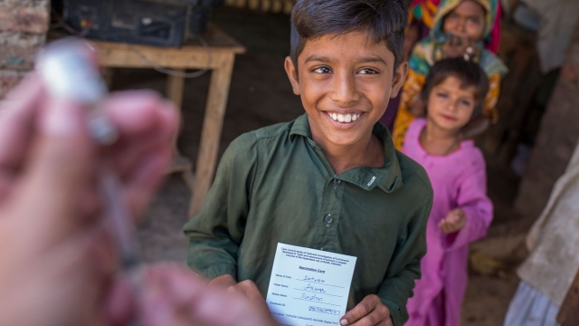

###### Public health

# A newly revived vaccine may deal a death blow to typhoid fever 

##### It languished for 20 years for lack of development money 

 

> Jan 31st 2019 

 

A BACTERIUM called Salmonella typhi travels from host to host in contaminated food and water. Thanks to better mains and drains its excursions have been curtailed in rich countries. But the disease that it causes—typhoid fever—is still common in places where modernity has not fully made its mark. In these parts between 11m and 20m people fall ill with typhoid every year. Of those 160,000, mostly children, die. 

Typhoid fever can be treated with antibiotics, but this line of defence is starting to fail as extensively drug resistant (XDR) bugs are spreading rapidly and alarmingly in Pakistan. Existing vaccines provide only temporary protection to adults and do not work in children. What is needed is a new and better vaccine. And one is now at hand, courtesy of the Bill and Melinda Gates Foundation, a big charity. 

The origins of this vaccine, which labours under the moniker of Typbar-TCV, can be traced back to work done 20 years ago by researchers at America’s National Institutes of Health. It was only ever licensed to Bharat Biotech, based in Hyderabad, India, for local use. Nobody else thought it worthwhile developing. Now the Gates Foundation has plucked Typbar-TCV from obscurity and pushed it through the research and testing necessary for it to be used everywhere. 

One of the first of those tests was conducted by the Oxford Vaccine Group (OVG), a research organisation in Britain, in 2017. Andrew Pollard, OVG’s boss, recruited 100 adult volunteers, vaccinated them and then gave them a drink laced with live S. typhi. Britain was a good place to do this because typhoid is essentially extinct there, so participants had no existing immunity. Antibiotics were on hand to treat those who succumbed, but most did not. This and subsequent experiments have shown the vaccine to be almost 90% effective and, crucially, safe for use in children as young as six months. 

The Gates Foundation has just sent a supply of 200,000 doses of Typbar-TCV to Pakistan, to try and fight the outbreak of XDR typhoid there. In Sindh province (mostly in the capital, Karachi), there were 5,274 cases of XDR typhoid (of 8,188 cases overall) between November 1st 2016 and December 9th last year. 

The new vaccine has also been warmly welcomed by GAVI, an international health organisation formerly known as the Global Alliance for Vaccines and Immunisation, which has promised to spend $85m on Typbar-TCV this year and next. GAVI was supposed to start vaccinations in Zimbabwe this week. The doses are already in the country. However, according to Seth Berkley, GAVI’s boss, strikes, protests and a deteriorating security situation have meant that the beginning of the campaign has been postponed until February 23rd. 

Other places where the vaccine could be deployed include Bangladesh, Ghana, India, Nepal, Nigeria and Uganda. Besides being able to bring typhoid outbreaks in countries like these to a halt, vaccination may also help drive down the use of antibiotics, and thus the selection pressure that maintains XDR bacteria in the population. Anita Zaidi, head of the vaccine-development, surveillance, and enteric and diarrhoeal diseases programmes at the Gates Foundation, even wonders if it might be possible to eliminate typhoid entirely if enough people are vaccinated. 

That is an aspiration. Typbar-TCV does, though, bring the immediate hope of saving many lives. What a shame it has arrived 20 years later than it might have done. 

-- 

 单词注释:

1.revive[ri'vaiv]:vt. 使苏醒, 使复兴, 使振奋, 回想起, 重播 vi. 苏醒, 复活, 复兴, 恢复精神 

2.vaccine['væksi:n]:n. 牛痘苗, 疫苗 a. 疫苗的, 牛痘的 

3.typhoid['taifɔid]:a. 伤寒的 n. 伤寒 

4.languish['læŋgwiʃ]:vi. 憔悴, 凋萎, 苦思 

5.Jan[dʒæn]:n. 一月 

6.salmonella[.sælmә'nelә]:n. 沙门氏菌 [医] 沙门氏菌属 

7.typhi[]:[网络] 伤寒沙门菌；普氏立克次菌；斑疹伤寒立克次体 

8.contaminate[kәn'tæmineit]:vt. 弄污, 弄脏, 污染, 毒害 [化] 污染 

9.curtail[kә:'teil]:vt. 缩减, 剥夺, 简略 [法] 剥夺特权 

10.modernity[mɒ'dә:nәti]:n. 现代性, 现代状态, 现代东西 

11.fully['fuli]:adv. 十分地, 完全地, 充分地 

12.typhoid['taifɔid]:a. 伤寒的 n. 伤寒 

13.antibiotic[.æntibai'ɒtik]:n. 抗生素 a. 抗生的 

14.extensively[]:adv. 广大, 广延, 外延, 大面积(耕种), 粗放, 广博, 广泛, 广阔 

15.XDR[]:外部数据表示协议 

16.bug[bʌg]:n. 错误, 虫, 病菌, 缺陷, 窃听器, 癖好, 防盗报警器, 双座小汽车, 要人 vt. 装防盗报警器, 装窃听器, 激怒 vi. 捉虫, 暴突 [计] 缺点, 错误 

17.alarmingly[ ə'lɑːmɪŋli]:adv. 让人担忧地 

18.Pakistan[.pɑ:ki'stɑ:n]:n. 巴基斯坦 

19.courtesy['kә:tisi]:n. 礼貌, 谦恭, 好意 [法] 优待, 礼貌, 恩惠 

20.melinda[mә'lindә]:n. 梅林达（女子名） 

21.moniker['mɔnikә(r)]:n. 名字, 绰号 

22.bharat['bʌrʌt]:n. （梵文）巴拉特（或婆罗多, 即印度）；印度巴拉特石油公司 

23.biotech['baɪəʊtek]:n. 生物技术 

24.HYDERABAD['haidәrәbɑ:d]:海得拉巴(①印度南部一城市 ②巴基斯坦东南部一城市) 

25.obscurity[әb'skjuәriti]:n. 阴暗, 朦胧, 晦涩, 费解, 身份低微 

26.Oxford['ɒksfәd]:n. 牛津, 牛津大学 

27.vaccine['væksi:n]:n. 牛痘苗, 疫苗 a. 疫苗的, 牛痘的 

28.organisation[,ɔ: ^әnaizeiʃən; - ni'z-]:n. 组织, 团体, 体制, 编制 

29.andrew['ændru:]:n. 安德鲁（男子名） 

30.pollard['pɒlәd]:n. 无角(截去角)的动物, 截去树梢的树, 麸皮 vt. 截去树梢 

31.vaccinate['væksineit]:v. 预防接种 

32.S[es]:[计] 标量, 服务员, 符号, 堆栈, 状态, 存储器, 开关, 同步, 系统 [医] 硫[黄](16号元素); 半; 骶骨的; 标记, 用法签; 光滑; 左的; 上转 

33.essentially[i'senʃәli]:adv. 本质上, 本来 

34.participant[pɑ:'tisipәnt]:n. 参加者, 参与者 a. 有份的, 参加的, 参与的 

35.immunity[i'mju:niti]:n. 免疫, 免疫性, 免除 [化] 免疫性 

36.succumb[sә'kʌm]:vi. 屈从, 屈服, 死 

37.crucially[ˈkru:ʃɪəlɪ]:adv. 至关重要地, 关键地 

38.outbreak['autbreik]:n. 爆发, 暴动 [医] 暴发 

39.Sindh[]:n. 信德省（巴基斯坦的一个省） 

40.Karachi[kә'rɑ:tʃi]:n. 卡拉奇(巴基斯坦港市) 

41.warmly['wɒ:mli]:adv. 亲切地, 温暖地, 热心地 

42.gavi[]: [地名] [意大利] 加维 

43.formerly['fɒ:mәli]:adv. 从前, 以前 

44.alliance[ә'laiәns]:n. 联盟, 联合 [法] 同盟, 联盟, 联姻 

45.immunisation[ˌɪmjʊnaɪ'zeɪʃən]:n. 免疫(immunization) 

46.vaccination[.væksi'neiʃәn]:n. 接种疫苗, 种痘 [医] 接种; 种痘 

47.Zimbabwe[zim'bɑ:bwei]:n. 津巴布韦 

48.seth[seθ]:n. 赛斯（男子名） 

49.Berkley[]:n. (Berkley)人名；(英)伯克利 

50.deteriorate[di'tiәriәreit]:v. (使)恶化 

51.deploy[di'plɒi]:v. 展开, 配置 

52.Bangladesh[,bɑ:ŋ^lә'deʃ]:n. 孟加拉国 [经] 孟加拉共和国 

53.Ghana['gɑ:nә]:n. 加纳 

54.Nepal[ni'pɒ:l]:n. 尼泊尔 

55.Nigeria[nai'dʒiriә]:n. 尼日利亚 

56.Uganda[ju(:)'^ændә, u:'^ændә]:n. 乌干达 

57.anita[ә'ni:tә]:n. 安尼塔（女子名） 

58.Zaidi[]:[网络] 扎迪；投资组合经理 

59.surveillance[sә:'veilәns]:n. 监视, 监督 [电] 侦测 

60.enteric[en'terik]:a. 肠的 [医] 肠的 

61.diarrhoeal[]:a. 腹泻 

62.entirely[in'taiәli]:adv. 完全, 全然, 一概 

63.aspiration[.æspә'reiʃәn]:n. 热望, 志向, 渴望 [医] 吸入; 吸[引], 吸引术 

