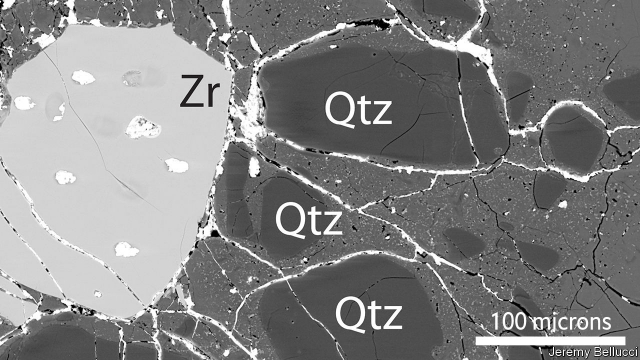

###### Astrogeology

# A rock from the Moon has a tiny piece of Earth inside it 

##### It arrived there 4bn years ago 

 

> Jan 31st 2019 

 

THIS IS A cross-section through a grain from a well-travelled rock. It was brought to Earth from the Fra Mauro highlands of the Moon in 1971, by the crew of Apollo 14. Four billion years before that, though, it had made the journey in the opposite direction, according to an analysis by Jeremy Bellucci of the Swedish Museum of Natural History, published in Earth and Planetary Science Letters. 

Fra Mauro is composed of ejecta from a celestial collision between an asteroid and the Moon, which excavated the biggest lunar impact basin, Mare Imbrium. Most of the samples returned by Apollo 14 are breccias created by this impact. Breccia is a type of rock formed by the higgledy-piggledy mixing of bits of other rock, and this two-gram grain was part of one such brecciated boulder. 

Dr Bellucci’s analysis of the minerals in the grain, particularly its zircon (Zr, in the picture) and quartz (Qtz), shows that they would have been unlikely to form in lunar conditions, but would easily have formed on Earth. The simplest explanation, therefore, is that Earth is where they came from. 

Almost certainly, the grain arrived on the Moon as part of a larger rock blasted off Earth’s surface by an impact similar to that which created Mare Imbrium. All this happened during a period of the solar system’s history called the late heavy bombardment, which lasted from 4.1bn to 3.8bn years ago. The Moon then being only a third as far away from Earth as it is now, travelling to the one from the other would have been an easy journey. The grain was then shifted again, by the Imbrium impact, to form part of the geological splatter now called Fra Mauro. 

Terrestrial material this old is rare, so finding some on the Moon has been a useful addition to geologists’ collections. And this particular grain may not be unique. Apollo 14 brought back 42kg of rock. Other chips off the block of old Earth are probably hiding among them. 

-- 

 单词注释:

1.astrogeology[,æstrәjdʒi'ɔiәdʒi]:n. 太空地质学 

2.Jan[dʒæn]:n. 一月 

3.fra[frɑ:]:abbr. 联邦铁路局（Federal Railroad Administration）；联邦储备法（Federal Reserve Act）；流量警报记录器（Flow Alarm Recorder）；自由基型（Free Radical Type） 

4.Mauro[]:莫罗（人名） 

5.highland['hailәnd]:n. 高地, 苏格兰高地 

6.Apollo[ә'pɒlәu]:n. 阿波罗(太阳神), 美男子 

7.jeremy['dʒerimi]:n. 杰里米（男子名） 

8.bellucci[]:n. (Bellucci)人名；(意)贝卢奇 

9.Swedish['swi:diʃ]:n. 瑞典人, 瑞典语 a. 瑞典的, 瑞典人的, 瑞典语的 

10.planetary['plænitri]:a. 行星的, 流浪的, 迁移不定的, 地球上的, 现世的 

11.ejecta[i'dʒektә]:n. 喷出物, 渣, 废物 [医] 排出物 

12.celestial[si'lestjәl]:a. 天的, 天国的, 天空的 [法] 天的, 天空的, 天国的 

13.asteroid['æstәrɒid]:n. 小行星, 海盘车 a. 星状的 

14.excavate['ekskәveit]:v. 挖空, 挖出, 凿通 

15.mare[mєә]:n. 母马, 母驴, 月球表面阴暗部 [法] 海 

16.imbrium[]:雨海纪 

17.breccia['bretʃiә]:n. 角砾岩 [化] 角砾岩 

18.breccia['bretʃiә]:n. 角砾岩 [化] 角砾岩 

19.brecciate['bretʃi,eit]:vt.将...作成角砾岩 

20.boulder['bәuldә]:n. 大圆石 [机] 圆石, 漂石 

21.zircon['zә:kɒn]:n. 锆石 [化] 锆石 

22.Zr[]:[医] 锆(40号元素) 

23.quartz[kwɒ:ts]:n. 石英 [化] 石英 

24.Qtz[]:[网络] 圆锥法；塔式起重机；漆膜圆锥弯曲试验仪 

25.bombardment[bɒm'bɑ:dmәnt]:n. 炮击 [化] 轰击 

26.geological[.dʒiәu'lɒdʒikәl]:a. 地质学的, 地质的 

27.splatter['splætә]:vt. 使水等飞溅, 结结巴巴地讲 vi. 发溅泼声, 说话结巴 n. 飞溅 

28.terrestrial[tә'restriәl]:n. 地球上的人 a. 地球的, 陆生的, 陆地的, 人间的 

29.chip[tʃip]:n. 屑片, 薄片, 碎片 vt. 削, 切, 削成碎片, 使摔倒, 凿 vi. 削下屑片 [计] 孔屑; 组件; 晶片; 芯片 

