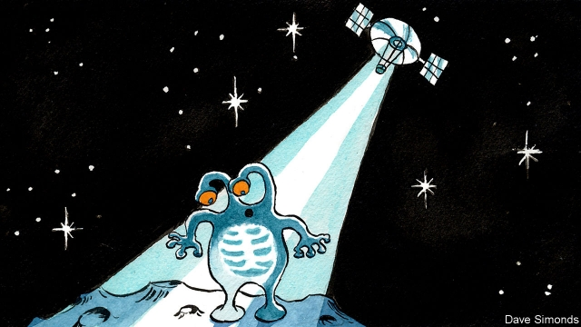

###### Talking to aliens

# Contacting extraterrestrials may be better done with X-rays than by radio 

##### They penetrate better through outer space 

 

> Jan 31st 2019 

 

OPINION IS DIVIDED on whether Homo sapiens should announce its presence to the universe by broadcasting messages to any putative extraterrestrials who may be listening, or should keep schtum, for fear of attracting unwanted attention. But if attempts at contact are to be made at all, then they might as well be done properly. 

Past efforts, including one in the 1970s to a star cluster 25,000 light-years away and another in 2017 to a planet a mere 12 light-years away, have used radio. Hang Shuang and his colleagues at the Nanjing University of Aeronautics and Astronautics, in China, think this approach foolish. Radio waves spread out quickly, and are also absorbed and scattered by interstellar dust. On top of this there are many sources of radio in the universe, which creates a confusing background. Instead, Mr Hang proposes using X-rays. 

X-rays diverge more slowly than radio waves. They are also better at penetrating dust. And there is little X-ray background to confuse them with. They would therefore be suitable in principle for interstellar communication. Their value as communication tools on Earth, however, has not been obvious, so little research has been done on using them to carry messages. But not none, for Mr Hang and his colleagues have actually built a prototype of an X-ray transceiver that has a particular, specialised purpose. This is to eliminate the communications blackout which a spacecraft experiences during re-entry into Earth’s atmosphere. The blackout is a result of the craft being surrounded by a plume of incandescent plasma generated by the heat of re-entry. Such a plasma is impenetrable by radio waves, but can be pierced by X-rays. Using their prototype, Mr Hang and his colleagues are able to encode messages into X-rays, transmit them through a vacuum, and then decode them at the other end. 

A practical version of this system would not broadcast signals directly to Earth from the re-entering craft. Rather it would transmit them to a satellite that then relayed the message Earthward by more conventional means. The reason for the detour is that, though X-rays penetrate dust, they are absorbed by the sorts of gases that make up Earth’s atmosphere. The re-entry transceiver works because the period of re-entry blackout happens high in the atmosphere, where the air is thin. A signal beamed through the thick air of the lower atmosphere would, by contrast, be absorbed. 

XCOM, as Mr Hang dubs his putative X-ray Aldis lamp, would be a more powerful version of such a spacecraft transmitter. To avoid atmospheric absorption it would have to be put into space to operate. Ideally, it would sit on the far side of the Moon, shielded from interference from Earth. 

By a lucky coincidence, the China National Space Administration, the country’s space agency, has just demonstrated, with the landing of its lunar probe Chang’e-4, that it can position equipment on that part of Earth’s natural satellite. Whether the agency’s research interests stretch as far as the hunt for extraterrestrial intelligence remains to be seen. But XCOM would certainly be a novel approach to the question. 

-- 

 单词注释:

1.alien['eiljәn]:n. 外国人, 外侨 a. 外国的, 相异的 

2.extraterrestrial[,ekstrәtә'restriәl]:a. 地球外的, 地球大气圈外的 

3.Jan[dʒæn]:n. 一月 

4.HOMO['hәumәu]:[化] 最高占据轨道; 最高占据分子轨道; 最高已占分子轨道 [医] 人属 

5.sapien[]:n. 智慧 

6.putative['pju:tәtiv]:a. 推定的, 被公认的 [法] 被公认的, 推定的, 假定的 

7.unwanted[.ʌn'wɒntid]:a. 没人要的, 不需要的, 多余的 

8.cluster['klʌstә]:n. 串, 丛, 群, 簇 vi. 成串, 丛生 vt. 使聚集 [计] 簇 

9.shuang[]:爽；霜（汉语拼音） 

10.nanjing['næn'dʒiŋ]:n. 南京（等于Nanking, Nanching） 

11.aeronautics[.єәrә'nɒ:tiks]:n. 航空学, 飞行术 [机] 航空学 

12.astronautics[.æstrә'nɒ:tiks]:n. 航天学, 宇宙航行 

13.quickly['kwikli]:adv. 很快地 

14.interstellar['intә'stelә]:a. 星际的 

15.diverge[dai'vә:dʒ]:vi. 分歧, 岔开 vt. 使岔开 

16.prototype['prәutәtaip]:n. 原型 [计] 样机; 原型 

17.transceiver[træns'si:vә]:n. 无线电收发机 [计] 收发器 

18.specialise['speʃә,laiz]:vt. 特加指明, 列举, 使专门化, 限定...的范围 vt.vi. (使)特化, (使)专化 vi. 成为专家, 专务, 专攻, 专门研究, 逐条详述 

19.blackout['blækaut]:n. 灯火管制, 暂时的意识丧失, 灯火熄灭, 删除 [计] 电网掉电 

20.plume[plu:m]:n. 羽毛, 羽毛装饰, 羽状的 vt. 用羽毛装饰, 整理羽毛, 使成羽毛状 

21.incandescent[.inkæn'desnt]:a. 白热的, 闪闪发光的, 辉耀的, 灿烂的 [医] 白炽的, 白热的 

22.plasma['plæzmә]:n. 血浆, 淋巴液, 原生质, 等离子体 [化] 等离体; 等离子体 

23.impenetrable[im'penitrәbl]:a. 不能通过的, 不可理喻的, 费解的, 顽固的 

24.encode[in'kәud]:vt. 把(电文、情报等)译成密码 [计] 编码 

25.decode[di:'kәud]:vt. 解码, 译解 [计] 译码 

26.earthward['ә:θwәd]:a. 向地球的 

27.detour['di:tuә]:n. 绕路, 迂回 v. (使)绕道 

28.dub[dʌb]:vt. 配音, 轻点, 授予称号, 击 n. 一下击鼓声, 笨蛋 

29.Aldis['ɔ:ldis]:lamp 奥尔迪斯手提信号灯(舰船、飞机上用摩尔斯电码发信号时用的灯) 

30.transmitter[træns'mitә]:n. 传送者, 传达人, (疾病的)传播者 [计] 发散机; 发送器 

31.absorption[әb'sɒ:pʃәn]:n. 吸收, 专心, 全神贯注 [化] 吸收; 吸收作用 

32.ideally[ai'diәli]:adv. 完美地, 理想地 

33.probe[prәub]:n. 探索, 调查, 探针, 探测器 v. 用探针探测, 调查, 探索 

