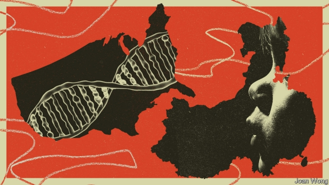

###### Scientific ethics

# Recent events highlight an unpleasant scientific practice: ethics dumping 

##### Rich-world scientists conduct questionable experiments in poor countries 

 

> Jan 31st 2019 

 

THE ANNOUNCEMENT in November of the editing of the genomes of two embryos that are now baby girls, by He Jiankui, a Chinese DNA-sequencing expert—brought much righteous, and rightful, condemnation. But it also brought a lot of tut-tutting from the outside world about how this sort of thing was to be expected in a place like China, where regulations, whatever they may say on paper, are laxly enforced. Dig deeper, though, and what happened starts to look more intriguing than just the story of a lone maverick having gone off the rails in a place with lax regulation. It may instead be an example of a phenomenon called ethics dumping. 

Ethics dumping is the carrying out by researchers from one country (usually rich, and with strict regulations) in another (usually less well off, and with laxer laws) of an experiment that would not be permitted at home, or of one that might be permitted, but in a way that would be frowned on. The most worrisome cases involve medical research, in which health, and possibly lives, are at stake. But other investigations—anthropological ones, for example—may also be carried out in a more cavalier fashion abroad. As science becomes more international the risk of ethics dumping, both intentional and unintentional, has risen. The suggestion in this case is that Dr He was encouraged and assisted in his project by a researcher at an American university. 

The scientist in question is Michael Deem of Rice University in Houston, Texas. Dr Deem was Dr He’s PhD supervisor between 2007 and 2010, and has continued to collaborate with him. The two are co-authors of at least eight published papers and several as-yet-unpublished manuscripts. Dr Deem also appears (along with nine others, all Chinese, including Dr He) on the author list of a paper, “Birth of twins after genome editing for HIV resistance”, which Dr He submitted to Nature before his announcement of his work at a meeting in Hong Kong. Nature’s editors rejected the paper (and will not, as is normal procedure in the case of rejection, confirm that they actually received it). 

According to a Chinese scientist involved in the genetically modified embryo project, which used a technique known as CRISPR-Cas9 to disable the gene for CCR5, a protein that HIV attaches itself to when entering a cell, Dr Deem participated as a member of the project team in the procedures in which potential volunteers gave their consent. Dr Deem will not comment. But a statement from his lawyers said, “Michael Deem has done theoretical work on CRISPR in bacteria in the past, and he wrote a review article on the physics of CRISPR-Cas. But Dr Deem has not designed, carried out, or executed studies or experiments related to CRISPR-Cas9 gene editing—something very different. He did not authorise submission of manuscripts related to CCR5 or PCSK9 [an unrelated protein involved in cholesterol transport] with any journal, and he was not the lead, last, or corresponding author on any such manuscript. And Dr Deem was not in China, and he did not otherwise participate, when the parents of the reported CCR5-edited children provided informed consent.” 

In America, in effect, the implantation of genetically modified embryos into a woman’s womb is forbidden. Such an experimental medical procedure would require permission from the country’s Food and Drug Administration, and such permission would not be forthcoming. Carrying on regardless would be a federal crime and one that, according to Hank Greely, a lawyer and bioethicist at Stanford University, might attract a fine of as much as $100,000, and a year in jail. 

For an American to support the execution of such work in another country is, though, a different matter. That would not be illegal under American law—though it would still violate federal rules if Dr Deem participated in the project without the approval of his university, which is investigating his role in the affair. Rice says it “had no knowledge of the work”, and, to its best knowledge, “none of the clinical work was performed in the United States.” It would not comment on the ongoing investigation. Neither Dr Deem nor his lawyers would comment on the specific suggestion that he had committed ethics dumping. 

Across the Atlantic from America, the Commission of the European Union (EU) has sponsored a three-year, €2.7m investigation into ethics dumping. TRUST, as it is called, has been a collaboration between researchers from Europe, Africa and Asia, which came to an end last year. It scrutinised past examples of ethics dumping and sought ways of stopping similar things happening in the future. As Doris Schroeder of the University of Central Lancashire, in England, who led the TRUST project, observes, “sometimes it’s because of the lack of awareness [of the laws in other nations]. Sometimes it’s about having double standards. We’ve certainly seen cases where there was a definite attempt to avoid legislation in European countries.” 

Zhai Xiaomei, the executive director of the Centre for Bioethics at the Chinese Academy of Medical Sciences, in Beijing, who is also deputy director of the health ministry’s ethics committee, welcomes what TRUST has done. “China’s weak ethics governance has made it an attractive destination for the export of unethical practices from the developed world,” she says. One high-profile case in China concerns Sergio Canavero, an Italian neurosurgeon who resigned from the University of Turin in 2015 because of fierce opposition to his plan to perform head transplants on human beings. Knowing that no country in Europe or North America would approve such procedures, Dr Canavero went to China, which he says “is quite different from the West” and “has a different ethics”. 

There, he collaborated with Ren Xiaoping, an orthopaedic surgeon at Harbin Medical University, on dogs, monkeys and human cadavers, and planned, last year, to graft the head of a patient paralysed from the neck down onto the body of a deceased donor—only to be stopped by China’s health ministry at the last minute. “The proposed procedure is based on astonishingly thin scientific evidence,” says Dr Zhai. “It’s not only ethically indefensible but against the Chinese law.” For his part Dr Canavero says, “we shouldn’t have announced the plan before the two papers [on dogs and on human cadavers] came out.” 

A dozen similar cases in Asia and Africa fill “Ethics Dumping: Case Studies from North-South Research Collaboration”, a book published by TRUST. Three notable examples are American-financed clinical trials that happened in India between 1998 and 2015. These were testing the efficacy of cheap cervical-screening methods. Such trials require control groups, which, in America, would be composed of women undergoing an established screening procedure. In the Indian trials, however, the controls—a total of 141,000 women—were not offered the pap smears that were supposed (though they were in practice often unavailable) to be the standard for screening in India at the time. 

Nor need behaving badly abroad as a researcher be life-threatening to be unacceptable. Another case highlighted by TRUST involved the San, a group of people in southern Africa well known to (and well studied by) the outside world because of their hunter-gatherer way of life, click-laden languages and ancient rock art. In 2010 a paper published in Nature on the first San genome to be sequenced caused an outcry among some San. According to Roger Chennells, a human-rights lawyer at Stellenbosch University, in South Africa, they found the consent procedures inappropriate and some of the language used in the paper, such as “Bushmen”, pejorative. 

As part of the TRUST project, Mr Chennells and his colleagues helped groups of San develop the first code of ethics created by an indigenous group in Africa. It requires researchers wishing to study San culture, genes or heritage to submit proposals to a review panel set up by San communities. It also asks researchers to treat people with respect, and to consider how their work could benefit local health care, education and jobs. 

Analysis of past transgressions has led TRUST’s researchers to suggest a set of guidelines called the Global Code of Conduct for Research in Resource-Poor Settings. This aims to raise awareness of bad practices, and to identify potential offences. A cornerstone of the code is that ethics reviews be conducted in all participating countries—those where the work will be carried out as well as those paying for it. According to Dr Schroeder, two European funding agencies—the commission itself, and the European & Developing Countries Clinical Trials Partnership, a joint effort by the EU, Norway, Switzerland and a group of drug companies—have already accepted the code. Meanwhile, in America, Kiran Musunuru, a gene-editing expert at the University of Pennsylvania, who was one of the first to look at Dr He’s data last year, suggests the creation of an international register for research involving the genetic modification of human embryos, with registration being a condition for subsequent publication. 

The latest twist in the CRISPR-babies saga itself is that Dr Deem was supposed to take up a position this month as Dean of the College of Engineering at the City University of Hong Kong. The offer was made before news of the birth of genetically modified babies broke. Dr Deem’s possible involvement in the affair has led the City University to put the contract on hold—at least until the investigation at Rice comes to a conclusion. The City University’s press office would not say whether the university would terminate the contract if Dr Deem is found to have been involved in the project, and neither Dr Deem nor his lawyers would comment on the matter. But, as one senior faculty member of the City University, who spoke on condition of anonymity, puts it, if the accusations being made turn out to be true, then “Dr Deem has committed a grave error of judgment and violated international norms. He is obviously not fit for such a senior academic position. We don’t want ethics dumping here.” 

-- 

 单词注释:

1.ethic['eθik]:n. 道德规范, 伦理 

2.questionable['kwestʃәnәbl]:a. 可疑的 [法] 可疑的, 有问题的, 不可靠的 

3.Jan[dʒæn]:n. 一月 

4.edit['edit]:vt. 编辑, 编校, 修订, 剪辑 [计] 编辑; DOS外部命令:该命令是一个用于编辑文本文件的全屏幕编辑程序 

5.genome['dʒi:nәum]:[化] 基因组 [医] 染色体组 

6.embryo['embriәu]:n. 胚胎, 胎儿, 胚芽 [医] 胚, 胚胎 

7.righteous['raitʃәs]:a. 公正的, 正义的, 正直的 [法] 正直的, 正当的, 正义的 

8.rightful['raitful]:a. 合法的, 正直的, 恰当的 [法] 正当的, 合法的, 依法有求权的 

9.condemnation[kɒndem'neiʃәn]:n. 非难, 宣告有罪, 非难的理由 

10.laxly['læksli]:adv. 松驰地, 缓慢地 

11.intrigue[in'tri:g]:n. 阴谋, 复杂的事 vi. 密谋, 私通 vt. 激起...的兴趣, 用诡计取得 

12.lone[lәun]:a. 孤单的, 孤立的, 单身的, 寂寞的 

13.maverick['mævәrik]:n. 未烙饲主印记的小牛, 持不同意见的人 vi. 迷路 

14.lax[læks]:a. 松的, 不严格的, 腹泻的, 松弛的 n. 腹泻, 松元音 

15.les[lei]:abbr. 发射脱离系统（Launch Escape System） 

16.laxe[]:[网络] 长；莱加内斯；林子豪 

17.worrisome['wʌrisәm]:a. 令人烦恼的, 麻烦的, 劳碌命的 

18.cavalier[.kævә'liә]:n. 骑士, 骑手 

19.unintentional[.ʌnin'tenʃәnl]:a. 无心的, 不是故意的 [法] 非故意的, 无意的, 无心的 

20.michael['maikl]:n. 迈克尔（男子名） 

21.deem[di:m]:v. 认为, 相信 

22.Houston['hju:stәn]:n. 休斯敦 

23.Texas['teksәs]:n. 德克萨斯 

24.phd[]:abbr. 哲学博士学位（Doctor of Philosophy） 

25.supervisor[.sju:pә'vaizә]:n. 管理者, 监督者, 指导者, 视导员 [计] 管理程序 

26.manuscript['mænjuskript]:n. 手稿, 原稿, 底稿 a. 手写的 

27.hiv[]:abbr. 艾滋病病毒（human immunodeficiency virus） 

28.hong[hɔŋ]:n. （中国、日本的）行, 商行 

29.kong[kɔŋ]:n. 含锡砾石下的无矿基岩；钢 

30.rejection[ri'dʒekʃәn]:n. 拒绝, 抛弃, 驳回, 被抛弃的东西, 呕出物 [化] 报废; 拒收 

31.genetically[]:adv. 创始, 遗传学, 生殖, 基因, 遗传, 发生 

32.CRISPR[]:[网络] Clustered regularly interspaced short palindromic repeats; 短回文重复序列 

33.physic['fizik]:n. 药品, 泻药, 医学 vt. 给...服药, 治愈, 使通便 

34.authorise['ɔ:θәraiz]:vt. 授权；批准；允许；委任（等于authorize） 

35.submission[sәb'miʃәn]:n. 屈服, 服从, 谦恭, 呈递, 提交, 意见 [经] 提交, 提出, 提交公断 

36.unrelated[]:[法] 无关的 

37.cholesterol[kә'lestәrɒl]:n. 胆固醇 [化] 胆固醇; 胆固醇 

38.implantation[.implɑ:n'teiʃәn]:n. 移植, 鼓吹, 灌输 [医] 植入法, 移植法, 植入, 埋入法(如药物等) 

39.womb[wu:m]:n. 子宫, 发源地 [医] 子宫 

40.forthcoming['fɒ:θ'kʌmɑŋ]:a. 即将来临的 n. 来临 

41.hank[hæŋk]:n. 一束, 一圈 vt. 用帆眼圈(将帆)系牢 

42.greely[]:n. (Greely)人名；(英)格里利 

43.bioethicist[,baiəu'eθisist]:n. 生物伦理学家 

44.stanford['stænfәd]:n. 斯坦福（姓氏, 男子名）；斯坦福大学（美国一所大学） 

45.execution[.eksi'kju:ʃәn]:n. 实行, 完成, 执行, 死刑 [计] 执行 

46.clinical['klinikәl]:a. 临床的, 门诊部的 [医] 临床的, 临证的 

47.ongoing['ɒngәuiŋ]:a. 前进的, 进行的, 不间断的 n. 前进, 发展 

48.EU[]:[化] 富集铀; 浓缩铀 [医] 铕(63号元素) 

49.collaboration[kә.læbә'ræʃәn]:n. 合作, 勾结 [法] 通敌卖国者, 奸细 

50.scrutinise[]:vt.vi. 细看, 仔细检查, 审查, 细阅 [经] 详细检查, 细细地看 

51.doris['dɔris]:n. 桃瑞丝（女子名） 

52.schroeder[]:n. 施罗德（男子名）；施罗德银行（德国银行） 

53.Lancashire['læŋkәʃiә]:n. 兰开夏郡(英格兰郡名) 

54.awareness[ә'weәnis]:n. 意识, 认识 [计] 识别, 议定, 明白 

55.zhai[]:翟（汉语拼音） 

56.Beijing[beidʒiŋ]:[经] 北京 

57.governance['gʌvәnәns]:n. 统治, 统辖, 管理 [法] 统治, 管理, 支配 

58.unethical[]:a. 不道德的 

59.Sergio[]:n. 塞尔吉奥（NBA球员） 

60.neurosurgeon[,njjәrәj's\\:dʒәn]:n. 神经外科医师 [医] 神经外科医师 

61.turin[tju'rin]:n. 都灵（意大利城市） 

62.opposition[.ɒpә'ziʃәn]:n. 反对, 敌对, 相反, 在野党 [医] 对生, 对向, 反抗, 反对症 

63.REN[]:[计] DOS内部命令:更改文件名 [医] 肾 

64.Xiaoping[]:邓小平 

65.orthopaedic[,ɔ:θәu'pi:dik]:a. 整形术的, 整形学的 

66.harbin['hɑ:rbin]:n. 哈尔滨（黑龙江省会） 

67.cadaver[kә'deivә]:n. 死尸, 尸体 [医] 尸体 

68.graft[grɑ:ft]:n. 嫁接, 贪污 v. 嫁接, 移植, 贪污 

69.paralyse['pærәlais]:vt. 使麻痹, 使瘫痪, 使无力, 使气馁, 终止 [医] 使麻痹, 使瘫痪 

70.decease[di'si:s]:n. 死亡 vi. 死亡 

71.astonishingly[ə'stɔniʃiŋli]:adv. 令人惊讶地 

72.ethically[]:adv. 伦理上 

73.indefensible[.indi'fensәbl]:a. 不能防卫的, 无辩护余地的 

74.collaboration[kә.læbә'ræʃәn]:n. 合作, 勾结 [法] 通敌卖国者, 奸细 

75.notable['nәutәbl]:n. 著名人士, 值得注意之事物 a. 值得注意的, 显著的 

76.efficacy['efikәsi]:n. 功效, 效力 [医] 效能, 功效, 效验 

77.pap[pæp]:n. 奶头, 乳头状物, 软食, 半流质食物 [计] 分组交换过程协议, 打印机访问协议 

78.smear[smiә]:vt. 涂, 擦上, 玷污, 把...擦模糊 vi. 被弄脏 n. 污点, 污迹, 污蔑 

79.unavailable[.ʌnә'veilәbl]:a. 得不到的, 不能利用的, 无用的 [化] 不可得的; 无效的; 不能利用的 

80.unacceptable[.ʌnәk'septәbl]:a. 无法接受的, 不受欢迎的 [法] 不能接受的, 不受欢迎的, 难以承认的 

81.san[sɑ:n]:abbr. 存储区域网（Storage Area Networking） 

82.outcry['autkrai]:n. 尖叫, 倒彩, 强烈抗议, 喊价 vi. 喊叫 vt. 叫得比...响 

83.roger['rɔdʒә]:interj. 对!, 行!, 好! 

84.stellenbosch['stelәnbɒʃ]:vt. 调离要职, 调任闲职 

85.inappropriate[.inә'prәupriәt]:a. 不适当的, 不相称的 

86.bushman['bjʃmәn]:n. 澳大利亚丛林中的居民,林区(或边远地区)的人 

87.pejorative['pi:dʒәreitiv]:a. 贬损的, 轻蔑的 n. 轻蔑语, 贬义词 

88.indigenous[in'didʒinәs]:a. 本土的, 国产的, 固有的 [医] 原产的, 本土的 

89.heritage['heritidʒ]:n. 遗产, 祖先遗留物, 继承物 [医] 遗传性 

90.transgression[træns'greʃәn]:n. 违反, 犯罪 [医] 亲和转移 

91.guideline['gaidlain]:n. 指导路线, 方针, 指标 [经] 指导路线, 方针, 准则 

92.cornerstone['kɔ:nәstәjn]:n. 奠基石, 基础 

93.clinical['klinikәl]:a. 临床的, 门诊部的 [医] 临床的, 临证的 

94.partnership['pɑ:tnәʃip]:n. 合伙, 合股, 合作关系 [经] 合伙(合作)关系, 全体合伙人 

95.Norway['nɒ:wei]:n. 挪威 

96.kiran[]:基兰（人名） 

97.Pennsylvania[.pensil'veinjә]:n. 宾夕法尼亚 

98.datum['deitәm]:n. 论据, 材料, 资料, 已知数 [医] 材料, 资料, 论据 

99.creation[kri:'eiʃәn]:n. 创造, 创作物, 发明 [化] 产生 

100.modification[.mɒdifi'keiʃәn]:n. 修正, 修饰, 修改 [化] 修饰; 修改 

101.registration[.redʒi'streiʃәn]:n. 登记, 挂号, 注册 [计] 登记; 定位; 对齐; 记录 

102.saga['sɑ:gә]:n. 传说, 英雄传奇, 冒险故事 

103.dean[di:n]:n. 院长, 主持牧师 [法] 外交团长, 学院院长, 教务长 

104.involvement[in'vɔlvmәnt]:n. 卷入, 牵连, 包含, 困窘 [经] 财政困难, 经济上的困窘 

105.terminate['tә:mineit]:a. 有结尾的, (可)结束的 vi. 结束, 终止, 满期 vt. 使停止, 使结束, 使终止 [计] 终止 

106.anonymity[.ænә'nimiti]:n. 匿名, 姓氏不明 [计] 匿名信件 

107.accusation[ækju:'zeiʃәn]:n. 控告, 指控, 指责 [法] 控告, 起诉, 告发 

108.judgment['dʒʌdʒmәnt]:n. 裁判, 宣告, 判决书 [医] 判断 

109.norm[nɒ:m]:n. 基准, 模范, 标准, 准则, 平均数 [化] 定额 

