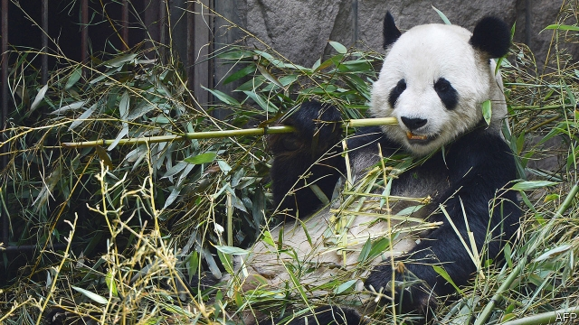

###### Panda evolution

# The giant panda’s unusual diet may be the result of human pressure 

##### Civilisation’s rise drove it into China’s bamboo forests 

 

> Jan 31st 2019 

 

THE GIANT PANDA is beloved of conservationists. It is the mascot of the WWF (World Wide Fund for Nature, formerly the World Wildlife Fund) and, with its striking black-and-white pelage, is one of the most recognisable large animals in the world. It is also evolutionarily weird. It is a type of bear, and therefore a member of the order of mammals known, after their usual dietary habits, as the Carnivora. But it is an obligate herbivore. 

And it is rare. Optimistic estimates put the global panda population at between 2,000 and 3,000 individuals—with all those not living in zoos occupying a few fragments of bamboo forest in central China. Pessimists reckon those numbers are on the high side. It is ironic, then, that this icon of the natural world might actually be an accidental consequence of human activity. Yet this is a plausible interpretation of results just published in a paper in Current Biology, by Wei Fuwen of the Institute of Zoology, in Beijing. 

Pandas are not merely herbivores, they are monovores—eating bamboo to the exclusion of almost anything else. Dr Wei wondered when this transition to monovory happened. The answer was, far more recently than anyone had expected. 

Past estimates of changes in pandas’ diets have depended on studies of their skulls and genes. The jaws of 4m-year-old fossils suggest that the ancestors of modern pandas were already by then eating a lot of tough vegetable matter. Analysis of a gene called Tas1r1, responsible for the taste sensation called “umami”, which detects glutamic acid, a common component of meat, tells a similar story. It indicates that selective pressures in favour of this gene started to relax about 4.2m years ago. By around 2m years ago, conventional theory has it, pandas had completed the transition to an all-bamboo diet. Dr Wei has, however, brought a third line of evidence to bear. This is the isotopic composition of the animals’ bones and teeth. 

Hydrogen apart, the most common elements in food are carbon, oxygen and nitrogen. Each of these has several isotopes (atoms of the same element whose nuclei have different numbers of neutrons within, and therefore different atomic weights). The two principal isotopes of carbon, 12C and 13C, and of nitrogen, 14N and 15N, have different ratios in different plant species—and these ratios tend to be preserved in the tissues of animals that eat those plants. The isotopes of oxygen,16O and 18O, vary in ratio according to the local climate. 

Dr Wei studied carbon and nitrogen isotopes in the bones of a dozen ancestral pandas, dating from between 11,000 and 5,000 years ago, and compared them with those of modern pandas. The ancient animals had a wider range of 15N/14N and 13C/12C ratios in their bones than did the modern ones. That suggests they had broader diets. Oxygen isotopes collected from fossil teeth told a similar story. The ancient pandas had more variable 18O/16O values, suggesting that they lived in more varied environments than do their modern kin. 

Whether the fossil pandas in Dr Wei’s study were still eating any meat remains unclear. What is clear, however, is that they were not yet the obligate bamboo feeders which they are today, and that they were making forest fringes, subtropical zones and open land their home, rather than dwelling solely in bamboo forests. The question is, what made them change? 

Dr Wei does not speculate. But there is one obvious possible culprit: the spread of Homo sapiens. Early Chinese history is shrouded in myth, but organised states clearly existed by about 5,000 years ago. Growing human populations could easily have displaced the ancestors of modern pandas to fringe areas where there was little to eat but bamboo. And if bamboo is all there is to eat, then those that prefer to eat it will be at an evolutionary advantage. The modern, bamboo-eating panda—symbol of animals under pressure from man—may thus have been made the way it is by precisely such human pressures. 

-- 

 单词注释:

1.Jan[dʒæn]:n. 一月 

2.conservationist[,kәnsә'veiʃәnist]:n. 自然资源保护论者 

3.mascot['mæskәt]:n. 福神, 吉祥的东西 

4.wwf[]:abbr. 世界野生动物基金（World Wildlife Fund）；世界摔跤联合会（World Wrestling Federation）；雨天流量（Wet-Weather Flow） 

5.formerly['fɒ:mәli]:adv. 从前, 以前 

6.pelage['pelidʒ]:n. 毛皮 [医] 毛发 

7.recognisable[]:a. 可辨认的；可认识的；可承认的（=recognizable） 

8.evolutionarily[,i:və,lu:ʃən'ærili]:adv. 演化地, 演进地(evolutionary的变形) 

9.weird[wiәd]:a. 怪异的, 超自然的, 不可思议的 n. 命运, 预言, 符咒 

10.mammal[mæmәl]:n. 哺乳动物 [化] 哺乳动物 

11.dietary['daiәtәri]:a. 饮食的 n. 规定食物 

12.Carnivora[kɑ:'nivәrә]:[pl. ][拉]食肉类 

13.obligate['ɒbligeit]:vt. 使负义务, 强使, 使感激, 施恩惠于 a. 有责任的, 必须的 

14.herbivore['hә:bivɒ:]:n. 草食动物 

15.pessimist['pesimist]:n. 悲观者, 厌世者, 悲观主义者 

16.reckon['rekәn]:vt. 计算, 总计, 估计, 认为, 猜想 vi. 数, 计算, 估计, 依赖, 料想 

17.ironic[aiә'rɔnik]:a. 冷嘲的, 挖苦的, 反话的, 讽刺的, 令人啼笑皆非的, 出乎意料的 

18.icon['aikɒn]:n. 画像, 肖像, 偶像, 图标, 像标 [计] 像标, 图标 

19.plausible['plɒ:zibl]:a. 貌似真实的, 貌似合理的, 说得煞有其事的 [法] 花言巧语的, 似乎有理的 

20.wei[]:n. 魏（姓氏）；魏（朝代）；渭河 

21.zoology[zәu'ɒlәdʒi]:n. 动物学, 动物区系 [医] 动物学 

22.Beijing[beidʒiŋ]:[经] 北京 

23.exclusion[ik'sklu:ʒәn]:n. 排除, 除外, 逐出 [医] 排除, 除外, 分离术 

24.transition[træn'ziʃәn]:n. 转变, 转换, 变迁, 过渡时期, 临时转调 [化] 跃迁 

25.skull[skʌl]:n. 头盖骨, 头脑, 好学生 [医] 头颅 

26.fossil['fɒsәl]:n. 化石, 古物 a. 化石的, 陈腐的, 守旧的 

27.sensation[sen'seiʃәn]:n. 感觉, 轰动 [医] 感觉 

28.umami[]:n. 鲜味；甘味 n. (Umami)人名；(日)马见(姓) 

29.glutamic[]:a. 谷氨酸的 

30.selective[si'lektiv]:a. 选择的, 选择性的 [经] 选择的, 选择性的 

31.isotopic[,aisәu'tɔpik]:a. 同位素的 [医] 同位的 

32.isotope['aisәutәup]:n. 同位素 [化] 同位素 

33.neutron['nju:trɒn]:n. 中子 [化] 中子 

34.ancestral[æn'sestrәl]:a. 祖先的, 祖传的 [法] 祖先的, 祖传的 

35.kin[kin]:n. 亲戚, 同族, 血缘关系, 家族 a. 有亲属关系的, 性质类似的, 同类的 

36.unclear[.ʌn'kliә]:a. 不易了解的, 不清楚的, 含混的 

37.feeder['fi:dә]:n. 饲养者, 供给者, 奶瓶 [化] 给料器 

38.fringe[frindʒ]:n. 边缘, 端, 流苏, 穗, 初步 vt. 加穗于, 加饰边于 a. 边缘的, 附加的 

39.subtropical[sʌb'trɒpikl]:a. 亚热带的 [医] 亚热带的 

40.speculate['spekjuleit]:vi. 深思, 推测, 投机 [经] 投机 

41.HOMO['hәumәu]:[化] 最高占据轨道; 最高占据分子轨道; 最高已占分子轨道 [医] 人属 

42.sapien[]:n. 智慧 

43.shroud[ʃraud]:n. 尸衣, 寿衣, 覆盖物, (船的)横桅索 vt. 包以尸衣, 遮蔽, 隐藏, 覆盖 

44.myth[miθ]:n. 神话, 虚构的事, 虚构的人 

45.displace[dis'pleis]:vt. 移置, 替换, 转移 

46.evolutionary[,i:vә'lu:ʃәnәri]:a. 展开的, 进化论的, 进化的, 发展的 [计] 进化的, 改良的, 发展的 

47.precisely[pri'saisli]:adv. 精确地, 明确地, 刻板地, 拘泥地, 正好, 恰恰, 对, 正是如此, 确实如此, 不错 

