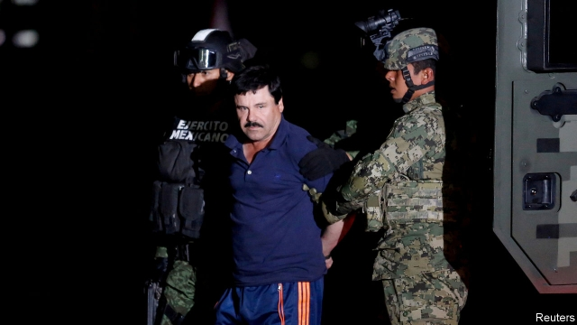

###### El Chapo’s final chapter

# A Mexican drug lord goes on trial 

##### A court case offers vivid insight into Latin America’s drug trade 

 

> Jan 31st 2019 

 

FOR TEN weeks the trial in New York of Joaquín Guzmán Loera, a Mexican drug lord known as “El Chapo”, has revealed sordid tales of graft, girls and gore. If the jury believes them, the former head of the Sinaloa drug gang and the protagonist in a war that has killed 100,000 Mexicans faces a life sentence in an American jail. 

Unless, of course, Mr Guzmán breaks out of prison for a third time. His second escape in 2015, from Mexico’s most secure jail, brought him global fame and prompted his extradition to America. A former minion explained to jurors how he did it. A GPS-equipped watch, smuggled in to Mr Guzmán, allowed accomplices a mile away to tunnel precisely to his cell. 

Other witnesses described his opulent, paranoid lifestyle. Over the years Mr Guzmán allegedly reaped $14bn. He moved between hideouts every 20 days and between his wife and mistresses more rapidly still. Panthers and crocodiles prowled his private zoo. He spied on so many phones that a flunkey had to write him summaries. And then there were the murders that Mr Guzmán ordered or committed. “I said to him, ‘Why kill people?’,” a former friend told the court. “He answered: ‘Either your mum’s going to cry or his mum’s going to cry.’” 

Insights into the drug trade abounded. When a police chief on Mr Guzmán’s payroll told him American radars were tracking his cocaine-filled planes, he began using boats. Foes were bribed, allegedly including Genaro García Luna, secretary of security for President Felipe Calderón, whose drug war in 2006-2012 disproportionately arrested the Sinaloa gang’s rivals. The most explosive tale came from a henchman who said he paid $100m to Enrique Peña Nieto, Mr Calderón’s successor, in exchange for leaving Mr Guzmán be. Mr Peña and Mr Garcia deny the allegations. 

Mr Guzmán did not testify. The place he most wants to have his story told is not inside a courtroom. In 2007 he tried unsuccessfully to have a Hollywood film made about his life. A meeting with Sean Penn, an actor, which he hoped would yield a deal, led to his final capture in 2016. On January 28th, as the prosecution rested its case, an unlikely guest joined the audience in court. Alejandro Edda plays Mr Guzmán in “Narcos: Mexico”, a Netflix series released in November. When the on-screen El Chapo arrived, the real El Chapo’s face lit up with glee. 

-- 

 单词注释:

1.el[el]:abbr. 预期损失（Expected Loss） 

2.Jan[dʒæn]:n. 一月 

3.york[jɔ:k]:n. 约克郡；约克王朝 

4.loera[]:[网络] 洛拉 

5.chapo[]:[网络] 小女孩 

6.sordid['sɒ:did]:a. 肮脏的, 贪婪的, 卑鄙的, 恶劣的, 暗淡的 [医] 污色的 

7.graft[grɑ:ft]:n. 嫁接, 贪污 v. 嫁接, 移植, 贪污 

8.gore[gɒ:]:n. 流出的血, 淤血, 三角形布 vt. 把...剪成楔形三角布, 缝以补裆, 刺伤, 抵 

9.Sinaloa[]:锡那罗亚州（墨西哥地名） 

10.protagonist[prәu'tægәnist]:n. 主人公, 主角, 领导者 

11.extradition[.ekstrә'diʃәn]:n. 引渡逃犯, 亡命者送还本国 [法] 引渡 

12.minion['minjәn]:n. 奴才, 宠臣 

13.juror['dʒuәrә]:n. 陪审员, 审查委员 [法] 陪审员, 陪审官, 宣誓者 

14.smuggle['smʌgl]:vt. 偷运, 走私, 私运 vi. 走私 

15.accomplice[ә'kʌmplis]:n. 共犯, 同谋 [医] 协同菌 

16.precisely[pri'saisli]:adv. 精确地, 明确地, 刻板地, 拘泥地, 正好, 恰恰, 对, 正是如此, 确实如此, 不错 

17.opulent['ɒpjulәnt]:a. 富裕的, 豪华的, 奢侈的, 丰富的, 大量的 

18.paranoid['pærәnɔid]:a. (似)患妄想狂的, (似)患偏执狂的 n. 患妄想狂的人 

19.lifestyle['laifstail]:n. 生活方式 

20.allegedly[ә'ledʒidli]:adv. 依其申述 

21.hideout['haidaut]:n. 隐匿处 

22.panther['pænθә]:n. 豹, 黑豹, 美洲豹 

23.crocodile['krɒkәdail]:n. 鳄鱼 

24.prowl[praul]:n. 潜行, 徘徊, 悄悄踱步 vi. 潜行以觅食, 徘徊 vt. 徘徊 

25.flunkey['flʌŋki]:n. 仆从, 走狗, 奴才, 奉承者, 势利小人 

26.abound[ә'baund]:vi. 大量存在, 富于, 充满 

27.payroll['peirәul]:n. 工资名单, 饷金名单, 发放的工资总额 [计] 工资表, 工资单 

28.foe[fou]:n. 仇敌, 反对者, 敌人, 对手 

29.bribe[braib]:n. 贿赂 vt. 贿赂, 收买 vi. 行贿 

30.genaro[]:n. 【男名】男子名 [网络] 那罗；格纳罗；赫纳罗 

31.luna['lu:nә]:n. 卢娜(月神), 月 

32.Felipe[]:n. (Felipe)人名；(西、葡、罗)费莉佩(女名), 费利佩 

33.Calderón[]:[地名] 卡尔德龙 ( 多米共 ) 

34.disproportionately[]:adv. 不匀称, 不相称 

35.henchman['hentʃmәn]:n. 忠实追随者, 党羽, 跟踪者 [法] 亲信, 心腹, 顺从者 

36.Enrique[enrik]:n. 恩里克（男子名） 

37.nieto[]:[网络] 尼亚图；托；外孙子 

38.successor[sәk'sesә]:n. 继承者, 接任者 [计] 后继 

39.garcia['^ɑ:ʃjә]:n. 加西亚（姓氏） 

40.allegation[.æli'geiʃәn]:n. 断言, 主张, 申辩 [法] 声明, 事实陈述, 断言 

41.testify['testifai]:v. 证明, 作证, 声明, 表明 

42.courtroom['kɒ:trum]:n. 法庭, 审判室 [法] 法庭, 审判室 

43.unsuccessfully[]:adv. 无用；失败地 

44.Hollywood['hɔliwud]:n. 好莱坞, 美国电影界, 美国电影工业, 美国式电影 

45.sean[ʃɔ:n]:n. 肖恩（男子名） 

46.penn[pen]:abbr. 宾夕法尼亚大学（Pennsylvania） 

47.prosecution[.prɒsi'kju:ʃәn]:n. 执行, 经营, 起诉 

48.Alejandro[]:n. 亚历杭德罗（男子名） 

49.Edda['edә]:n. (古冰岛两文学集之一)：1230年问世的古冰岛散文集(或)1200年问世的古冰岛诗集 

50.netflix[]:n. 全球十大视频网站中唯一收费站点 

51.sery[]:n. (Sery)人名；(俄)谢雷；(科特)塞里 

52.glee[gli:]:n. 欢乐, 高兴 

