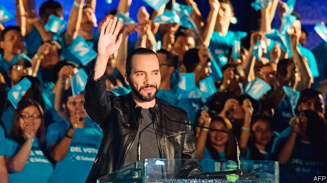

###### In search of a saviour

# A charismatic populist aims for El Salvador’s presidency 

##### Will the forthcoming election bring change to a troubled country? 

 

> Jan 31st 2019 

 

THE PLAZAS in San Salvador’s historical centre were once decrepit and dangerous. Now renovated, they bustle. In Barrios Square children splash in colourful fountains. Crowds throng the surrounding pedestrianised streets, socialising long after sundown. This small part of El Salvador’s capital offers an enticing glimpse of what the country could become. 

The credit for this transformation belongs to San Salvador’s recently departed mayor. “Nayib Bukele created all these spaces,” says Bryan López of Aliens Force Krew, Central America’s breakdancing champions, who are wowing onlookers with a display of handstands and backflips. Now Mr Bukele is plotting a bigger renovation. Polls tip him to win the first round of a presidential election on February 3rd. 

The rise of Mr Bukele has been unorthodox. Rallies and interviews are rare but tweets are plentiful from the 37-year-old former businessman, in a campaign relying heavily on social media. He has more Facebook followers than the president of Colombia, a country with seven times the population of El Salvador, but he has avoided presidential debates and the scrutiny they bring. Mr Bukele worked without a salary as mayor, but received around $1m from family businesses in circumstances that prompted the courts to seek an investigation. If victorious, he would become the first president in El Salvador’s young democracy not to belong to one of two main political parties. 

His electoral pledges are not limited to nicer squares, though he vows to refurbish historical centres in 50 towns across the country. He has promised new ideas to “dismantle the neoliberal model” and lift the poor. Salvadoran institutions are slightly less rickety than those in Guatemala, where the president is attempting to destroy a UN-backed anti-corruption body, or in Nicaragua, where thugs have killed hundreds of people protesting against Daniel Ortega, its despotic president. But many fear that a populist like Mr Bukele may neglect rather than strengthen them.  

Salvadorans are keen for a change. Jobs that pay a good wage are elusive. The murder rate fell by half between 2015 and 2018, but El Salvador remains Latin America’s most violent country after Venezuela. For the poorest, the only paths to comfort are crime or departure. By one estimate, around 1.5% of Salvadorans leave the country each year. 

The dominant political parties have not solved much. The FMLN and ARENA, which were born out of two sides in a disastrous civil war that ended in 1992, offer remarkably similar policies. Mr Bukele’s critics insist that he, too, would bring only superficial change to the county. He “represents the worst of the same”, says Carlos Calleja, his nearest opponent, representing the right-leaning ARENA. 

In a break from the past, however, this is the first election in El Salvador where voters’ anger at corruption has taken centre-stage. Past presidents have used budgetary tricks to divert nearly $1bn in funds to their office. The last three to leave office were investigated for misusing much of it to enrich themselves and their friends. The current president, Salvador Sánchez Cerén, has also directed $147m to his office this way. No one knows how it was spent. Both Mr Bukele and Mr Calleja pledge to do away with such tricks. 

Mr Bukele says he wants a Salvadoran version of the graft-busting commission under attack in Guatemala. But GANA, the party he is using as a vehicle for his candidacy, is notoriously corrupt. It controls only an eighth of the seats in congress, at least until elections in 2021, which might hinder Mr Bukele’s policy ambitions. Fuzzy funding promises might, too. Tax exemptions for 100,000 of the poorest families will be paid for by “the relentless fight against corruption”. Some 20,000 scholarships at foreign universities for young people will materialise after El Salvador seeks “strategic alliances” around the world. His pricey plazas plunged San Salvador into onerous debt. 

Mr Calleja presents himself as “the true outsider” in the race. He hopes to keep Mr Bukele’s vote share below 50% and force a run-off vote in March. Unlike Mr Bukele, he has no political experience. He cites his work with the Clinton Foundation, teaching farmers to grow better crops, as proof that he can find technocratic solutions to his country’s problems. He vows to bring more foreign investment to El Salvador, which gets less than Nicaragua despite an economy twice its neighbour’s size. 

Mr Calleja’s chances look slim. His party’s time in government is not recalled fondly. Salvadorans are desperate to entrust the task of remaking their country to somebody new. It is the slick Mr Bukele who seems to offer them the blankest canvas on which to project their dreams. 

-- 

 单词注释:

1.saviour['seivjә]:n. 救助者, 救世主, 救星 

2.charismatic[,kæriz'mætik]:a. 魅力, 能吸引大众的非凡能力, 神授的能力, 领袖人物感人的超凡魅力 

3.Populist['pɔpjulist]:n. 民粹派的成员 

4.el[el]:abbr. 预期损失（Expected Loss） 

5.presidency['prezidәnsi]:n. 总统职权, 总裁职位 

6.forthcoming['fɒ:θ'kʌmɑŋ]:a. 即将来临的 n. 来临 

7.Jan[dʒæn]:n. 一月 

8.plaza['plɑ:zә]:n. 广场, 市场, 购物区 

9.san[sɑ:n]:abbr. 存储区域网（Storage Area Networking） 

10.decrepit[di'krepit]:a. 衰老的 

11.renovate['renәuveit]:vt. 更新, 革新, 刷新, 修复, 使恢复活力 

12.bustle['bʌsl]:n. 喧闹, 裙撑 vi. 奔忙, 喧闹 vt. 使忙碌, 催促 

13.barrio['bɑ:riәu]:n. <西> 地方行政区域 

14.colourful['kʌlәful]:a. 颜色丰富的, 鲜艳的, 艳丽的, 多色的, 丰富多彩的, 吸引人的, 引人入胜的 [计] 有色的 

15.pedestrianise[pi'destriәnaiz, pә-]:vt.<主英> = pedestrianize 

16.socialise['sәjʃәlaiz]:vt. 使社会化, 使社会主义化, 使适合社会需要 vi. (美)(非正式)参加社交活动, 发生社交往来 

17.sundown['sʌndaun]:n. 日落, 阔边女帽 

18.entice[in'tais]:vt. 诱骗, 引诱, 怂恿 

19.bryan['braiәn]:n. 布赖恩（男子名） 

20.López[]:[地名] 洛佩斯 ( 阿根、厄 ) 

21.alien['eiljәn]:n. 外国人, 外侨 a. 外国的, 相异的 

22.breakdancing['breɪk.dɑːnsɪŋ]:na. 霹雳舞 n. 霹雳舞（掺入杂技动作，常在街头表演） [网络] 跳着霹雳舞 

23.wow[wau]:interj. (非正式)哇 n. 巨大的成功, 轰动一时的成功, 十分有趣的事物 [计] WIn32上的Windows 

24.onlooker['ɔnljkә(r)]:n. 旁观者, 袖手旁观者 

25.handstand['hændstænd]:n. 手倒立 

26.backflip['bæk,flip]:n. 后翻式；后滚翻；倒翻筋斗 vi. 后空翻；表演后空翻 

27.renovation[.renәu'veiʃәn]:n. 革新, 刷新, 修理 [化] 改建 

28.presidential[.prezi'denʃәl]:a. 总统制的, 总统的, 首长的, 统辖的 [法] 总统的, 议长的, 总经理的 

29.unorthodox[.ʌn'ɒ:θәdɒks]:a. 非正统的, 异教的 

30.rally['ræli]:n. 重振旗鼓, 集合, 群众集会, 跌停回升 v. 重整旗鼓, 集合, 恢复精神, 团结, 挖苦, 嘲笑 

31.tweet[twi:t]:vi. 啁啾 n. 小鸟叫声 

32.facebook[]:n. 脸谱网 

33.follower['fɒlәuә]:n. 从者, 属下, 追补者 [电] 随动机 

34.Colombia[kә'læmbiә]:n. 哥伦比亚 

35.Salvador['sælvәdɔ:]:[经] 萨尔瓦多 

36.scrutiny['skru:tini]:n. 细看, 仔细检查, 监视, 选票检查 [经] 复查, 评核, 仔细检查 

37.electoral[i'lektәrәl]:a. 选举人的, 选举的, (有关)选举的 [法] 选举的, 选举人的, 由选举人组成的 

38.pledge[pledʒ]:n. 诺言, 保证, 誓言, 抵押, 信物, 保人, 祝愿 vt. 许诺, 保证, 使发誓, 抵押, 典当, 举杯祝...健康 

39.vow[vau]:n. 誓约, 誓言, 许愿 vi. 起誓, 发誓, 郑重宣言 vt. 立誓, 起誓要, 郑重地宣布 

40.refurbish[.ri:'fә:biʃ]:vt. 再磨光, 刷新 

41.dismantle[dis'mæntl]:vt. 拆除...的设备, 分解, 去除覆盖物 

42.neoliberal[ˌni:əʊ'lɪbərəl]:n. 新自由主义者 

43.Salvadoran[,sælvə'dɔ:rən]:n. 萨尔瓦多人 a. 萨尔瓦多的；萨尔瓦多人的 

44.les[lei]:abbr. 发射脱离系统（Launch Escape System） 

45.rickety['rikәti]:a. 患佝偻病的, 虚弱的, 摇摆的 [医] 佝偻病的 

46.Guatemala[.gwɑ:tә'mɑ:lә]:n. 危地马拉 

47.Nicaragua[,nikә'rɑ:^wә, ,nikә'ræ^juә]:[经] 尼加拉瓜 

48.thug[θʌg]:n. 恶棍, 刺客, 凶手 [法] 凶手, 刺客, 暴徒 

49.daniel['dænjәl]:n. 丹尼尔（男子名） 

50.Ortega[]:奥尔特加（人名） 奥尔特加（地名, 阿根廷、哥伦比亚） 

51.despotic[de'spɒtik]:a. 专制的, 专横的, 暴虐的 [法] 专制的, 专横的 

52.Salvadoran[,sælvə'dɔ:rən]:n. 萨尔瓦多人 a. 萨尔瓦多的；萨尔瓦多人的 

53.elusive[i'lu:siv]:a. 难懂的, 易忘的, 难以捉摸的 

54.Venezuela[,vene'zweilә]:n. 委内瑞拉 

55.dominant['dɒminәnt]:a. 占优势的, 支配的 [医] 优性的, 显性的 

56.fmln[]:[网络] 马蒂民族解放阵线；马蒂党；萨尔瓦多民族解放阵线 

57.arena[ә'ri:nә]:n. 角斗场, 舞台, 场地 [医] 尿沉渣, 尿沙; 脑沙 

58.disastrous[di'zɑ:strәs]:a. 损失惨重的, 悲伤的 

59.remarkably[ri'mɑ:kәbli]:adv. 显著地, 引人注目地, 非常地 

60.carlo[]:n. 卡洛（男子名） 

61.calleja[]:[网络] 卡列哈；哈维尔·卡列哈；加列哈 

62.corruption[kә'rʌpʃәn]:n. 腐败, 堕落, 贪污 [计] 论误 

63.budgetary['bʌdʒitәri]:a. 预算的 [法] 预算的 

64.divert[dai'vә:t]:vt. 转移, 使欢娱 vi. 转移 

65.misuse[.mis'ju:z]:n. 误用, 滥用 vt. 误用, 滥用, 虐待 

66.enrich[in'ritʃ]:vt. 使富足, 使肥沃 

67.Gana['^ɑ:nә]:[史]加纳王国(公元4至13世纪时的西非古国) 

68.candidacy['kændidәsi]:n. 候选人的地位, 候选资格 [法] 候选人的身份, 资格 

69.notoriously[]:adv. 臭名昭著的, 声名狼藉的 

70.hinder['hindә]:a. 后面的 v. 阻碍, 打扰 

71.fuzzy['fʌzi]:a. 有微毛的, 模糊的 [电] 微毛 

72.exemption[ig'zempʃәn]:n. 解除, 免除, 免税 [化] 免检 

73.relentless[ri'lentlis]:a. 无情的, 冷酷的, 残酷的 

74.materialise[mә'tiәriәlaiz]:vi.vt. (使)物质化, (使)具体化, (使)追求物质利益, (使)显形, 成为事实, 实现 vi. 突然出现 

75.alliance[ә'laiәns]:n. 联盟, 联合 [法] 同盟, 联盟, 联姻 

76.pricey['praisi]:a. 昂贵的, 价格高的 

77.onerous['ɒnәrәs]:a. 繁重的, 负有法律责任的 [法] 负有义务的, 艰巨的, 繁重的 

78.outsider[' aut'saidә]:n. 外人, 局外人, 非会员, 外行, 门外汉, 比赛中获胜可能性不大的选手 [经] 外船公司 

79.cite[sait]:vt. 引用, 引证, 表彰 [建] 引证, 指引 

80.clinton['klintәn]:n. 克林顿（男子名） 

81.technocratic[ˌteknə'krætɪk]:a. 由技术专家官员组成的；受技术官僚影响的 

82.fondly['fɒndli]:adv. 溺爱地, 怜爱地, 情柔地 

83.entrust[in'trʌst]:vt. 信托, 交托, 委托 [经] 委托 

84.remake[ri'meik]:vt. 再作, 再制, 重作 n. 再制, 改作, 重制物 

85.slick[slik]:a. 光滑的, 熟练的, 聪明的, 华而不实的, 老套的, 陈腐的 adv. 灵活地, 聪明地 vt. 使光滑, 使漂亮 vi. 打扮整洁 n. 光滑平面, 平滑器, 修光工具 

