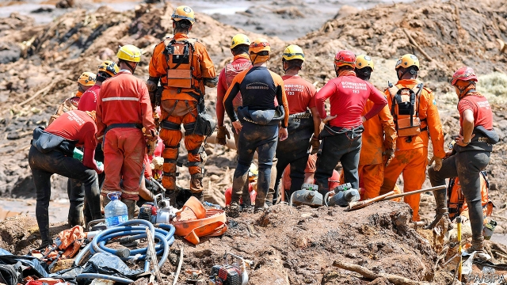

###### Fatal rupture

# Brazil’s worst ever dam disaster follows years of regulatory capture 

##### The government’s special treatment of mining comes at a cost 

 

> Jan 31st 2019 

 

WHEN HE SAW the river of sludge roaring down the valley, José Ferreira da Silva did not fear for his son, a welder. He was working for Vale, a Brazilian mining giant, near a tailings dam at its iron-ore mine at Brumadinho. “The company always said it was safe, and we believed them,” he says. The dam’s collapse on January 25th, unleashing 12m cubic metres of mining waste, is Brazil’s worst industrial accident. As the sludge hardened and the death toll rose—the final tally may surpass 350 people—Mr Ferreira’s hopes for his missing son faded, but not his anger. 

Brazil is going through a grim reckoning. Miners and the government have long enjoyed cosy ties but many wonder: at what cost? Mining accounts for around 5% of GDP, according to Vale. It also employs hundreds of thousands of people and is backed by powerful politicians. That includes the new president, Jair Bolsonaro, who campaigned on promises to open up more of the Amazon forest for prospecting. The latest tragedy comes only three years after a similar collapse of a dam jointly owned by Vale at Mariana, 100 miles (160km) away, where 19 people died. 

Tailings dams are cheap and risky. The upstream sort have been banned in Chile and are rare in America and Europe. Their widespread use in Brazil is one way the government helps mining firms to put profit over protection, says Carlos Martinez at the Federal University of Itajubá. Miners are favoured because they often shoulder the responsibilities of governments in remote places, building schools and hospitals, for example. In Minas Gerais (literally, “General Mines”), the state where Brumadinho is located, Vale often dominates local economies. Once state-owned, but privatised in 1997, it is the biggest employer of Brumadinho’s 40,000 residents, and pays 60% of the town’s taxes. 

Regulatory capture is one result, says Bruno Milanez at the Federal University of Juiz da Fora. Understaffed and underfunded, the National Mining Agency visited only a quarter of Brazil’s 790 tailings dams in 2017, leaving mining firms to hire contractors to carry out safety inspections. 

Mr Bolsonaro’s government now promises a crackdown. Courts have frozen 10bn reais ($2.7bn) of Vale’s assets to pay for damages. The firm’s shares have plunged (see article). Police arrested three employees and two contractors responsible for recent safety studies. The cabinet met to discuss the fate of the remaining high-risk dams. Yet the public outcry after the Mariana disaster led to similar lawsuits and promises. Several mining executives say that stricter oversight must be accompanied by cultural change in the industry to protect human life. 

“It’s not about whether or not to mine,” says Maria Dalce Ricas of the Minas Gerais Association for the Defence of the Environment. “It’s how to mine, and where.” A worker’s cafeteria should not, for instance, have been built below a tailings dam, as was the case at Brumadinho. Dozens were probably buried alive while eating lunch. The latest tragedy is compounded by the crippling of the livelihood of the town, where mining is unlikely to continue. “People worked at the mine so that they could feed their families,” said Mr Ferreira, “but mining destroyed Brumadinho.” 

-- 

 单词注释:

1.rupture['rʌptʃә]:n. 破裂, 断裂, 裂开, 决裂, 不和 v. (使)破裂 

2.regulatory['regjulәtәri]:a. 受控制的, 统制的, 调整的 [经] 规则的 

3.Jan[dʒæn]:n. 一月 

4.sludge[slʌdʒ]:n. 软泥, 泥泞 [化] 沉淀物; 泥状沉淀 

5.Ferreira[]:n. 费雷拉（人名） n. 费雷拉（地名） 

6.DA[,di:'ei]:美国地方检察官 [计] 数据采集, 数据管理员, 数据分析, 设计自动化 

7.silva['silvә]:n. 森林, 森林志 

8.welder['weldә]:n. 焊接工 [化] 焊机 

9.vale[veil]:n. 谷, 溪谷, 告别 interj. 再见 

10.Brazilian[brә'ziljәn]:n. 巴西人 a. 巴西的, 巴西人的 

11.tailing['teiliŋ]:n. 下脚, 嵌入墙中砖石突出部, 尾料 [化] 谱尾 

12.Brumadinho[]:[地名] 布鲁马迪纽 ( 巴西 ) 

13.alway['ɔ:lwei]:adv. 永远；总是（等于always） 

14.unleash[.ʌn'li:ʃ]:vt. 解开...的皮带, 发出, 发动 

15.toll[tәul]:n. 通行费, 代价, 钟声 vt. 征收, 敲钟, 鸣钟, 勾引, 引诱 vi. 征税, 鸣钟 

16.tally['tæli]:n. 符木, 记账, 得分, 比分, 计数器, 标签, 符合, 对应物 vt. 记录, 点数, 计算, 加标签于, 使符合 vi. 记帐, 符合, 吻合, 记分 [计] 计数 

17.surpass[sә'pɑ:s]:vt. 超越, 凌驾, 胜过 

18.Brazil[brә'zil]:n. 巴西 

19.grim[grim]:a. 冷酷的, 坚强的, 残忍的, 可怕的, 讨厌的 

20.reckon['rekәn]:vt. 计算, 总计, 估计, 认为, 猜想 vi. 数, 计算, 估计, 依赖, 料想 

21.GDP[]:[化] 鸟苷二磷酸 

22.jair[]:[网络] 睚珥；贾伊尔；睢珥 

23.amazon['æmәzɒn]:n. 亚马孙河 [医] 无乳腺者 

24.jointly['dʒɒintli]:adv. 共同地, 连带地 

25.Mariana[.mæri'ɑ:nә]:n. 马里亚纳群岛 

26.risky['riski]:a. 危险的 

27.upstream['ʌp'stri:m]:adv. 向上游, 逆流地 a. 向上游的, 逆流而上的 

28.Chile['tʃili]:n. 智利 [化] 番椒; 辣椒 

29.carlo[]:n. 卡洛（男子名） 

30.Martinez[]:n. 马丁内斯（男子名） 

31.mina['mainә]:n. 迈纳(古希腊单位) 

32.gerais[]:[网络] 戈亚斯州 

33.literally['litәrәli]:adv. 逐字地, 按照字面上地, 不夸张地 

34.privatise[p'rɪvətɪs]:vt. 使私有化 

35.regulatory['regjulәtәri]:a. 受控制的, 统制的, 调整的 [经] 规则的 

36.bruno['bru:nәu]:n. 布鲁诺（男子名） 

37.juiz[]:[网络] 判事官；茹伊斯；油衣使 

38.forum['fɒ:rәm]:n. 论坛, 公开讨论的广场, 法庭, 讨论会 [法] 讨论会, 专题讨论, 公共论坛 

39.understaffed[.ʌndә'stæft]:a. 人员不足的, 人手不足的 

40.underfunded[ˌʌndəˈfʌndɪd]:a. 资金不足的 

41.contractor['kɒntræktә]:n. 立契约的人, 承包商 [化] 承包者; 承包工厂 

42.crackdown['krækdaun]:n. 制裁, 镇压, 痛击 

43.reais[]:[网络] 雷亚尔；黑奥；雷阿尔 

44.asset['æset]:n. 资产, 有益的东西 

45.outcry['autkrai]:n. 尖叫, 倒彩, 强烈抗议, 喊价 vi. 喊叫 vt. 叫得比...响 

46.lawsuit['lɒ:sju:t]:n. 诉讼 [法] 诉讼, 诉讼案件 

47.oversight['әuvәsait]:n. 勘漏, 失察, 失败, 照料 [经] 监督权 

48.cultural['kʌltʃәrәl]:a. 文化的, 教养的, 修养的 [医] 培养的 

49.Maria[mә:'raiә, mә'riә]:n. 玛丽亚（女名） 

50.ricas[]:[网络] 扬卿小筑；小筑个人站；冬季新片 

51.livelihood['laivlihud]:n. 生计, 营生, 生活 

