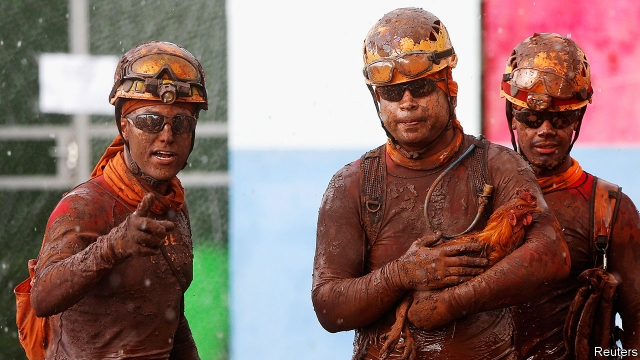
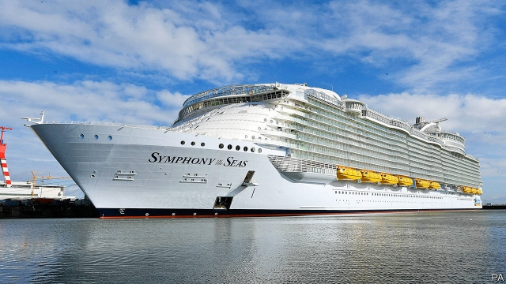

###### The anointing of Juan Guaidó

# Business this week 

 

> Jan 31st 2019 

A dam belonging to Vale, the world’s largest iron-ore producer, collapsed in Brazil, killing at least 84 people. About 276 are still missing. The company’s share price has fallen by 18% since the collapse; investors fear a torrent of compensation claims and regulatory fines. The firm said that it will decommission dams similar to the one that collapsed, a move which will reduce its annual output of iron ore by 10%. See article. 

In America, the Federal Reserve ditched its guidance to investors suggesting that further rises in interest rates lie ahead. The American central bank pledged to be “patient”, citing low inflation and recent economic turbulence as reasons not to raise rates. It also said it would slow down its policy of shrinking its balance-sheet if needed. 

America’s Justice Department accused Huawei, a Chinese technology company, of a series of misdeeds including theft of intellectual property and the obstruction of justice. Huawei is also accused of duping four banks into violating sanctions on Iran, on which basis Canadian police arrested Meng Wanzhou, its chief financial officer, in December. America formally requested her extradition this week. If the allegations against Huawei are proven, American firms could be banned from selling it their technology. See article. 

Norwegian Air said that it would try to raise NKr3bn ($350m) in a rights issue. The troubled carrier bet the house on making a success of low-cost flights across the Atlantic Ocean. But it is now paying the price for expanding too fast; last year it lost NKr3.8bn. IAG, an airline group that owns British Airways, recently pulled out of takeover talks with Norwegian and sold its stake in the airline. 

The euro zone’s economy failed to bounce back in the final three months of 2018, with growth remaining at 0.2% in both the third and fourth quarters. Italy fell into recession over the period. Meanwhile, Spain’s unemployment rate fell to 14.5% in the last quarter of 2018, its lowest rate in a decade. Although 3.3m people in the country are still looking for work, the unemployment rate has fallen steadily since its peak of nearly 27% in 2013. See article. 

Boeing, the American aerospace giant, announced that annual revenues last year exceeded $100bn for the first time, helped by strong demand for its commercial aircraft. Last year the firm received 20% more orders for its civil jets than its European rival, Airbus. 

BuzzFeed, a news website once known for “listicles”, announced another round of job losses. BuzzFeed’s founder and chief executive, Jonah Peretti, said the company would reduce its headcount by 15%, or by about 250 jobs, according to the Wall Street Journal. Verizon Media Group, which owns rival websites such as HuffPost, Yahoo, and AOL, also said it would sack 800 employees. 

Denmark is to build a 70km fence along its German border to repel stray pigs. It will be constructed to stop the spread of African swine fever. The Danes, famed for their exports of bacon and other pork products, are worried about infected wild boar bringing the untreatable disease north, which could devastate livestock and hurt the country’s farming industry. 

De Beers, the world’s largest producer of diamonds, said sales fell by a quarter at the start of this year. The mining giant is particularly being affected by slower economic growth in China, the world’s second-biggest consumer of the stones. 

A government-appointed commission in Germany agreed that the country should phase out the use of coal by 2038. The body agreed that a total of at least €40bn ($46bn) should be provided in aid for coal-mining states affected by the move, which is less than the figure of around €60bn they had asked for. It is hoped that the new target will partly offset the extra carbon emissions caused by Germany’s abandonment of nuclear power, which its government announced in 2011. 

 

Royal Caribbean, a cruise line based in America, announced that revenues in the last three months of 2018 rose by 16% and profits by 9.6%, year on year. Bookings for cruise holidays were unexpectedly healthy over the winter. Last year the company expanded by acquiring Silversea Cruises, a luxury brand, and launching into service the Symphony of the Seas, the largest passenger ship in the world by gross tonnage. 

-- 

 单词注释:

1.anoint[ә'nɒint]:vt. 涂油, 施以涂油礼 [医] 涂油膏 

2.juan[hwɑ:n]:n. 胡安（男子名） 

3.Jan[dʒæn]:n. 一月 

4.vale[veil]:n. 谷, 溪谷, 告别 interj. 再见 

5.producer[prә'dju:sә]:n. 生产者, 制作者, 制作人 [化] 发生器; (炉煤气)发生炉; 制气炉; 生产者 

6.Brazil[brә'zil]:n. 巴西 

7.investor[in'vestә]:n. 投资者 [经] 投资者 

8.compensation[.kɒmpen'seiʃәn]:n. 补偿, 赔偿金, 工资 [医] 代偿(机能), 补偿 

9.regulatory['regjulәtәri]:a. 受控制的, 统制的, 调整的 [经] 规则的 

10.decommission[.di:kә'miʃәn]:vt. 使退役 

11.pledge[pledʒ]:n. 诺言, 保证, 誓言, 抵押, 信物, 保人, 祝愿 vt. 许诺, 保证, 使发誓, 抵押, 典当, 举杯祝...健康 

12.cite[sait]:vt. 引用, 引证, 表彰 [建] 引证, 指引 

13.inflation[in'fleiʃәn]:n. 胀大, 夸张, 通货膨胀 [化] 充气吹胀; 膨胀 

14.turbulence['tә:bjulәns]:n. 混乱, 动荡, 骚乱, 紊流 [化] 湍流; 紊流 

15.huawei[]: 华为 

16.sery[]:n. (Sery)人名；(俄)谢雷；(科特)塞里 

17.misdeed['mis'di:d]:n. 罪行, 犯罪 [法] 不端行为, 犯罪, 恶性 

18.obstruction[әb'strʌʃәn]:n. 障碍, 妨碍, 闭塞物 [医] 梗阻, 不通 

19.dupe[dju:p]:n. 傻瓜, 易受骗的人 vt. 欺骗, 愚弄 

20.sanction['sæŋkʃәn]:n. 核准, 制裁, 处罚, 约束力 vt. 制定制裁规则, 认可, 核准, 同意 

21.Iran[i'rɑ:n]:n. 伊朗 

22.meng[]:abbr. 工程硕士（Master of Engineering） 

23.Wanzhou[]:万州 

24.formally['fɒ:mәli]:adv. 正式地, 形式上 

25.extradition[.ekstrә'diʃәn]:n. 引渡逃犯, 亡命者送还本国 [法] 引渡 

26.allegation[.æli'geiʃәn]:n. 断言, 主张, 申辩 [法] 声明, 事实陈述, 断言 

27.Norwegian[nɒ:'wi:dʒәn]:n. 挪威人, 挪威语 a. 挪威的, 挪威人的, 挪威语的 

28.IAG[]:abbr. International Administrative Data Processing Geodesy 国际管理数据处理组 

29.airway['єәwei]:n. 空中航线, 风道 [医] 导气管 

30.takeover[]:n. 接管, 接收 [经] 接收 

31.euro['juәrәu]:n. 欧元（欧盟的统一货币单位） 

32.recession[ri'seʃәn]:n. 后退, 凹处, 衰退, 归还 [医] 退缩 

33.boe[bəu]:abbr. back outlet eccentric 后偏心（轮）出口 

34.aerospace['єәrәuspeis]:n. 航天空间, 航天技术 

35.airbus['eәbʌs]:空中客车 

36.BuzzFeed[]:[网络] 网路 

37.listicles[]:[网络] 列表 

38.founder['faundә]:n. 创立者, 建立者 vt. 使沉没, 使摔倒, 弄跛, 浸水, 破坏 vi. 沉没, 摔到, 变跛, 倒塌, 失败 

39.jonah['dʒәunә]:n. 约拿(<<圣经>>中的先知), <<约拿书>>, 带来不幸的人 

40.peretti[]:[网络] 配饰系列；经典无爪款；白勒泰 

41.headcount[ˈhedkaʊnt]:n. 点人头数总人数, 职员总数 

42.verizon[]:n. 威瑞森（全成威瑞森无线通讯, 是美国第一家提供320万像素照相手机配套销售的无线营运商） 

43.yahoo[jә'hu:]:n. 人面兽心的人, 乡愚, 粗汉 

44.aol[]:abbr. 美国境内提供线上加值网络服务的公司（American On Line） 

45.Denmark['denmɑ:k]:n. 丹麦 

46.repel[ri'pel]:vt. 逐退, 抵制, 使厌恶, 抗御 vi. 使厌恶, 相互排斥 

47.stray[strei]:n. 走失的家畜, 浪子 a. 迷途的, 偶然的 vi. 迷路, 彷徨, 流浪 

48.swine[swain]:n. 猪, 卑鄙的家伙 

49.Dane[dein]:n. 丹麦人 

50.famed[feimd]:a. 著名的, 闻名的 

51.boar[bɒ:]:n. 公猪, 野猪 

52.untreatable[ʌnt'ri:teɪbl]: 无法医治的 

53.devastate['devәsteit]:vt. 毁坏 [法] 使荒废, 毁灭, 掠夺 

54.de[di:]:[化] 非对映体过量 [医] 铥(69号元素铥的别名,1916年Eder离得的假想元素) 

55.les[lei]:abbr. 发射脱离系统（Launch Escape System） 

56.offset['ɒ:fset]:n. 抵消, 把...并列, 旁系, 支管, 用胶印法印 vt. 弥补, 抵消, 胶印 vi. 装支管 n. 偏移量 [计] 偏移量 

57.emission[i'miʃәn]:n. 发射, 射出, 发行 [医] 发射, 遗精 

58.abandonment[ә'bændәmәnt]:n. 放弃, 抛弃, 放纵 [经] 委付, 废弃, 放弃(采矿权) 

59.Caribbean[.kæri'bi:әn]:n. 加勒比海 a. 加勒比海的, 加勒比人的 

60.cruise[kru:z]:n. 巡航, 巡弋, 漫游 v. 巡航, 巡弋, 漫游 

61.booking['bukiŋ]:n. 预约演出合同 [机] 书型模法 

62.unexpectedly[]:adv. 想不到的, 突然的, 意外的, 出乎意料的 

63.silversea[]:[网络] 银海；银海邮轮；银海游轮 

64.tonnage['tʌnidʒ]:n. 吨位 [化] 吨位 

