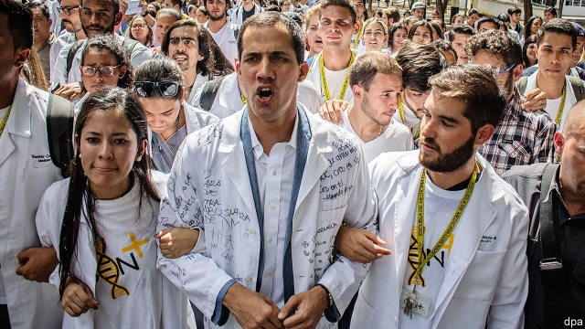
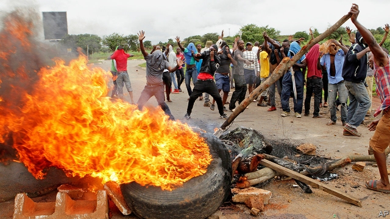

###### The anointing of Juan Guaidó

# Politics this week 

 

> Jan 31st 2019 

 

More Venezuelans took to the streets to demand that Nicolás Maduro, who rigged an election last year, step down in favour of the head of the national assembly, Juan Guaidó, as the constitution prescribes. Mr Guaidó is recognised by most Latin American democracies, as well as the United States and Canada. Several European countries said they would recognise Mr Guaidó unless elections are called soon. Mr Maduro, whose misrule has led to hyperinflation and food shortages, retains the support of Russia, Turkey and, lukewarmly, China. Mr Guaidó said he had held secret talks with the Venezuelan army to persuade it to switch sides. America said that payments for oil imports from Venezuela would be put into accounts that would be available only to a democratic government. See article. 

A court in northern China sentenced a human-rights lawyer, Wang Quanzhang, to four and a half years in prison for “subversion”. He was the last to go on trial of more than 200 lawyers and activists who were detained in 2015. Journalists, diplomats and Mr Wang’s wife were barred from the proceedings. 

Canada’s prime minister, Justin Trudeau, fired his country’s ambassador to China, John McCallum. Mr McCallum had ruffled feathers when he suggested that Meng Wanzhou, a senior executive of Huawei, a technology firm, might have strong grounds to challenge a request for her extradition from Canada to the United States to face fraud charges. 

The Supreme Court of Pakistan rejected a petition calling for a review of its earlier decision to acquit Asia Bibi, a Christian woman accused of blasphemy. Rioting zealots had previously called for her to be hanged anyway. This time protests were muted, as 3,000 zealots had been locked up. See article. 

Two bombs exploded near a cathedral in the Philippines, killing 20 people and injuring many more. Islamic State claimed responsibility for the attack, which came just after voters in the Muslim-majority region voted in favour of more political autonomy. See article. 

American officials said they were making progress in talks with the Taliban about ending the war in Afghanistan. America has offered to withdraw its forces if the Taliban promise not to harbour terrorists, stop fighting and begin talks with the Afghan government. See article. 

The government shutdown in America ended on January 26th after 35 days, making it the longest in history. President Donald Trump blinked first in his dispute with Congress, having promised to keep the government closed until he received funding to build a wall on the Mexican border. But he warned there would be another shutdown—or that he would declare a national emergency—if legislators did not fund his wall by February 15th. See article. 

Roger Stone, a former adviser to Mr Trump, was arrested in Florida. The office of Robert Mueller, the special counsel investigating links between Russia and Mr Trump’s election campaign, levelled seven charges against Mr Stone, including witness tampering and obstructing an official proceeding. See article. 

Howard Schultz, a former boss of Starbucks, said he was considering running as an independent candidate in the next presidential election. Critics warned that doing so would split the anti-Trump vote, thus helping the president to secure another term. See article. 

A polar vortex froze the American Midwest, with temperatures falling to -33ºC in Chicago. At least eight people have died because of the inclement weather. See article. 

Britain’s Parliament voted to back the Brexit deal proposed by Theresa May, the prime minister, so long as she replaces the Irish “backstop”, which seeks to avoid a hard border in Ireland, with some unspecified alternative. Michel Barnier, the EU’s lead negotiator, said he was unwilling to reconsider the previous agreement. Jeremy Corbyn, Britain’s opposition leader, met Mrs May to discuss options. See article. 

Greece voted to recognise Macedonia, its neighbour, under the new name of North Macedonia. The agreement opens the door to North Macedonia’s admission to the EU and NATO. 

 Gilets jaunes protesters in France set up not one but two new political parties. Neither sounds coherent. One vows to “remake politics around the heart and empathy”. Other gilets jaunes denounced the party-builders for selling out. See article. 

Matteo Salvini, Italy’s deputy prime minister, asked his government to bar prosecutors from pressing potential kidnapping charges against him. He is in trouble over his order to stop 177 migrants from leaving a boat. Mr Salvini had previously welcomed the trial, saying he was proud to defend his country. 

 

Zimbabwe’s police and army have been accused of mass rapes, beatings and robbery while crushing protests against costly fuel. 

Benny Gantz, a retired general, jumped in opinion polls after launching his campaign for Israel’s parliamentary elections, due in April. No one is sure what he stands for, but Mr Gantz’s new party is expected to win more than 20 seats in the 120-seat Knesset. Likud, the party of Binyamin Netanyahu, the prime minister, is expected to win 30 or so. 

More than 130 people are feared to have drowned off the coast of Djibouti after two boats carrying migrants capsized. The vessels were carrying people from Africa to the Arabian peninsula, where they were hoping to seek work. 

A judicial commission into corruption in South Africa has heard testimony from a businessman that government officials and members of the ruling African National Congress were put on monthly retainers, paid bribes and given gifts including sports cars by a firm that won government contracts. The daughter of one minister was also offered driver training because she kept crashing the cars she had been given. 

-- 

 单词注释:

1.anoint[ә'nɒint]:vt. 涂油, 施以涂油礼 [医] 涂油膏 

2.juan[hwɑ:n]:n. 胡安（男子名） 

3.politic['pɒlitik]:a. 精明的, 明智的, 策略的 

4.Jan[dʒæn]:n. 一月 

5.venezuelan[,venә'zweilәŋ]:a. 委内瑞拉的；委内瑞拉人的 

6.maduro[mә'duәrәu]:a. 色深味浓的烟草做的, (雪茄)色深味浓的 

7.rig[rig]:n. 装备, 帆装 vt. 装配, 装扮, 给船装帆, 垄断, 操纵 

8.misrule[mis'ru:l]:vt. 施暴政 n. 暴政 

9.hyperinflation[,haipәrin'fleiʃәn]:n. 恶性通货膨胀 

10.lukewarmly[]:adv. lukewarm的变形 

11.venezuelan[,venә'zweilәŋ]:a. 委内瑞拉的；委内瑞拉人的 

12.Venezuela[,vene'zweilә]:n. 委内瑞拉 

13.wang[]:n. 王（姓氏）；王安电脑公司 

14.subversion[sәb'vә:ʃәn]:n. 颠覆, 打倒, 破坏 [法] 颠覆, 死亡, 败坏 

15.activist['æktivist]:n. 激进主义分子 

16.detain[di'tein]:vt. 扣留, 扣押, 耽搁 [法] 拘留, 扣押, 留住 

17.diplomat['diplәmæt]:n. 外交官, 有外交手腕的人 [法] 外交家, 外交官, 有权谋的人 

18.proceeding[prәu'si:diŋ]:n. 进行, 程序, 行动, 诉讼程序, 事项 [化] 会议论文集 

19.justin['dʒʌstin]:n. 贾斯廷（男子名） 

20.trudeau[]:n. (Trudeau)人名；(英、法)特鲁多 特鲁多 

21.john[dʒɔn]:n. 盥洗室, 厕所, 嫖客 

22.McCallum[]:n. (McCallum)人名；(英)麦卡勒姆 麦卡勒姆（人名） 

23.ruffle['rʌfl]:n. 皱褶, 波纹, 生气, 混乱 vt. 弄皱, 触怒, 洗(牌), 连续轻擂(鼓) vi. 起皱, 发脾气, 连续轻擂 

24.meng[]:abbr. 工程硕士（Master of Engineering） 

25.Wanzhou[]:万州 

26.huawei[]: 华为 

27.extradition[.ekstrә'diʃәn]:n. 引渡逃犯, 亡命者送还本国 [法] 引渡 

28.fraud[frɒ:d]:n. 欺骗, 欺诈, 诡计, 骗子 [经] 欺诈, 舞弊, 骗子 

29.Pakistan[.pɑ:ki'stɑ:n]:n. 巴基斯坦 

30.petition[pi'tiʃәn]:n. 请愿, 诉状, 陈情书, 申请, 祈求, 祷文 v. 正式请求, 恳求, 请愿 

31.acquit[ә'kwit]:vt. 无罪释放, 表现, 使履行 [法] 开释, 释放, 免 

32.bibi[]:n. 周笔畅 

33.blasphemy['blæsfәmi]:n. 亵渎神明, 亵渎神明的言词 [法] 冒秽罪, 侮辱, 亵秽 

34.riot['raiәt]:n. 暴动, 喧闹, 放纵 vi. 发动, 暴动, 纵情, 放荡 vt. 浪费, 挥霍 

35.zealot['zelәt]:n. 热心者, 狂热者, 犹太教狂热信徒 [法] 狂热分子, 激烈分子 

36.Philippine['filipi:n]:a. 菲律宾(群岛)的, 菲律宾人的 

37.Islamic[iz'læmik]:a. 伊斯兰教的, 穆斯林的 

38.voter['vәutә]:n. 选民, 投票人 [法] 选民, 选举人, 投票人 

39.Taliban[]:塔利班 

40.Afghanistan[æf'gænistæn]:n. 阿富汗 

41.terrorist['terәrist]:n. 恐怖分子 [法] 恐怖份子, 恐怖主义 

42.Afghan['æfgæn]:a. 阿富汗的, 阿富汗人的 n. 阿富汗人, 阿富汗语, 阿富汗毛毯 

43.shutdown['ʃʌtdaun]:n. 关门, 停工, 停机 [经] 停工 

44.donald['dɔnәld]:n. 唐纳德（男子名） 

45.trump[trʌmp]:n. 王牌, 法宝, 喇叭 vt. 打出王牌赢, 胜过 vi. 出王牌, 吹喇叭 

46.blink[bliŋk]:vi. 眨眼, 闪亮 vt. 眨眼, 使闪亮 n. 眨眼, 瞬间, 闪光, 闪烁 [计] 闪烁 

47.legislator['ledʒisleitә]:n. 立法者, 立法官, 立法委员 [法] 立法者, 立法机关成员, 立法委员 

48.roger['rɔdʒә]:interj. 对!, 行!, 好! 

49.adviser[әd'vaizә]:n. 顾问, 劝告者, 指导教师 [法] 顾问, 劝告者 

50.Florida['flɒridә]:n. 佛罗里达州 

51.Robert['rɔbәt]:[法] 警察 

52.Mueller[]:米勒（人名） 

53.counsel['kaunsәl]:n. 商议, 忠告, 法律顾问 v. 商议, 劝告 

54.tamper['tæmpә]:vi. 干预, 拨弄, 贿赂, 损害, 篡改 vt. 篡改 n. 捣棒, 打夯机, 填塞者 

55.obstruct[әb'strʌkt]:vt. 阻隔, 妨碍, 阻塞, 遮没 vi. 设障碍 

56.howard['hauәd]:n. 霍华德（男子名） 

57.Schultz[]:n. 舒尔茨（姓氏） 

58.starbuck['sta:bʌk]:n. 星巴克（咖啡公司） 

59.presidential[.prezi'denʃәl]:a. 总统制的, 总统的, 首长的, 统辖的 [法] 总统的, 议长的, 总经理的 

60.polar['pәulә]:a. 两极的, 极地的, 正好相反的, 极性的 n. 极线, 极面 

61.vortex['vɒ:teks]:n. 旋涡, 旋风, 涡流 [化] 涡旋 

62.Midwest[]:n. (美国的)中西部 [经] 中西部 

63.Chicago[ʃi'kɑ:gәu]:n. 芝加哥 

64.inclement[in'klemәnt]:a. 险恶的, 严酷的 

65.Brexit[]:[网络] 英国退出欧盟 

66.theresa[ti'ri:zә]:n. 特丽萨（女子名） 

67.backstop['bækstɒp]:n. 挡球网, 接球手 [电] 背向停止 

68.unspecified['ʌn'spesifaid]:a. 未特别指出的, 未特别提到的 

69.michel[]:n. 米歇尔（男子名） 

70.barny[]: [人名] 巴尼 

71.negotiator[ni'gәuʃieitә]:n. 磋商者, 交涉者, 议定者 [经] 谈判者, 交易者, 协商者 

72.reconsider[.ri:kәn'sidә]:v. 再考虑, 重新考虑 

73.jeremy['dʒerimi]:n. 杰里米（男子名） 

74.Corbyn[]:科尔宾（人名） 

75.opposition[.ɒpә'ziʃәn]:n. 反对, 敌对, 相反, 在野党 [医] 对生, 对向, 反抗, 反对症 

76.Mr['mistә(r)]:先生 [计] 存储器回收程序, 多重请求 

77.Macedonia[,mæsi'dәunjә]:n. 马其顿 

78.EU[]:[化] 富集铀; 浓缩铀 [医] 铕(63号元素) 

79.NATO['neitәj]:北大西洋公约组织, 北约组织 [经] 北大西洋公约组织 

80.gilet[dʒi'lei]:n. 背心, 马甲 

81.jaune[]:[网络] 汝拉 

82.protester[]:n. 抗议者, 持异议者, 拒付者 [经] 反对者 

83.coherent[kәu'hiәrәnt]:a. 互相耦合的, 清晰的, 明了的，凝聚性的, 连贯的 

84.vow[vau]:n. 誓约, 誓言, 许愿 vi. 起誓, 发誓, 郑重宣言 vt. 立誓, 起誓要, 郑重地宣布 

85.remake[ri'meik]:vt. 再作, 再制, 重作 n. 再制, 改作, 重制物 

86.empathy['empæθik]:n. 移情作用, 共鸣 [医] 移情, 神入 

87.denounce[di'nauns]:vt. 告发, 抨击, 谴责 [法] 谴责, 斥责, 告发 

88.matteo[]:马泰奥（人名） 

89.salvini[]:[网络] 索氏丽体鱼；萨尔维尼 

90.prosecutor['prɒsikju:tә]:n. 实行者, 告发者, 公诉人 [法] 原告, 起诉人, 检举人 

91.kidnap['kidnæp]:vt. 绑架, 诱拐, 拐骗 [法] 拐带, 诱拐, 绑架 

92.migrant['maigrәnt]:n. 候鸟, 移居者 [法] 移居者 

93.rape[reip]:n. 抢夺, 掠夺, 强奸, 葡萄渣, 芸苔 vt. 掠夺, 抢夺, 强奸 

94.beating['bi:tiŋ]:n. 打, 挫败, 搏动 [化] 打浆 

95.benny['beni]:n. 安非他明(药片) 

96.gantz[]: [人名] 甘茨; [电影]杀戮都市/杀戮都市 

97.parliamentary[.pɑ:lә'mentәri]:a. 国会的, 议会的, 议会制度的 

98.Knesset['kneset]:n. (以色列)议会 

99.Likud[li:'ku:d]:n. 利库德集团(以色列右翼党派的政治联盟,长期为以色列执政党) 

100.binyamin[]:本雅明 

101.Netanyahu[]:n. 内塔尼亚胡（人名） 

102.Djibouti[dʒi'bu:ti]:吉布提[非洲] 

103.capsize[kæp'saiz]:v. 翻覆, 倾覆 

104.judicial[dʒu:'diʃәl]:a. 法庭的, 公正的, 审判上的, 司法的 [法] 司法的, 审判上的, 法官的 

105.corruption[kә'rʌpʃәn]:n. 腐败, 堕落, 贪污 [计] 论误 

106.testimony['testimәni]:n. 证言, 证据, 声明 [医] 证据 

107.retainer[ri'teinә]:n. 家臣, 侍从, 保持者 [化] 保持器; 定位器; 隔栅; 隔环; 护圈; 止动器; 止动装置 

108.bribe[braib]:n. 贿赂 vt. 贿赂, 收买 vi. 行贿 

