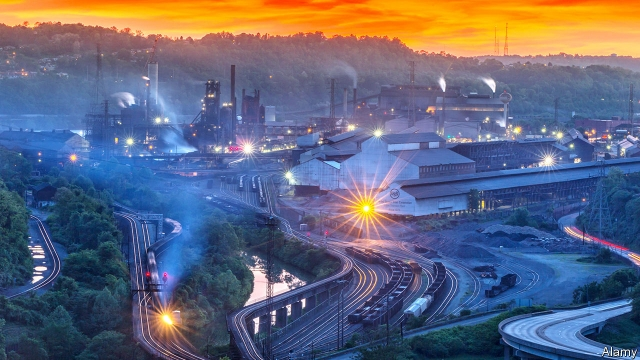

###### Pennsylvania Idol

# A rustbelt town adapts a TV format for politics 

##### Braddock needed a mayor, so it held an audition 

 

> Jan 31st 2019 

 

THE CASTING call went out last month. Braddock, a small steel town ten miles from Pittsburgh, needed a new mayor. John Fetterman, who had held the post for 13 years, had stepped down to become Pennsylvania’s lieutenant-governor. Interested candidates had five minutes each to wow the borough council in a special public session and convince them that they should be the next mayor. Only five applicants, who included a former chef and a wig-seller, auditioned on January 29th. Chardae Jones, a 29-year-old business analyst sporting pink dreads, was the unanimous winner. 

The town does not usually hold open auditions for vacant political posts. Its council has the power to appoint an interim mayor, but an attempt to do this last month derailed when questions emerged about the eligibility of the chosen candidates and the vetting process. So the council decided to open the contest to any resident of the borough who is registered to vote and has not been convicted of a felony. 

Braddock has struggled for generations. The hardscrabble town where Andrew Carnegie opened his first steel mill and first Carnegie Library is a shadow of its former self. At its height in the 1920s the population exceeded 20,000. Today it is less than 1,800. Braddock Avenue, the main commercial artery, once had bustling shops, hotels and restaurants. Today it is a parade of empty lots and closed storefronts. 

Braddock’s mayor has few powers. The borough has been under state financial oversight since 1988. The council, not the mayor, operates the budget and hires borough employees. The mayor has public-safety responsibilities, but the police department is only part-time and its budget is tight. 

The outgoing mayor, Mr Fetterman, a graduate of Harvard Kennedy School of government, did much to shine a spotlight on Braddock, including giving TED talks, appearing on “The Colbert Report”, a comedy news programme, and hustling to attract businesses and investors. When he became mayor in 2006, the town didn’t even have an ATM. He went on national television to beg Subway, a restaurant chain, to open. New restaurants eventually came (though still no Subway), but Braddock’s renaissance is still some way off. Carnegie’s mill, miraculously, is still in operation. Its chimneys dominate the skyline, but not the city’s economy. It employs only 10% of the 5,000 workers it once did, and few of them live in Braddock. 

The victor of Braddock’s talent contest, Ms Jones, intends to continue much of Mr Fetterman’s promotion, but warns that redevelopment means nothing if the community is not safe. She will have to audition again to keep her new job. She faces a primary, and then a more conventional election in November. 

-- 

 单词注释:

1.Pennsylvania[.pensil'veinjә]:n. 宾夕法尼亚 

2.idol['aidәl]:n. 偶像, 崇拜物, 宠儿, 幻象, 谬论 

3.rustbelt[]: 铁锈地带; 衰退地区 

4.politic['pɒlitik]:a. 精明的, 明智的, 策略的 

5.Braddock['brædək]:n. 布拉多克（美国宾夕法尼亚州西南部城镇） 

6.audition[ɒ:'diʃәn]:n. 听, 听力, 试听 [计] 审计命令 

7.Jan[dʒæn]:n. 一月 

8.Pittsburgh['pitsbә:g]:n. 匹兹堡 

9.john[dʒɔn]:n. 盥洗室, 厕所, 嫖客 

10.fetterman[]: [人名] 费特曼 

11.wow[wau]:interj. (非正式)哇 n. 巨大的成功, 轰动一时的成功, 十分有趣的事物 [计] WIn32上的Windows 

12.borough['bә:rәu]:n. 自治的市镇, 区 

13.jones[dʒәunz]:n. 琼斯（姓氏） 

14.analyst['ænәlist]:n. 分析者, 精神分析学家 [化] 分析员; 化验员 

15.unanimous[ju:'nænimәs]:a. 意见一致的, 无异议的 

16.interim['intәrim]:a. 暂时的, 临时的, 间歇的 n. 过渡时期 

17.derail[di'reil]:vt. 使出轨 n. 脱轨器 [计] 转移指令 

18.eligibility[.elidʒә'biliti]:n. 适任, 合格 [法] 合格, 合格性 

19.vet[vet]:n. 兽医 vi. 当兽医 vt. 诊断, 检审 

20.convict[kәn'vikt]:n. 囚犯, 罪犯 vt. 宣告有罪, 使知罪 

21.felony['felәni]:n. 重罪 [法] 重罪, 重刑罪 

22.hardscrabble['hɑ:d'skræbl]:[美]贫脊的, 非常穷困的 

23.andrew['ændru:]:n. 安德鲁（男子名） 

24.carnegie[kɑ:'ne^i]:n. 卡内基（姓氏） 

25.les[lei]:abbr. 发射脱离系统（Launch Escape System） 

26.artery['ɑ:tәri]:n. 动脉, 干道, 要道 [医] 动脉 

27.bustle['bʌsl]:n. 喧闹, 裙撑 vi. 奔忙, 喧闹 vt. 使忙碌, 催促 

28.storefront['stɒ:frʌnt]:n. 店面 

29.oversight['әuvәsait]:n. 勘漏, 失察, 失败, 照料 [经] 监督权 

30.Harvard['hɑ:vәd]:n. 哈佛大学 

31.kennedy['kenidi]:n. 肯尼迪（姓氏, 美国第35任总统） 

32.spotlight['spɒtlait]:n. 照明灯, 反光灯, 聚光灯 

33.ted[ted]:vt. 翻晒 

34.Colbert[]:n. 科尔伯特（人名） 科尔伯特（地名, 在美国） 

35.hustle['hʌsl]:n. 心碌, 挤, 推, 拥挤喧嚷 vt. 催促, 乱挤活动, 硬逼, 强夺 vi. 赶紧, 硬挤过去 

36.investor[in'vestә]:n. 投资者 [经] 投资者 

37.ATM[]:[计] 自动出纳机; 异步传输方式 

38.renaissance[ri'neisәns]:n. 复活, 复兴, 文艺复兴 a. 文艺复兴的 

39.miraculously[]:adv. 超自然, 非凡, 不可思议, 令人惊叹, 象奇迹一样, 奇迹般, 能创造奇迹 

40.skyline['skailain]:n. 天涯, 地平线, 空中轮廓线 

41.victor['viktә]:n. 胜利者 a. 胜利的 

42.promotion[prәu'mәuʃәn]:n. 晋级, 创建, 增进 [经] 推广, 推销, 促进 

43.redevelopment[]:n. 再开发；重点恢复 

