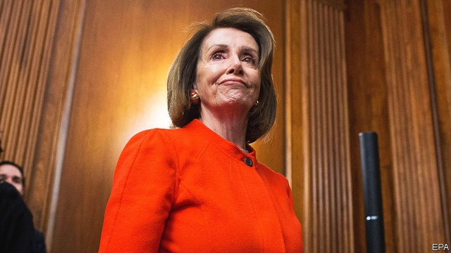

###### In search of lost time (and money)

# America’s government shutdown took a toll 

##### Some Republicans would prefer a national emergency to a repeat performance 

 

> Jan 31st 2019 

 

TERRIBLE TRAFFIC, packed Metro cars, full restaurants: Washington returned to work this week after the longest-ever government shutdown ended, at least for now. Despite vowing not to reopen government without the $5.7bn he demanded for his border wall, Donald Trump did just that, signing a spending bill that funds the government through February 15th and creates a bipartisan, bicameral commission to develop a border-security proposal. 

Ann Coulter, a far-right commentator and supporter of Mr Trump, called him “the biggest wimp ever to serve as President of the United States.” A headline on the Daily Caller, a conservative website, blared “TRUMP CAVES”. Polls showed that more Americans blamed Mr Trump for the shutdown than blamed House Democrats—perhaps because, 11 days before it began, he boasted that he would be “proud to shut down the government” if Congress failed to give him exactly what he wanted. 

When it was over, the non-partisan Congressional Budget Office (CBO) released a report on the shutdown’s economic effects. It estimated that American GDP was $3bn lower in the last quarter of 2018 and will be $8bn lower in the first quarter of 2019 than it would have been without the shutdown. That pain was not evenly distributed; federal workers and businesses that rely on them felt the effects more strongly than the economy as a whole. Though much of that activity should eventually be recovered, the CBO forecast that around $3bn—or 0.02% of projected annual GDP—has been permanently lost. 

Businesses that could not receive permits or loans because the relevant agency was closed probably delayed hiring and investment. Unpaid workers who had to take out loans will see their future spending constrained by debt servicing. A lack of published economic data increased economic uncertainty, while funding gaps probably began “to reduce the credibility of the federal government,” making it harder to attract talent and more expensive to make contracts with private business. And though the 800,000 furloughed or unpaid federal workers will receive back wages, private-sector workers that depend on government—suppliers, contractors, restaurants near government offices and the like—may not. 

Nor is America out of the woods. Mr Trump threatened to force another shutdown if the commission fails to come up with a recommendation that he likes. Bills to prevent the effects of a shutdown through “automatic continuing resolutions”—meaning that funding will continue at current levels if lawmakers fail to agree on spending levels—have been floated in both houses of Congress, by members of both parties. Mr Trump also threatened to declare a national emergency, a prospect some congressional Republicans find more appealing than another shutdown. 

-- 

 单词注释:

1.shutdown['ʃʌtdaun]:n. 关门, 停工, 停机 [经] 停工 

2.toll[tәul]:n. 通行费, 代价, 钟声 vt. 征收, 敲钟, 鸣钟, 勾引, 引诱 vi. 征税, 鸣钟 

3.Jan[dʒæn]:n. 一月 

4.metro['metrәu]:n. 地铁 

5.Washington['wɒʃiŋtn]:n. 华盛顿 

6.vow[vau]:n. 誓约, 誓言, 许愿 vi. 起誓, 发誓, 郑重宣言 vt. 立誓, 起誓要, 郑重地宣布 

7.reopen[.ri:'әupәn]:v. 重开, 再开始, 再开 

8.donald['dɔnәld]:n. 唐纳德（男子名） 

9.trump[trʌmp]:n. 王牌, 法宝, 喇叭 vt. 打出王牌赢, 胜过 vi. 出王牌, 吹喇叭 

10.bipartisan[bai,pɑ:ti'zæn]:a. 两党连立的 

11.bicameral[bai'kæmәrәl]:a. 两院制的, 有两个议院的 [医] 二室的, 两室的 

12.ann[æn]:n. 安（女子名） 

13.coulter['kәultә]:n. 犁刀 

14.commentator['kɔmenteitә]:n. 评论员, 实况广播员, 注释者, 时事评论员 

15.supporter[sә'pɒ:tә]:n. 支持者, 后盾, 迫随者, 护身织物 [法] 支持者, 赡养者, 抚养者 

16.wimp[wimp]:n. 懦弱的人；无能的人 

17.caller['kɒ:lә]:n. 访客, 召集员, 传唤员 a. 新鲜的 [计] 呼叫方标识 

18.blare[blєә]:n. 巨响, 吼叫声, 光泽 vi. 高声鸣叫, 大叫 vt. 大声喊出 

19.trump[trʌmp]:n. 王牌, 法宝, 喇叭 vt. 打出王牌赢, 胜过 vi. 出王牌, 吹喇叭 

20.congressional[kәn'greʃәnl]:a. 会议的, 议会的, 国会的 [法] 代表大会的, 大会的, 议会的 

21.cbo[]:abbr. 通道总线输出（Channel Bus Out）；首席商务官（Chief Business Officer）；银行总监 （Chief Banking Officer）；国会预算局（Congressional Budget Office） 

22.GDP[]:[化] 鸟苷二磷酸 

23.evenly['i:vәnli]:adv. 平衡地, 平坦地, 平等地 

24.unpaid[.ʌn'peid]:a. 未付款的, 不支薪水的 [经] 未付的, 未缴纳的 

25.constrain[kәn'strein]:vt. 强迫, 限制, 关押 

26.datum['deitәm]:n. 论据, 材料, 资料, 已知数 [医] 材料, 资料, 论据 

27.uncertainty[.ʌn'sә:tnti]:n. 不确定, 不可靠, 不确定的事物 [化] 不确定度 

28.credibility[.kredi'biliti]:n. 可信用, 确实性, 可靠 [法] 证据能力, 可信程度, 确实性 

29.furlough['fә:lәu]:n. 休假, 放假, 暂时解雇 vt. 准假, (暂时)解雇 

30.unpaid[.ʌn'peid]:a. 未付款的, 不支薪水的 [经] 未付的, 未缴纳的 

31.contractor['kɒntræktә]:n. 立契约的人, 承包商 [化] 承包者; 承包工厂 

32.lawmaker[lɒ:'meikә]:n. 立法者 

33.congressional[kәn'greʃәnl]:a. 会议的, 议会的, 国会的 [法] 代表大会的, 大会的, 议会的 

