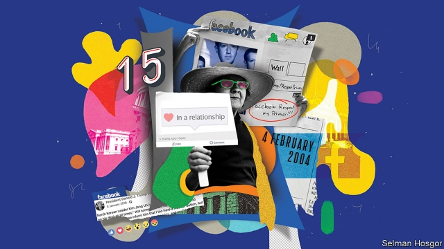

###### Remembrance of posts past

# Facebook turns 15 

##### How the social-networking giant has changed America 

 

> Feb 2nd 2019 

 

ON FEBRUARY 4th 2004 a young website with a baby-blue banner was born. Founded in a dormitory at Harvard, TheFacebook.com tapped into people’s instinctive desire to see and be seen. Few guessed how successful it would become. In 2008 Rupert Murdoch, the media mogul who had bought the social-networking rival MySpace, called Facebook the “flavour of the month”; the following year this newspaper warned in an article about Facebook that it is “awfully easy for one ‘next big thing’ to be overtaken by the next.” 

Instead Facebook has stayed on top by spreading wildly across America and the world and buying competitors, including the photo-sharing app Instagram and the messaging firm WhatsApp. Around two-thirds of American adults use its original social network. At its peak, the average user spent nearly an hour a day on Facebook’s platforms. Few companies have exerted such a strong influence on society, changing people’s communication habits, reuniting lost contacts, shaping their perception of world events and redefining the meaning of the word “friend”. “Every once in a while, changes in technology come along which are so profound, that there is a before and an after. Facebook is one of those,” says Roger McNamee, author of a forthcoming book called “Zucked”. 

Birthdays are an occasion for reflection. In the 15 years since its founding, Facebook has altered America in three notable ways. First, it has shaped what it means and feels like to be young. The company has done this twice: once with its flagship social network, which became the pastime and addiction of college students and high schoolers in the mid-2000s, and again with Instagram, which is the digital drug of choice for their successors today, along with the rival app Snapchat. 

The company has fostered a virtual “me-conomy”, where people (over)share their feelings, photos and comments. Some blame Facebook for fanning teenage narcissism and for short attention spans. Others say it has caused anxiety, depression and insecurity. Researchers have shown that people who spend more time on Facebook are more likely to think other people have it better than they do and that life is unfair. 

The lasting effects of social media, and Facebook in particular, on young people’s psyches will not be fully understood for years, but it is clear that Facebook has changed human interaction. At the safe remove of a screen, bullying on social media has become painfully common; some 59% of American teenagers say they have been bullied or harassed online. Facebook has cultivated far-flung, online friendships, but it has changed the nature of offline ones, too. According to research by Common Sense Media, a non-profit, in 2012 around half of 13- to 17-year-olds said their favourite way to communicate with friends was in person. Today only 32% feel that way, with 35% preferring texting. 

Second, Facebook has changed attitudes to privacy. The social network thrives through trust. After Facebook was launched, for the first time people felt comfortable sharing intimate details online, including their phone number, relationship status, likes and dislikes, location and more, because they felt they could control who had access to them. Users were vaguely aware that Facebook was starting to make a fortune mining this data and selling advertisers access to specific types of users, but they mostly did not object. 

Opinions about privacy may be shifting again at Facebook’s hands, this time in reverse. Public scandals about outside firms getting access to Facebook users’ data, including last year’s Cambridge Analytica fiasco, have shone a light on the firms’ massive data collection. Around half of American adult users are not comfortable with Facebook compiling such detailed information about them, according to a survey by Pew Research Centre. Concerns about privacy and lax oversight probably played into the beating that Facebook’s reputation took last year. According to the Reputation Institute, a consultancy, Facebook’s standing among Americans fell sharply in 2018, and its score ranks significantly below other technology companies, including Google. A fresh scandal over Facebook spying on users’ online activities in the name of research may further dent the company’s image. 

Third, Facebook has left a lasting mark on politics. The social-networking firm has become an invaluable tool for politicians seeking office, both through paid advertisements to reach voters and free content that spreads on the social network. “You’d be hard-pressed to find a politician who’s been elected in the last ten years who didn’t use Facebook,” says David Kirkpatrick, author of “The Facebook Effect”, a history of the social network. Two presidents, Barack Obama and Donald Trump, won election in no small part thanks to Facebook. In Mr Obama’s case, Facebook helped him fundraise and drum up support. In 2016 Facebook’s role was more controversial: false news spread wildly and Russians meddled with messages on social media, which may have helped Mr Trump gain an edge. 

The rise of fake news and spread of filter bubbles, where people see their pre-conceptions reinforced online, have probably disillusioned many voters. Facebook has had a hand in spreading misinformation, terrorism and ethnic violence around the world. But it has also spurred civil engagement. Black Lives Matter, a campaign against police violence, began with a Facebook post and quickly spread through the social network. Much of the grassroots opposition to Mr Trump, from the women’s marches to groups like Indivisible, use the platform to organise themselves. Many other campaigns and movements have attracted members through Facebook and Twitter. “They give ordinary people a voice. That’s a net positive for society,” says Mr Kirkpatrick. 

Can the social-media giant stay as influential in the next 15 years as it has already been? At the risk of being wrong about Facebook again, that seems unlikely. This is partly because its impact has already been so extensive. But it is also because of growing unease with the platform. As with all new technologies, from the printed book to the telegraph, social media can be used both for good and bad. Critics of Facebook are increasingly vocal about the harms, pointing out that Facebook is addictive, harmful for democracy and too powerful in making decisions about what content people see. “Big tobacco” is what the bosses of several top tech companies have started calling the social network, and politicians are speaking openly about regulation. 

Though it has just posted record quarterly profits, it seems unlikely that Americans are going to increase the time they spend on Facebook proper. Time on its core social network is declining, probably because users are questioning whether it is as enjoyable as it used to be. Adults in America spent 11.5% of their online time on Facebook’s main platform, a fifth less than two years earlier, according to Brian Wieser of Pivotal Research. Instagram use is rising, but not enough to make up for the core social network’s decline. As more people question whether social media are good for them, Facebook could loosen its grip on America. The relationship with Facebook continues, but the love affair is over. 

-- 

 单词注释:

1.remembrance[ri'membrәns]:n. 回想, 记忆, 纪念品, 记忆力, 问候, 致意 

2.facebook[]:n. 脸谱网 

3.feb[]:abbr. 二月（February） 

4.Harvard['hɑ:vәd]:n. 哈佛大学 

5.instinctive[in'stiŋktiv]:a. 本能的, 天生的, 直觉的 [医] 本能的 

6.Rupert['ru:pət]:n. 鲁珀特（男子名） 

7.MURDOCH['mә:dɔk]:n. 默多克(m.) 

8.mogul[mәu'^ʌl, 'mәu^ʌl]:n. 大人物, 有权势的人 

9.myspace[]:“我的空间”, 美国在线社交网站名称 

10.wildly[]:adv. 狂暴地, 激动地, 狂热地, 鲁莽地, 轻率地 

11.APP[]:[计] 应用, 应用程序; 相联并行处理器 

12.Instagram[]:一款图片分享应用 

13.WhatsApp[]:[网络] 智能手机；联络电话；每月活跃用 

14.reunit[]:[网络] 重逢；使再联合；单元类 

15.perception[pә'sepʃәn]:n. 知觉, 感觉, 领悟力, 获取 [医] 知觉 

16.redefine[.ri:di'fain]:vt. 重新定义 [计] 重新定义 

17.profound[prә'faund]:a. 极深的, 深厚的, 深刻的, 渊博的 

18.roger['rɔdʒә]:interj. 对!, 行!, 好! 

19.mcnamee[]: [人名] [爱尔兰姓氏] 麦克纳米盖尔语姓氏的英语形式，来源于人名，含义是“Meath之猎犬”(hound of Meath) 

20.forthcoming['fɒ:θ'kʌmɑŋ]:a. 即将来临的 n. 来临 

21.Zucked[]:[网络] 成了朱克伯格 

22.notable['nәutәbl]:n. 著名人士, 值得注意之事物 a. 值得注意的, 显著的 

23.flagship['flægʃip]:n. 旗舰 

24.addiction[ә'dikʃәn]:n. 入迷, 瘾 [医] 瘾, 癖嗜 

25.schoolers[]:[网络] 儿童而 

26.successor[sәk'sesә]:n. 继承者, 接任者 [计] 后继 

27.Snapchat[]:[网络] 图片分享；阅后即焚；刷机教程 

28.foster['fɒstә]:a. 收养的, 养育的 vt. 养育, 抚育, 培养, 鼓励, 抱(希望) 

29.overshare[]:n. 〈口,非正式〉(过于私人或细节的)信息 v. 过度分享 [网络] 分享控；感同身受 

30.teenage['ti:nidʒ]:a. 十三岁到十九岁的 

31.narcissism[nɑ:'sisizm]:n. 自我陶醉, 自恋 [医] 自爱欲, 恋已癖 

32.insecurity[.insi'kjuәrәti]:n. 不安全, 不安全感 [医] 不安全感, 无保障 

33.psych[saik]:vt. 精神分析治疗, 使作好心理准备 

34.fully['fuli]:adv. 十分地, 完全地, 充分地 

35.bully['buli]:n. 欺凌弱小者, 土霸 vt. 威胁, 恐吓, 欺负 vi. 欺负 a. 特好的, 第一流的 adv. 十分 

36.painfully['peinfuli]:adv. 痛苦地, 苦恼地, 费力地 

37.harass['hærәs]:vt. 使困扰, 使烦恼, 折磨 

38.online[]:[计] 联机 

39.offline[]:[计] 挂线, 脱机 

40.texting[]:n. 发短信 

41.privacy['praivәsi]:n. 隐私, 隐居, 秘密 [计] 个人保密权 

42.statu[]:[网络] 状态查看；雕像；特级雪花白 

43.vaguely['veigli]:adv. 含糊地, 暧昧地 

44.datum['deitәm]:n. 论据, 材料, 资料, 已知数 [医] 材料, 资料, 论据 

45.advertiser['ædvәtaizә]:n. 做广告者, 广告客户 [经] 广告商, 广告者 

46.Cambridge['keimbridʒ]:n. 剑桥 

47.analytica[]:[网络] 生化及实验室技术展；生化技术博览会；慕尼黑生技医疗仪器展 

48.fiasco[fi'æskәu]:n. 惨败, 大失败 

49.pew[pju:]:n. 教堂长椅, 会众, 座位 vt. 为(教堂)安装座位, 把...围在一起 

50.lax[læks]:a. 松的, 不严格的, 腹泻的, 松弛的 n. 腹泻, 松元音 

51.oversight['әuvәsait]:n. 勘漏, 失察, 失败, 照料 [经] 监督权 

52.consultancy[]:n. 商量, 协商, 磋商, 会诊, 与...商量, 咨询, 请教, 找(医生)看病, 查阅, 考虑 [经] 咨询业务, 咨询服务 

53.significantly[]:adv. 值得注目地；意味深长地 

54.google[]:谷歌；搜索引擎技术；谷歌公司 

55.dent[dent]:n. 凹痕 vt. 使凹下, 削弱 vi. 塌陷 

56.politic['pɒlitik]:a. 精明的, 明智的, 策略的 

57.invaluable[in'væljuәbl]:a. 无价的, 价值无法衡量的 

58.voter['vәutә]:n. 选民, 投票人 [法] 选民, 选举人, 投票人 

59.david['deivid]:n. 大卫；戴维（男子名） 

60.Kirkpatrick[]:柯克帕特里克（人名） 

61.barack[bɑ:'ræk]:n. 巴拉克（男子名） 

62.obama[]:n. 奥巴马(姓) 

63.donald['dɔnәld]:n. 唐纳德（男子名） 

64.trump[trʌmp]:n. 王牌, 法宝, 喇叭 vt. 打出王牌赢, 胜过 vi. 出王牌, 吹喇叭 

65.fundraise['fʌnd,reiz]:n. 募捐 

66.meddle['medl]:vi. 干涉, 干预, 擅自摸弄 [法] 干预, 插手, 弄乱 

67.fake[feik]:n. 假货, 欺骗, 诡计 a. 假的 vt. 假造, 仿造 vi. 伪装 

68.disillusion[.disi'lu:ʒәn]:n. 觉醒, 幻灭 vt. 使醒悟, 使幻想破灭 

69.misinformation['misinfә'meiʃәn]:n. 错误的消息, 误传 [法] 错误的消息, 误传 

70.terrorism['terәrizm]:n. 恐怖主义, 恐怖统治, 恐怖状态 [法] 胁迫, 暴政, 恐怖政治 

71.ethnic['eθnik]:a. 人种的, 种族的 [医] 人种的 

72.engagement[in'geidʒdmәnt]:n. 诺言, 约会, 婚约, 交战 [医] 衔接 

73.quickly['kwikli]:adv. 很快地 

74.grassroot[]:n. 草根 

75.opposition[.ɒpә'ziʃәn]:n. 反对, 敌对, 相反, 在野党 [医] 对生, 对向, 反抗, 反对症 

76.indivisible[.indi'vizәbl]:a. 不能分割的, 除不尽的 [经] 不可分的, 除不尽的 

77.twitter['twitә]:n. 啁啾, 唧唧喳喳声 vi. 啭, 啁啾, 颤抖 vt. 嘁嘁喳喳地讲, 抖动 

78.unease[.ʌn'i:z]:n. 不安 

79.vocal['vәukl]:a. 嗓音的, 声音的, 有声的, 歌唱的 n. 元音, 声乐作品 

80.addictive[ә'diktiv]:a. 上瘾的 

81.tech[tek]:n. 技术学院或学校 

82.openly['әjpәnli]:adv. 公开地, 坦率地, 直率地, 公然地 

83.les[lei]:abbr. 发射脱离系统（Launch Escape System） 

84.brian['braiәn]:n. 布莱恩（男子名） 

85.wies[]: [地名] [奥地利、德国] 维斯 

86.pivotal['pivәtәl]:a. 枢轴的, 关键的, 起中心作用的 

