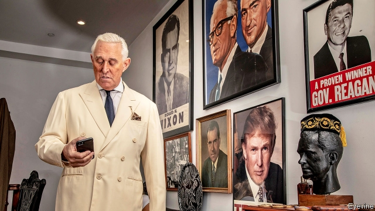

###### Get me Roger Stone

# Is this man the missing link in the Mueller investigation? 

##### Or is he an attention-seeking mythmaker? Or could he be both these things? 

 

> Jan 31st 2019 

 

THE FIRST time Roger Stone talked to Donald Trump about running for president was in 1988. “We’re sitting in the office. He’s looking at the newspaper, which he did more then than now. And he says, Jesus Christ: George Bush and Mike Dukakis? How fuckin’ pathetic is that? How fuckin’ pathetic. He says, You ever shake hands with George Bush? I said No, what’s it like. He said, Let me show you (dead-fish handshake). He said, And this Dukakis, what is he? 5’5"? I said, Maybe you should run. He says, I’ll tell you this: I’m not interested in running. But if I did run, I’d win.” 

Mr Stone’s role in Mr Trump’s eventual victory has been a source of speculation ever since November 2016. On January 25th he was arrested at his home in Fort Lauderdale and indicted by Robert Mueller, the special counsel, on seven counts, including obstructing an official proceeding, witness-tampering and making false statements about his communication with WikiLeaks and the Trump campaign. At his arraignment Mr Stone—in Democratic blue suit, tie and uncharacteristically flabby pocket-square—pleaded not guilty to all seven counts. He left the courthouse through throngs of supporters and detractors waving signs that read: “DIRTY TRAITOR”, LOCK HIM UP” and “ROGER STONE DID NOTHING WRONG”. Across the street was a huge inflatable rat with a blond hairpiece. 

Mueller-watchers had awaited Mr Stone’s indictment eagerly. The investigation was set up to look at “links and/or co-ordination” between the Russian government and the Trump campaign. Many links have already been revealed in indictments, but co-ordination has proved more elusive. Mr Stone, who both worked on the campaign for a while and seemed to have advance knowledge of the emails stolen from the Democratic National Committee by Russian military intelligence (the GRU) looked as if he might be the missing link. 

CNN was so sure Mr Stone’s indictment was coming that the network had a camera team outside Mr Stone’s house when the FBI turned up to arrest him. On a similar hunch, The Economist had lunch with him in December in Fort Lauderdale. Asked then if he was worried about the special counsel’s investigation into links between Russia and Mr Trump’s campaign, he scoffed: “Worry? I don’t worry. I make other people worry.” 

Mr Stone’s reputation as the kind of political operative imagined by screenwriters owes much to his own mythmaking. For a race he worked on early in his career, in his home state of Connecticut, he and other volunteers paced the platforms at a commuter railway station, passing out flyers with hot coffee in the mornings and freshly mixed martinis when the passengers returned in the evenings. His break came when working for Richard Nixon, a politician Mr Stone admires so much that he has the 37th president’s face tattooed between his shoulder blades. (“Man with Richard Nixon tattoo turns out to be a criminal,” was the headline on Popdust, a gossip website, after the indictment.) In his book about Nixon he writes, “I was drawn to Richard Nixon not because of his philosophy; he had none. It was his resilience and his indestructibility that attracted me.” Mr Stone says that Nixon was “exceptionally kind”, that he called him on his birthday, remembered his wife’s and dogs’ names and sent letters when his parents died. 

After tasting success of a sort with Nixon, Mr Stone worked on Ronald Reagan’s ill-starred 1976 presidential campaign. The next year he was elected president of Young Republicans in a campaign managed by Paul Manafort, convicted by Mr Mueller’s team for felonies too numerous to list in a paper that prizes concision. When Reagan won at the second attempt, Mr Stone set up a lobbying firm, Black, Manafort and Stone, that became infamous for its work for Ferdinand Marcos in the Philippines, Mobutu Sese Seko in Zaire and Jonas Savimbi in Angola, among others. The two men parted ways after selling the company in the 1990s. They were reunited on the Trump campaign, which Mr Manafort briefly ran while Mr Stone flitted about, laying claim to an influence over the candidate and tactics that was never spelled out. 

The indictment fills in some gaps. It alleges that in June and July of 2016, after his official role with the campaign had ended, Mr Stone “informed senior Trump campaign officials that he had information indicating [WikiLeaks] had documents whose release would be damaging to the Clinton campaign.” WikiLeaks released its first batch of emails on July 22nd. Four days later Mr Trump had nearly erased Hillary Clinton’s lead. After the release, says the indictment, “a senior Trump Campaign official” was directed “to contact STONE about any additional releases and what other damaging information [WikiLeaks] had regarding the Clinton campaign. STONE thereafter told the Trump campaign about potential future releases of damaging material by [WikiLeaks].” 

Mr Mueller names neither the senior campaign official nor the person who “directed” him or her to contact Mr Stone. According to emails published by the New York Times, Mr Stone and Stephen Bannon, the campaign’s chief executive, exchanged emails about WikiLeaks in early October. Over lunch Mr Stone is acerbic about Mr Bannon. “I have trouble dealing with people who are slovenly,” says Mr Stone, a renowned clothes horse (he dressed down for lunch, wearing a white Oxford shirt and flat-fronted trousers, but did drop the name of his favourite Japanese tailor). “If you want to know what Steve Bannon had for lunch, just look at the front of his shirt.” 

The indictment further alleges that Mr Stone made several other false statements regarding the nature of his communication with intermediaries in direct contact with Julian Assange, the head of WikiLeaks, and with Mr Trump’s campaign. The witness-tampering charge stems from his alleged attempts to prevent one of those intermediaries from contradicting his testimony. Mr Stone advised the witness to “Stonewall it. Plead the fifth,” and later, “I’m not talking to the FBI and if your [sic] smart you won’t either.” When the intermediary proved less tractable than he desired, Mr Stone called him “a rat. A stoolie. You backstab your friends—run your mouth my lawyers are dying Rip you to shreds [sic].” He also threatened the witness’s therapy dog, Bianca, and suggested that he “Prepare to die”. 

Over lunch in December, Mr Stone offered a lawyerly, expansive defence of his conduct. “There’s no evidence, or proof, and no one can honestly say that I had advance notice of the source, or the content or the exact release date of the WikiLeaks material either stolen—or I should say, allegedly stolen and allegedly hacked.” The word “exact” in that sentence is doing a great deal of work. Otherwise, says Mr Stone, “I am not guilty of any other crime in connection with the 2016 election,” and besides, “I’m not really sure receiving material from WikiLeaks would have been a crime had I done so.” Not everyone would be so sanguine: campaign-finance law bars foreign nationals from contributing—and campaigns from soliciting from them—money or any “thing of value” to an American political campaign. 

Mr Stone says that his subsequent testimony before the House Intelligence Committee, another possible source of legal trouble for him, was “completely accurate and truthful”, and that “any discrepancy in my testimony would be immaterial.” The indictment alleges otherwise. The committee asked Mr Stone whether he had any documents concerning “discussions you have had with third parties about” Mr Assange. Mr Stone replied that he did not. The indictment alleges that in fact he had multiple emails and texts about Mr Assange, including one to a Trump supporter from October 3rd 2016 that read, “Spoke to my friend in London last night [presumably Mr Assange, who lives at the Ecuadorean embassy there]. The payload is still coming.” Four days later WikiLeaks released thousands of emails stolen from John Podesta, Mrs Clinton’s campaign chairman. 

Mr Trump’s spokesman said the indictment has “nothing to do with the president”, and called Mr Stone “somebody who has been a consultant for dozens of Republican presidents and candidates”. That is true, but it conceals the duration and depth of the relationship between Messrs Trump and Stone. They have been close since Mr Stone solicited donations from Donald and his father, Fred, for Reagan’s 1980 campaign. In 1988 Mr Stone oversaw the creation of a Draft Trump for President Committee, and arranged for supporters to hold “Trump for President” signs at a speech Mr Trump gave in New Hampshire. Mr Stone recalls that the speech was about how “our NATO partners are ripping us off…and our trading partners are fucking us.” 

After he was released on bail, Mr Stone spent the weekend talking to any briefly stationary television camera. To a local news station in Florida he boasted, grinning, “There are four phases of fame: Who is Roger Stone? Get me Roger Stone. Get me a Roger Stone-type. Who is Roger Stone? I guess I’m in phase two at the moment.” Outside the Florida courthouse where he first appeared he vowed not to testify against Mr Trump; two days later he said he would consider co-operating with Mr Mueller, whose case against him he described as “thin as piss on a rock”. He decried the “Gestapo tactics” of his arrest, though that may have been because federal agents—who were on furlough because of the government shutdown but reportedly volunteered for the job—feared he would destroy evidence. He admitted to having made errors in his testimony but said they were “inconsequential within the scope of this investigation.” 

Asked whether he thought Mr Stone did what was he has been accused of doing, a former colleague was circumspect: “I don’t know, but I think he would have liked to. He always had a way of putting himself at the centre of things, and in this case he may have talked himself into a jail sentence.” 

-- 

 单词注释:

1.roger['rɔdʒә]:interj. 对!, 行!, 好! 

2.Mueller[]:米勒（人名） 

3.Jan[dʒæn]:n. 一月 

4.donald['dɔnәld]:n. 唐纳德（男子名） 

5.trump[trʌmp]:n. 王牌, 法宝, 喇叭 vt. 打出王牌赢, 胜过 vi. 出王牌, 吹喇叭 

6.Jesus['dʒi:zәs]:n. 耶稣 

7.george[dʒɔ:dʒ]:n. 乔治（男子名）；自动操纵装置；英国最高勋爵勋章上的圣乔治诛龙图 

8.mike[maik]:vi. 偷懒, 游手好闲 n. 休息, 游手好闲, 扩音器, 话筒 

9.pathetic[pә'θetik]:a. 悲哀的, 可怜的, 感伤的, 差劲的 [医] 感情的 

10.handshake['hændʃeik]:n. 握手 

11.Dukakis[]:n. (Dukakis)人名；(英)杜卡基斯 

12.eventual[i'ventʃuәl]:a. 最后的, 终于的 

13.speculation[.spekju'leiʃәn]:n. 沉思, 推测, 投机 [经] 投机交易, 买空卖空 

14.fort[fɒ:t]:n. 堡垒, 要塞, 易货站 vt. 设要塞保卫 vi. 设要塞 

15.Lauderdale[]:劳德戴尔 

16.indict[in'dait]:vt. 起诉, 控告, 指控 [法] 控告, 揭发, 对...起诉 

17.Robert['rɔbәt]:[法] 警察 

18.counsel['kaunsәl]:n. 商议, 忠告, 法律顾问 v. 商议, 劝告 

19.obstruct[әb'strʌkt]:vt. 阻隔, 妨碍, 阻塞, 遮没 vi. 设障碍 

20.wikileaks[]: 维基解密 

21.arraignment[ә'reinmәnt]:n. 提讯, 传讯, 责难 [法] 提审, 讯问, 审问 

22.uncharacteristically[,ʌn,kæriktə'ristikli]:adv. 不典型地；非同寻常地 

23.flabby['flæbi]:a. 软弱的, 没气力的, 不稳的, 松弛的 

24.courthouse['kɒ:thaus]:n. 法院, 郡政府所在地 

25.supporter[sә'pɒ:tә]:n. 支持者, 后盾, 迫随者, 护身织物 [法] 支持者, 赡养者, 抚养者 

26.detractor[di'træktә(r)]:n. 毁损者, 贬低者 

27.roger['rɔdʒә]:interj. 对!, 行!, 好! 

28.inflatable[in'fleitәbl]:a. 膨胀的, 得意的, 通货膨胀的 

29.blond[blɒnd]:a. 金发的 n. 白肤碧眼金发的人 

30.hairpiece['hєәpi:s]:n. 假发 

31.indictment[in'daitmәnt]:n. 起诉, 控告, 起诉状 [经] 起诉书 

32.eagerly[]:adv. 渴望, 热衷于, 热切 

33.elusive[i'lu:siv]:a. 难懂的, 易忘的, 难以捉摸的 

34.gru[]:n. (Gru)人名；(法)格吕 abbr. 格勒乌, 苏军总参谋部情报总局（Glavnoe Razvedivatelnoe Upravlenie） 

35.cnn[]:abbr. 美国有线电视新闻网络（Cable News Network） 

36.FBI[]:美国联邦调查局 [经] 美国联邦调查局 

37.hunch[hʌntʃ]:n. 肉峰, 预感, 大块 vt. 弯腰驼背, 预感到, 耸肩 vi. 向前移动, 隆起 

38.economist[i:'kɒnәmist]:n. 经济学者, 经济家 [经] 经济学家 

39.operative['ɒpәrәtiv]:a. 动作的, 运转的, 有效的, 关键的, 手术的 n. 技工, 侦探 

40.screenwriter['skri:nraitә]:n. 电影剧本作家, 编剧家 

41.mythmaking['miθ,meikiŋ]:n. 编造神话 

42.Connecticut[kә'netikәt]:n. 康涅狄格 

43.commuter[kә'mju:tә]:n. 乘公共车辆上下班者, 月季票乘客 [经] 非(当地)居民 

44.flyer['flaiә]:n. 飞鸟, 飞行物, 飞行员, 快车, 传单, 飞跳 [经] 投机买卖, 孤注一掷, (广告)传单 

45.freshly['freʃli]:adv. 新, 新近, 精神饱满 

46.martini[mɑ:'ti:ni]:n. 马提尼（一种鸡尾酒, 等于Martini） 

47.richard['ritʃәd]:n. 理查德（男子名） 

48.nixon['niksn]:n. 尼克松（美国第37任总统） 

49.tattoo[tә'tu:]:n. 归营号, 连续有节奏的敲击, 文身, 矮种马 vt. 连续有节奏地敲, 刺花纹于 vi. 作连续有节奏的敲击 

50.gossip['gɒsip]:n. 闲聊, 随笔, 流言, 爱讲闲话的人 vi. 说闲话, 闲聊 

51.resilience[ri'ziliәns]:n. 弹回, 有弹力, 恢复力 [化] 回弹; 弹性; 弹回性; 回能; 弹能 

52.indestructibility[]:[医] 不灭性 

53.exceptionally[]:adv. 特殊地；异常地；例外地 

54.ronald['rɔnәld]:n. 罗纳德（男子名） 

55.presidential[.prezi'denʃәl]:a. 总统制的, 总统的, 首长的, 统辖的 [法] 总统的, 议长的, 总经理的 

56.paul[pɔ:l]:n. 保罗（男子名） 

57.manafort[]:[网络] 马纳福特 

58.convict[kәn'vikt]:n. 囚犯, 罪犯 vt. 宣告有罪, 使知罪 

59.felony['felәni]:n. 重罪 [法] 重罪, 重刑罪 

60.concision[kәn'siʒәn]:n. 切断, 简明, 简洁 

61.reagan[]:n. 里根（姓氏） 

62.lobby['lɒbi]:n. 大厅, 休息室, 游说议员者 vi. 游说议员, 游说 vt. 游说 

63.Ferdinand['fә:dinәnd]:n. 男子名 

64.Marcos[]:n. 马科斯（姓氏） 

65.Philippine['filipi:n]:a. 菲律宾(群岛)的, 菲律宾人的 

66.Mobutu[]:n. (Mobutu)人名；(刚(金))蒙博托 

67.sese[]: [医]觉 

68.seko[]:[网络] 赛高；西科；新功 

69.Zaire[zә'i:rә]:n. 扎伊尔 [医] 流行性霍乱 

70.Jona[]:n. (Jona)人名；(瑞典)约纳；(塞、冰、意)约娜 (女名), 约纳 abbr. 日本有机和自然食品协会（Japan Organic & Natural Foods Association） 

71.savimbi[]:[网络] 萨文比；沙文比 

72.Angola[æŋ'^әulә]:[经] 安哥拉 

73.reunite[.ri:ju:'nait]:v. (使)再联合 

74.briefly['brifli]:adv. 简短地, 扼要地, 简明地, 简单地 

75.flit[flit]:n. 掠过, 迁徙 vi. 掠过, 迁徙 

76.tactic['tæktik]:n. 一项战术, 一条策略 a. 战术的, 顺序的, 排列的 

77.allege[ә'ledʒ]:vt. 宣称, 主张, 提出, 断言 [法] 断言, 指称, 指证 

78.clinton['klintәn]:n. 克林顿（男子名） 

79.batch[bætʃ]:n. 一次所烘的面包, 一次所制之量, 一组, 批, 成批, 分批 v. 成批, 分批处理 [计] 一批 

80.erase[i'reis]:vt. 抹去, 擦掉 [计] 清洗; 擦除; 抹除; DOS内部命令:从磁盘上删除一个或多个文件 

81.Hillary['hiləri:]:n. 希拉里（美国现任国务卿） 

82.thereafter[.ðєәr'æftә]:adv. 其后, 从那时以后 

83.york[jɔ:k]:n. 约克郡；约克王朝 

84.stephen['sti:vn]:n. 斯蒂芬（男子名） 

85.bannon[]:n. (Bannon)人名；(英)班农 

86.acerbic[ә'sә:bik]:a. 酸的, 尖刻的 

87.slovenly['slʌvәnli]:a. 邋遢的, 不修边幅的, 不整洁的, 懒散的, 潦草的, 马虎的 adv. 邋遢地, 不修边幅地, 不整洁地, 懒散地, 潦草地, 马虎地 

88.renowned[ri'naund]:a. 有名的, 有声誉的 

89.Oxford['ɒksfәd]:n. 牛津, 牛津大学 

90.trouser['trauzә]:a. 裤子的 

91.steve[]:n. 史蒂夫（男子名） 

92.intermediary[.intә'mi:diәri]:n. 仲裁者, 调解者, 媒介物, 中间人 a. 中间的, 媒介的 

93.Julian['dʒu:ljәn]:a. 尤利乌斯恺撒的 

94.Assange[]:[网络] 阿桑奇；阿桑奇先生；维基解密创办人阿尚吉 

95.testimony['testimәni]:n. 证言, 证据, 声明 [医] 证据 

96.stonewall[stәun'wɒ:l]:vi. 防守挡击, 围以石墙, 妨碍或阻碍 

97.plead[pli:d]:vi. 辩护, 恳求 vt. 为...辩护, 提出...借口, 托称, 恳求 

98.les[lei]:abbr. 发射脱离系统（Launch Escape System） 

99.tractable['træktәbl]:a. 驯服的, 易于管教的 [经] 易加工的, 易处理的 

100.stoolie['stuːlɪ]:n. 暗探 

101.backstab['bækˌstæb]:v. 以卑鄙的手段陷害 

102.rip[rip]:n. 裂痕, 破绽, 拉裂, 浪子, 巨浪 vi. 被拉开, 裂开, 猛冲 vt. 撕, 扯, 劈 

103.shred[ʃred]:n. 碎布条, 细片, 少量 v. 撕碎 

104.therapy['θerәpi]:n. 治疗 [医] 疗法, 治疗 

105.Bianca[bi'æŋkә, 'bjɑ:ŋkә]:n. 比安卡(f.) 

106.lawyerly['lɔ:jәli]:a. (=laywerlike) 如律师的, 适合于律师的 

107.expansive[ik'spænsiv]:a. 扩张性的, 使扩大的, 广阔的 [化] 膨胀的; 可以膨胀的 

108.honestly['ɒnistli]:adv. 真诚地, 公正地 

109.allegedly[ә'ledʒidli]:adv. 依其申述 

110.hack[hæk]:n. 劈, 砍, 砍痕, 出租车, 干咳, 晒架, 鹤嘴锄 vt. 劈, 砍, 出租, 用旧 vi. 劈, 砍, 干咳, 驾驶出租车 a. 出租的 

111.solicit[sә'lisit]:v. 请求, 乞求, 招揽, 征求 

112.truthful['tru:θful]:a. 说真话的, 诚实的, 真实的, 如实的 [法] 真实的, 说实话的, 诚实的 

113.discrepancy[dis'krepәnsi]:n. 不符合, 差异, 不相符之处 [化] 不符值; 偏差值 

114.immaterial[.imә'tiәriәl]:a. 非物质的, 无形的, 精神的 [法] 非物质的, 无形的, 非实质的 

115.Ecuadorean[]:厄瓜多尔人 厄瓜多尔的 厄瓜多尔人的 

116.payload['peilәud]:n. 商务载重, 工资负担, 净载重量, 有效负荷, 弹头 [化] 负荷量 

117.john[dʒɔn]:n. 盥洗室, 厕所, 嫖客 

118.podesta[pәu'destә]:[史](中世纪意大利的城镇)长官, 县长 

119.Mr['mistә(r)]:先生 [计] 存储器回收程序, 多重请求 

120.spokesman['spәuksmәn]:n. 发言人, 代言者 

121.Messrs['mesәz]:[法][pl. ](=Messieurs)各位(先生) 

122.donation[dәu'neiʃәn]:n. 捐赠物, 捐款, 捐赠 [经] 赠品, 捐款, 捐赠 

123.fred[fred]:n. 佛瑞德（男子名） 

124.oversee[.әuvә'si:]:vt. 向下看, 了望, 监督, 偷看到 [法] 监察, 监督, 俯瞰 

125.creation[kri:'eiʃәn]:n. 创造, 创作物, 发明 [化] 产生 

126.hampshire['hæmpʃiә]:n. 汉普郡（英国南部之一郡） 

127.NATO['neitәj]:北大西洋公约组织, 北约组织 [经] 北大西洋公约组织 

128.rip[rip]:n. 裂痕, 破绽, 拉裂, 浪子, 巨浪 vi. 被拉开, 裂开, 猛冲 vt. 撕, 扯, 劈 

129.fucking['fʌkiŋ]:a. 该死的, 难完成的, 难做的, 低劣的, 讨厌的, 丑恶的, 混乱的, 乱糟糟的 

130.bail[beil]:n. 保释, 拎环, 杓, 栅栏 vt. 保释, 舀水 

131.stationary['steiʃ(ә)nәri]:a. 不动的, 静止的, 不变的, 固定的, 停留的 [计] 定常, 定态, 固定的 

132.Florida['flɒridә]:n. 佛罗里达州 

133.grin[grin]:n. 露齿笑 v. 露齿而笑 

134.vow[vau]:n. 誓约, 誓言, 许愿 vi. 起誓, 发誓, 郑重宣言 vt. 立誓, 起誓要, 郑重地宣布 

135.testify['testifai]:v. 证明, 作证, 声明, 表明 

136.piss[pis]:vi. 小便, 下大雨, 抱怨 vt. 撒尿弄脏, 尿在...上 n. 小便 

137.decry[di'krai]:vt. 反对, 责难, 诽谤, 诋毁 

138.gestapo[^es'tɑ:pәu]:n. <德>盖世太保, 纳粹秘密警察 

139.furlough['fә:lәu]:n. 休假, 放假, 暂时解雇 vt. 准假, (暂时)解雇 

140.shutdown['ʃʌtdaun]:n. 关门, 停工, 停机 [经] 停工 

141.reportedly[ri'pɒ:tidli]:adv. 根据传说, 根据传闻, 据报道 

142.inconsequential[.inkɒnsi'kwenʃәl]:a. 不合逻辑的, 不合理的, 不重要的 

143.alway['ɔ:lwei]:adv. 永远；总是（等于always） 

