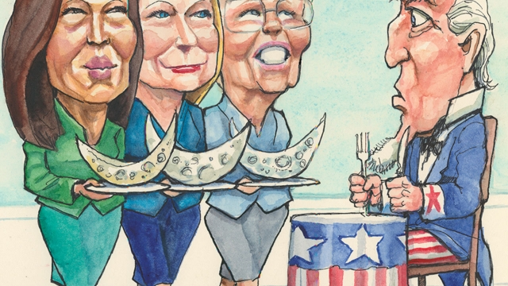

###### Lexington

# The Democratic primary is already the most left-wing in decades 

##### This looks like a bad strategy for beating Donald Trump 

 

> Jan 31st 2019 

MODERATE DEMOCRATS have had a good few months. They dominated the Democratic primaries ahead of the mid-term elections, duly delivered a Democratic majority in the House of Representatives, and have been quietly getting their way there, too. For all the hoopla over Alexandria Ocasio-Cortez, the House agenda looks pragmatic, with a focus on fiscal prudence, infrastructure development and not impeaching President Donald Trump. House Democrats think this approach will keep on board the centrist voters they won last year. That looks like a more promising way to get rid of Mr Trump. So why are the early Democratic runners for next year’s presidential election flocking to the left? 

In 2016 Hillary Clinton said Senator Bernie Sanders’s promise of universal state-provided health care could “never, ever come to pass”. Most Democratic candidates in competitive mid-terms races also rejected it. Yet all three heavyweights who have so far declared for 2020—the senators Kirsten Gillibrand, Kamala Harris and Elizabeth Warren—are for it. So are several big names expected to announce shortly, including Senator Cory Booker and Mr Sanders himself. Only Ms Warren and Mr Sanders among them have a record of taking populist positions. The rest have leapt to them. Indeed the uniformity of their proposals is striking. 

Most offer some version of Mr Sanders’s free college pledge. All are for giving a federal job to whomever wants one, as first suggested by Mr Booker. These proposals are not necessarily crazy; the health-care system is a mess. But the idea that they could form a realistic agenda for a governing system choked by partisanship is absurd. The light-headed fashion in which the early runners are airing their proposals adds to that impression. Slammed on social media for having promised only two years of free college, Julián Castro—once Barack Obama’s centrist housing secretary—shot back that he’d push for four, then. Pressed for her view of private medical insurance, Ms Harris said she’d scrap it. She later tried to walk that back. Yet what was she—what are they all—thinking of? 

Ms Ocasio-Cortez, for one. Inspired by the demise of the centralised party structure and the rise of social media, the left-wing activist world she represents has rarely been more vibrant or intimidating to the Democratic establishment. Some compare it to the supercharged activism that pushed the Democrats leftward in the 1930s and 1960s. The alacrity with which Ms Harris and Ms Warren praised Ms Ocasio-Cortez’s signature policy, the Green New Deal, supports that. (So does the fact that a 29-year-old freshman congresswoman is considered to have a signature policy.) 

That is one of two structural changes behind the new populism. The other is the growing importance of online fundraising, which most Democratic consultants think requires bold left-wing pledges, especially in a crowded primary field, in which cash-hungry populists will compete to be the boldest. That contest promises, in turn, to make online fundraising even more important to those involved, because it will make Wall Street donors less generous. Ms Warren’s proposed wealth tax on households worth over $50m has already given them something to hate. Still, the effect of these structural factors can be overstated. 

As the mid-terms indicate, the activists are not in step with most Democratic voters, who appear more focused on opposing Mr Trump than on remaking the health-care system. Historical comparisons underline this. The leftward lurches of the 1930s and 1960s were also spurred by events, in the form of the Great Depression and the civil-rights struggle, which convinced millions of the need for radical change. There is little evidence that most Democratic voters think today’s more complicated socioeconomic inequities warrant the big expansion of the state that the populist candidates are promising. Even in fairly liberal states such as Colorado, voters have rejected proposals for a single-payer health-care scheme. Mr Sanders’s better-than-expected run in 2016 said more about dissatisfaction with Mrs Clinton than the power of his ideas. This also suggests the consultants may be wrong to demand hard-left pledges for the purpose of fundraising. Of the three past masters of online fundraising, Mr Obama, Beto O’Rourke and Mr Sanders, only the last is an outright left-winger. 

The disruptive effect of Mr Trump offers more fundamental explanations for the Democrats’ lurch to the left. Activists think his ideological nonconformity and unpopularity afford them an opportunity to shift the Overton window to the left. Establishment figures such as Mr Booker and Ms Harris still seem mesmerised by his ability to make headline-grabbing pronouncements with which Mrs Clinton could not compete for attention. This seems to underappreciate his subsequent weakness. Over half of voters—roughly the portion the Democratic candidate would need—say they will definitely not vote for him. It is not obvious why such voters, sick of Mr Trump’s antics, would warm to a Democrat offering a different set of implausible promises. “If we try to out-crazy the policy announcements of a troubled president, we will do nothing to restore confidence,” warns Senator Chris Coons of Delaware. 

Trying to improve on Mrs Clinton may be a better strategy—and her proposals were the least of her problems. Voters rejected her because they didn’t like or identify with her, not because her jobs plan was small-bore. The new populists’ reluctance to grapple with that hints at a lack of confidence in their own ability to win voters’ trust. It is surely no coincidence that they represent the main cohort of hated Washington insiders in the contest. More outsiderish candidates—perhaps including Mr O’Rourke, who, like Mr Obama before him, is not primarily associated with Washington despite his time in Congress—may be better at talking to voters without promising them the moon. But there is no sign of them yet. For now the race is dominated by senators offering the moon on a plate, in Swiss cheese, pepper jack, or any other flavour. 

-- 

 单词注释:

1.lexington['leksiŋtәn]:n. 列克星敦市（位于美国肯塔基州） 

2.donald['dɔnәld]:n. 唐纳德（男子名） 

3.trump[trʌmp]:n. 王牌, 法宝, 喇叭 vt. 打出王牌赢, 胜过 vi. 出王牌, 吹喇叭 

4.Jan[dʒæn]:n. 一月 

5.democrat['demәkræt]:n. 民主人士, 民主主义者, 民主党党员 [经] 民主党 

6.duly['dju:li]:adv. 恰当地, 充分地, 适当地, 及时地 

7.quietly['kwaiәtli]:adv. 安静地, 沉着地, 秘密地 

8.hoopla['hu:plɑ:]:n. 喧闹, 大吹大擂的宣传, 投环套物游戏 

9.alexandria[,æli^'zɑ:ndriә]:n. 亚历山大港（位于埃及）；亚历山大市（美国弗吉尼亚一城市）；亚历山大大帝 

10.pragmatic[præ^'mætik]:a. 忙碌的, 爱管闲事的, 自负的, 固执己见的, 实际的, 务实的, 国事的, 国务的 [法] 闲断的, 固执己见的, 实用主义的 

11.fiscal['fiskәl]:a. 财政的, 国库的 [经] 财政上的, 会计的, 国库的 

12.prudence['pru:dns]:n. 审慎, 慎重, 精明, 节俭 

13.infrastructure['infrәstrʌktʃә]:n. 基础结构, 基础设施 [经] 基础设施 

14.impeach[im'pi:tʃ]:vt. 控告, 怀疑, 检举, 弹劾 [法] 控告, 检举, 弹劾 

15.centrist['sentrist]:n. 中间党派的成员, 温和主义者 [法] 中间派议员, 中立派议员 

16.voter['vәutә]:n. 选民, 投票人 [法] 选民, 选举人, 投票人 

17.presidential[.prezi'denʃәl]:a. 总统制的, 总统的, 首长的, 统辖的 [法] 总统的, 议长的, 总经理的 

18.Hillary['hiləri:]:n. 希拉里（美国现任国务卿） 

19.clinton['klintәn]:n. 克林顿（男子名） 

20.senator['senәtә]:n. 参议员, (某些大学的)理事 [法] 参议员, 上议员 

21.bernie['bә:ni]:n. 伯尼（男子名）；[俚]可卡因（等于cocaine） 

22.heavyweight['heviweit]:n. 重量级拳击运动员, (非正式)有影响的要人 a. 最重量级的 

23.senator['senәtә]:n. 参议员, (某些大学的)理事 [法] 参议员, 上议员 

24.Kirsten['k\\:stәn]:n. 柯尔斯顿(f.) 

25.gillibrand[]: [人名] 吉利布兰德 

26.kamala[kә'meilә]:n. [植] 粗糠柴 

27.harris['hæris]:n. 哈里斯（英国苏格兰一地区）；哈里斯（姓氏） 

28.elizabeth[i'lizәbәθ]:n. 伊丽莎白（女子名） 

29.cory[]:n. 克里, 科里（人名） 

30.booker['bukә]:n. （旅馆车票, 戏票等的）登记人；寻选模特儿的人 

31.sander['sændә]:[电] 散沙 

32.warren['wɒrәn]:n. 养兔场, 拥挤的地区 

33.Populist['pɔpjulist]:n. 民粹派的成员 

34.uniformity[.ju:ni'fɒ:mәti]:n. 无差异, 同样, 划一, 一致 [医] 均匀性 

35.pledge[pledʒ]:n. 诺言, 保证, 誓言, 抵押, 信物, 保人, 祝愿 vt. 许诺, 保证, 使发誓, 抵押, 典当, 举杯祝...健康 

36.whomever[ˌhu:mˈevə(r)]:pron. （作动词或介词的宾语时, 有时候用来替代whoever） 

37.realistic[riә'listik]:a. 现实的, 逼真的, 现实主义的, 实在论的 

38.partisanship['pɑ:tәznʃip]:n. 党派性, 党派偏见, 对党派的忠诚 

39.barack[bɑ:'ræk]:n. 巴拉克（男子名） 

40.scrap[skræp]:n. 碎片, 残余物, 些微, 片断, 铁屑, 吵架 vt. 扔弃, 敲碎, 拆毁 vi. 互相殴打 a. 零碎拼凑成的, 废弃的 

41.demise[di'maiz]:n. 崩, 薨, 死亡 vt. 让渡, 遗赠, 转让 

42.centralise['sentrәlɑiz]:vt. 形成中心, 把统治权集中于中央, 把...集中起来, 成为...的中心, 集中 

43.activist['æktivist]:n. 激进主义分子 

44.vibrant['vaibrәnt]:a. 振动的, 战栗的, 响亮的, 活跃的 

45.supercharge['sju:pәtʃɑ:dʒ]:vt. 对...增压, 使超负荷, 使过度, 使过分 [化] 增压器 

46.activism['æktivizm]:n. 激进主义, 行动主义, 能动论 [法] 激进主义, 行动主义 

47.leftward['leftwәd]:a. 左方的, 左侧的 adv. 在左方, 在左手 

48.alacrity[ә'lækrәti]:n. 敏捷, 轻快, 乐意 

49.freshman[]:n. 新手, 生手, 大学一年级学生, (美)中学一年级学生 

50.congresswoman['kɒŋgreswumәn]:n. 国会女议员, 众议院女议员 

51.Populism['pɒpjulizm]:n. 平民主义, 民粹主义 

52.online[]:[计] 联机 

53.fundraising['fʌndˌreɪzɪŋ]:n. 筹款, 募款 a. 筹款的 

54.donor['dәunә]:n. 捐赠人 [化] 给体; 供体 

55.les[lei]:abbr. 发射脱离系统（Launch Escape System） 

56.overstate[.әuvә'steit]:vt. 夸大的叙述, 夸张, 过分强调 [经] 多计, 高估 

57.remake[ri'meik]:vt. 再作, 再制, 重作 n. 再制, 改作, 重制物 

58.lurch[lә:tʃ]:n. 惨败, 倾斜, 挫折, 举步蹒跚, 徘徊 vi. 惨败, 倾斜, 徘徊 vt. 击败 

59.socioeconomic['sәuʃiәu,i:kә'nɔmik]:a. 社会经济学的 

60.inequity[in'ekwiti]:n. 不公平, 不公正 

61.warrant['wɒ:rәnt]:n. 授权, 正当理由, 根据, 证明, 批准, 凭证, 令状, 委任状 vt. 授权给, 保证, 担保, 批准, 使有正当理由 

62.Colorado[,kɔlә'rɑ:dәu]:n. 科罗拉多, 科罗拉多河 

63.dissatisfaction['dis.sætis'fækʃәn]:n. 不满, 不平 

64.Mr['mistә(r)]:先生 [计] 存储器回收程序, 多重请求 

65.obama[]:n. 奥巴马(姓) 

66.beto[]:n. (Beto)人名；(英)贝托 

67.outright['autrait]:a. 率直的, 完全的, 总共的, 直率的 adv. 完全地, 率直地, 立刻地, 一直向前 

68.disruptive[dis'rʌptiv]:a. 分裂的, 破坏(性)的 [计] 击穿的, 中断的 

69.ideological[.aidiә'lɒdʒikәl]:a. 意识形态的, 空想的 [法] 思想的, 思想上的, 意识形态的 

70.nonconformity[.nɒnkәn'fɒ:miti]:n. 不适合, 不一致, 不信奉国教 

71.unpopularity['ʌn.pɒpju'læriti]:n. 不受欢迎, 失人心 

72.Overton[]:奥弗屯（英国城市） 

73.mesmerise['mezmәraiz, 'mes-]:vt. 对...施催眠术, 使目瞪口呆, 使入迷 

74.pronouncement[prә'naunsmәnt]:n. 声明, 公告, 宣言, 宣告, 发表, 意见, 决定 [法] 宣判, 宣布, 宣告 

75.underappreciate[]:[网络] 不太赞赏 

76.antic['æntik]:n. 滑稽动作 a. 古怪的 

77.democrat['demәkræt]:n. 民主人士, 民主主义者, 民主党党员 [经] 民主党 

78.implausible[im'plɒ:zәbl]:a. 难以置信的, 不象真实的 

79.chris[kris]:n. 克里斯（男子名）；克莉丝（女子名） 

80.coon[ku:n]:n. 浣熊, 狡滑的人, 黑人 

81.Delaware['delәweә]:n. 特拉华(美国州名) 

82.reluctance[ri'lʌktәns]:n. 不情愿, 勉强 [电] 磁阻 

83.grapple[græpl]:v. 抓住, 掌握 n. 抓住, 系紧, 掌握, 与...扭打 

84.cohort['kәuhɒ:t]:n. 一群；步兵大队；支持者；共同特点的一群人 

85.Washington['wɒʃiŋtn]:n. 华盛顿 

86.insider['in'saidә]:n. 内部的人, 权威人士, 知道内情的人 [经] 熟悉内情者 

87.outsiderish[]:[网络] 外来人 

88.jack[dʒæk]:n. 插座, 千斤顶, 男人 vt. 抬起, 提醒, 扛举, 增加, 提高, 放弃 a. 雄的 [计] 插座 

