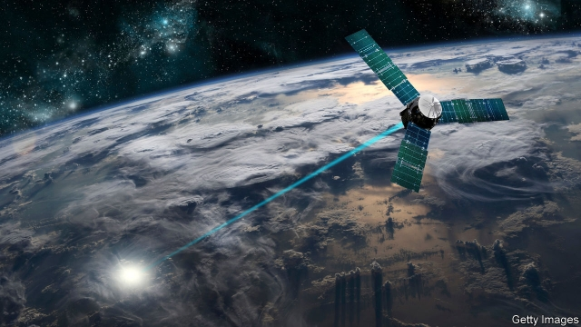

###### Laser tag

# The Pentagon wants satellites with laser beams attached to their heads 

##### Missile-interceptors in space could protect America, but at a galactic cost 

 

> Jan 31st 2019 

 

LASER WEAPONS orbiting in space and warplanes that shoot down rockets sound like the doodlings of a teenage boy. Both appear in the Trump administration’s missile-defence review, published on January 17th. It lays out a celestial vision of homeland defence that looks cosmically expensive and technologically dubious. 

America does not skimp on shooting missiles out of the sky. Its 2018 budget allocated $19.3bn to the task—roughly equivalent to the entire defence budget of Canada or Turkey. Since 2001 it has splashed out over $130bn. Some of that is spent on ship-based Aegis and land-based Patriot and Terminal High Altitude Area Defence (THAAD) systems, which are aimed at short or medium-range missiles. Intercontinental ballistic missiles (ICBMs) fly higher and faster. 

For those, America has built a sprawling “ground-based midcourse defence” (GMD) directed at North Korea and Iran. At $67bn and rising, it is the Pentagon’s fourth-most-expensive weapon system. Launches are spotted by infrared satellites and a radar network stretching from Cape Cod to Japan, and then—in theory—struck by one of 44 interceptors in Alaska and California. 

Though GMD was declared ready in 2004, it was not tested against an ICBM-type target until 2017 and then under generous conditions. Using four interceptors against one warhead is assumed to give a 97% chance of a hit. That sounds promising. But if merely a dozen missiles were volleyed at America, not only would it soak up more than $3bn of interceptors but a single warhead would still have a 30% chance of getting acquainted with an American city. The average revolver offers better odds for a game of Russian roulette. 

The Trump administration has been adding interceptors, beefing up radars and conducting new tests. But the latest missile-defence review, the first in nine years, makes some more radical proposals. 

One is to shoot down missiles in their “boost phase” as they take off, when they are slower and harder to disguise, rather than above the atmosphere as GMD aims to do. Since the boost phase lasts for only a few minutes, that requires spotting launches and pouncing quickly. The suggestion is that fighter jets like the F-35 or even drones could be “surged” towards enemy launchpads in a crisis, armed with new interceptor missiles or compact lasers. That carries obvious risks. 

So the second strategy is to do more sensing and shooting from space. This fits with Mr Trump’s galactic proclivities. In December he ordered the creation of a new Space Command to run military operations in space. A new Space Force and Space Development Agency are in the works. 

The Pentagon is especially keen to put larger numbers of smaller and cheaper satellites into lower orbit for “birth to death tracking”: from detecting tell-tale plumes at launch to establishing whether an intercept is successful. Officials are also beginning a six-month study into the feasibility of putting the interceptors themselves, whether rockets or lasers, into space. 

Few of these ideas are new. An airborne laser was successfully tested against missiles in 2010. The Obama administration poured hundreds of millions of dollars into space sensors. The vision of orbiting lasers harks back to the Reagan administration’s Strategic Defence Initiative, widely dubbed “Star Wars”. 

In 2012 the National Research Council published a detailed and scathing judgment of such methods. Boost-phase defence, it said, “is not practical or cost effective under real-world conditions for the foreseeable future”. It pointed out that rocket motors burn out so quickly that interceptors would have to get unfeasibly close to the launch-pad. 

Space-based interceptors might deal with that problem, but would require a preposterously large constellation of satellites costing hundreds of billions of dollars. The Pentagon insists that new, commercially available technology will bring down costs. Its task is to persuade Congress that the budget, at least, is not headed to infinity and beyond. 

-- 

 单词注释:

1.lase[leiz]:vi. 发出激光, 以激光照射 

2.pentagon['pentәgәn]:n. 五角形, 五边形 [经] 五角平台 

3.galactic[gә'læktik]:a. 乳汁的, 银河的, 极大的 [医] 乳液的, 催乳液的 

4.Jan[dʒæn]:n. 一月 

5.warplane['wɒ:plein]:n. 军用飞机 

6.doodling['du:dlɪŋ]:n. 乱写之物, 乱画之物 v. 心不在焉地乱写乱画( doodle的现在分词 ) 

7.teenage['ti:nidʒ]:a. 十三岁到十九岁的 

8.trump[trʌmp]:n. 王牌, 法宝, 喇叭 vt. 打出王牌赢, 胜过 vi. 出王牌, 吹喇叭 

9.celestial[si'lestjәl]:a. 天的, 天国的, 天空的 [法] 天的, 天空的, 天国的 

10.cosmically['kɒzmikәli]:adv. 按照宇宙法则, 大规模 

11.technologically[teknә'lɔdʒikәli]:adv. 技术上地；科技地 

12.dubious['dju:biәs]:a. 可疑的, 不确定的 

13.skimp[skimp]:vt. 少给, 克扣 vi. 吝啬 a. 少的, 不足的 

14.aegis['i:dʒis]:n. 羊皮盾, 保护, 庇护, 赞助, 支持 [法] 庇护, 保护 

15.patriot['peitriәt]:n. 爱国者, 爱国主义者 

16.thaad[]:abbr. Theater High-Altitude Area Defense 战区高海拔区防卫 

17.intercontinental[,intә,kɔnti'nentl]:a. 大陆间的, 洲际的 

18.ballistic[bә'listik]:a. 弹道的 [医] 射击的, 冲击的 

19.icbm[,ai,si:bi:'em]:abbr. InterContinental Ballistic Missile 洲际弹道导弹 

20.sprawl[sprɒ:l]:vi. 伸开手足躺, 爬行, 蔓生, 蔓延 vt. 懒散地伸开, 使蔓生, 使不规则地伸展 n. 伸开手足躺卧姿势 

21.midcourse['midkɔ:s]:a. (宇宙飞船、飞机或船的)航程中段的,中途的  n. 航程中段,中途 

22.GMD[]:abbr. 冈比亚法拉西（Gambian Dalasi，货币简称）；地基中段防御（Gound-based Midcourse Defense） 

23.Korea[kә'riә]:n. 朝鲜, 韩国 

24.Iran[i'rɑ:n]:n. 伊朗 

25.infrared[.infrә'red]:a. 红外线的 n. 红外线 

26.cape[keip]:n. 岬, 海角, 披肩, 斗蓬 

27.cod[kɒd]:n. 鳕, 欺骗, 愚弄 v. 欺骗, 愚弄 

28.interceptor[.intә'septә]:n. 阻止的人, 妨碍者, 拦截战斗机 [法] 窃听器, 截取者, 障碍物 

29.Alaska[ә'læskә]:n. 阿拉斯加州 

30.California[.kæli'fɒ:njә]:n. 加利福尼亚 

31.warhead['wɒ:hed]:n. 弹头 

32.volley['vɒli]:n. 群射, 齐发, 迸发 vt. 群射, 齐发, 截击 vi. 进行群射, 齐鸣 

33.acquaint[ә'kweint]:vt. 使认识, 介绍 

34.revolver[ri'vɒlvә]:n. 左轮手枪 [化] 旋转炉 

35.odds[ɒdz]:n. 可能性, 几率, 机会, 胜算, 不平等 

36.roulette[ru:'let]:n. 轮盘赌, 点线机, 骑缝线 

37.pounce[pauns]:n. 猛扑, 爪 vi. 猛扑, 突袭 vt. 扑住 

38.quickly['kwikli]:adv. 很快地 

39.drone[drәun]:n. 雄蜂, 懒惰者, 嗡嗡的声音, 无人驾驶飞机(或船) vi. 嗡嗡作声, 混日子 vt. 低沉地说 

40.surge[sә:dʒ]:n. 巨涌, 汹涌, 澎湃 vi. 汹涌, 澎湃, 颠簸, 猛冲, 突然放松 vt. 使汹涌奔腾, 急放 [计] 电压尖峰 

41.launchpad[]: [计][OS/2]快速启动板 

42.compact[kәm'pækt]:a. 紧凑的, 紧密的, 简洁的 vt. 使紧密结合, 压缩 vi. 变坚实 

43.proclivity[prә'kliviti]:n. 倾向, 癖性 

44.creation[kri:'eiʃәn]:n. 创造, 创作物, 发明 [化] 产生 

45.plume[plu:m]:n. 羽毛, 羽毛装饰, 羽状的 vt. 用羽毛装饰, 整理羽毛, 使成羽毛状 

46.intercept[.intә'sept]:n. 截取, 妨碍, 截距 vt. 拦截, 阻止, 截取 

47.feasibility[.fi:zә'biliti]:n. 可行性, 可能性 [化] 可行性 

48.airborne['єәbɒ:n]:a. 升空的, 空运的, 空中传播的, 空降的 

49.obama[]:n. 奥巴马(姓) 

50.sensor['sensә]:n. 传感器 [计] 检测器 

51.hark[hɑ:k]:vi. 倾听 

52.reagan[]:n. 里根（姓氏） 

53.dub[dʌb]:vt. 配音, 轻点, 授予称号, 击 n. 一下击鼓声, 笨蛋 

54.scathing['skeiðiŋ]:a. 伤害的, 损伤的, 严厉的 

55.judgment['dʒʌdʒmәnt]:n. 裁判, 宣告, 判决书 [医] 判断 

56.foreseeable['fɒ:'si:әbl]:a. 可预知的, 能预测的 [法] 可预见的, 可预料的 

57.unfeasibly[]:不能实行地 

58.preposterously[prɪ'pɒstərəslɪ]:adv. 反常地; 荒谬地; 荒谬可笑地; 不合理地 

59.constellation[.kɒnstә'leiʃәn]:n. 星座, 荟萃 [化] 构象 

60.commercially[]:adv. 商业上；通商上 

61.infinity[in'finiti]:n. 无限大, 无限 [计] 无穷 

