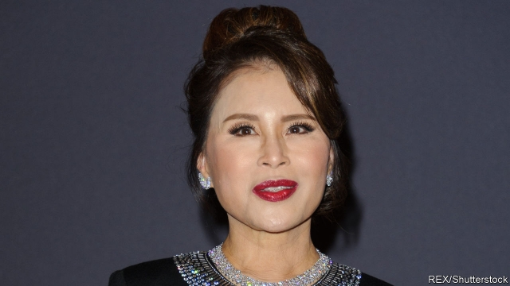

###### The princess and the PM

# A royal rumour upends Thai politics 

 

> print-edition iconPrint edition | Asia | Feb 9th 2019 

IS THAI POLITICS about to turn upside down? For almost 20 years an endless political battle has pitted royalist elites, known as “yellow shirts”, against partisans of a populist former prime minister, Thaksin Shinawatra, known as “red shirts”. Parties linked to Mr Thaksin have won every election since 2001; the army has twice ousted Thaksinite governments in coups, most recently in 2014. Although the ruling junta is theoretically restoring democracy via an election on March 24th, the process was looking stage-managed to preserve the generals’ sway and keep Mr Thaksin at bay. But the royal family is contemplating a move that could upend the generals’ schemes and rehabilitate Mr Thaksin. 

As The Economist went to press, each Thai political party was finalising a list of up to three choices for prime minister that it must register by law by February 8th. Thai Raksa Chart, a party founded by allies of Mr Thaksin in case his main vehicle, the Pheu Thai party, were to be dissolved by the junta, was preparing to nominate Princess Ubolratana, the older sister of King Vajiralongkorn, pending approval from all concerned. The princess is a friend of Mr Thaksin, but also on good terms with her brother. Her move into politics may be smoother because she was stripped of royal title when she married an American (horrors!) in the 1970s (she has since divorced him and returned to live in Thailand). Were she to allow herself to be nominated, she would be in a strong position to attract support from both the ardently royalist yellow shirts and Mr Thaksin’s red shirts. 

Although her role remains uncertain, the generals are left in limbo. Prayuth Chan-ocha, the junta leader and prime minister since 2014, was clearly manoeuvring to stay on in the top job after the election. He has been holding election rallies in all but name for months. In theory these “mobile cabinet meetings” serve to explain his government’s policies to the public. In practice, he has been parading through stadiums before cheering crowds. On January 30th Palang Pracharat, a party founded last year by ministers in Mr Prayuth’s government to carry the torch for it in the election revealed its candidates for prime minister. Unsurprisingly, Mr Prayuth’s name appeared, alongside those of the deputy prime minister, Somkid Jatusripitak, and the party’s leader and a former industry minister, Uttama Savanayana. Mr Prayuth is not running for parliament, but under the constitution whose adoption he oversaw, the prime minister does not have to be an MP—the same loophole the princess could make use of. 

Being nominated by a political party is not the only way to become prime minister, but it makes it much easier. The job will be filled by a joint sitting of the 250-seat Senate and the 500-seat House of Representatives. In the first round of voting, which is limited to the parties’ pre-election nominees, a simple majority is enough to win the job. Candidates who have not been nominated can also enter the fray, but only in a second round of voting if no nominated candidate has triumphed—and they need two-thirds of votes. “That will be very difficult,” reckons Prajak Kongkirati of Thammasat University. 

Although Thaksinites seem likely to win a good share of the House, the entire Senate will be appointed by the junta. Mr Prayuth would therefore need to secure the support of just 126 elected representatives to remain in office. But Mr Prayuth, who has not stated clearly that he wants to stay on, would presumably not stand against a royal candidate. Indeed, one of the supposed reasons for his coup, beyond ending the strife between the red shirts and yellow shirts, was to protect the monarchy. 

Even if the princess demurs at the last moment, her flirtation with running changes Thai politics. It suggests the king, an aloof but meddling figure, is seeking a resolution to the standoff, rather than implicitly endorsing the suppression of the red shirts. That, in turn, makes Mr Prayuth look less secure. An election that seemed destined to conform to a predictable script has become much more intriguing. 

