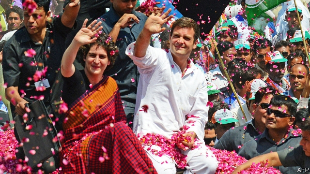

###### The can-do Gandhis

# Congress, India’s oldest political party, gains a new lease on life 

 

> print-edition iconPrint edition | Asia | Feb 9th 2019 

ARUN SHOURIE, a former cabinet minister and acid-tongued pundit, once dismissed India’s ruling Bharatiya Janata Party (BJP) as “Congress plus a cow”. By equating prime minister Narendra Modi’s Hindu nationalists with their secular rivals, he was implying that, since both of India’s biggest parties share such traits as cronyism and paternalist economics, all that really distinguishes the BJP is its displays of piety, such as reverence for cows. 

So it may have come as some surprise to three Muslim residents of Kharkali, a tiny hamlet in the state of Madhya Pradesh in central India, when a court on February 4th threw them in jail on suspicion of slaughtering a cow. The surprise was not just that the police had invoked the draconian National Security Act, which allows a year’s detention without charge. It was that while BJP-run states are best known for enforcing “cow protection” laws, Madhya Pradesh is no longer run by the BJP. Two months ago its voters brought the ostensibly more liberal Congress back to power. Yet whereas the BJP had campaigned with a promise to create a ministry for bovine affairs, Congress has gone further. One of its first acts was to announce a $63m programme to build some 1,000 cow shelters across all 52 districts of the state. “They talked the talk but we walk the walk,” says Jyotiraditya Scindia, an MP from the state who is also the party’s chief whip. 

Cows are not the only issue over which Congress has strayed from the path set by its best-known leaders, Mahatma Gandhi and Jawaharlal Nehru. With national elections looming in April, the party is pandering to pious Hindus, who have not exactly been short of pandering since Mr Modi took power in 2014. Stung for years by the BJP’s charge that it has “appeased” Muslim voters, doling out favours to the 14% minority to secure their vote, Congress fields fewer Muslim candidates. The minority fill fewer places in its internal counsels, too. Meanwhile, on controversies that electrify conservative Hindus—such as plans to erect a temple to the god Ram on the site of a mosque demolished by Hindu fanatics in 1992, or a recent court ruling that ended a ban on women worshippers at a Hindu temple in Kerala state—Congress has remained conspicuously mum. 

This shift has accelerated since Rahul Gandhi, Nehru’s great-grandson, replaced his mother, Sonia Gandhi, as Congress’s leader in late 2017. Although the 48-year-old Mr Gandhi’s sudden penchant for being photographed visiting Hindu temples has been the butt of jokes, the overall strategy seems to be working. Five years ago Mr Modi humiliated Congress, stripping its share in the Lok Sabha, the lower house, to a dismal 44 of 545 seats—its worst-ever showing. In state elections the BJP made further inroads, whittling Congress’s share of state governments to just three out of India’s 36 states and territories. Some pundits opined that Mr Modi just might fulfil his boast of making India “Congress free”. 

But the 133-year-old party has bounced back smartly in recent months. In December, to the surprise of its own cadres, Congress won control of three large states in the Hindi-speaking heartland that has long been seen as a BJP stronghold. This show of resilience, combined with growing signs of disenchantment with Mr Modi, has tipped the party’s fortunes markedly. In the press and on social media, where the BJP had until recently maintained a dominant voice, Mr Gandhi is far less often portrayed as an immature crown prince. Mr Modi, despite remaining a masterly showman and wielding an intimidating party machine, is no longer above criticism. 

Although polls in India are notoriously unreliable, the trend over the past year is clear. The number of seats the BJP is projected to win in the Lok Sabha has shrunk by around a third. It seems unlikely to retain its current outright majority. Congress is predicted to triple its share. This would still leave it with fewer than 200 seats, a smaller tally than the BJP. But Congress has a long history of corralling smaller regional parties into broad coalitions. “Who would want to ally with Modi?” asks Mr Scindia. “Congress has much more the characteristics of a party around which divergent allies can unite.” 

As for whom voters would rather see as prime minister, polls over the past two years show Mr Modi’s lead over Mr Gandhi slipping steadily, from a walloping 43 percentage points to just 12. Since the most recent poll Mr Gandhi has received another boost, with the enlistment of his sister Priyanka as a campaign manager in Uttar Pradesh, the most populous and politically important state (the siblings are pictured on the previous page, during the election of 2014). Although it is unclear whether Ms Gandhi will shift many votes, her star status will certainly grab attention from Mr Modi, who has grown used to unstinting and adulatory press coverage. 

But it is not just the Gandhis’ glamour or Congress’s new, cow-friendly look that has improved its prospects. Despite a reputation for taking frequent holidays, Mr Gandhi has proved an energetic manager. Crucially, too, he has delegated wisely, and refrained from micro-managing at the local level. “The most interesting new dynamic in Congress is that they show more deference to state leaders,” says Milan Vaishnav of Carnegie, a think-tank, noting that the trend marks a contrast to the increasing centralisation of power in the BJP under Mr Modi. 

Mr Gandhi timed a bold campaign promise to provide all Indians with a minimum guaranteed income just days before the government released its budget on February 1st. This made the varied sops it contained to farmers, taxpayers and others look puny by comparison. Disgruntled officials made matters worse by claiming that the government was suppressing dire unemployment data. Few Indians believe the promises of either Mr Gandhi or Mr Modi, and as the campaign escalates, they will believe even less. But whereas the prime minister cannot truthfully be said to have brought India the achche din or good times that he promised voters in 2014, his upstart rival does not yet have a record of broken vows to disappoint them with. 

