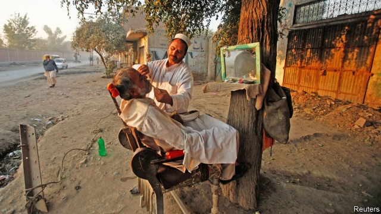

###### Shaving grace

# Pakistan’s rugged north-west sees an outbreak of pogonophilia 

 

> print-edition iconPrint edition | Asia | Feb 9th 2019 

HOVERING ABOVE a plush barber’s chair in his small hair salon in Peshawar, a city in northern Pakistan, Muhammad Ijaz strokes a beard so intricately designed it verges on the preposterous. Hair swoops across his cheeks. A chinstrap of clean-shaven skin surrounds a thin goatee. “It’s never been done before,” boasts the 24-year-old with a smile. 

Such so-called “French” beards (a term that might surprise Parisians) are sprouting all over the urban centres of Khyber Pakhtunkhwa, a mountainous border region, only recently emerged from almost a decade on the front line of Pakistan’s Taliban insurgency. Between 60% and 95% of customers now come in for fancy designs, according to a straw poll of the barbers in Khyber supermarket, a popular shopping destination. One barber draws his fingers across his face, illustrating the “L”, the “J” and other in-vogue patterns. 

Why the coiffed exuberance? A barber’s customers offer a variety of explanations. Eyeing your correspondent in the mirror, one suggests that the young men of Pakistan’s Pushtun minority are mimicking Naqeebullah Mehsud, an aspiring model, whose murder by the police last year turned him into a martyr against state oppression. Another says he simply admires the West (for “its peace and greenery”, especially). As internet access spreads through Pakistan’s deprived, Pushtun-dominated north-west, young people now connect more to global trends: they pirate “Game of Thrones”, “Vikings” and other razor-shy shows in huge numbers. 

Today’s styles, though, are not entirely new. Beards “have always been a part of Pushtun culture” notes Swat Swag, a popular storyteller, on Twitter. These liberal designs represent a “return to pre-Afghan-jihad, pre-madrassa-influence”, ie, to the 1960s. So it is not surprising that imams disapprove. In late 2017 Islamist groups threatened to shut down barbers offering “un-Islamic” designs. Fundamentalists believe Muslims should wear a beard in the style of Muhammad, the longer, the better. Officials in the district of Swabi and the village of Shabqadar have followed up with legally tenuous edicts. In March the Sulemani Hairdressers’ Association ordered all its followers, who it claims number 100,000, to eschew cheeky designs. “Now the government must make it a law,” says Gohar Ali, the association’s leader. 

It shows no sign of doing so. Compliance is patchier than with previous “beard bans”. Another union has refused to play along. In Beauty Saloon barbers, Imtiaz Khan says he agrees with the ban. “Fashion is a sin,” he explains. But following the order has cost him half his business, he admits, as his scissors snip around the face of a fashionable friend to whom he has—grudgingly—granted an exemption. 

