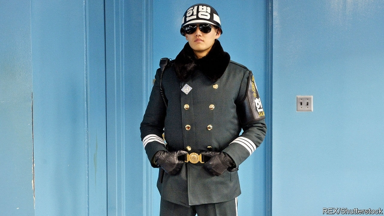

###### Blessed are the peacemakers

# South Korea’s conscientious objectors escape military conscription 

 

> print-edition iconPrint edition | Asia | Feb 9th 2019 

LIM JAE-SUNG is a mild-mannered lawyer in his thirties with a fondness for monogrammed shirts and human-rights cases. Owing to South Korea’s strict military-service laws, he is also a convicted criminal with a prison record. Mr Lim refused to serve in the army after becoming involved with the anti-war movement sparked by the dispatch of South Korean troops to Iraq in 2003. When a court sentenced him to a year and a half in jail, his parents kept it secret from their friends to avoid bringing shame on the family. He told his grandparents that he was going to spend some time in China. “It would have been too difficult to explain,” he says. 

To future generations of South Korean men, Mr Lim’s story may come to sound like a quaint tale from the ancient past. In November the country’s Supreme Court ruled that it was not a crime to refuse military service for reasons of religion or conscience, voiding its own near-unanimous ruling from 2004, which had found just the opposite. Prosecuting people for conscientious objection and sending them to prison, the judges said this time, violated basic rights and went against the spirit of “liberal democracy, tolerance and magnanimity”. Courts across the country, which had already become increasingly reluctant to convict conscientious objectors, have since thrown out pending cases en masse. 

The Supreme Court ruling overturned the conviction of a conscientious objector who was a Jehovah’s Witness—a member of a pacifist religious group. But many South Koreans question military service. All men (women are exempt) are required to enlist. They must serve between 21 and 24 months before they turn 29, although the current government has moved to shorten the duration of service. 

Conscripts are forced to live in barracks far from home, with unpredictable leave and little contact with the outside world. Earlier this year the use of mobile phones was legalised—but only after 6pm. Hazing and other abuses are rife. “I worried that the violent atmosphere would turn me into a violent person, someone who is happy to beat other people,” says Lee Yong-suk, a conscientious objector who now runs a pacifist NGO. Before the verdict, the United Nations Human Rights Council had repeatedly called on South Korea to offer a “reasonable” alternative to military service. 

Such demands are not yet widely accepted in South Korea. Four of the 13 Supreme Court judges hearing the case voted against decriminalising conscientious objection. They cited the “severe security situation” and argued that it was impossible to tell if objectors were sincere or merely shirking. It is not only conservative types who see military service as a patriotic duty in a country which is technically still at war with North Korea, its nuclear-armed totalitarian neighbour. Many fear that lots of conscripts would give the armed forces a miss if there were any alternative. 

At the moment, only a few dozen men defy the draft each year, most of them Jehovah’s Witnesses. Two-thirds of Koreans say they do not understand why anybody would refuse to serve in the army, which is still widely regarded as a rite of passage for young men. And even though conscientious objection is no longer illegal, it will still be up to the courts to assess the sincerity of any professed pacifist. That leaves judges plenty of leeway to compel conscripts to serve. Some prosecutors have cited a fondness for shoot-em-up video games as evidence that an objector’s principles were feigned. Moreover, the alternative to military service that the defence ministry has cooked up is to spend three years working as a prison guard. 

Still, the verdict will help make conscientious objection more acceptable. Activists hope that it may also make life less miserable for those who continue to join the army. “If people have a choice, the army will have to work harder to make military service bearable,” says Mr Lee. For now, his fellow pacifists will continue to face criticism. They may even still go to prison. But at least they will be guarding the cells, not occupying one. And it should be easier to tell their grandparents about it. 

