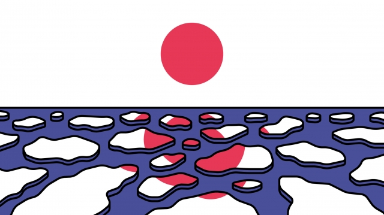
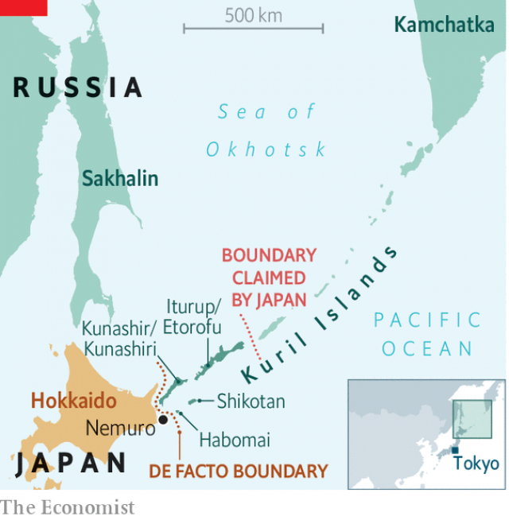

###### Banyan

# Why Japan’s prime minister pines for four desolate islands 

 

> print-edition iconPrint edition | Asia | Feb 7th 2019 

AS ALWAYS IN early February, ice floes are starting to clog the strait between Nemuro, a fishing port in northern Japan, and Kunashiri, a volcanic island hanging on the horizon. And as always on February 7th, Nemuro’s residents clogged a local cultural centre to mark “Northern Territories Day”, when they pine publicly for Kunashiri and three other nearby islands—the Northern Territories—sundered from Japan in the final days of the second world war. 

In 1945, two days after America bombed Hiroshima, Joseph Stalin declared war on Japan and Soviet troops attacked Japanese-held territory. They grabbed the southern Kuril islands, even though Russia had acknowledged them as Japanese since 1855. For two years the islanders lived alongside the occupiers. A touching photograph in an exhibition in Nemuro shows Russians and Japanese enjoying a game of go. Japanese women helped deliver Russian babies. Then, suddenly, the fraternising was over. By 1949 all the islanders had been deported. 

Today about 6,000 surviving islanders, many in Nemuro, dream of their furusato, their home turf. One of them, sluicing the floors at the fish-auction house, recalls with impish laughter how she left, aged four: “hoisted aboard in a fish box packed with other children and their parents”. She left behind a territorial dispute that drags on today. The agreement with the Soviet Union that re-established diplomatic relations in 1956 was supposed to entail the return of the two nearer (and smaller) islands, Habomai and Shikotan. But that part of the deal was never fulfilled, and no formal peace treaty has ever been signed. Technically, the second world war lingers on. 

In some respects, the islands have seemed closer in recent years. Each summer Russia now allows a handful of trips across the Nemuro Strait for Japanese born on the Kurils, or whose ancestors lie buried there. The visits are changing attitudes, at least on the Japanese side. When Banyan first came to Nemuro a decade ago, former islanders and their supporters were adamant: the return of the islands would entail their evacuation by Russians. No offence. Which Russians really wanted to live in such isolation? And wouldn’t Japanese resourcefulness quickly show up the long-wasted opportunities for development? The Russians have barely made a mark on the wild islands (to Banyan’s mind, a big part of their allure). 

 

These days views have changed. Returning Japanese say they are moved when they meet Russians on the islands—it is their furusato too. Kozo Iwayama, who runs an information centre on the Northern Territories, says Japanese should live side-by-side with Russians if the islands are returned. Yet there is a whiff of desperation in such compromise. The chances of a deal seem to be ebbing, even as the number of Japanese born on the islands ineluctably shrinks. A decade ago Japanese nationalists would not have accepted the return of merely the two smaller islands. Now, even that would seem a triumph. 

One Japanese in particular has made the islands’ return his mission: Shinzo Abe, the prime minister. A nationalist, he wants to erase the scars of Japan’s wartime past. Besides, his father and grandfather, as foreign minister and prime minister respectively, also passionately sought the Northern Territories’ return. In Japanese politics, foreign policy is all too often a family heirloom. 

It explains the charm offensive launched on Vladimir Putin. To melt the ice, two winters ago the strait-laced Mr Abe even took the Russian president for a naked dip in a hot spring in his home prefecture. Last month, in Moscow, the two men held their 25th meeting. Again Mr Abe came back empty-handed. He has tried everything, including dangling promises of Japanese investment in the Russian Far East and compromises involving “shared sovereignty”. 

No sooner was Mr Abe back in Tokyo than hopes began to rise for the 26th meeting, on the fringes of the G20 summit in Osaka in June. Yet Mr Putin’s reputation at home rests on increasing Russian territory, not slicing bits off. He may have contemplated a deal when he was riding high following his annexation of Crimea in 2014—he might like the idea of being the leader who brings the Great Patriotic War to a proper close. But today a contentious pension reform, falling incomes and cuts to social services are eating away at his popularity. Ultra-nationalists stand ready to outflank him over the Kurils. As for Mr Abe, who stands down in 2021, he has asked to be judged by the Northern Territories. His legacy may founder among the ice floes. 

