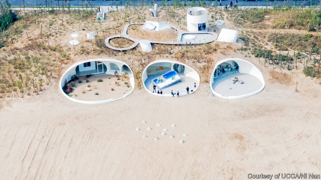

###### The sands of time

# An art gallery buried on a Chinese beach 

 

> print-edition iconPrint edition | Books and arts | Feb 9th 2019 

BURIED BENEATH a sand dune, in the beach town of Beidaihe, nestles one of China’s newest art galleries. An offshoot of the Ullens Centre for Contemporary Art in Beijing, 300km away, the UCCA Dune is unlike any other cutting-edge art museum in China. Most are high-profile architectural statements, erected in the middle of bustling cities. The Dune is subtle and secluded, its galleries unfolding against the backdrop of the sands. 

Interdependence with the landscape and the local community is at the heart of the Dune’s purpose. It aims to be sustainable ecologically as well as financially, and to help protect the environment rather than destroying it. “Our work was not just to design a physical structure,” says Li Hu of OPEN Architecture, one of the overseers of the project, but to “dream up an entirely new type of institution.” 

Mr Li wanted to create a gallery that was not “juxtaposed” to its environment but “merged into it”. Instead of placing the museum on top of the dunes as was originally planned, he decided to bury the building beneath them to preserve the coastal ecology. The structure is heated by geothermal energy; its walls and windows and the wooden tables in its café were handmade from local materials, a tribute to the craftsmanship of the Hebei region. Because the museum is lit naturally by skylights, visitors’ experiences of the artwork will vary with the seasons and time of day. 

The Dune’s interiors are meant to cultivate an intimacy between viewer, work and space. “Going to a museum in China often feels like going to a shopping centre,” says Mr Li—an experience of rushed consumerism, typically characterised by large crowds and smartphone selfies. By contrast, the Dune’s subterranean galleries invoke the caves in which the most primitive human art was first daubed. The design was inspired by Louis Kahn, a 20th-century American architect who envisaged museums as a “society of rooms”, which foster interaction and encourage people to slow down. Given the isolated location, visitors will have to make a deliberate “pilgrimage to the art”, as Mr Li puts it, rather than just a hurried urban fly-by. 

“After Nature”, the inaugural exhibit (curated by Luan Shixuan), focuses on a pertinent subject: the future of humanity’s relationship with the natural world. Each of the nine contemporary Chinese artists in the show engages cleverly with the space that their work occupies. Visitors standing in front of Liu Yujia’s “Wave”, a digital diptych featuring aerial footage of waves rushing against the coast, need only to turn around to find themselves looking out at the Bohai Sea. Beyond a glass door lies Zheng Bo’s “Dune Botanical Garden”, a work of bio-art made of transplanted local weeds that also functions as a museum garden. Nearby stands “Destination”, an installation by Na Buqi, which comprises an overturned billboard advertising an eerily photoshopped beachside getaway. 

Ms Na’s contribution is a wry commentary on the museum itself. Its location, Beidaihe, is well-established as both a summer retreat for Beijing’s political elite and a popular beach resort for domestic tourists. Cranes crowd behind the dunes, supervising construction work by Aranya, a Chinese developer that also funded and built the museum. Much as the Dune wants to attract visitors, a big influx might threaten its sustainable vision: like that forlorn billboard, a picture-perfect ideal risks being compromised by the double-edged forces of consumption. 

