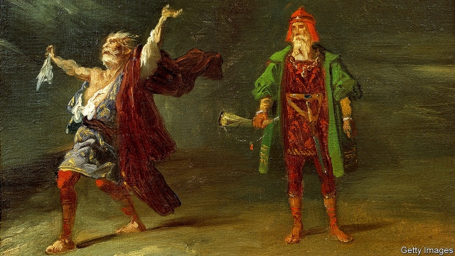

###### Physician, curb thyself

# An unconventional memoir of madness 

 

> print-edition iconPrint edition | Books and arts | Feb 9th 2019 

Let Me Not be Mad. By A.K. Benjamin. Bodley Head; 213 pages; £16.99. To be published in America by Dutton in June; $27. 

THIS IS A golden age for books written by doctors, psychoanalysts, surgeons and the like. In Britain, “This Is Going To Hurt”, Adam Kay’s memoir about his time as a junior doctor, has featured on bestseller lists for months. Atul Gawande, an American surgeon, has written a series of thoughtful inquiries into the limits of surgical intervention and end-of-life care. Books by Oliver Sacks, a neurologist who popularised the genre with works such as “The Man Who Mistook His Wife for a Hat” before his death in 2015, are still being published. 

“Let Me Not Be Mad” seems, at first glance, to fit into this trend. Written by a clinical neurologist under the pseudonym A.K. Benjamin, it begins at an anonymous, presumably British, hospital. A female patient—an amalgam, like all the figures in the book, of several different case studies and encounters, both “real and imagined”—sits down in the doctor’s office, having been referred to him because her brain appears to be “rotting”. Mr Benjamin zooms out to predict her future: “Forgetfulness first…The onset of ‘anomia’ following the rule of frequency: losing the name for Caerphilly, then Cheddar, then cheese, then children, your children.” 

So far, so familiar. But soon it becomes clear that the main subject is not the patients, but the doctor himself. As the book progresses, he appears to lose his job—or at least to be prevented from seeing patients. His frame of reference shrinks to a few eccentric acquaintances, pop songs and scraps of reading. Indeed, “Let Me Not Be Mad” relies more on literary and cultural references than on clinical ones; the author explains that before becoming a neurologist, he was, among other things, a screenwriter and a monk. 

“King Lear” recurs throughout—from the title to various references to “Poor Tom”, the madman as whom a character in the play disguises himself, to passages that echo Lear’s own descent into madness. Allusions are made to Kafka, Dostoyevsky, David Foster Wallace and many other writers (nearly all of them men). Occasionally Mr Benjamin himself brings out pin-prick details with a novelist’s skill: the “fading impression of goggles like quotation marks” around the eyes of one patient, or an early Autumn morning “set like a daguerreotype by a gossamer of frost”. 

The argument that loosely emerges is that doctors can be as damaged as their patients. And Mr Benjamin is sceptical of the tendency, perhaps even the mania, for classification, the glib assurance of diagnosis: 

But these points would be stronger if he relied less on personal anecdote and more on professional expertise. Some moments in the book are moving, such as when the author’s daughter seems to have a fit or when a close colleague dies. Other vignettes—in which he describes his rather strange online dating persona, say, or returns to a kind of monastery at the end of the book—fall flat. Moreover Mr Benjamin’s slippery method proves problematic. 

He is an openly unreliable narrator; even before he admits that some of the case studies “were me, are me”, there is a whiff of uncertainty, of fact melding with fiction and becoming distorted, grotesque. But in the end these elisions undermine his theme. The effect of the best medical memoirs, like those of Sacks, is to make idiosyncratic cases seem emblematic of wider maladies. In “Let Me Not Be Mad”, the focus is on a single, highly subjective and extreme experience. Rather than plumbing the depths of an “unravelling mind”, it seems instead to skim the surface. 

