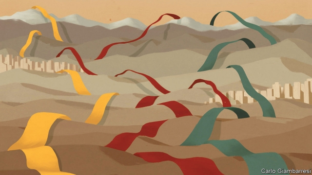

###### Together under heaven

# In the future, Eurasia will rule the world 

 

> print-edition iconPrint edition | Books and arts | Feb 9th 2019 

The New Silk Roads. By Peter Frankopan. Knopf; 336 pages; $26.95. Bloomsbury; £14.99. 

The Future is Asian. By Parag Khanna. Simon & Schuster; 448 pages; $29.95. Weidenfeld & Nicolson; £20. 

Belt and Road: A Chinese World Order. By Bruno Maçães. Hurst; 224 pages; $29.95 and £20. 

ASKED HOW he came to write “The Lord of the Rings”, J.R.R. Tolkien replied: “I wisely started with a map and made the story fit.” And so, says Bruno Maçães, when imagining new realities it is natural to begin the same way. These days a revised map of the world might have a radically different focus from previous ones—because a vast, integrated Eurasian supercontinent is proving to be the salient feature of an emerging global order. 

Once, when East was East and West was West, the chasm between them was not only geographical, but moral and historical too. “Asia” was a term invented by Europeans to emphasise their own distinctiveness; to Kipling-era imperialists, Asian societies were backward, despotic and unchanging. By contrast, Europe had made the decisive break to pursue a scientific approach to human affairs—which justified its dominion over other continents. Condescension was met with emulation: since Japan’s Meiji Restoration in 1868, Asia’s modernisation was long a matter of copying the West, either out of admiration for Europeans or to repel them or both. Asia’s economic transformations since the second world war were partly shaped by the needs of Western markets. 

But now the modernisation that Europe first brought to Asia is racing back the other way. The Eurasian land mass is fizzing with new connections, thanks to fibre-optic cables, pipelines, roads, bridges and manufacturing zones linking East with West. Two years ago a freight train that began its journey in Yiwu in eastern China pulled into a depot in east London. The feat was largely symbolic. But nobody should doubt that Asia and Europe are being brought onto a common plane. 

That process is the starting point of three stimulating new books, which make it clear that the map of world politics as it has been drawn for seven decades is no longer fit for purpose. From the old map’s centre, as Mr Maçães describes it, the power of the United States radiated to the European and East Asian edges of Eurasia, acting as “a kind of forward deployment against the dangers emanating from its inner core”—that is, the communist challenges from Moscow and Beijing. 

Today, the increasingly integrated nature of the Eurasian supercontinent that has emerged from the cold war—all the glitzy cities springing up out of deserts, all those ports being built along Indo-Pacific coasts—should not be a surprise to students of capitalism and development. What many Western prognosticators got wrong, however, was assuming this world would be made in the West’s image; that it would embrace not just Western economics but also liberal political values, with their supposedly universal appeal and validity. You only have to look at the two biggest players by land mass, China and Russia, to see the folly of that presumption. Other illiberal powers, notably Turkey and Iran, are using past historical glories to conjure a resurgent future, projecting power along the new silk roads. 

Economic integration seems not to be dissolving such differences in values, but heightening them. Nor is it clear that America and Europe can do much about it. Spreading democratic ideals is not a consistent priority for the United States; it increasingly wants to wield power from a distance. Western Europe is turning in on itself in part—and here is the deep irony—as a response to crises sweeping in from Eurasia, among them waves of immigrants and Russia’s meddling both in Europe’s borderlands and its internal politics. 

Mr Maçães, a Portuguese political scientist and former foreign minister, sketched some of his arguments in “The Dawn of Eurasia” (published last year). In “Belt and Road” he looks chiefly at China’s part in reshaping the world. Until now, its signature foreign-policy project has been known in English as the Belt and Road Initiative. That final word already sounds too diminutive. Encompassing scores of countries and $1trn of real or promised infrastructure spending, the aim, first, is to create a new global economy with China at its heart. For all China’s denials, the Belt and Road is also a major piece of geopolitical engineering. It reflects China’s desire to shape its external environment rather than simply adapting to it; some worry that it is China’s means to replace an American-led international order with its own. As a phrase, “the Belt and Road” may come to be used in the same, shorthand way as “the West” is today. 

Start with the map, and the story follows. Yet there is no plan or plot, says Mr Maçães. President Xi Jinping and his acolytes are no Marxist determinists. Lenin is the better role model as they seize a fleeting chance to change the course of history. 

And how. As Peter Frankopan, an Oxford historian, deliciously puts it in “The New Silk Roads”, when Mike Pompeo, the secretary of state, last July unveiled America’s counter to the Belt and Road, the sum promised—$113m in new programmes—was only somewhat more than the combined earnings of Ivanka Trump and Jared Kushner. Just as “Belt and Road” augments Mr Maçães’s earlier work, so “The New Silk Roads” updates Mr Frankopan’s magnificent history “The Silk Roads” (2015), which altered many readers’ views of where the world’s historical centre of gravity lay. 

China is now repurposing an old tenet. The ancient concept of tianxia, or “all under heaven”, put China at the heart of power and civilisation. Moral precepts governed relations among states. There are echoes of that in Mr Xi’s notion of a “Community of Shared Future for Mankind”, and in the constant emphasis on “win-win” outcomes, mutual dependence and respect. Countries’ obligations depend on their place in a China-centred network. 

The gratitude and dependency of others are convenient for China as it seeks to recycle its foreign-currency surplus, employ its workers on construction sites abroad, secure raw materials and fob off low-grade production onto others so that it may keep the best high-tech manufacturing and services at home. The Trump administration calls this approach “debt-trap diplomacy”. But that misses the appeal for many recipients of Chinese largesse. For a start, no one else is offering so much of it. 

What is more, as Parag Khanna says in “The Future is Asian”, an upbeat examination of a changing “Greater Asia”, others welcome China’s infrastructural forays “because they provide cover to pursue their own commercial agendas.” Nor does the fact of India, Japan, South Korea and Turkey jumping into an infrastructural arms race imply a zero-sum contest. Rather, says Mr Khanna, a Singapore-based geostrategist, China is thereby “kick-starting the process by which Asians will come out from under its shadow.” 

Mr Khanna is too blithe about the drawbacks of authoritarianism. He imputes too much technocratic brilliance to the region’s elites and glosses over the brutal dimensions of development, including China’s high-tech repression against Uighurs. But on an important point, he agrees with Mr Maçães and Mr Frankopan: Eurasia’s future is likely to be more ductile than fixed and hegemonic. In this new world order, actions still lead to reactions. The increasing alignment of democratic Japan, Australia and India as a response to Chinese assertiveness is only one case in point. 

Ineluctably, Eurasia is cohering, but that does not have to be under the stifling “togetherness” of tianxia. In their different ways, these books all serve as an antidote to American fears of a Manichaean contest with China. They give shape to latent forces that are already impossible to ignore. 

