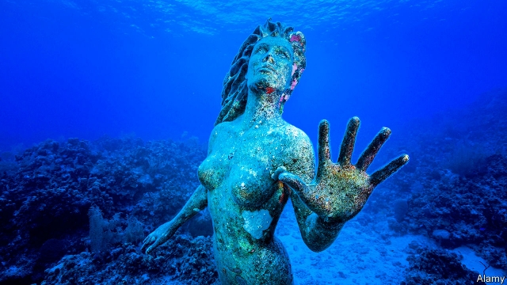

###### The sirens’ song

# Mermaids, monsters—and motherhood 

 

> print-edition iconPrint edition | Books and arts | Feb 9th 2019 

Salt on Your Tongue: Women and the Sea. By Charlotte Runcie. Canongate; 365 pages; $24.00 and £14.99. 

BY LONG TRADITION, men and women experience the sea in different ways. Men set out on it, looking for land, gold, adventure; women stay on shore, waiting and worrying. Men scoop up shoals of fish, or harpoon great whales; women, wrapped in shawls and with hands rubbed raw, gut and fillet, preserve and sell whatever the seafarers bring in. Even young weekenders on England’s beaches, faced with a rough sea, react in different ways. The girls jump and scream; the posturing lads throw stones. 

This difference both intrigues Charlotte Runcie and bothers her. When she was small, to stand in a rock-pool of clear seawater made her feel “bright and fierce”. That feeling seems to dissipate with the knowledge that women were traditionally kept away from the sea, their mere presence on a boat unlucky and the great sea epics almost empty of them. The sea was not their place. In her lyrical and gently digressive book she analyses, and works to recover, the countering power of her first, elemental, female response to the sea. 

She begins by considering who is really in charge of it. Her chapter headings are the names of the seven Pleiades, the stars—all girls, most variously abused by gods—whose rising told Greek sailors when to embark. The moon, female in most cultures, controls the tides. The goddess Athena sorted out the waves for Odysseus. Our Lady, star of the sea, smooths it for all who invoke her. 

The sea is also inhabited by mysterious, terrifying or bewitching women. Sirens sing men towards doom on their rock; Scylla, her teeth “full of black death”, writhes in her whirlpool. Underwater caves hide Sycorax, Caliban’s mother, and the awful progenetrix of Grendel in “Beowulf”. Mermaids, selkies and naiads, all alluring in their beauty, draw sailors down to the depths. When men sail, what they fear is often females who know the sea better. 

On the other hand, as second-mate Stubb cries in “Moby-Dick”, “Such a funny, sporty, gamy, jesty, joky, hoky-poky lad, is the Ocean, ho!” A man’s thing. All down the ages men engage with the sea closely, aggressively; they grapple with it and fight it. Ms Runcie spends much of her book in the women’s place, on the shore of the East Neuk of Fife, where she walks the dog, hunts for shells and sea-glass, exults in the flight of gannets and sea eagles and visits shrines and caves where saints, all male, communed with God and the waves. Her prose is often lovely, but the sea keeps its distance. Real close grappling with it, she finds, is not to sing the men’s sea shanties (though they make her feel temporarily elated again), nor to try lone yachting, nor to swim in it. It is to have a baby. 

The connection of the sea and the human body is familiar: the salt of tears, the make-up of the blood. A connection with pregnancy and childbirth seems more tenuous, and is sometimes too far a stretch, but Ms Runcie sets the theme early: the sea is “a gradual process of becoming, of widening and ageing and growing into more”. In some ways she becomes the sea herself, a fluid, heavy medium in which the baby grows from something light as sea-silk, or a tiny curled sea-snail, into a seafarer. In other ways she is a sailor on a ship, sick, encumbered, chronically fearful and, in several harrowing passages, racked by the dangers of a difficult birth and overwhelmed by waves of pain. Men have Odysseus clinging to his raft, the smashing of the Pequod, the horror-voyages of the Flying Dutchman and the Ancient Mariner; but women, every day and everywhere, have this. 

And in the end, as usually in sea stories, the sea has the last word. Ms Runcie carries her tiny new daughter down to the beach at St Monans and introduces her, in a sort of baptism, to salt water. Her encounter with the sea of motherhood has indeed made her grow into someone else. She is steadier and calmer; she is unafraid. But she has not aged, as she supposed. Instead she is that little girl again, bright and fierce. 

