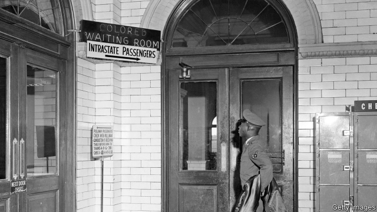

###### Lines of colour

# When the Supreme Court ruled that separate could mean equal 

 

> print-edition iconPrint edition | Books and arts | Feb 9th 2019 

Separate: The Story of Plessy v Ferguson, and America’s Journey from Slavery to Segregation. By Steve Luxenberg. W.W. Norton; 624 pages; $35.00. 

THE KEY to success at the Supreme Court, as the late Justice William Brennan liked to say, is the number five. With five votes—a majority of the justices—you can do anything. But as an impassioned group of activists discovered in 1896, falling short sometimes does more than disappoint a losing litigant: it can cement a disastrous status quo for generations. 

In “Separate”, the context and aftermath of the court’s ruling in Plessy v Ferguson are woven into a nuanced history of America’s struggles in the 19th century as a civil war was fought, slavery ended and a new, complex racial politics haltingly took form. Steve Luxenberg, an editor at the Washington Post, dwells on the personal lives of the men who built and decided a case that wound up blessing the regime of Jim Crow segregation in America’s South. His narrative culminates in an irony: six of the seven justices who signed onto what became one of the Supreme Court’s most reviled rulings were northerners. John Marshall Harlan—a Kentuckian who once “had no quarrel with slavery” and whose family owned many slaves—wrote a dissent articulating the constitutional principle of racial equality that was not upheld by a majority of the court until Brown v Board of Education, nearly six decades later. 

Like any good history, “Separate” introduces some puzzles while resolving others. A key facet of the story, unknown by many—including, apparently, the justices who heard the case—is that the episode spurring Plessy was an elaborate set-up designed to hasten just such a reckoning. When Homer Plessy, a French-speaking Creole with only one black great-grandparent, took his seat in the white carriage of a Louisiana train in 1892, an officer approached him. “Are you a coloured man?” he asked. When the fair-skinned Mr Plessy answered “yes”, yet refused to budge, he was arrested for violating the state’s Separate Car Act. The scene had been carefully choreographed by the Comité des Citoyens, a civil-rights alliance of blacks, whites and Creoles in New Orleans whose first attempt at a test case (with Daniel Desdunes, a citoyen’s son, in Plessy’s role) had recently foundered on a technicality. 

“Separate” notes that several prominent men of colour, including Frederick Douglass—the escaped slave who became a celebrated abolitionist and orator—never thought much of the legal strategy of challenging segregation on the rails. It stung Louis Martinet, editor of the New Orleans Crusader, that Douglass “saw no good in the undertaking”. But Martinet experienced moments of doubt, too, wondering if white racism and black “submissiveness” rendered their fight a “hopeless battle”. 

Albion Tourgée and James Walker, the lawyers arguing Plessy’s case at the Supreme Court, knew at the outset that the justices were “somewhat adverse” to their position. So they pulled out all the stops with a nearly 80-page brief. Segregation in railcars violated the Thirteenth Amendment banning slavery, they reasoned, as it “reimpose[d] the caste system”. It was barred by each of the four provisions of the Fourteenth Amendment, including the citizenship and equal-protection clauses. Most creatively, the lawyers contended that tossing a light-skinned man with a few drops of coloured blood out of a white carriage violated his due-process rights, as it amounted to a “forcible confiscation” of “the reputation of being white”. 

Wrapping these claims in a vision of colour-blindness, Tourgée and Walker persuaded only one justice—Harlan—that segregation was a “badge of servitude” at odds with the constitution’s promise of equality. Meanwhile Justice Henry Brown, writing for the majority, found separate carriages stigmatising only if “the coloured race chooses to put that construction upon it”. Luxenberg attributes Brown’s myopic view that “separate did not mean unequal” to his sheltered New England upbringing and “most conventional” outlook. “Separate” shows how seven justices launched a half-century of racial cruelty because, unlike Harlan, they failed to see that “equality and opportunity could not survive if they came in different colours”. 

