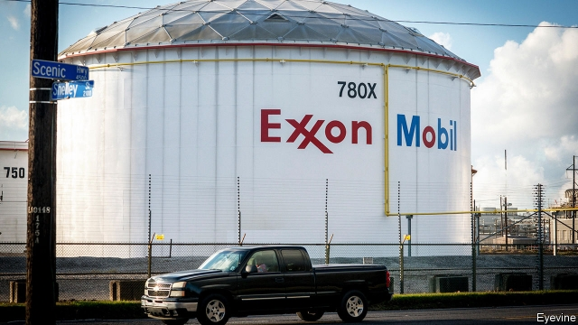
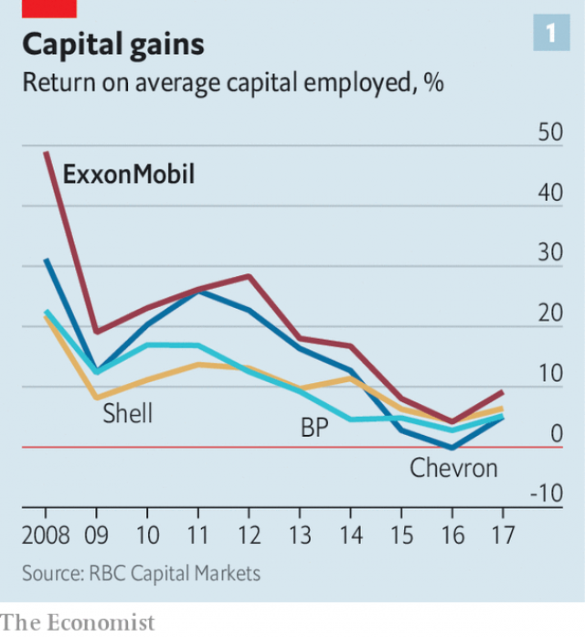
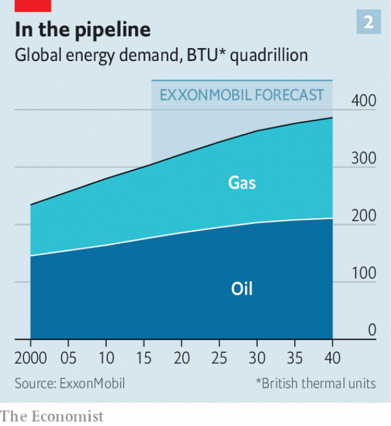
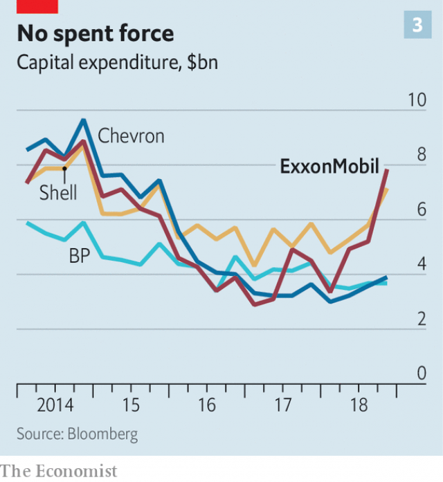
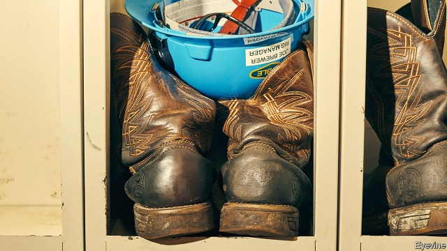

###### Bigger oil

# ExxonMobil gambles on growth 

 

> print-edition iconPrint edition | Briefing | Feb 9th 2019 

OFF THE coast of Guyana, 160km beyond the ramshackle, rainbow-coloured roofs and the sea wall meant to protect the low-lying capital, past the mud flats and into the deep, churning Atlantic, a vast drilling vessel sits almost perfectly still. Thrusters work constantly to keep the boat’s centre within a three-metre radius above a well head on the seabed almost 2km below. Workers fly in and out by helicopter. Some come from Guyana, some America, their rubber-soled boots adorned with cowboy stitching. Once aboard they manage towering drill pipes, guide robots near the ocean floor, monitor storms or perhaps just cook. All these efforts are directed towards a single goal: drilling as effectively as possible, so the ship can move to the next oil well and then the next. 

Companies had spent decades looking for oil off the coast of Guyana. In 2015 ExxonMobil, the world’s largest publicly traded oil company, became the first to find it. The firm now estimates that more than 5bn barrels of oil lie beneath the seabed. If all goes to plan, within the next decade Guyana could become the second-biggest oil producer in Latin America, behind only Brazil. That would transform a poor and tiny country into a petrostate. For ExxonMobil, the project is part of a bid to reassert its dominance. On February 1st the company announced annual results, declaring itself on track for ambitious growth. By 2025, oil and gas production will be 25% higher than in 2017. 

ExxonMobil was once the world’s most valuable company and is still a giant of the industry. It has survived for 137 years, emerging from the break-up of Standard Oil in 1911 to become the energy firm that inspired both the greatest respect and the greatest contempt. Exxon built a sprawling global empire of oil reserves, refineries and petrochemical plants, cementing its place as a leviathan after its merger with Mobil in 1999. The company was notorious for giving little information to investors, judging that impressive cash flows and returns on capital spoke for themselves. 

ExxonMobil has given ample fuel to the industry’s detractors, too. The greatest failure came in 1989, when a tanker, the Exxon Valdez, ran aground, pouring 11m gallons of crude onto unspoilt Alaskan shorelines. But events that attracted criticism also made it seem impregnable. It has weathered lawsuits over everything from a leaky petrol station to abetting torture in Indonesia. According to “Private Empire”, Steve Coll’s book of 2012 on ExxonMobil, Lee Raymond, the firm’s boss between 1993 and 2005, admired Standard Oil for sticking to its position, even when it was controversial. To that end Mr Raymond argued vociferously against the Kyoto Protocol, an international deal to reduce greenhouse-gas emissions signed in 1997. America withdrew from the agreement in 2001. 

Two decades after the merger with Mobil, the company culture remains rigorous and private. Its headquarters in Irving, Texas, are tucked away on a site occasionally traversed by bobcats. Tech firms may offer complimentary quinoa but ExxonMobil staff are clear-eyed about free lunch. Avocados at the salad bar cost 55 cents extra. 

 

In recent years, however, disappointing results and missteps mean that ExxonMobil no longer looks invincible. Tech giants are now more valuable. Under the leadership of Rex Tillerson, who left the company in 2017 to become Donald Trump’s secretary of state, ExxonMobil paid $31bn in 2009 for XTO Energy, a shale-gas firm, just before gas prices crashed. In 2017 the company was forced to write down 4.8bn barrels of reserves, nearly a fifth of the company’s total, because low oil prices had made extraction uneconomic. The firm’s return on capital employed, an impressive 49% in 2008, had crumpled to 9% by 2017 (see chart 1). 

ExxonMobil, along with other big oil companies, now faces existential risks, too. Calls are rising to reduce carbon emissions and limit the rise in global temperatures. According to the Intergovernmental Panel on Climate Change (IPCC), doing so becomes more difficult after 2030, as it would depend more heavily on draconian rules and big leaps in science. This has increased pressure to hasten a transition from fossil fuels to renewable sources of power. The regulation of emissions, lawsuits and advances in clean-energy technology that this entails could force oil demand to fall and the price to plunge. 

Against this backdrop Darren Woods, who replaced Mr Tillerson in 2017, has a strategy to ensure success for years to come—sticking to what ExxonMobil does best. His intention, announced last year, is to spend more than $200bn over seven years. This will include big investments in petrochemicals and refining. But his boldest plan is for boosting the output of fossil fuels. Mr Woods wants the company’s profits from oil and gas to reach about $23bn in 2025, triple what they were in 2017. 

 

“We take a long-term view of the industry,” Mr Woods explained recently. “We are providing the energy needed by economies and by people’s standards of living.” Mr Woods says he supports the goals of the Paris climate agreement of 2015, when governments vowed to keep the rise in temperatures “well below” 2ºC relative to pre-industrial levels. To limit warming to 2ºC, let alone the 1.5ºC that the IPCC recommends, oil production should decline. However ExxonMobil does not expect this to happen (see chart 2). Its forecast of future oil demand, propelled by a growing population and rising incomes, makes rising temperatures seem all but inevitable, contends Kathy Mulvey of the Union of Concerned Scientists, a pressure group. ExxonMobil, backed by 137 years of expertise, is working to supply more fossil fuels. 

 

Activists are pressing oil companies to change. Many oil companies, including ExxonMobil, cut capital spending after the price of crude sank in 2014 (see chart 3 ). Some green advocates began to murmur that big oil firms might change for good if they continued to cut investment and return cash to shareholders or if they pursued modest growth in oil production while pouring money into renewables. Royal Dutch Shell and Total, for example, invested in wind and solar energy, as well as electricity utilities. 

ExxonMobil’s view of climate change has progressed since Mr Raymond’s day. “We recognise, the industry recognises, broader society has grown to recognise the impact of combustions of oil and gas and the emissions that come with that and the threat that represents—the risk that represents to the climate,” Mr Woods explains. He insists that his firm looks “very closely at the renewables space and the opportunities to participate in that”. The company is applying its geological expertise to research into carbon capture and storage. 

Spending on green technologies remains minimal, however. European peers may be investing in utilities, but ExxonMobil has little appetite for them. “We have much higher expectations for the returns on the capital we invest,” Mr Woods asserts. ExxonMobil plans instead to expand its usual business. On December 3rd Shell, under pressure from green investors, said that it would tie executive pay to a plan to cut carbon emissions from its products even as ExxonMobil announced yet another oil discovery off Guyana, its tenth. 

Some of the firm’s plans resemble those of its peers. It is investing in petrochemicals and in American shale-oil, where production can rise and fall far more quickly than in big offshore projects, making it suited for an era of uncertainty. Like other oil giants, ExxonMobil highlights its investments in gas, which produces electricity more cleanly than coal. But it is unusual in its appetite for higher spending—it expects an increase of 16% this year—and in its bullish views about both gas and oil. 

Reserves are continuously drained, Mr Woods points out, so the industry must invest to sustain production. “There is a tremendous amount of growth required in a depletion business just to stand still.” However ExxonMobil is investing not only to maintain production but also to increase it as projects in America, Guyana and Brazil begin pumping crude. 

Investors greeted Mr Woods’s plan with dismay. Other oil companies were announcing buy-backs, not big investments. The company, newly solicitous, has tried to be more transparent. On February 1st Mr Woods took the unusual measure for a boss of ExxonMobil of answering investors’ questions on the annual earnings call. He reported increased production and plans for even higher capital expenditures in 2019. After a bumpy 12 months, the company’s share price ticked up. 

Environmentalists and green investors, long critics of ExxonMobil, are trying to knock the company off course. Several American cities and counties are using the courts to demand that large oil companies pay for the cost of guarding against rising sea levels. In October New York’s attorney-general filed a suit alleging that ExxonMobil used one set of assumptions about climate change in external documents and another for internal planning. That case is pending. In January America’s Supreme Court rejected the firm’s attempt to halt a separate investigation by Massachusetts over whether it misled the public about threats from climate change. 

Lawsuits are unlikely to vanquish ExxonMobil. Last year a federal judge in California dismissed a lawsuit against oil firms, arguing that Congress and diplomacy, not courts, should handle the fallout from climate change. “If I were trying to think of an existential threat to the company it’s not litigation,” says Andrew Logan of Ceres, a non-profit that works with investors to argue for sustainability, “it’s whether the business strategy is obsolete.” 

ExxonMobil’s biggest risk appears to be a world where oil demand peaks as measures to combat emissions grow, and then prices fall. Projects might become uneconomic sooner than expected, stranding the company’s assets. Mr Woods says he is backing projects with low costs. He argues that his firm’s unusually high level of integration of its various businesses and technology means it can produce more efficiently than its peers. Take oil extracted in the Permian basin of Texas. ExxonMobil uses data analysis to drill for oil using extra-long wells, then transports it to company refineries and petrochemical plants nearby. 

Concern is growing among investors, however. In 2017, 62% of ExxonMobil’s shareholders voted to require the company to disclose how action to limit temperature rises to 2ºC would affect its business. ExxonMobil produced a document that critics charged was too vague. This year shareholders will vote on a new resolution, filed by the pension funds for New York state and the Church of England, to require ExxonMobil to do what Shell has done and commit to reducing emissions not just from its operations but also from the products it sells. 

Even if shareholders vote in favour of the resolution, ExxonMobil, like Shell, would probably have an escape hatch. Shell can increase production of oil and gas under its new targets, as long as it takes other steps such as increasing energy production from wind and solar. Shell also may adjust its targets, to keep its plans consistent with society’s progress towards the goals of the Paris treaty. If governments do not restrict carbon emissions, Shell can ease up too. 

ExxonMobil might have to change its strategy more dramatically if more investors turn away from oil and gas. But that looks unlikely at the moment. Gas faces growing competition from wind and solar but for now it can help replace coal plants. Oil still has a stranglehold on transport. In an optimistic scenario only 15% of the world’s cars will be electric by 2030. Lorries and planes will be electrified more slowly still. 

Thomas DiNapoli, who oversees New York’s pension fund, has played a central role in putting pressure on ExxonMobil. However he says his fund will not divest soon, in part because oil companies are held by big indices that generate good returns. He is not alone. Far from abandoning them, the shareholdings of the world’s 20 largest institutional investors in big oil companies climbed from 24% in 2014 to 27% in 2017, according to the International Energy Agency. 

Politicians may have more sway. E3G, a think-tank, simulated the interaction of different policies and corporate strategies. If the world were to move on to a pathway compatible with warming below 2ºC, the price of oil would drop and a company with ExxonMobil’s strategy—what E3G calls “last one standing”—might come into direct competition with large national oil companies with very low production costs, such as Saudi Aramco. 

To date politicians, particularly in America, have been reluctant to legislate for bold restrictions on carbon. That is in part thanks to ExxonMobil’s attempts to obstruct efforts to mitigate climate change. Mr Raymond worked to sow doubt about climate science. Mr Tillerson adopted a more convoluted position. In 2009 he announced the company’s support for a carbon tax, which was not under serious consideration in America, and argued against a cap-and-trade scheme for pollution permits, which was. Mr Tillerson supported the Paris climate agreement but also said that there was “no scientific basis” for limiting warming to 2ºC and warned that the world depended on fossil fuels for “our very survival”. 

Under Mr Woods ExxonMobil’s policies on climate change remain marred by inconsistencies. In October the company said it was giving $1m, spread over two years, to a group advocating a carbon tax. ExxonMobil maintains that a carbon tax is a transparent and fair way to limit emissions. But the sum is less than a tenth of its federal lobbying spending in 2018. Moreover, the carbon tax it favours would include protection for oil companies from climate lawsuits. 

 

The firm is also working to reduce leaks of methane, a powerful greenhouse gas, from its wells, pipelines and refineries. However the American Petroleum Institute (API), of which Mr Woods is chairman, has been a main force urging Mr Trump’s administration to ease regulations on methane emissions. The API’s other efforts include lobbying against incentives for electric cars. 

As other oil and gas companies grapple with their own strategies, ExxonMobil may not prove an outlier in committing to business as usual. Even firms investing more in renewables are loth to give up fossil fuels, which are far more profitable. Total, BP and Chevron plan to increase production of oil and gas. Analysts at RBC, a bank, expect Shell to do so, too. 

ExxonMobil is not alone in trying to sway the climate debate in its direction either. Shell, Total and BP are all members of the API. Marathon Petroleum, a refiner, reportedly campaigned to ease Barack Obama’s fuel-economy standards. BP spent $13m to help block a proposal for a carbon tax in Washington state in November. The Western States Petroleum Association, whose membership includes ExxonMobil and Shell, also lobbied to defeat that tax. 

While oil companies plan to grow, trends in cleaner energy are moving in the wrong direction. Investments in renewables fell as a share of the total in 2017 for the first time in three years, as spending on oil and gas climbed. In 2018 carbon emissions in America grew by 3.4% as economic activity picked up, even as coal fell out of favour. Mr Woods maintains that any change to the energy supply will be gradual. “I don’t think people can readily understand just how large the energy system is, and the size of that energy system will take time to evolve,” he argues. 

ExxonMobil meanwhile continues to search for oil, reshaping the world as it goes. In Guyana there is much debate over how to use the royalties from oil. Possibilities include programmes for the poor and infrastructure to deal with flooding. Guyana’s capital, Georgetown, rests below sea level. Water often laps city streets. 

Out at sea, ExxonMobil is working to increase production. By next year an underwater web of pipes will connect wells on the seabed to a vast vessel. From there the oil will be transferred to smaller tankers, then to the vast infrastructure that can refine and transport it until it reaches consumers in the form of fertiliser, plastic bottles, polyester or, most likely, petrol. From beneath the ocean floor to your car’s tank, for about the price of a gallon of milk. 

