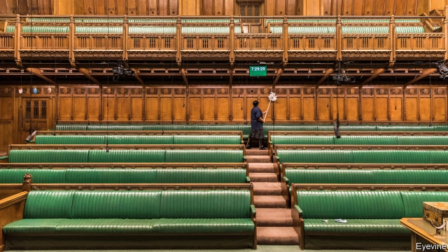

###### Less haste, less speed

# Brexit? What Brexit? Amid national crisis, MPs debate beer and snooker 

 

> print-edition iconPrint edition | Britain | Feb 7th 2019 

IF BREXIT IS to happen on the due date of March 29th a mass of legislation must be passed by Parliament. The pressure will be greater still if Britain leaves with no deal, which would mean no transition period. Yet so far the government has got through just five of 11 major laws that are needed to make Brexit workable. Bills still in the queue cover trade, agriculture, fisheries, immigration, international health care and financial services. And Parliament has processed only 100 of 600-odd Brexit-related statutory instruments. 

It was thus no surprise when the government scrapped the ten-day half-term recess that had been due to begin on February 15th, causing MPs to moan about suddenly having to find child care or, worse, cancel skiing holidays. Yet here is a curious thing: despite the urgency of the situation, this week the Commons enjoyed a largely Brexit-free agenda. Besides police and local-government finance, debates were held on such pressing matters as anti-social behaviour, beer taxes and sport, in which MPs spent three hours discussing subjects including a new rugby ground in Nantyffyllon and a project to get people with autism interested in snooker. Barely 30 sitting days remain until March 29th. 

Why the parliamentary inactivity? One answer is that everything is on hold until Theresa May comes up with a plan for winning a meaningful vote on a revised Brexit deal. This week the search took her from Belfast to Brussels. Yet the signs are that the EU is not ready to offer more than minor tweaks to the Irish backstop that could keep Britain in a customs union. Since Tory Brexiteers want the backstop ditched completely, the prime minister’s chances of getting her deal through Parliament still seem remote. She denies claims that she is running down the clock. Yet her inertia seems to be doing just that. 

The other answer is the simple fact of minority government. Maddy Thimont Jack of the Institute for Government, a think-tank, says ministers have chosen not to press ahead with the agriculture and fisheries bills for fear of ambushes by MPs. The trade bill, which could be a vehicle for efforts to keep Britain permanently in a customs union, is held up in the Lords, where the government also lacks a majority. This points to another problem. Even if Mrs May miraculously wins a meaningful vote on her Brexit deal, she will find it hard to secure the majorities needed for all stages of a subsequent withdrawal bill. 

She has promised MPs a new set of Brexit votes on Valentine’s day. That could see a further bid to upend normal procedure, in order to stop no deal. The government fiercely opposes such efforts to usurp its usual control of Parliament. Yet in truth its control is already weak—and unlikely to get stronger. 

