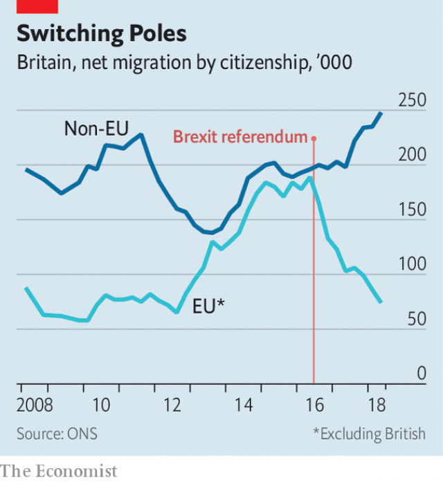

###### The new Europeans

# Europeans in Britain are packing up. The rest of the world is moving in 

 

> print-edition iconPrint edition | Britain | Feb 9th 2019 

THE FIELDS of Worcestershire surrender their goodies to a changing cast of labourers. In the 1970s and ’80s Indians and Pakistanis were bussed in from Birmingham to pick sprouts and pull onions. Then came South Africans and Kurds. In the 2000s, as the European Union bulged eastward, Poles, Lithuanians and Latvians took seats on the same buses. In turn, they were replaced by Bulgarians and Romanians. Everyone talks in hand gestures. “As their country develops, people don’t want to do the job,” says Bal Padda, whose family claim to run Britain’s only Asian-owned strawberry farm. “Now England has to decide which other country to let in.” 

Britain’s immigration system is undergoing its most radical reform in half a century. Three big shifts are under way. Future migrants are likely to be more skilled than their predecessors. They will probably stay in Britain for only a few years, rather than settle. And a much greater proportion will come from outside the EU. 

 

The switch is partly down to politics. Ministers reckon the Brexit vote was driven by concern over immigration—in particular about the perceived lack of control over who comes and for how long, as much as alarm over increasing numbers. The government plans to end free movement from the EU while letting in more skilled workers from the rest of the world. Unskilled workers will still be able to come, but only for a year and with no right to bring their family or to claim benefits. Since the Brexit referendum, net migration from the EU has tumbled. But from elsewhere it has shot up (see chart ). 

Nowhere sends more people to Britain than China and India. But whereas China mostly sends students, India sends workers. Indians have been among Britain’s three biggest foreign-born populations since the 1950s. For most of that time they were second only to the Irish, but overtook them in 2003. A decade later they were outnumbered by Polish-born migrants, but most experts reckon that Indians will soon become Britain’s most populous migrant group once again, as the pendulum swings back to non-EU migration. Estimates suggest just over 850,000 Indian-born people live in Britain, compared with a little under 900,000 Poles. 

The changing profile of the average Indian immigrant foreshadows the shift now under way in the rest of the system. Take Birmingham, home to Britain’s largest Indian-born population outside London. The strawberry-farming Paddas are typical of a generation of poor immigrants who moved to Britain seeking work in the 1950s and ’60s. Mr Padda’s father moved in 1966, in time to watch England’s football team win the World Cup on a black-and-white TV. He earned £5 a week (roughly £100, or $130, today) working in a foundry. Now he owns a 120-acre farm supplying big retailers. 

Jaswant Singh Sohal, a retired dentist, says his father only intended to come for a few years when he moved to Birmingham in 1953. “He said he’d go back and settle when he had 5,000 rupees. It’s what most people said at the time.” He never did. Instead, he encouraged about 150 family members to join him. About half of Indian-born residents in England and Wales in 1971 were still in the country in 2011. Now the younger Mr Sohal drives a Bentley (“very British”, he says, with evident approval). 

By contrast, most Indian migrants now come temporarily, in part because ministers bent on curbing immigration have made it much harder for non-EU citizens to take permanent jobs in Britain. Of the 62,000 work visas issued to Indians in the latest rolling year for which figures are available, about a third were for intra-company transfers, a category that allows mainly IT workers to come for up to five years. Another 5,000 were general “tier 2” visas, for example for doctors. The remainder were mainly other short-term categories, such as for sportspeople or exchanges. 

Today’s Indian migrants are better educated than both their predecessors and the average migrant. Nine in ten Indians arriving in Britain since the Brexit vote have some form of higher education, compared with 75% in the previous ten years. A little under three-quarters of all Indian nationals in Britain are similarly qualified, compared with under a third of Poles. “Would the new generation of Indians do a job like this?” asks Mr Padda, overlooking the farm. “I don’t think so.” 

One of their number lives in Edgbaston, round the corner from Mr Sohal. Jatinder Singh flew here from Delhi last April and will go back home next year, unless his IT contract is extended. He mixes with British Indians and white Britons alike, playing badminton with both. He has no qualms about going back to India, where he will do the same job. “It’s booming,” he says. 

The political impact of the shift will depend on how noticeable it proves. Perceptions change more slowly than migrant flows, says Madeleine Sumption of Oxford University. Since Britain’s Indian population is big and long-established, changes are not immediately obvious. Far fewer Britons say they are concerned about immigration (about 16%) than did before the referendum (a little more than half). This trend might continue as a greater proportion of immigrants come relatively briefly for work or study, rather than to settle. David Goodhart of Policy Exchange, a think-tank, reckons most people would accept students and short-term workers who do not cause the same demographic shifts as permanent migrants and their offspring. 

Whatever the politics, the stock of Indians in Britain and new flows of Indian migrants will probably continue to grow. It will still be cheaper for firms to import a rotating cast of IT contractors rather than train the native population. The new immigration regime will probably allow more non-Europeans to work in hospitals. And India would ask for even more visas in any post-Brexit trade deal. “Diageo [a British firm] will send them a load of whisky,” says a former Home Office official. “They will send us a load of skilled people.” 

