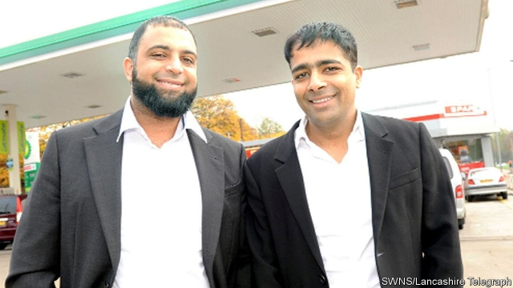

###### All pumped up and places to go

# How two brothers from Blackburn reinvented the petrol station 

 

> print-edition iconPrint edition | Britain | Feb 9th 2019 

ENTREPRENEURS SOMETIMES talk of a “light bulb” moment. For Zuber and Mohsin Issa it came shortly after they bought their first petrol station in Bury, Lancashire. Looking at the small plot, they realised that the land that came with it could accommodate shops and cafés. Thus the humble fuel pump developed into a “forecourt convenience retail” outlet, the brothers’ favoured term. The Bury petrol station became the first branch of what is now the largest independent operator of garage forecourts in the world. 

Euro Garages, as the Issas named their empire, is one of Britain’s least-known business triumphs. The brothers were born in the early 1970s in Blackburn. Their father, a Gujarati immigrant, had come to work in Britain’s declining textile industry, but later bought a petrol station, where his teenage sons learned the trade before buying their Bury garage in 2001. 

Even as the overall number of petrol stations in Britain tanked, with owners cashing in on rising land values, Euro Garages grew. It has opened 380 sites around Britain and, since 2016, has bought thousands more around Europe, becoming the market leader in independent forecourts in Germany, the Netherlands and Belgium, second in Italy and third in France. Last year it bought almost 1,000 sites in America, as well as 560 in Australia. With more than 5,000 sites and 30,000 employees in nine countries, it claims to be one of Britain’s largest privately held companies by revenue, reporting takings last year of £20bn ($26bn), which would put it ahead of, for example, Virgin and Dyson. 

The brothers were brought up in the terraces of Blackburn, but now spend more time in the air travelling between their acquisitions. The company’s executive jet shares a hangar with President Donald Trump’s personal helicopter at Blackpool airport. The Issas have invested in a mansion in one of London’s poshest districts. But they still live in their home town, and the firm’s modest headquarters on the edge of Blackburn are strictly functional. 

Before Euro Garages arrived, there had long been plenty of retail forecourts on motorways, allowing travellers to fill up their cars and buy a stale sandwich and cold coffee at the same time. They were generally owned by the big oil companies. But Euro Garages extended this model throughout the country and started spending big money on making their forecourts more convenient, and civilised. 

The Issas put all types of fuel on the same pump, making it easier to fill up. They put in more lights, making forecourts safer, and began running supermarket and fast-food franchises. Take one of the latest outposts, Frontier Park, a £4m forecourt development near Blackburn that is more shopping destination than mere filling station. Over two acres it includes a Spar supermarket, a Starbucks and a KFC, as well as a Totally Wicked vaping shop. 

Euro Garages has consequently flipped the formula for making money at a forecourt. Whereas petrol stations used to get about 80% of their income from fuel sales, about two-thirds of Euro Garages’ revenues flow from its shops and fast-food outlets. Only 4% of visitors come just to shop, but they make up the fastest-growing segment. As footfall to beleaguered high streets diminishes, garages are pulling more people in. Retailers want to piggyback on this trend. Greggs, a baker, has reduced the number of its high-street branches. But it has opened 167 outlets at Euro Garages forecourts since 2013. 

The forecourt formula has caught on. Ireland’s Applegreen has a similar approach. Motor Fuel Group, a British rival, is opening post offices at its forecourts. 

The question is whether Euro Garages can handle its high-octane expansion. Chris Noice of the Association of Convenience Stores argues that the space afforded to the company at its big new American forecourts should allow it to expand its franchises. In Europe, the brothers will have to “tailor their offer” to local appetites and expectations, which may differ between Bologna and Blackburn. Same fuel, but proper cappuccinos. 

