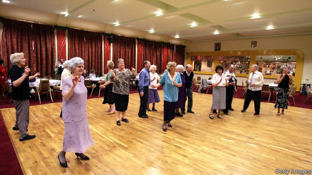
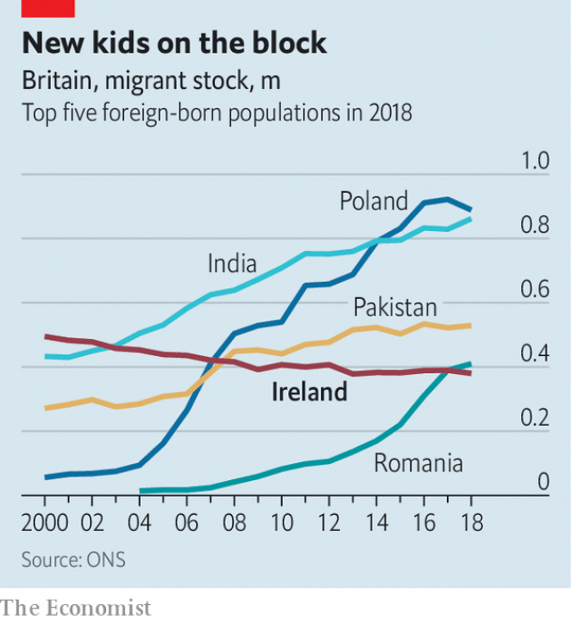

###### Last waltz in Kilburn

# Irish Britain is booming—and shrinking 

 

> print-edition iconPrint edition | Britain | Feb 9th 2019 

FIFTY YEARS on, they are still unsteady on their feet. Then, the Irish thronging the dance halls of “County Kilburn” and Cricklewood in north London were wobbly after one whisky too many. Now many of them bring walking sticks to the tea dance in a hall next to a Catholic church that used to hold 18 masses each weekend. Mostly, they have swapped their Jameson’s for tea. But the waltzes are the same. “Get that wheelchair on to the dance floor,” orders the singer, Michael Troy, whose accordion is adorned with the Irish tricolor. And they do. 

Britain’s Irish population is swelling and shrinking. A record number of Britons with Irish ancestors are applying to Dublin for passports, in order to retain the benefits of EU citizenship, such as free movement, after Brexit. Yet the Irish-born population of Britain is dwindling. The Irish first came in sizeable numbers in the famine of the 1840s. As recently as 2002 they were the largest foreign-born group. But since 2000 their number has since dropped by almost a quarter, seeing them overtaken by Poles, Indians, Pakistanis and, last year, Romanians. “We’re a dying race,” says Mr Troy. He used to play country music to Irish audiences in London six nights a week. Now he’s lucky to play two. 

The explanation partly lies across the Irish Sea. The economic boom of the 1990s and 2000s encouraged some Irish people to go home and others not to leave in the first place. The trend was reversed in the few years following the economic crash in 2008, but Ireland’s economy is now booming once more. 

Most are not going home but to the great tea dance in the sky. The Irish-born population pyramid is “completely inverted”, says Louise Ryan of Sheffield University. The elderly population echoes the huge flows of teenagers in the 1950s and ’60s. More than 40% of Irish-born people in Britain are over 65. “We play at loads of funerals,” says Mr Troy. 

 

Some groups are now dedicated to tackling the loneliness of elderly Irish. Tea dances are part of the answer. Margaret Redmond, who moved to London 46 years ago, sings along to a song she remembers playing on the boat as she sailed from Dublin. She used to have her hair done every Monday before going out dancing. Now she does a turn of the floor, as if to prove she has the old magic. “Not bad for two new hips,” she reckons. 

It is hard to prise Alice Kennedy, 81, from the floor. There are few men to dance with, so she beckons women to join her. When she went to Irish ceilidhs in Cricklewood in the 1960s, she would always wait for a man to ask her to dance. “That’s how you pulled. You’d try to shun them if they weren’t a good dancer.” 

There is, though, just a hint of an encore. After Brexit, Ireland will be the only EU country to retain free movement with Britain. Ms Ryan reckons employers will lure more Irish people to fill vacancies left behind by departing Europeans. “The Irish workforce will kick in again,” she says. Mr Troy should keep his accordion handy. 

