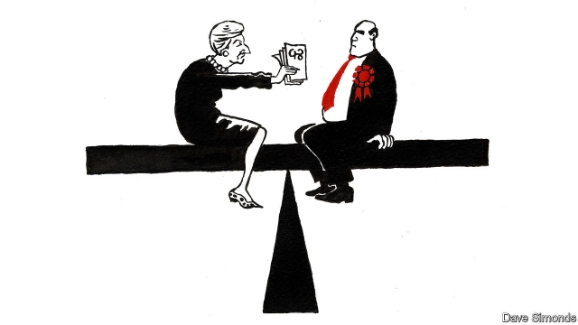

###### Woo who?

# Labour MPs provide a tricky path to a majority for the Brexit deal 

 

> print-edition iconPrint edition | Britain | Feb 9th 2019 

WHAT PRICE a majority? In British politics, the Democratic Unionist Party provided a rough guide. Judging by the £1bn ($1.3bn) in funding for Northern Ireland secured by the DUP’s ten MPs in 2017, in return for a promise to support Theresa May’s government, the going rate is £100m per MP. By that reckoning, if Mrs May wants to overturn the 230-vote defeat of her Brexit deal last month, about £12bn should do it. 

The prime minister’s chances of uniting her Conservative Party behind the deal look slim. But a faint path to a majority may run through the votes of Labour MPs, who are increasingly wobbly on Brexit. Twenty-four of them—including eight front-benchers—abstained or voted against an amendment last month that would have helped prevent a no-deal Brexit. The Labour whip is not being cracked. MPs are still expected to follow the party line, but any reckoning will come only after Brexit is through Parliament, explain those involved. Labour’s main concern is still avoiding blame for Brexit, not changing it. 

The government’s approach to getting opposition MPs on board has so far been more stick than carrot. Before Christmas, one Conservative minister glibly predicted that Labour MPs would fall into line as the prospect of a chaotic no-deal Brexit hove into view. “It’s a narrow strategy,” says one shadow minister. “It’s not a grand bargain.” 

But belatedly, Mrs May is trying harder to woo Labour MPs. Trade union leaders were invited to Downing Street on January 24th for Mrs May’s unique take on a charm offensive. The idea has been floated that Labour MPs from poor areas could get extra funding for their constituencies in return for their support when the Brexit deal next comes before Parliament. 

The cash-for-votes idea has not been a big success so far. John Mann, a Labour MP and supporter of Mrs May’s deal, was effusive. But other Labour MPs from Leave-voting constituencies were simply offended. Anna Turley, the member for Redcar, rejected the offer as a “bribe”. Other ruses designed to seduce opposition MPs may cause as many problems as they solve. Talk of beefing up workers’ rights, say, may nudge a Labour MP towards backing the deal, but convince a Tory to oppose it. 

More radical tactics are still available to the prime minister. On February 6th Jeremy Corbyn, the Labour leader, laid out five conditions under which his party would support a deal. Chief among them were demands to keep Britain in a customs union with the EU and maintain parity of workers’ rights. Reaching such a bargain with the opposition would shove a stick of dynamite under Britain’s political system, with Remainer Labour MPs angry at their party for enabling Brexit and hardline Tory Brexiteers furious that a watered-down deal had been passed with Mr Corbyn’s help. “It’s ‘deal’ and exploded parties, or ‘no deal’ and parties just about intact,” says one Labour peer. 

Jacob Rees-Mogg, the ringmaster of the Conservative Brexiteers, has warned Mrs May not to follow in the footsteps of Robert Peel, who split the Tory party for a generation in the 19th century by repealing the protectionist Corn Laws. As for Labour, the promise of a customs union might be enough to win round a large number of MPs on paper. But in practice, the chance to defeat and perhaps destroy the government—even at the risk of a disorderly no-deal Brexit—may prove too tempting. Mrs May could end up going one further than Peel, and splitting both parties. When it comes to Brexit, a majority can cost a lot. 

