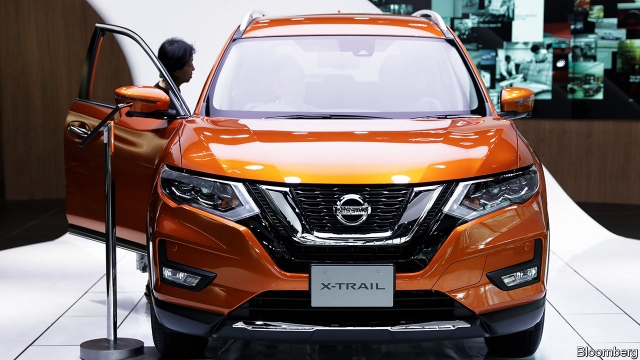

###### X-Trail of destruction

# Nissan snubs Sunderland. Is Brexit to blame? 

 

> print-edition iconPrint edition | Britain | Feb 7th 2019 

SUVS OFTEN divide opinion. Whereas some drivers appreciate their butch styling, more staid motorists find them brash and bulky. Nissan’s X-Trail has caused a different sort of split in Britain. The carmaker’s announcement on February 3rd that it would produce the latest version of the model in Japan, reversing an earlier decision to use its factory in Sunderland, has elicited contrary explanations from the two sides of the Brexit argument. 

Remainers blame Britain’s imminent departure from the European Union. Brexiteers claim the decision is a result of pressures on a global industry. Nissan says both are right, citing the business case for making X-Trails in Japan but also lamenting the “continued uncertainty” around Brexit. 

Teasing apart Nissan’s motivations is tricky. In 2016 the firm promised to continue making the X-Trail and the Qashqai, a smaller SUV, in Sunderland after Britain left the EU. In return Nissan’s then boss, Carlos Ghosn (now languishing in a Japanese jail awaiting trial over alleged financial misconduct), received a confidential letter of “assurances” from ministers. Now published, the letter promises to hand over up to £80m ($104m) for help with research and development. But since 2016 much has changed: in the car industry, inside Nissan, and in Britain’s approach to Brexit. 

All carmakers have suffered as governments and consumers have turned against diesel. Plunging sales of diesel cars, such as the version of the X-Trail that was set to be made in Sunderland, prompted Nissan to promise last year to withdraw from the diesel market in Europe. Increasing production at a factory in Japan that already makes petrol-powered X-Trails will need far less investment than making those cars with imported engines in Sunderland. 

At the same time, Nissan has become harder-nosed. It has recently struggled in Europe, where its new-car registrations fell by 13% last year. One result of Mr Ghosn’s imprisonment, which he blames on a corporate power-struggle, is that his strategy of chasing sales and hoping that economies of scale would bring profitability is out. Nissan’s new boss, Hiroto Saikawa, cares more about making profitable cars than lots of cars. Investing in a diesel X-Trail in Sunderland did not fit this strategy. 

So how much can be ascribed to Brexit? Since 2016 the government has announced plans to leave the EU’s single market and customs union, which would make life harder for carmakers, whose supply chains criss-cross the continent. The possibility of a disruptive no-deal exit remains open. A trade agreement between the EU and Japan that took effect on February 1st means that X-Trails exported from Japan to Europe will eventually attract no tariff, whereas if exported from Britain they could face duty of up to 10%. 

The big worry for Britain is that Nissan’s move will reinforce an industry mindset to shift production elsewhere. Investment in the British car industry fell by half in 2017. When deciding where to make new models, carmakers will look less favourably on a Britain that lies outside its local trade bloc, whatever the terms of its exit. 

