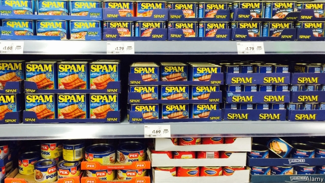

###### Spam, spam, spam!

# No-deal plans become ever sillier—and the public can’t wait 

 

> print-edition iconPrint edition | Britain | Feb 9th 2019 

A REFRIGERATED PLANE flying round-the-clock sallies to bring medicine to a besieged population, emergency waste centres established to deal with overflowing rubbish and martial law imposed on a restive population as the queen is whisked from the capital by helicopter to escape rioters. Leaks from the government’s preparations for a no-deal Brexit sometimes sound as if they have come from the imagination of a pulp-fiction novelist. Many Brexiteers blame the alternately frightening and farcical stories on dastardly “Remoaner” officials, working to undermine the case for leaving without a deal. 

They can at least be reassured by the fact that no-deal preparations are no longer theoretical. Pinning down precise details of the government’s work is difficult, partly because of official secrecy and partly because big decisions—like what tariff regime will be implemented if Britain leaves the European Union without a deal—have yet to be taken by ministers. But the bureaucratic engine has kicked up a gear, with cross-government preparations being organised under the code name Operation Yellowhammer. 

There is plenty to do. The government has six bills and mountains of secondary legislation to get through Parliament before March 29th. At least 25 new IT systems, managing everything from the collection of VAT from foreign firms to the international trade in livestock, are being developed at breakneck speed. Civil servants are issuing no-deal advice on all manner of things; this week exporters were told that they would have to put little stickers over any labels saying their produce was of EU origin. Community leaders have been privately warned that, although there should be no overall shortage of food, in some areas there will be a lack of distribution. 

Behind the scenes there has been a big reshuffle of the state’s resources. Some 3,500 soldiers are ready for action and 4,000 civil servants have been told to down tools and move to new roles preparing for Brexit. More will follow. Lots of their work will prove useless if a deal is struck. The government has, for instance, spent more than £107m ($139m) on ferries to increase freight capacity. Matt Hancock, the health secretary, has boasted that he is now the world’s largest buyer of fridges, meaning he will have a lot to flog if there are no medicine shortages. 

There is not much evidence that apocalyptic scenarios have frightened the public. Theresa May has spent two years saying that no deal is better than a bad deal, and voters believe her. Indeed, support for leaving without a deal is higher than that for accepting the deal that her government has agreed on with the EU. The unwise remark on February 6th by Donald Tusk, the European Council’s president, that there was a “special place in hell” for Brexit’s architects is unlikely to make Britons any keener to compromise with Brussels. 

Despite reports of stockpiling, supermarkets say they have so far seen little difference in purchases of tinned food, loo roll and the like. If that changes, some businesses are ready to step in. As well as water-storage facilities and emergency-power generators, one entrepreneurial online outfit offers a “Deluxe Brexit Box” for £595, which includes 157 portions of not very appetising meals. What better way to watch the riots than with a packet of freeze-dried beef and potato stew? 

