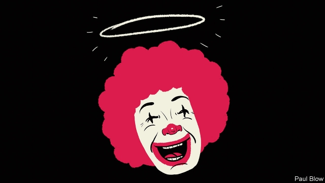

###### Bartleby

# A 25-year battle to improve the image of McDonald’s 

 

> print-edition iconPrint edition | Business | Feb 7th 2019 

EVERY DAY McDonald’s serves 69m customers, more than the population of Britain or France. The company has what is estimated to be the most valuable fast-food brand in the world, cherished as a cheap dining option for families. 

But do consumers perceive McDonald’s as a socially or environmentally responsible company? If they do not, it is in spite of the best efforts of Bob Langert. In 1988, he took a temporary assignment managing a furore over polystyrene “clamshells” in which the company’s burgers were served, and which were being damned for their contribution to America’s litter problem. That turned into a 25-year career (he has since left the firm) dealing with the chain’s various negative external effects. 

It was a Herculean task, akin to being fashion consultant to Steve Bannon. Apart from litter, he had to deal with animal welfare, environmental destruction, obesity and workers’ rights. When he began, the company’s mascot was being dubbed “Ronald McToxic” because of the clamshell problem. But he had more success than outsiders might think. His book “The Battle to Do Good: Inside McDonald’s Sustainability Journey” is a must-read even for those who are cynical about the business of corporate social responsibility. 

At times, the fast-food chain did not help itself. In the 1990s, it sued two Greenpeace activists for producing leaflets about its practices. The ensuing “McLibel” trial gave the claims worldwide publicity and was described as the world’s biggest corporate-PR disaster. Mr Langert tried to reduce the damage. The company consulted panels of independent experts and engaged with campaigning groups. On occasion it aimed to keep one step ahead of the activists—McDonald’s took action even when there was little sign of public concern. Shaving one inch off the napkins saved 3m lbs of paper annually, for example, but few consumers noticed. 

Environmentalists did attack the firm for its impact on the Amazon rainforest, saying trees were being cut down to make room for cattle pasture or the expansion of soy farming for cattle feed. In 1989 the company announced that it “never has and never will buy beef from recently deforested rainforests” and it has also worked to limit the expansion of soy farming in the region. The rise of veganism amid doubts about the health effects of eating meat have given McDonald’s new worries. 

Accomplishing change is not just a matter of the company snapping its fingers. Most McDonald’s restaurants are operated by franchisees and its goods are bought from a wide range of suppliers, so three or four layers may separate the McDonald’s head office and the cattle-rancher who supplies the firm’s beef. 

In the late 1990s, after complaints from campaign groups about the living conditions of hens, Mr Langert visited an egg facility to find that conditions were indeed terrible. In August 2000 the firm said it would buy eggs only from suppliers that gave hens 72 square inches of space, compared with an industry average of 48 square inches. Suppliers resisted so strongly that McDonald’s had to find new sources for its eggs. But those who complied found that the mortality rates of hens decreased and egg-laying rates increased, offsetting the extra costs. 

Mr Langert found it took a long time to get agreement within the company on a particular subject and then to persuade suppliers to comply. But once he reached that stage, he had enormous clout; McDonald’s is the largest purchaser of beef and pork in America, as well as the second-largest buyer of chicken. Another victory was persuading a supplier to phase out the use of gestation stalls for sows which make it impossible for the animals to move. 

Human working conditions also caused the company trouble. One day Mr Langert got a call from a Catholic bishop who was concerned about the low wages paid to tomato-pickers. Another issue was the use of “trans fats” to cook the restaurant’s fries, which were deemed to increase the risk of heart disease; it took six years for the chain to phase out the practice. But the company has also added more salads and healthy options. 

Was all the effort worth it? It seems likely that many of the people who care a lot about these issues would never eat a fast-food burger in the first place. But Mr Langert did more than most to reduce environmental waste and animal cruelty. A decent career record for an obviously decent man. 

