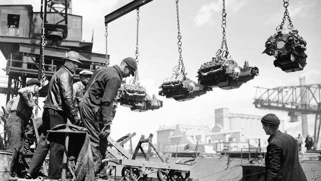
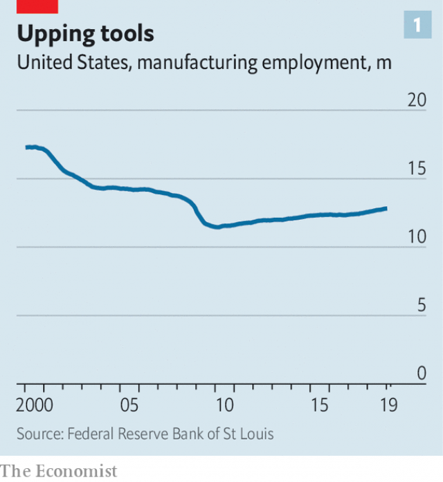
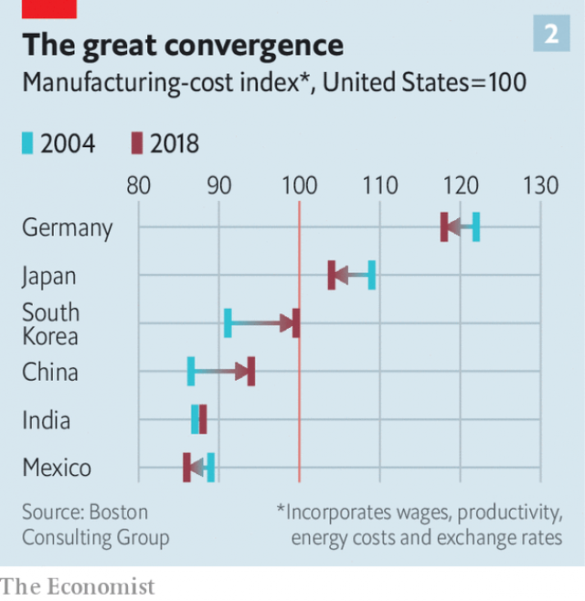

###### Making it in America

# American manufacturing companies have a spring in their step 

 

> print-edition iconPrint edition | Business | Feb 9th 2019 

A DRIVE ALONG the narrow county roads of Mount Pleasant, Wisconsin, used to be a sleepy affair. You would spot a pumpkin farm, the odd homestead and red barn. But a recent visit revealed a cacophonous building site: a factory is emerging in this corner of the Midwest. Where chicken coops once stood, Foxconn, a Taiwanese contract-manufacturing giant best-known for assembling iPhones, has arrived. 

When in 2017 the firm announced plans to build a massive factory for high-end televisions, many cheered, not least President Donald Trump, who came for last year’s ground breaking ceremony. Electronics manufacturers had long ago abandoned America for cheaper countries, especially China, so the investment seemed to mark a reversal. Having secured a promise of over $4bn in subsidies from Wisconsin, Foxconn vowed to create 13,000 jobs, many of them on the assembly line, with an average annual salary of $54,000. 

But what Foxconn will do in these hinterlands is now in question. The company has discovered that it is hard to get thousands of Midwesterners to work long hours at stressful assembly-line jobs for relatively low pay. Last week Mr Trump personally intervened and persuaded Foxconn’s boss, Terry Gou, not to pull out. Even so, Foxconn has scaled back its mass-manufacturing plans, and an insider confirms that it will now make only unspecified quantities of “high-value products”. It has not retracted its jobs promise, but observers doubt if it will hire at the scale it originally envisaged. 

At first glance, the Foxconn reversal confirms that American manufacturing is in trouble. Consider the recent wobbles at other big firms with local factories. Electrolux, a Swedish white-goods giant, announced on January 31st that it is shutting down an oven-making plant in Memphis, Tennessee. It blamed higher costs arising from the Trump administration’s tariffs on imported steel and aluminium, as well as the bankruptcy of Sears, a big retailer that sold its products. On January 28th, Caterpillar, a legendary American maker of heavy equipment, reported disappointing profits for the fourth quarter thanks in part to a slowdown in China’s economy, which has been hit by America’s trade war. 

 

A closer look, however, suggests manufacturing is undergoing a revival, especially among agile smaller firms and those using advanced techniques. According to the Bureau of Labour Statistics, manufacturing employment leapt by 261,000 jobs in 2018, reaching a total of 12.8m, coming after another rise in 2017, of 207,000 jobs. The sector has rebounded from the financial crisis of 2008-09 (see chart 1). The Institute for Supply Management’s manufacturing purchasing-managers’ index, a closely-watched indicator, rose to 56.6 in January from 54.3 in December (a figure above 50 signals expansion). It has shown expansion for 29 consecutive months. 

With characteristic modesty, Mr Trump is claiming most of the credit. His tax-reform package, passed at the end of 2017 by Congress, reduced corporate-tax rates, made capital investment more attractive and cut the incentive for American multinationals to hoard cash overseas. Though some firms have used the bounty from tax reform to undertake big share buy-backs, it seems that large firms are increasing investments in plant and equipment in America. Analysts at Goldman Sachs, an investment bank, estimate that the big industrial firms of the S&P 500 index (leaving out the large technology firms) during the first three quarters of 2018 spent $460bn on capital expenditures, up from $400bn in the same period in 2017. 

In a survey of leading American firms released on January 28th by the National Association for Business Economics, a trade association, four times as many firms in the “goods-producing sector” (which includes manufacturing) expect to increase capital spending in the next three months as those expecting to cut spending. Foreign direct investment into American manufacturing shot up to roughly $185bn during the first nine months of 2018, compared with under $100bn in 2017. 

 

Yet forces that predate Mr Trump’s arrival into the White House are also boosting the fortunes of American factories. A new analysis by the Boston Consulting Group, a consultancy, shows that the cost of manufacturing is approaching parity for the two economic superpowers (see chart 2) whereas 15 years ago Chinese costs were over an eighth lower. Manufacturers were bringing supply chains home (partly by investing in automation) well before Mr Trump took office, according to a forthcoming report from the Conference Board, a research group. Researchers conclude that nearly two-thirds of manufacturers in America, domestic and foreign, in leading sectors were localising sourcing and manufacturing from 2011 to 2016, and only about a quarter were globalising. Since Mr Trump’s election, higher oil prices have helped manufacturing businesses linked to the energy industry. 

The report also offers clues as to what went wrong in Wisconsin. Electronics was among the sectors that did the least reshoring during the period studied. This is because electronics supply chains and innovation ecosystems in China are highly specialised, efficient and hard to duplicate. In contrast, the automobile and metals industries were aggressive localisers. 

To catch a glimpse of what could be the future of American manufacturing, travel to southern New England, home of America’s first manufacturing boom two centuries ago. Here, Mr Trump has been good for Trumpf. The German firm’s North American headquarters and manufacturing hub in Farmington, Connecticut, is bustling. Trumpf makes machine tools, each costing $500,000 or more, that cut, bend and shape metal with the aid of proprietary lasers. Unlike the traditional metal-bashing kit found on typical factory floors, which are cost-effective only for mass production, these computer-controlled marvels allow short runs and high variation, making mass customisation economic. 

Business is booming. Trumpf counts such American industrial icons as John Deere, a manufacturer of tractors, and Toro, which makes lawnmowers, as customers. Sales rose 21% to $699m in the year to June 2018, and were a healthy $400m in the second half of 2018. Customers frequently cite tax breaks from being able to expense the cost more quickly as reasons for investment. Behind a giant tarpaulin in Trumpf’s factory can be glimpsed a new assembly-line being built for its next-generation offering. Trumpf has also spent some $30m building a “factory of the future” in Chicago, close to its industrial clients. 

In Cromwell, a nearby town by the bucolic Connecticut River, John Carey, founder of Carey Manufacturing, reflects on his small company’s experience with reshoring. The family-controlled firm makes automobile components as well as metallic handles and latches for such things as toolboxes. Unable to face a flood of cheap Chinese imports around 2000, he outsourced operations to mainland China but found it to be a race to the bottom on quality and price. He brought back the work to America starting in 2014, a process he has accelerated in the past two years. He invested $2.5m in equipment from Trumpf and embraced advanced manufacturing. Consumers want products in ever greater variety, on demand, and Trumpf’s advanced tools allow even small manufacturers like Carey to be nimble. Carey is growing—it hopes to earn $4m in revenues from reshored product lines in 2019, more than double the figure three years ago. 

Mr Carey praises Mr Trump for taking on China’s unfair subsidies, but berates him for his steel and aluminium tariffs, which have raised his costs. Like Foxconn, his firm’s big challenge is finding enough skilled workers. America needs a system of apprenticeships like that of Germany, he says. Instead of wasting billions on a border wall with Mexico, he argues, Mr Trump should spend the money helping develop a highly-skilled manufacturing workforce. The evidence suggests that if America builds it, companies will come. 

