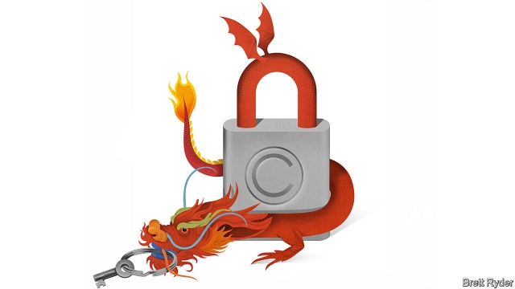

###### Schumpeter

# Chinese firms are not all serial intellectual-property thieves 

 

> print-edition iconPrint edition | Business | Feb 9th 2019 

WARS SOMETIMES have moments of cultural levity—even trade wars. Last summer, as America and China were bombarding each other with tariffs, a quaint exhibition opened at the National Museum of China on Tiananmen Square paying tribute to, of all things, American intellectual-property (IP) protection. 

It was a surprise hit. More than 1m visitors filed past 60 beautifully crafted models of inventions, such as an ice-cream maker, submitted to the United States Patent Office between 1836 and 1890 (all property of the Hagley Museum in Delaware). No doubt some visitors were arm-twisted to go, because it coincided with the start of an innovation drive by President Xi Jinping. But many were simply in thrall to American inventiveness. One remarkable visitor, says David Cole, the Hagley Museum’s boss, was an elderly man, Hu Guohua, who was granted the first-ever patent in Communist China, in 1985. It was a reminder of how young IP protection is in China; in America the first patent dates back to 1790 and was signed by George Washington. 

IP is one of the main fronts in President Donald Trump’s trade war against China. It is also the crux of an indictment in America against Huawei, a Chinese tech giant. In both cases, the government seeks to give the impression that stealing from the West is part of the modus operandi of Chinese firms, something a Wall Street Journal columnist described last week as a practice they regard as a “patriotic duty”. 

But that is lazy thinking. The Chinese state may encourage philandering of ideas, and foreign firms in China doubtless face pressure to surrender their secrets. Yet IP protection in China, for all its flaws, has improved at rocket speed of late. As Chinese firms issue more patents, the keener they are to protect them. Some executives even tacitly support American pressure, hoping it will strengthen the rule of law. In an echo of the fawning nickname “Xi Dada”, some have whispered “Trump Dada”, or Daddy Trump. 

The litany of complaints about piracy in China, to be sure, goes back decades: copyright infringement in the case of software, and trademark violation against firms such as Disney. Michael Jordan, a basketball legend, spent years trying to stop a sportswear firm using his name, which read as Qiaodan in Chinese, until he was partially successful in 2016. Today, local trademarks of Peppa Pig, a cartoon character, are being sought by scores of patent “squatters”, using a rule that lets them get in ahead of its British owners. Two American tech firms, Qualcomm and InterDigital, have been mauled in Chinese courts in royalty-related antitrust cases. China is a long way from living up to the IP commitments it made on entering the World Trade Organisation in 2001. It still forces firms in joint ventures with state-owned enterprises to surrender IP, and pursues a Communist Party-first industrial policy far removed from the free-for-all of 19th-century American entrepreneurship. 

Yet among Chinese firms, the mindset is starting to change—as it eventually did among Japanese firms after they robbed America blind in the 1970s and 1980s. From humble beginnings (Mr Hu applied for his first patent in a half-built bungalow), China accounted for 44% of the world’s patent filings in 2017, submitting twice as many applications as America, according to the World Intellectual Property Organisation. Companies, mostly Chinese ones, sue each other over patents in China more than in any other country. 

When foreigners do litigate in China, Rouse, a law firm, says they have a higher win rate in patent cases than domestic ones, and are awarded more damages overall. Such fines are low by international standards, but are improving: Alfred Dunhill, a British luxury brand, won a $1.4m payout in October over trademark infringement by a Chinese menswear brand called Danhuoli. In January, the IP court system was bolstered by the establishment of an appeals tribunal at the Supreme People’s Court in Beijing. 

The more inventive it is, the more protection benefits China. Huawei was the world’s biggest filer of international patents in 2017; whatever misgivings there are about its loyalties to the Chinese state, it is hard to doubt its commitment to innovation. An executive at Alibaba notes that as Chinese firms expand globally, particularly in South-East Asia, they, too, suffer from having their ideas ripped off, making them keener to protect them. As China’s economy weakens, says an executive of Beiqi Foton Motor, a vehicle manufacturer, his firm will need to protect its patents from rivals even more, to guard its share of a shrinking market. 

Executives admit to gaping holes in the IP system, particularly in inland regions where local tribunals are subject to heavy-handed interference by provincial governments keen to shield local copycats. That is why some IP executives in China accept the rationale behind American arm-twisting. After all, they admit, if it were not for American pressure on intellectual property, China would not have come half as far. That is not to say they approve of Mr Trump’s bombastic approach, which adds to the sense that America is trying to stifle China’s rise. But the desire for change is both internally and externally driven. As one executive puts it, “No one likes to be called a thief—not even kids.” 

It is also worth recalling how much of a cultural wrench the Anglo-Saxon IP system is for China. The country that invented printing had no Western concept of copyright. There is even a Chinese saying that “to steal a book is an elegant offence”. When inventions were flourishing in 19th-century America, the West tried to impose IP codes on a humbled China that simply could not square them with its Confucian traditions. Yet America was no saint either. As the Hagley Museum’s Mr Cole points out, its patent office in the early days charged more to foreigners for patents than it did to Americans, especially the British, with whom America was engaged in an earlier version of “strategic competition”. That point was not emphasised at the exhibition in Tiananmen Square. 

