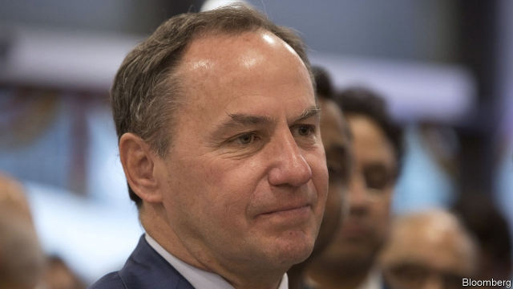

###### Swanning in

# Intel’s new boss leads a firm that is both thriving and troubled 

 

> print-edition iconPrint edition | Business | Feb 9th 2019 

AFTER A SEVEN-MONTH search, Intel on January 31st announced that its new chief executive would be its chief financial officer. Robert Swan had been filling in as the boss since last year, when Brian Krzanich, his predecessor, left after violating company rules about relationships with subordinates. Mr Swan inherits a company with dominant products and an enviable market position—but also one whose core business has stumbled. 

The good news is that an increasingly electronic world has an insatiable appetite for the computer chips that Intel makes. A week before Mr Swan’s appointment Intel announced results that reflected strong growth. Its annual revenue, of $70.8bn, set a record, and its operating income of $23.3bn was up by 29% from the same period in 2017 (though the numbers were slightly below the market’s expectations). 

Intel’s chips power 84% of desktop computers, leaving scraps for Advanced Micro Devices, its only competitor. It has a near 100% market share in the more profitable market for the beefier chips used in data-centres and cloud-computing farms. 

On the face of it the future looks promising, too. The personal computer market is growing again after years of decline. As connected gizmos proliferate—everything from smart speakers to TVs, cars and medical devices—the market for server chips to process the information they collect should grow briskly as well. 

Under Mr Krzanich, Intel had hoped to reinforce its cloud-computing dominance by expanding into new areas, particularly specialised “accelerator” chips designed to speed up specific data-centre workloads. It bought Altera, a maker of field-programmable gate arrays, or chips that can be programmed, in 2015, and Nervana, which makes machine-learning chips, a year later. The aim was to compete with firms like Nvidia, which already offers silicon customised for certain data-centre workloads, chiefly artificial intelligence. It acquired Mobileye, an Israeli maker of computer-vision chips for cars, in 2017. 

Mr Swan’s most urgent job, though, is to ensure Intel’s misfiring core business can bring it into that future. One vital ingredient of its dominance has been its prowess in ultra-high-tech manufacturing, repeatedly shrinking the components in its chips as predicted by Moore’s Law, which was named for the firm’s co-founder. Each time those components shrank, the chips built from them got faster, cheaper and less power-hungry. Intel was better at doing that than any of its competitors, releasing improved chips with such metronomic regularity that its product-release schedule was given the name “tick-tock”. 

But it has stumbled lately. Its newest “10-nanometre” factories were due to start producing chips in 2016 (the number refers, in a very loose sense, to how densely packed the components in a chip are). They will not now be ready until 2020, an unprecedented delay. That has allowed two rivals, Taiwan Semiconductor Manufacturing Company and Samsung, a South Korean firm, to catch up. 

Things will only get harder. The cost of yet more component-shrinking is becoming prohibitive. State-of-the-art chip factories cost more than $10bn, a number that is rising. Many formerly cutting-edge firms have thrown in the towel over the past decade. Worse, the physics of how electronic components behave at near-atomic scales means that each new round of shrinkage offers fewer benefits than it used to. Intel spends heavily on R&D, exploring everything from better chip packaging to exotic ideas like quantum-mechanical transistors. But none is yet ready for prime time. 

Some worry that Intel’s attempts at diversification risk misallocating both cash and its engineers’ attention. In any case, says Joseph Moore at Morgan Stanley, a bank, Intel has always struggled outside its core business of desktop and server chips. In a post-appointment email to employees, Mr Swan said he was not minded to change the fundamentals of his predecessors’ strategy. But he did not mince his other words: “our execution must improve”. 

